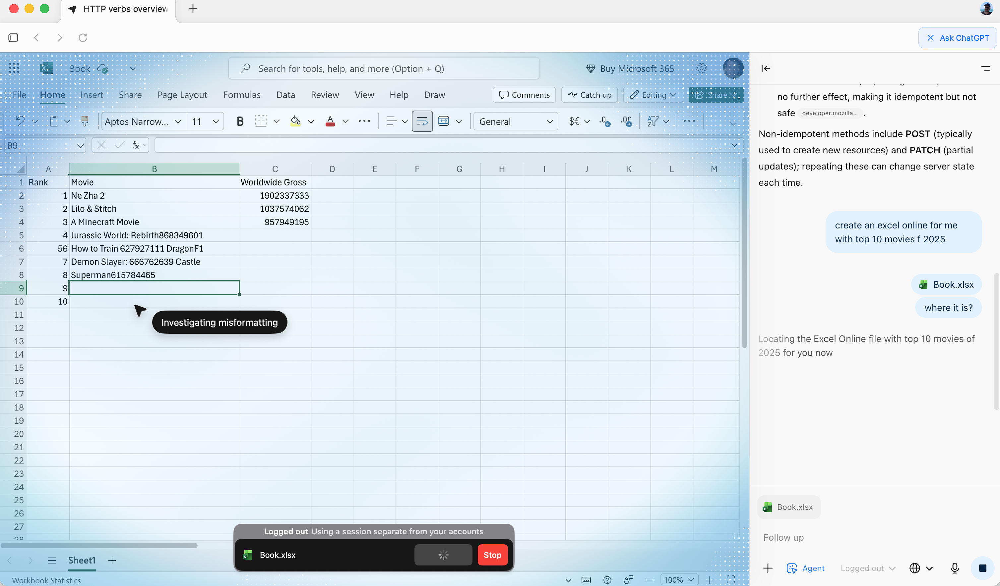
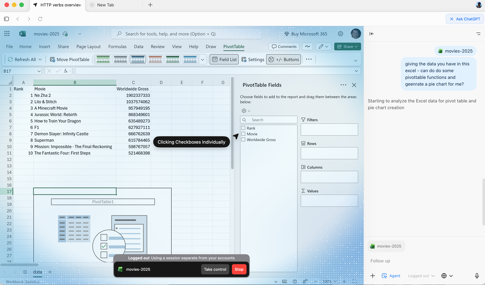
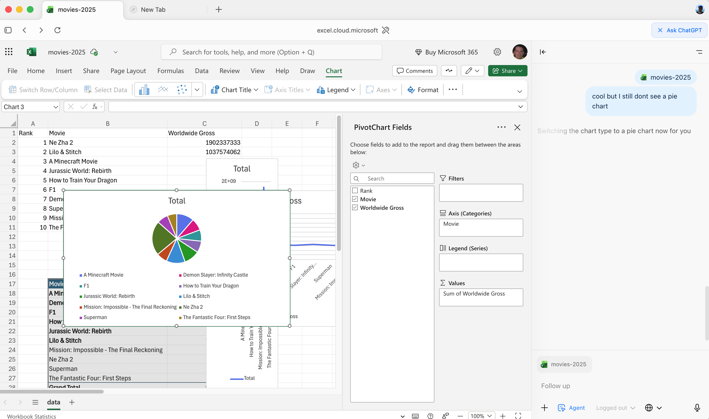

# OpenAI Atlas

[https://chatgpt.com/atlas](https://chatgpt.com/atlas) It's OpenAI browser with a LLM + Agent built in. It's a fork of Chromium(open source version of Chrome) with integrated AI capabilities.

## What can you do?

* Use natural language to navigate the web.
* Ask questions about web content.
* Summarize articles and web pages.
* Generate content based on web data.
* Automate web tasks using AI agents.
  * ask it to buy food for you
  * ask it to plan a trip
  * ask it to research a topic
  * Ask it to create an excel

## Potential

Has a great potentical. Because it work with any website, it can be used for a lot of things.

## Current Issues

* It's slow, super slow.
* You need to repeat a lot, not suprised, the surface is huge, meaning it work with any website of the planet.
* It's a security nightmare, easy to do data exfiltration.

## Atlas in Action

Prompt:
```
Create an excel online for me with top movies of 2025.
```
Result: <br/>
 <br/>
 <br/>
 <br/>
