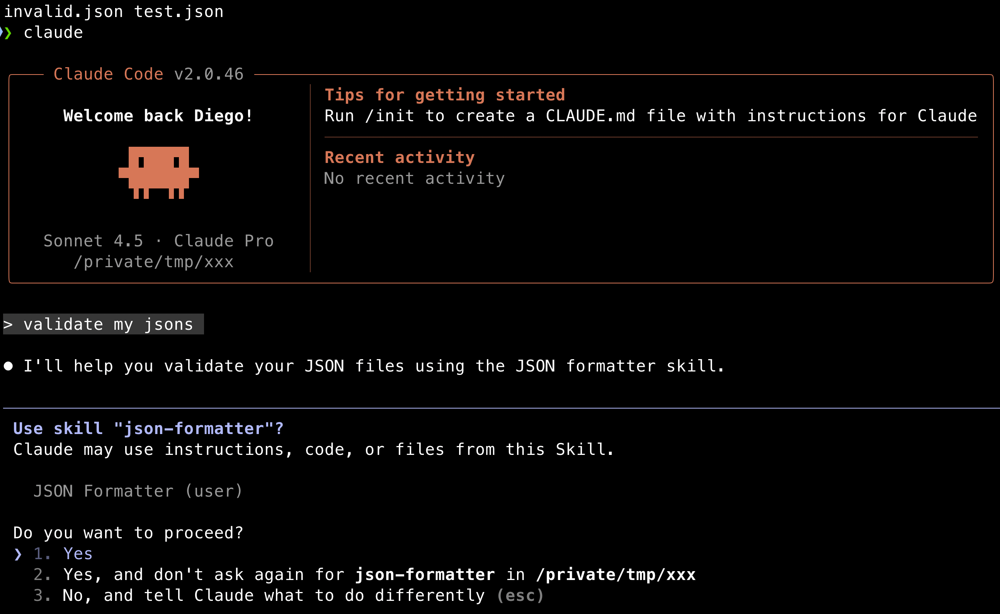

# Claude Skills

Claude Skills are specialized tools that enhance Claude's capabilities in various domains. Below is a list of ideas for Claude Skills that can be developed to assist users in different tasks.

More here: [https://www.claude.com/blog/skills](https://www.claude.com/blog/skills)

# Implemented Skills

## json-formatter

Format, validate, and minify JSON files with precision and safety.

**Location**: `~/.claude/skills/json-formatter/`

**Features**:
- Validates JSON syntax with detailed error reporting (line and column numbers)
- Pretty-print formatting with 2-space indentation
- Minification for production use
- File size comparison before/after operations
- UTF-8 encoding preservation
- Zero external dependencies (Python standard library only)

**Structure**:
```
~/.claude/skills/json-formatter/
├── SKILL.md          - Skill instructions for Claude
├── validate.py       - JSON validation script
├── format.py         - JSON formatting/minifying script
└── README.md         - Documentation
```

**Installation**:

Global installation (available in all projects):
```bash
cp -r json-formatter ~/.claude/skills/
```

Project installation (shared via git):
```bash
mkdir -p .claude/skills
cp -r json-formatter .claude/skills/
```

**How to Activate**:

Skills are model-invoked. Claude automatically activates them based on your request. Simply ask:
- "validate this JSON file"
- "format this JSON"
- "minify test.json"
- "check if this JSON is valid"

Claude will detect the intent and activate the json-formatter skill automatically.

**Scripts Usage**:

Direct script execution:
```bash
python3 ~/.claude/skills/json-formatter/validate.py <filepath>
python3 ~/.claude/skills/json-formatter/format.py <filepath>
python3 ~/.claude/skills/json-formatter/format.py <filepath> --minify
```

## Result of skill in action



```
⏺ JSON Validation Results

✓ test.json - VALID

The JSON is valid and well-formed.

Current size: 90 bytes (minified)

Structure:
{
"name": "test",
"values": [1, 2, 3],
"nested": {
    "key": "value",
    "array": [{"id": 1}, {"id": 2}]
}
}

✗ invalid.json - INVALID

Syntax errors found:

1. Line 1: Trailing comma after 3 in array - [1,2,3,] (JSON does not allow trailing commas)
2. Line 1: Incomplete key-value pair - ,"broken" is missing a colon and value
3. Line 1: JSON object is not properly closed

Current content:
{"name":"test","values":[1,2,3,],"broken"}

Errors:
- Position ~36: Unexpected comma after array element
- Position ~37: Expected : after property name
- Position ~46: Unexpected end of JSON input

---
Would you like me to:
1. Fix the invalid.json file?
2. Format (pretty-print) the valid test.json file?
3. Leave them as-is?
```

# Claude Skills Ideas

File & Code Management

1. json-formatter - Format, validate, and minify JSON files
2. yaml-validator - Validate and format YAML files
3. env-generator - Generate .env files from templates
4. code-metrics - Calculate LOC, complexity, and file counts
5. duplicate-finder - Find duplicate code blocks across files
6. dead-code-detector - Identify unused functions and imports
7. string-converter - Convert between naming conventions (camelCase, snake_case, etc.)

Testing & Quality

8. test-generator - Generate unit test templates
9. test-runner - Run tests and format output
10. coverage-analyzer - Analyze test coverage reports
11. mock-generator - Generate mock data for testing
12. lint-fixer - Run linters and auto-fix issues

Git Operations

13. git-cleaner - Clean merged/stale branches
14. commit-analyzer - Analyze commit history and patterns
15. branch-compare - Compare changes between branches
16. git-stats - Generate git statistics and contributor reports

API & Network

17. api-tester - Make HTTP requests and format responses
18. endpoint-documenter - Generate API documentation from code
19. port-finder - Find and kill processes on ports
20. health-checker - Check health of multiple services/URLs

Container & Infrastructure

21. container-optimizer - Analyze and optimize Dockerfiles
22. compose-validator - Validate docker-compose files
23. k8s-helper - Generate Kubernetes manifests
24. resource-monitor - Monitor container resource usage

Database

25. migration-generator - Generate database migration files
26. schema-differ - Compare database schemas
27. query-optimizer - Analyze and suggest SQL optimizations

Project Management

28. scaffold - Generate project boilerplate
29. dependency-updater - Update project dependencies
30. changelog-generator - Generate changelogs from commits