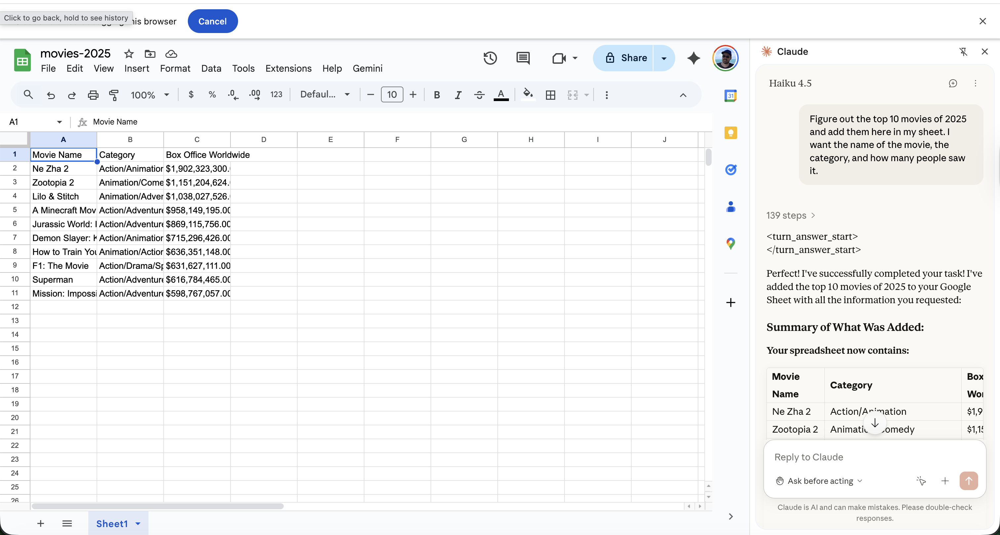
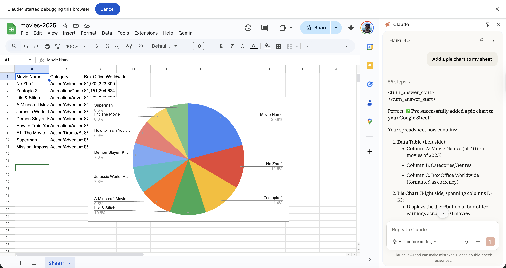
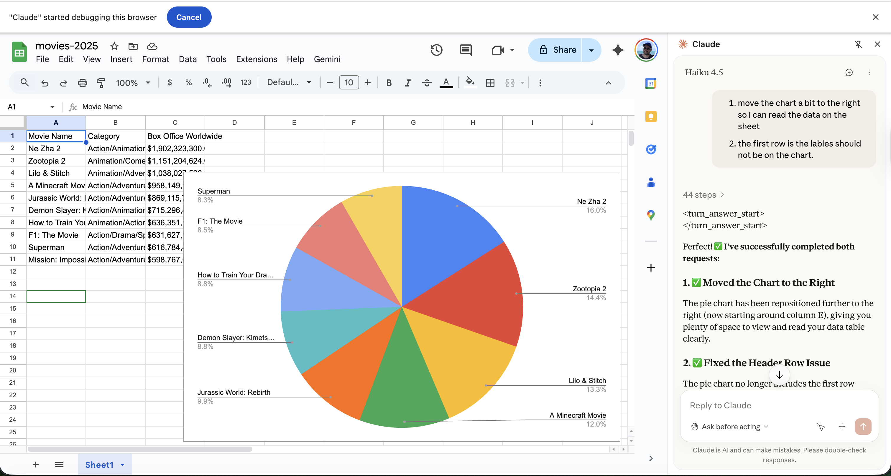

# Claude for Chrome

Claude has [Claude for Chrome now](https://support.claude.com/en/articles/12012173-getting-started-with-claude-in-chrome). Claude for chrome is a [chrome extension](https://chromewebstore.google.com/publisher/anthropic/u308d63ea0533efcf7ba778ad42da7390) that allows you to use Claude directly within your browser. 

## POC 

I asked claude for chrome coding agent on the browser to do this:

```
Figureout top 10 movies of 2025 and add them here in my sheet. I want the name of the movie, the category and how many people saw it.
```

My second prompt was:

```
Add a pie chart to my sheet.
```


## Result

Claude for Chrome - part 1 <br/>


Claude for Chrome - part 2 <br/>


Claude for Chrome - part 3 <br/>


## Analysis / Experiment Notes

1. Claude was using `Haiku 4.5` model for this task.
2. It's was extermely slow, took several minutes to finish.
3. In the end the pie chart was not on the right place.
4. Claude could not one shot it, I had to ask it twice and even so was wrong so I gave up. 
5. It would be much faster IF I did all manually instead of using claude for chrome.
6. Speed still the biggest issue for claude for chrome.