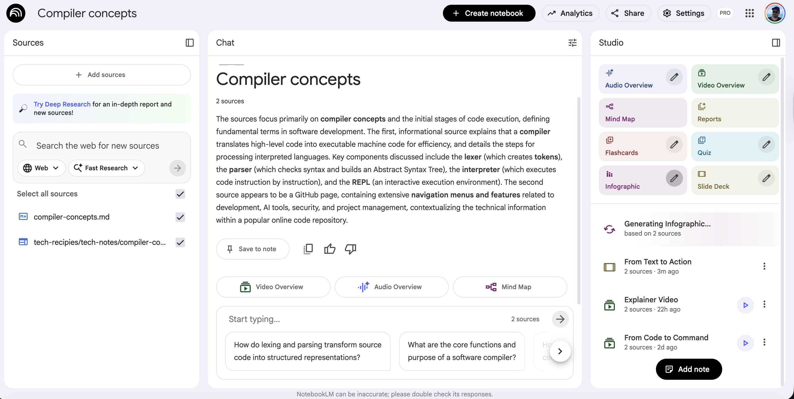

# Notebook LLM

What is it? It's a research and thinking partner, grounded in the information you trust, built with the latest Gemini models. Notebook llm can:
* Generate images
* Videos
* Podcasts
* Slides
* Quiz
* Flashcards
* Infographics
* Summarize
* Reports
* Mind Map

You can add many sources and you can ask questions to gemini.

## Video Generation

Resul is this: [video](https://www.youtube.com/watch?v=dvURMFXC-d0) generated based on [this md](https://github.com/diegopacheco/tech-recipies/blob/main/tech-notes/compiler-concepts.md)

## Slides Generation

Result is this [slidedeck](From_Text_to_Action.pdf)