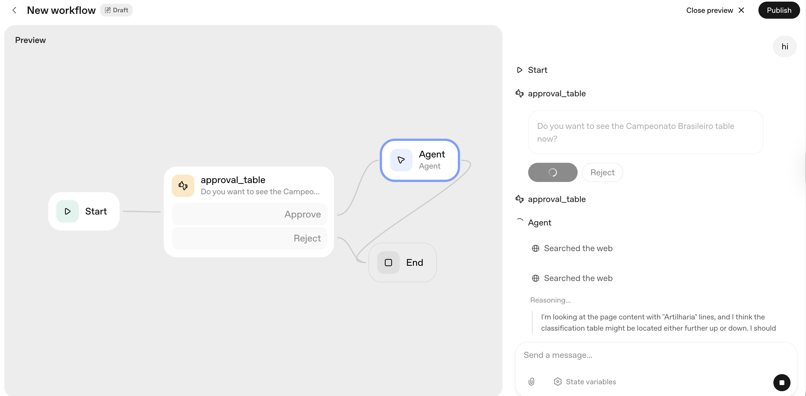

# OpenAI AgentKIT

Play with on: 17.OCT.2025

## Experience Summary

I had to verify my ID before to use it. A bit annoying but understandable.

Thi is the UI with an agent running.

### PROS

* Capabilities are: File searchs, Guardrails, MCP Integrations, Basic IF/Else, While, User Approvals, SetState(Variables).
* You can drag and drop on a visual tool
* Guardrails is nice because you can detect PII and other unwanted content.
* There is a preview mode to test your agents.

### CONS

* Very basic, you cant do much.
* Errors are not all obvious nor super clear.
* I could not find where on the AgentKit UI to ask chatGPT to help me troubleshoot errors.
* Indded n8n(https://n8n.io/) is much more powerful.
