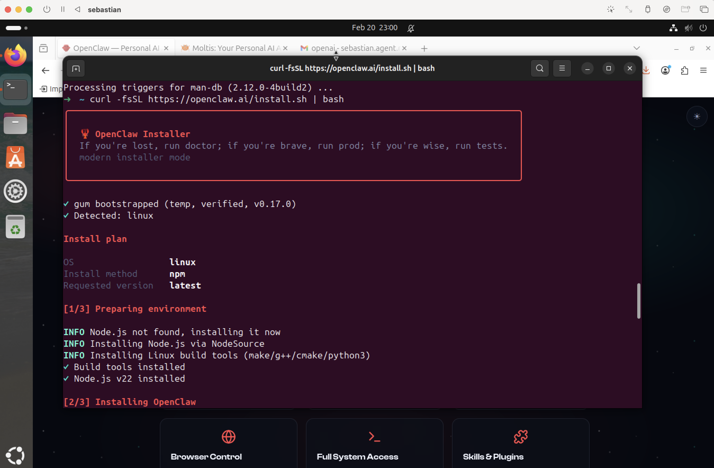
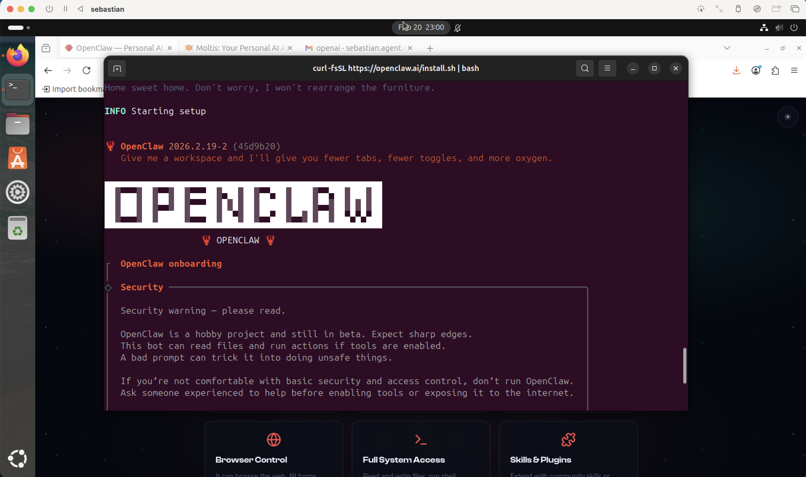
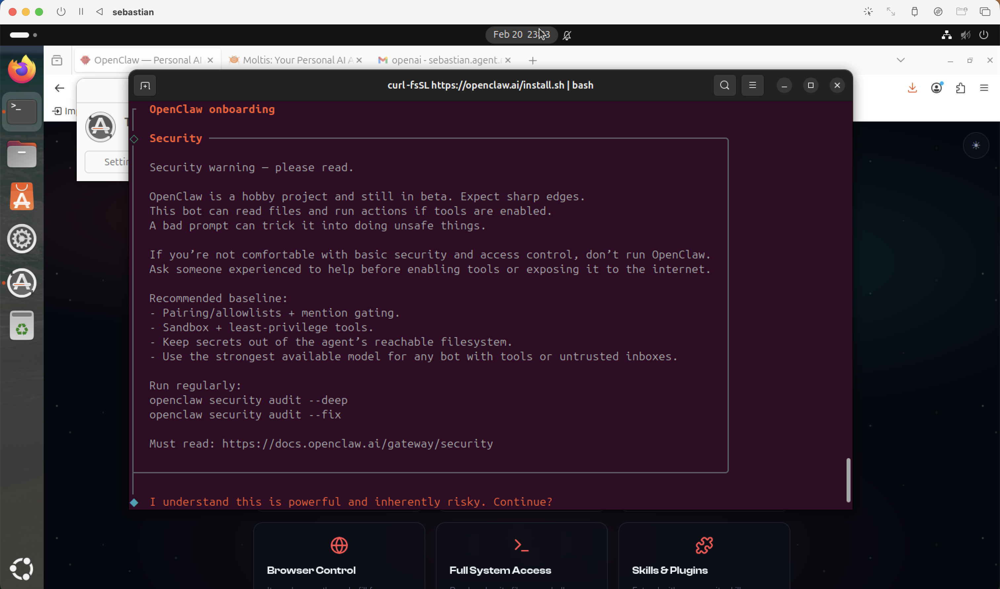
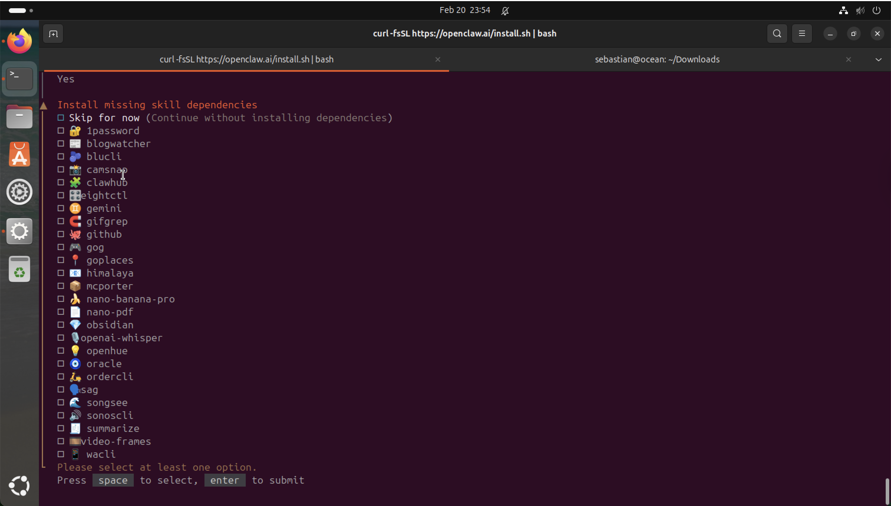

# Open Claw

https://openclaw.ai/

## How I use it?

1. First of all I create a ubuntu VM using UTM and Qemu 9x.
2. Them I create a new Gmail and a new slack channel for complete isolation.
3. I install Ubuntu 24.03 LTS on the the VM did not have any of my personal data there.
4. Innstall open claw via the terminal.
5. I found necessary call the VM "Sebastian". (IF you know, you know)

## Experience Notes

1. OpenClaw is very insecure.
2. I oonly uset it because I knew what I was doing and took several steps tward isolation/sandvoxing by: having my own VM, by not having my data on the ubuntu/vm, by creating a separated gmail and slack channel. I also created a separated OpenAI API.
3. OpenClaw is very buggy.
4. I had to troubleshoot for a while to figure our that when I change the BOT and APP Tokens that open claw had them hard coded on a json file in ~/openclaw/config.json. I had to change them there and restart the app to make it work. Funny is that the installation ask to create env vars which I did but clearly not all parts of open claw code use them.
5. It felt very half backed, the UI, specially to configure slack is terrible, is awful.

### Result

1 - VM Instalation of Open Claw  

2 - VM Instalation of Open Claw  

3 - Open Claw Sec Recommendations  

4 - Open Claw Built In Skills  

5 - Chat with Open Claw Agent on the Dashboard  

6 - Open Claw Dashboard  

