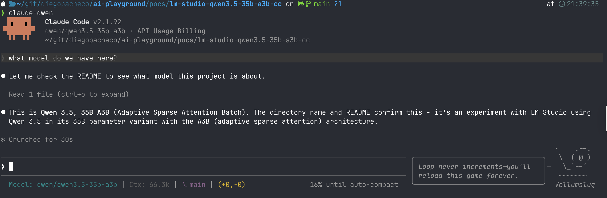
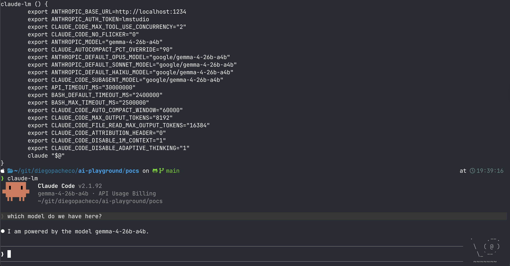
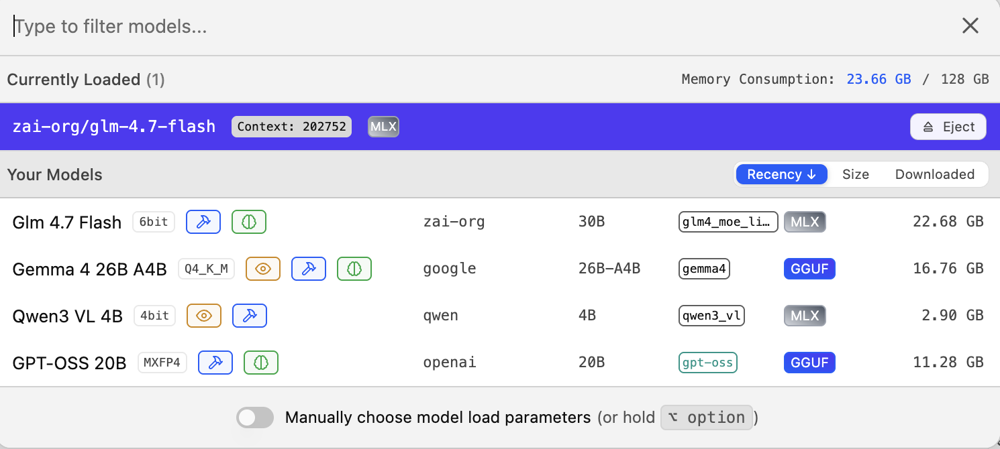
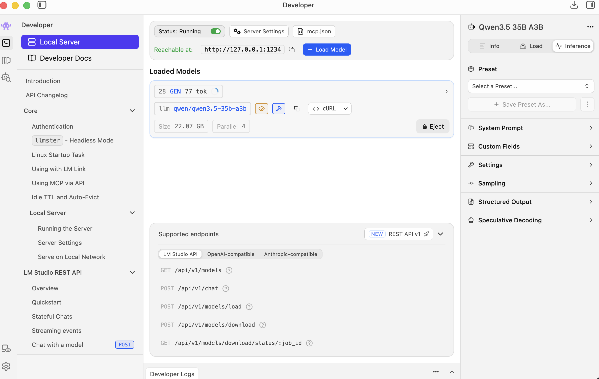
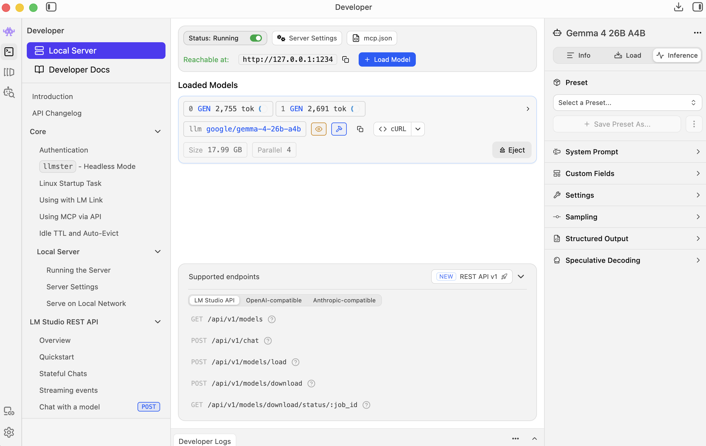
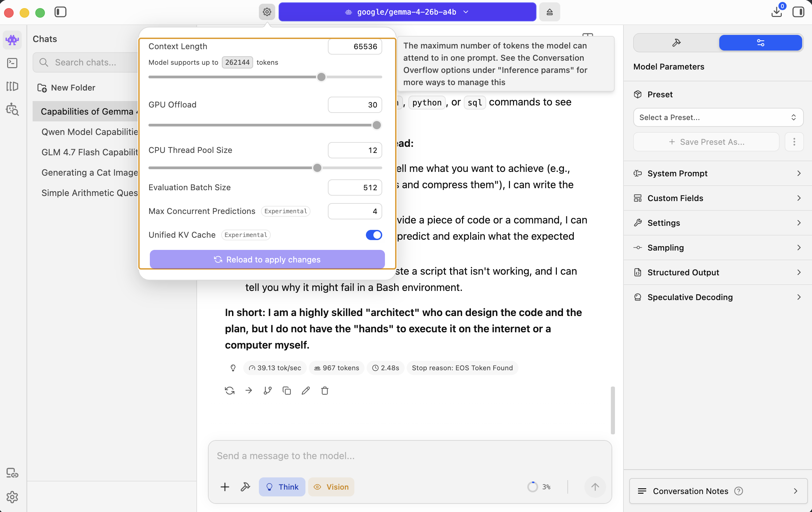

# Local Models

Local models allow you to run LLMs on your own machine without sending data to external APIs. This is useful for privacy, offline work, and experimentation with open-source models. LM Studio is a desktop application that makes it easy to download, load, and serve local models through an OpenAI-compatible and Anthropic-compatible API. By pointing Claude Code at LM Studio's local server, you can use Claude Code's interface and tooling with any model LM Studio supports.

## LM Studio 0.49

LM Studio 0.49 is the latest version of LM Studio. It supports loading multiple models, configuring context length, GPU offload, thread pool size, and more. It exposes a local server at `http://127.0.0.1:1234` with OpenAI-compatible and Anthropic-compatible REST API endpoints.

### Installing LM Studio 0.49

1. Download LM Studio from [https://lmstudio.ai](https://lmstudio.ai)
2. Install it on your machine (macOS, Windows, or Linux)
3. Open LM Studio and go to the search/discover tab
4. Search for the model you want (e.g. `qwen3.5-35b-a3b`, `gemma-4-26b-a4b`, `glm-4.7-flash`)
5. Click download and wait for the model to finish downloading
6. Go to the Developer tab on the left sidebar
7. Click "+ Load Model" and select the model you downloaded
8. The local server starts automatically at `http://127.0.0.1:1234`
9. You can adjust settings like context length, GPU offload, parallel requests in the model settings panel

## Models

### google/gemma-4-26b-a4b

Gemma 4 26B A4B is Google's open model with 26 billion total parameters and 4 billion active parameters per token. It uses a similar sparse activation approach. It supports a large context window up to 262,144 tokens, though in practice you may want to set it lower (e.g. 65,536) depending on your hardware. Runs well on machines with 23+ GB of memory available for model loading.

### qwen/qwen3.5-35b-a3b

Qwen 3.5 35B A3B is a Mixture-of-Experts model from Alibaba's Qwen team. It has 35 billion total parameters but only activates 3 billion parameters per token (A3B = Active 3 Billion) using Adaptive Sparse Attention architecture. This makes it fast and memory efficient while maintaining quality close to much larger dense models. Model size is around 22.87 GB. Works well for code generation and general tasks through LM Studio.

### zai-org/glm-4.7-flash

GLM 4.7 Flash is a fast inference model from Zhipu AI (ZAI). It is optimized for speed and low latency. The "flash" variant prioritizes throughput over maximum quality, making it a good choice for interactive use cases where response time matters. Available through LM Studio's model library.

## Running Models with Claude Code

You can connect Claude Code to LM Studio's local server by setting environment variables. Below are shell functions you can add to your `.bashrc` or `.zshrc` to launch Claude Code with each model.

### Gemma 4 26B A4B
```bash
claude-g4() {
    export ANTHROPIC_BASE_URL=http://localhost:1234
    export ANTHROPIC_AUTH_TOKEN=lmstudio
    export CLAUDE_CODE_MAX_TOOL_USE_CONCURRENCY="2"
    export CLAUDE_CODE_NO_FLICKER="0"
    export ANTHROPIC_MODEL="gemma-4-26b-a4b"
    export CLAUDE_AUTOCOMPACT_PCT_OVERRIDE="90"
    export ANTHROPIC_DEFAULT_OPUS_MODEL="google/gemma-4-26b-a4b"
    export ANTHROPIC_DEFAULT_SONNET_MODEL="google/gemma-4-26b-a4b"
    export ANTHROPIC_DEFAULT_HAIKU_MODEL="google/gemma-4-26b-a4b"
    export CLAUDE_CODE_SUBAGENT_MODEL="google/gemma-4-26b-a4b"
    export API_TIMEOUT_MS="30000000"
    export BASH_DEFAULT_TIMEOUT_MS="2400000"
    export BASH_MAX_TIMEOUT_MS="2500000"
    export CLAUDE_CODE_AUTO_COMPACT_WINDOW="60000"
    export CLAUDE_CODE_MAX_OUTPUT_TOKENS="8192"
    export CLAUDE_CODE_FILE_READ_MAX_OUTPUT_TOKENS="16384"
    export CLAUDE_CODE_ATTRIBUTION_HEADER="0"
    export CLAUDE_CODE_DISABLE_1M_CONTEXT="1"
    export CLAUDE_CODE_DISABLE_ADAPTIVE_THINKING="1"
    claude "$@"
}
```

### GLM 4.7 Flash
```bash
claude-glm() {
    export ANTHROPIC_BASE_URL=http://localhost:1234
    export ANTHROPIC_AUTH_TOKEN=lmstudio
    export CLAUDE_CODE_MAX_TOOL_USE_CONCURRENCY="2"
    export CLAUDE_CODE_NO_FLICKER="0"
    export ANTHROPIC_MODEL="zai-org/glm-4.7-flash"
    export CLAUDE_AUTOCOMPACT_PCT_OVERRIDE="90"
    export ANTHROPIC_DEFAULT_OPUS_MODEL="zai-org/glm-4.7-flash"
    export ANTHROPIC_DEFAULT_SONNET_MODEL="zai-org/glm-4.7-flash"
    export ANTHROPIC_DEFAULT_HAIKU_MODEL="zai-org/glm-4.7-flash"
    export CLAUDE_CODE_SUBAGENT_MODEL="zai-org/glm-4.7-flash"
    export API_TIMEOUT_MS="30000000"
    export BASH_DEFAULT_TIMEOUT_MS="2400000"
    export BASH_MAX_TIMEOUT_MS="2500000"
    export CLAUDE_CODE_AUTO_COMPACT_WINDOW="60000"
    export CLAUDE_CODE_MAX_OUTPUT_TOKENS="8192"
    export CLAUDE_CODE_FILE_READ_MAX_OUTPUT_TOKENS="16384"
    export CLAUDE_CODE_ATTRIBUTION_HEADER="0"
    export CLAUDE_CODE_DISABLE_1M_CONTEXT="1"
    export CLAUDE_CODE_DISABLE_ADAPTIVE_THINKING="1"
    claude "$@"
}
```

### Qwen 3.5 35B A3B
```bash
claude-qwen() {
    export ANTHROPIC_BASE_URL=http://localhost:1234
    export ANTHROPIC_AUTH_TOKEN=lmstudio
    export CLAUDE_CODE_MAX_TOOL_USE_CONCURRENCY="2"
    export CLAUDE_CODE_NO_FLICKER="0"
    export ANTHROPIC_MODEL="qwen/qwen3.5-35b-a3b"
    export CLAUDE_AUTOCOMPACT_PCT_OVERRIDE="90"
    export ANTHROPIC_DEFAULT_OPUS_MODEL="qwen/qwen3.5-35b-a3b"
    export ANTHROPIC_DEFAULT_SONNET_MODEL="qwen/qwen3.5-35b-a3b"
    export ANTHROPIC_DEFAULT_HAIKU_MODEL="qwen/qwen3.5-35b-a3b"
    export CLAUDE_CODE_SUBAGENT_MODEL="qwen/qwen3.5-35b-a3b"
    export API_TIMEOUT_MS="30000000"
    export BASH_DEFAULT_TIMEOUT_MS="2400000"
    export BASH_MAX_TIMEOUT_MS="2500000"
    export CLAUDE_CODE_AUTO_COMPACT_WINDOW="60000"
    export CLAUDE_CODE_MAX_OUTPUT_TOKENS="8192"
    export CLAUDE_CODE_FILE_READ_MAX_OUTPUT_TOKENS="16384"
    export CLAUDE_CODE_ATTRIBUTION_HEADER="0"
    export CLAUDE_CODE_DISABLE_1M_CONTEXT="1"
    export CLAUDE_CODE_DISABLE_ADAPTIVE_THINKING="1"
    claude "$@"
}
```

After adding one of these functions to your shell config, reload your shell and run the function name (e.g. `claude-g4`, `claude-glm`, `claude-qwen`) to start Claude Code connected to the local model.

## Screenshots

### Claude Code with Qwen 3.5 35B A3B


Claude Code v2.1.92 connected to the Qwen 3.5 35B A3B model via LM Studio. The model correctly identifies itself and describes its Adaptive Sparse Attention architecture.

### Claude Code with Gemma 4 26B A4B


Shows the `claude-lm` shell function with all environment variables configured to point Claude Code at the local Gemma 4 26B A4B model. Claude Code confirms it is powered by `gemma-4-26b-a4b`.

### LM Studio Models List


LM Studio UI showing the loaded and available models: GLM 4.7 Flash, Gemma 4 26B A4B, Qwen3 VL 4B, and GPT-OSS 20B. Total memory consumption is 23.06 GB.

### LM Studio Developer View with Qwen


LM Studio Developer tab with the Qwen 3.5 35B A3B model loaded. The local server runs at `http://127.0.0.1:1234` with the model using 22.87 GB and parallel set to 4. Shows the available REST API endpoints including OpenAI-compatible and Anthropic-compatible routes.

### LM Studio Developer View with Gemma 4 26B A4B


LM Studio Developer tab with the Gemma 4 26B A4B model loaded. The local server runs at `http://127.0.0.1:1234` with the model using 11.99 GB and parallel set to 4. Shows the supported REST API endpoints including LM Studio API, OpenAI-compatible, and Anthropic-compatible routes.

### LM Studio Context Length Settings


LM Studio settings panel for the Gemma 4 26B A4B model. Context length is set to 65,536 tokens (model supports up to 262,144), GPU offload at 50, thread pool size 12, eval batch size 512, max concurrent predictions 4, and unified KV cache enabled.

## POCs

### LM Studio + Qwen 3.5 35B A3B + Claude Code
Runs the Qwen 3.5 35B A3B model locally through LM Studio and connects it to Claude Code. Qwen 3.5 is a MoE model with 35B total params and 3B active params per token using Adaptive Sparse Attention. The model handles code generation and general tasks. Model size is ~22.87 GB. The POC demonstrates Claude Code working with Qwen as the backend model for coding tasks.

POC: [lm-studio-qwen3.5-35b-a3b-cc](https://github.com/diegopacheco/ai-playground/tree/main/pocs/lm-studio-qwen3.5-35b-a3b-cc)

### LM Studio + GLM 4.7 Flash + Claude Code
Runs the GLM 4.7 Flash model from Zhipu AI locally through LM Studio and connects it to Claude Code. GLM 4.7 Flash is optimized for fast inference and low latency, making it suitable for interactive coding sessions where response speed matters more than maximum reasoning depth. The POC demonstrates using this flash-optimized model as the backend for Claude Code.

POC: [lm-studio-glm-4.7-flash](https://github.com/diegopacheco/ai-playground/tree/main/pocs/lm-studio-glm-4.7-flash)

### LM Studio + Gemma 4 26B A4B + Claude Code
Runs Google's Gemma 4 26B A4B model locally through LM Studio and connects it to Claude Code. Gemma 4 has 26B total params with 4B active params per token. Supports context windows up to 262K tokens. The POC shows Claude Code using Gemma 4 as the backend, with all model overrides configured to route every request through the local Gemma instance.

POC: [lm-studio-gemma-4-26b-a4b-cc](https://github.com/diegopacheco/ai-playground/tree/main/pocs/lm-studio-gemma-4-26b-a4b-cc)

### LM Studio + CodeLlama Instruct 7B
Runs Meta's CodeLlama Instruct 7B model locally through LM Studio. CodeLlama is a code-specialized variant of Llama 2 with 7 billion parameters, fine-tuned for instruction following and code generation. It is a smaller, dense model compared to the MoE models above, requiring less memory and running faster on modest hardware. The POC demonstrates using CodeLlama for code-related tasks through LM Studio.

POC: [llm-studio-codellma-instruct-7B](https://github.com/diegopacheco/ai-playground/tree/main/pocs/llm-studio-codellma-instruct-7B)
