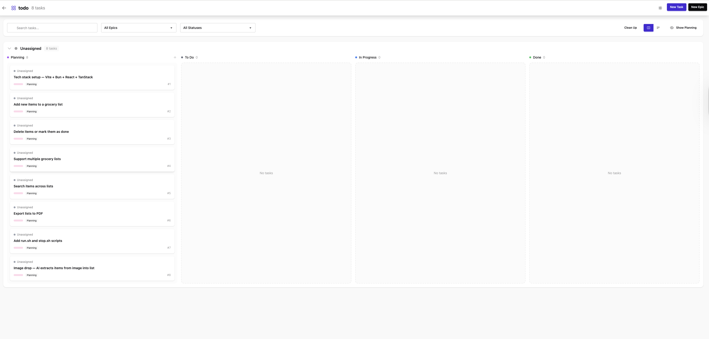
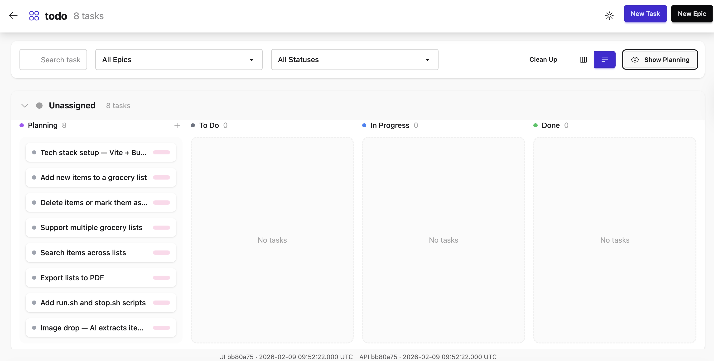
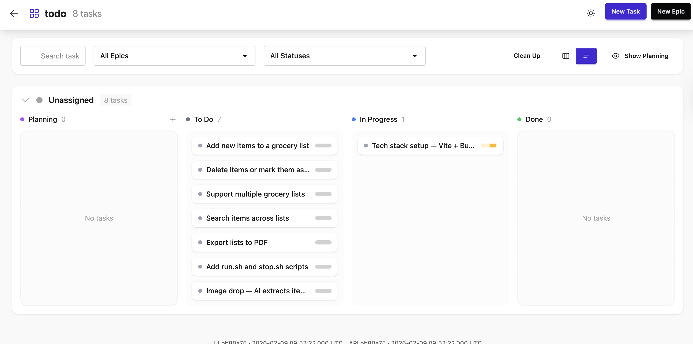
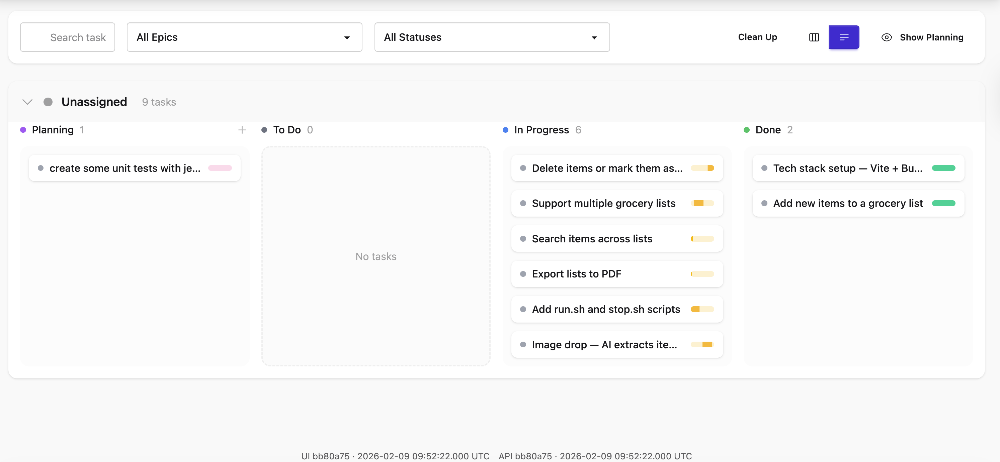
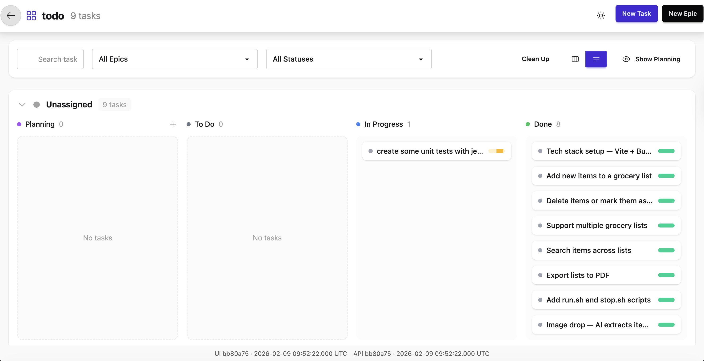
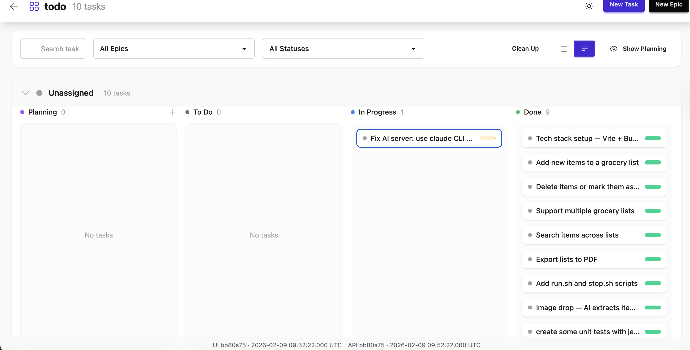

# Flux

https://github.com/sirsjg/flux

## Add to claude code

Run the install script:
```
./install-mcp-claude.sh
```

This will:
1. Pull the latest flux image
2. Start the flux-web container (port 3000)
3. Register the MCP server in Claude Code

Flux web UI: http://localhost:3000

## Manual setup

Start the web server:
```
./flux.sh
```

Register the MCP server:
```
claude mcp add flux -- podman run -i --userns=keep-id --rm -v flux-data:/app/packages/data -v flux-blobs:/home/flux -e FLUX_DATA=/app/packages/data/flux.sqlite sirsjg/flux-mcp:latest bun packages/mcp/dist/index.js
```

## Result

Flux Board <br/>


Flux Planning <br/>


Flux Wip 1 <br/>


Flux Wip 2 <br/>


Flux DONE <br/>


I reported a but in claude code and them he created a task on flux. <br/>



```
⏺ 16/16 tests passing. Marking the task done in Flux.

⏺ flux - move_task_status (MCP)(task_id: "nvqbfvw", status: "done")
  ⎿  Moved task "create some unit tests with jest." to done

⏺ All 9 tasks are now done in Flux. Final status:

  ┌─────────────────────────────────────────────────────┬─────────┐
  │                        Task                         │ Status  │
  ├─────────────────────────────────────────────────────┼─────────┤
  │ Tech stack setup — Vite + Bun + React + TanStack    │ ✅ done │
  ├─────────────────────────────────────────────────────┼─────────┤
  │ Add new items to a grocery list                     │ ✅ done │
  ├─────────────────────────────────────────────────────┼─────────┤
  │ Delete items or mark them as done                   │ ✅ done │
  ├─────────────────────────────────────────────────────┼─────────┤
  │ Support multiple grocery lists                      │ ✅ done │
  ├─────────────────────────────────────────────────────┼─────────┤
  │ Search items across lists                           │ ✅ done │
  ├─────────────────────────────────────────────────────┼─────────┤
  │ Export lists to PDF                                 │ ✅ done │
  ├─────────────────────────────────────────────────────┼─────────┤
  │ Add run.sh and stop.sh scripts                      │ ✅ done │
  ├─────────────────────────────────────────────────────┼─────────┤
  │ Image drop — AI extracts items from image into list │ ✅ done │
  ├─────────────────────────────────────────────────────┼─────────┤
  │ Create some unit tests with jest                    │ ✅ done │
  └─────────────────────────────────────────────────────┴─────────┘
```