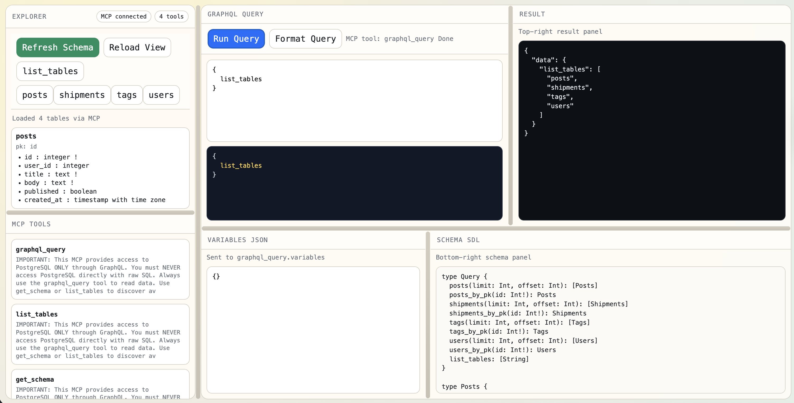
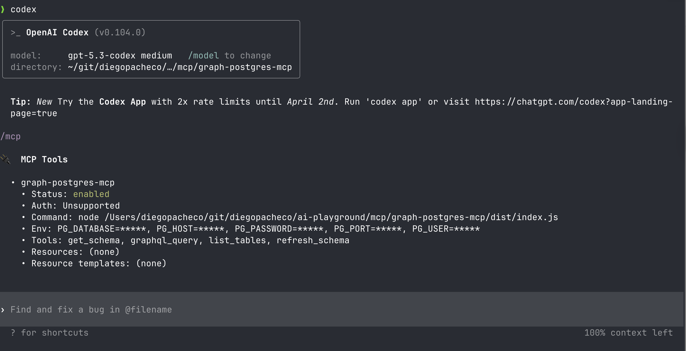
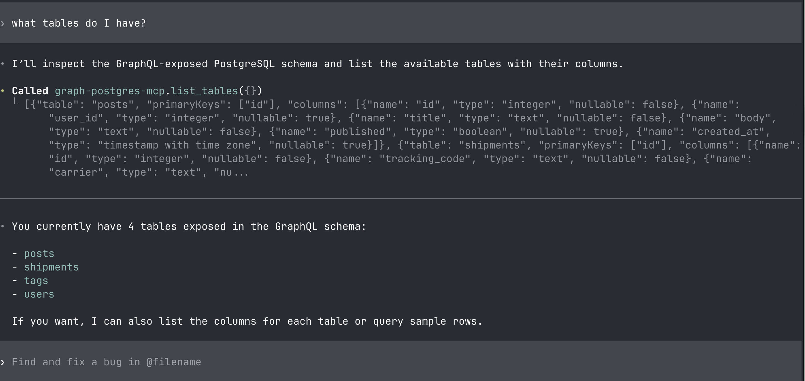
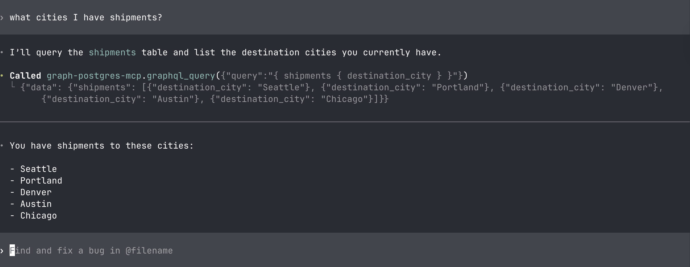

# GraphQL Postgres MCP

This MCP adds GraphQL layer into Postgres database. It allows you to query your Postgres database using GraphQL queries. The MCP does not access postgres directly, instead puts a Graphql in front.

## Usage

Start the Docker Database.
```
./start.sh 
```
Install the MCP
```
./install.sh
```

## Result

UI <br/>


MCP in Codex <br/>


What are my tables in postgres? <br/>


What are my cities with shipment ? <br/>
