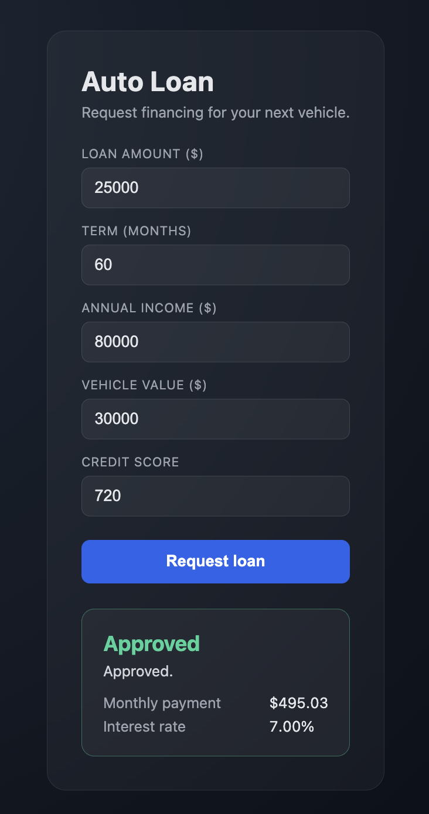
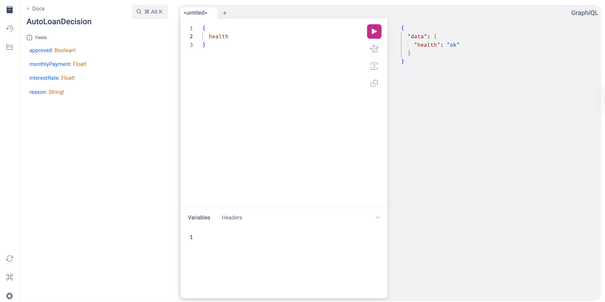
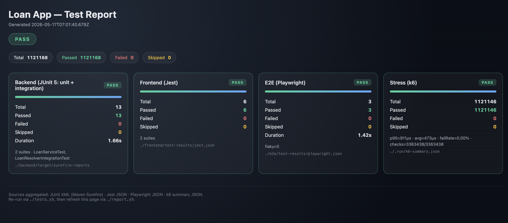

# Loan App

Auto-loan request flow built on Spring Boot 4 + GraphQL on the backend and React + TanStack Query + Bun on the frontend.

Follows the project rules in [../CLAUDE.md](../CLAUDE.md).

## Stack

**Backend** — `backend/`
- Java 25
- Spring Boot 4.0.6
- `spring-boot-starter-web` + `spring-boot-starter-graphql`
- GraphiQL exposed at `/graphiql`

**Frontend** — `frontend/`
- React 18
- TypeScript 6
- TanStack Query (`@tanstack/react-query`)
- Vite
- Bun as the package manager / runtime
- Plain `fetch`-based GraphQL client (no Apollo / urql)

## Layout

```
loan-app/
├── backend/
│   ├── pom.xml
│   └── src/main/
│       ├── java/com/loan/
│       │   ├── LoanApplication.java
│       │   ├── domain/        AutoLoanInput, AutoLoanDecision  (records)
│       │   ├── service/       LoanService                      (approval logic)
│       │   └── graphql/       LoanResolver                     (Query + Mutation mapping)
│       └── resources/
│           ├── application.yml
│           └── graphql/schema.graphqls
├── frontend/
│   ├── package.json
│   ├── vite.config.ts
│   ├── tsconfig.json
│   ├── index.html
│   └── src/
│       ├── main.tsx
│       ├── App.tsx
│       ├── api/         client.ts, mutations.ts   (transport layer)
│       ├── components/  LoanForm.tsx, LoanResult.tsx  (presentation)
│       ├── types/       loan.ts                   (shared types)
│       └── styles.css
├── start.sh
└── stop.sh
```

## Run

```bash
./start.sh   # backend on :8080, frontend on :5173
./stop.sh
```

PIDs are kept in `.run/` and logs in `.run/backend.log` / `.run/frontend.log`.

## GraphQL contract

Schema at `backend/src/main/resources/graphql/schema.graphqls`:

```graphql
type Query   { health: String! }
type Mutation {
  requestAutoLoan(input: AutoLoanInput!): AutoLoanDecision!
}

input AutoLoanInput  { amount, termMonths, annualIncome, vehicleValue, creditScore }
type  AutoLoanDecision { approved, monthlyPayment, interestRate, reason }
```

Approval rules (`LoanService`):
- Credit score `< 650` → denied.
- Loan amount `> 85%` of vehicle value (LTV) → denied.
- Monthly payment `> 40%` of monthly income (DTI) → denied.
- Otherwise approved with a tiered annual rate: `800+ → 5%`, `700–799 → 7%`, `650–699 → 10%`.
- Monthly payment uses standard amortization.

## Screenshots

### Frontend — the application UI



The React app rendered against a sample request:

- **Header** — "Auto Loan" with the tagline "Request financing for your next vehicle." Renders from `App.tsx`.
- **Form** — five number inputs (`LoanForm.tsx`): Loan amount, Term (months), Annual income, Vehicle value, Credit score. Each maps 1:1 to a field on `AutoLoanInput`.
- **Submit** — the blue "Request loan" button fires the TanStack Query `useMutation` wired to `requestAutoLoan` in `src/api/mutations.ts`.
- **Result card** — `LoanResult.tsx`. The capture shows a successful submission: `amount=25000`, `term=60`, `income=80000`, `vehicleValue=30000`, `creditScore=720`. The decision returned from the server is **Approved**, with `monthlyPayment = $495.03` and `interestRate = 7.00%` (credit score 720 lands in the 700–799 tier).

The green status bar and bordered card style come from the `.result.approved` rule in `src/styles.css`; on rejection the equivalent `.denied` variant turns red.

### Backend — GraphiQL introspection



The GraphiQL playground served by Spring Boot at <http://localhost:8080/graphiql>:

- **Left panel** — auto-generated Docs view for the `AutoLoanDecision` type. The four fields (`approved: Boolean!`, `monthlyPayment: Float!`, `interestRate: Float!`, `reason: String!`) match the record in `com.loan.domain.AutoLoanDecision`.
- **Middle panel** — query editor running `{ health }`.
- **Right panel** — response: `{ "data": { "health": "ok" } }`. This is served by `LoanResolver.health()` and confirms the GraphQL endpoint is wired correctly end-to-end.

This view is the cheapest way to verify the backend is alive without going through the React app — useful during development if the frontend is misbehaving and you need to isolate the problem.

### Aggregate test report



The single dashboard produced by `./report.sh` after `./tests.sh` finishes. It reads four separate result artifacts and renders one page:

- **Header** — generation timestamp.
- **Overall pill** — green **PASS** because every suite passed. Flips to amber **PARTIAL** if a result file is missing, red **FAIL** if any suite has failures.
- **Top totals** — sum across all four suites: `Total 1,121,168` · `Passed 1,121,168` · `Failed 0` · `Skipped 0`. The headline number is dominated by k6 because each VU iteration counts as one "test" for stress purposes.
- **Per-suite cards**, left to right:
  - **Backend (JUnit 5: unit + integration)** — `13 / 13` passed across 2 suites (`LoanServiceTest`, `LoanResolverIntegrationTest`), duration 1.66s. Source: `./backend/target/surefire-reports`.
  - **Frontend (Jest)** — `6 / 6` passed across 2 suites (`client.test.ts`, `mutations.test.ts`). Source: `./frontend/test-results/jest.json`.
  - **E2E (Playwright)** — `3 / 3` passed, `flaky=0`, duration 1.42s. Source: `./e2e/test-results/playwright.json`.
  - **Stress (k6)** — `1,121,146 / 1,121,146` requests succeeded, `p95=911µs · avg=473µs · failRate=0.00%`, `checks=3,363,438/3,363,438` (each iteration runs three assertions: HTTP 200, `approved=true`, no GraphQL errors). Source: `./.run/k6-summary.json`.

Each card carries its own PASS badge and a colored top bar whose width reflects the per-suite pass rate. The badge logic for k6 is stricter than just "no HTTP errors" — it also requires every `k6 check` to have passed, so a server that silently denies all loans would fail the stress card even though every request returned 200.

Sources aggregated: JUnit XML (Maven Surefire) · Jest JSON · Playwright JSON · k6 summary JSON. The page is fully static — refresh by re-running `./report.sh`.

## Separation of concerns

- **Domain types** (`domain/`) are pure data — Java records, no annotations, no logic.
- **Service** (`LoanService`) owns approval logic and has no Spring Web / GraphQL imports — testable in isolation.
- **Resolver** (`LoanResolver`) is a thin adapter that maps GraphQL operations to service calls. No business logic lives here.
- **Frontend `api/`** is the only place that knows the GraphQL endpoint or query strings.
- **Frontend `components/`** receive plain props; they don't know about `fetch`, TanStack Query, or the network.
- **Frontend `App.tsx`** is the single seam where TanStack Query is wired to the API layer and rendered components.
