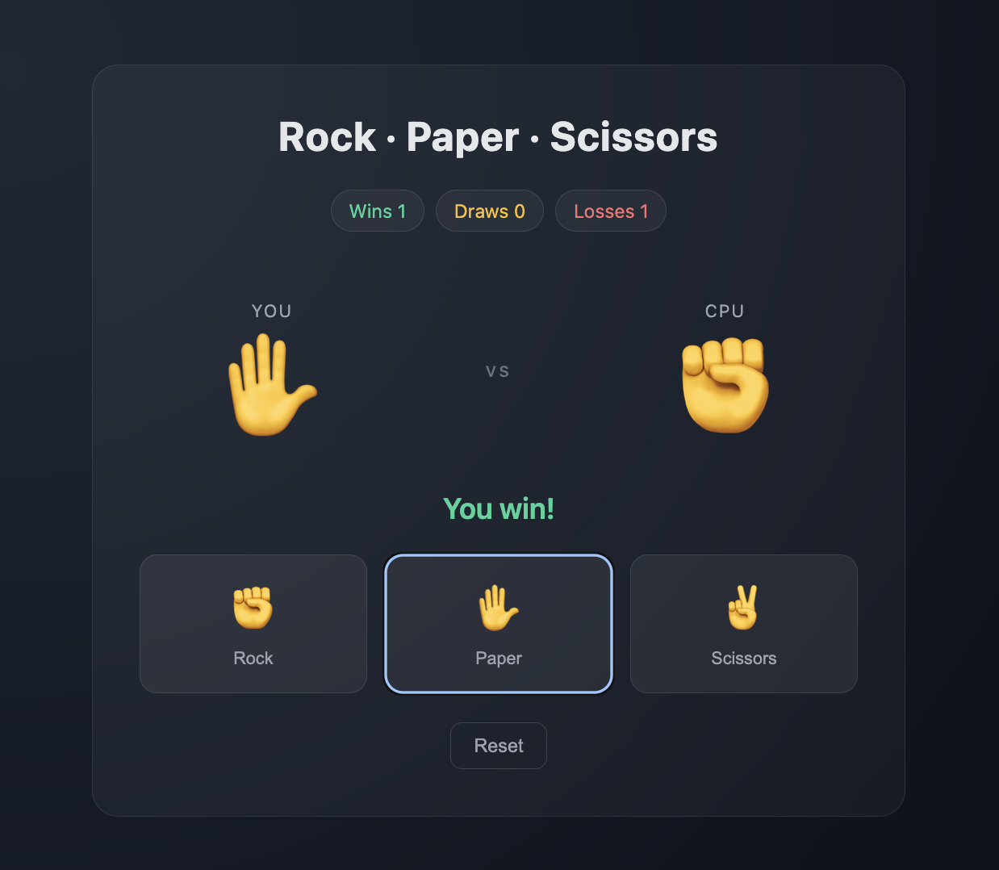

# Rock · Paper · Scissors

A small React + TypeScript web game built with Vite.

## Project rules

This project follows the 12-rule template defined in [../CLAUDE.md](../CLAUDE.md).

## Run

```bash
./run.sh
```

Then open http://localhost:5173

## Stack

- React 18
- TypeScript
- Vite

## Result



The screenshot shows the running game UI:

- **Title bar** — "Rock · Paper · Scissors".
- **Score pills** — running totals for Wins, Draws, Losses (here: 1 win, 0 draws, 1 loss).
- **Arena** — left side shows the player's last move, right side shows the CPU's move, separated by a `vs` marker. In the capture the player threw Paper (✋) against CPU Rock (✊).
- **Outcome** — colored verdict line below the arena ("You win!" in green; red for losses, amber for draws).
- **Controls** — three buttons (Rock, Paper, Scissors). The last-played button stays highlighted with a blue outline.
- **Reset** — clears score and current round back to the initial state.

Dark theme, glass-panel card on a radial gradient background, system font stack.
