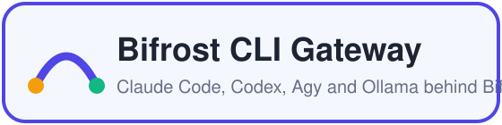
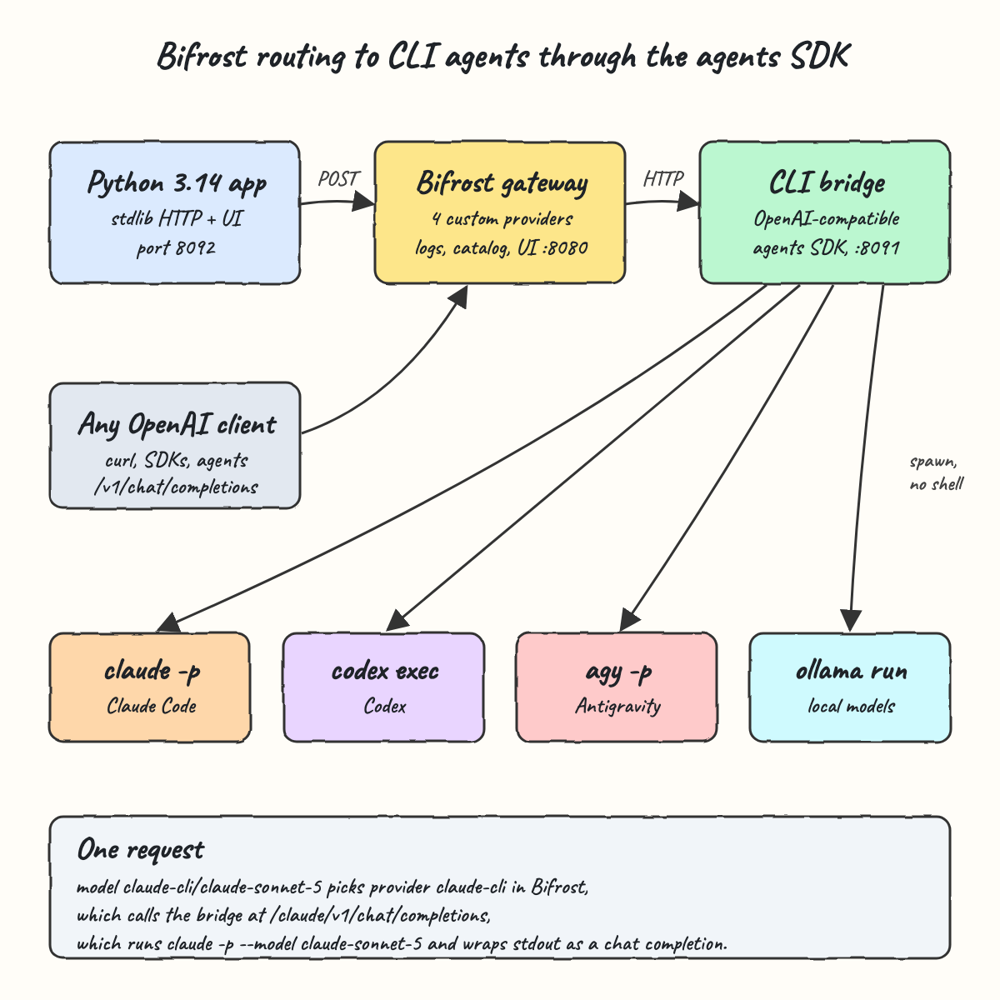
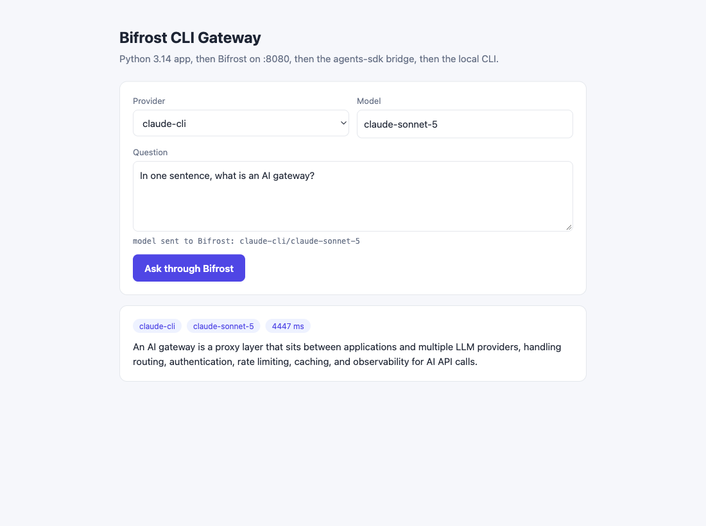
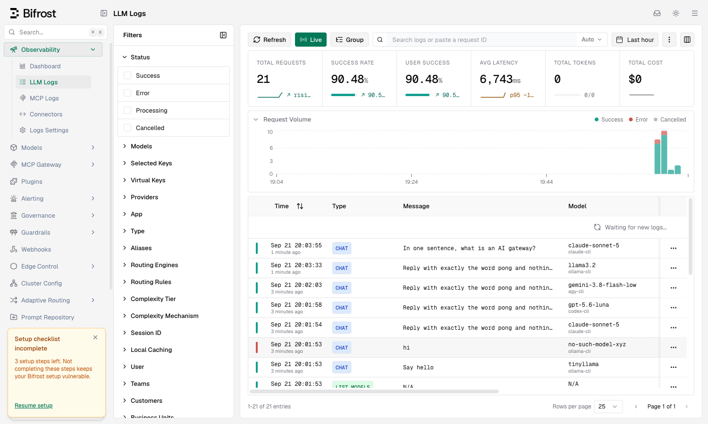

<p align="center"></p>

# Bifrost CLI Gateway

This POC runs the [Bifrost](https://github.com/maximhq/bifrost) AI gateway locally. Bifrost routes to the models you already use through CLIs: Claude Code, Codex, Agy and Ollama. A small Python 3.14.7 bridge, built on a copy of the agents SDK, exposes those CLIs as OpenAI-compatible endpoints, and Bifrost registers each one as a custom provider. A simple Python 3.14.7 web app sends every question through Bifrost, so any OpenAI client can also call `claude-cli/claude-sonnet-5`, `codex-cli/gpt-5.6-luna`, `agy-cli/gemini-3.8-flash-low` or `ollama-cli/llama3.2`.

## How It Works?

1. The app posts `{"model": "claude-cli/claude-sonnet-5", "messages": [...]}` to Bifrost at `/v1/chat/completions`.
2. Bifrost reads the prefix `claude-cli`, picks that custom provider (base type `openai`) and forwards the call to its `base_url`.
3. Every provider's `base_url` points at the bridge with its own prefix: `/claude`, `/codex`, `/agy` or `/ollama`.
4. The bridge turns the messages into one prompt and calls the matching agents SDK class, for example `ClaudeCodeAgent`.
5. The SDK runs `claude -p --model claude-sonnet-5 <prompt>` as an argument list, with no shell.
6. The bridge wraps the CLI's stdout in an OpenAI `chat.completion`. Bifrost logs it and returns it with routing info, and the app shows the answer, provider and latency.
7. When a CLI fails, the bridge returns a 502. Bifrost passes the error through instead of inventing an answer.

## Architecture



The diagram source is [architecture.svg](architecture.svg).

## Features

- **Bifrost running locally**: started with `npx`, pinned to the gateway binary `v2.2.1`, with its Web UI, logs and model catalog on port 8080.
- **CLI models behind Bifrost**: Bifrost can route to, log and govern Claude Code, Codex, Agy and Ollama like any other provider.
- **One custom provider per CLI**: the model string picks the CLI, and you configure it once in `bifrost/config.template.json`.
- **Model catalog**: the bridge serves `/v1/models` per provider, so `GET /v1/models` on Bifrost lists every CLI model.
- **Copied agents SDK**: `agent-sdk/agent_sdk.py` keeps the shell-free process runner and the per-CLI argument builders.
- **Python 3.14.7 app**: a stdlib web UI that talks only to Bifrost, never to a CLI directly.
- **Failures stay visible**: CLI errors come back as HTTP 502 through Bifrost and show up in red in the Bifrost logs.
- **No dependencies**: the bridge, app and tests use only the Python standard library.

## Stack

- **Bifrost `v2.2.1`** (npx wrapper `1.6.3`): the gateway that does routing, logging and the model catalog.
- **Python 3.14.7**: the bridge and the app, stdlib `http.server` and `urllib`, no packages.
- **agents SDK (Python)**: copied in to call Claude Code, Codex, Agy and Ollama through their CLIs.
- **unittest**: built-in test runner for unit tests and the live integration suite.
- **Bash scripts**: one command each to set up, start, test and stop the stack.

## Contracts/APIs

Bifrost on `http://localhost:8080`:

| Method | Path | What it does |
|---|---|---|
| POST | `/v1/chat/completions` | OpenAI chat call, `model` is `<provider>/<model>` such as `codex-cli/gpt-5.6-luna` |
| GET | `/v1/models` | Every model from all four CLI providers |
| GET | `/` | Bifrost Web UI with LLM logs |

Bridge on `http://localhost:8091`, called only by Bifrost. `<cli>` is `claude`, `codex`, `agy` or `ollama`:

| Method | Path | What it does |
|---|---|---|
| POST | `/<cli>/v1/chat/completions` | Runs the CLI and returns an OpenAI `chat.completion`. Streaming returns 400 |
| GET | `/<cli>/v1/models` | Known model ids for that CLI |
| GET | `/health` | Bridge status and providers |

App on `http://localhost:8092`:

| Method | Path | Body | Response |
|---|---|---|---|
| POST | `/api/ask` | `{"provider": "claude-cli", "model": "claude-sonnet-5", "question": "..."}` | `{"answer", "provider", "model", "latency_ms"}` |
| GET | `/api/providers` | | `{"providers": [...]}` |

Call Bifrost with any OpenAI client:

```bash
curl -s http://localhost:8080/v1/chat/completions \
  -H "Content-Type: application/json" \
  -d '{"model":"claude-cli/claude-sonnet-5","messages":[{"role":"user","content":"Reply with pong"}]}'
```

## Key data structures and design decisions

- **Custom provider instead of a Go plugin**: Bifrost `.so` plugins must be built with the same Go toolchain and module versions as the gateway binary, which breaks with the prebuilt npx binary. A `custom_provider_config` with `base_provider_type: openai` needs no build and uses Bifrost's normal routing, retries, logs and catalog.
- **Path prefix per CLI**: all four providers share one bridge process, and the path picks the CLI, so the model id reaches the CLI unchanged.
- **Config template**: Bifrost does not expand `env.` inside `network_config.base_url`. `start-all.sh` renders `bifrost/config.template.json` with the bridge port from `scripts/ports.env` into `.run/bifrost/config.json`, which is Bifrost's app dir. Its SQLite config and logs databases stay out of git.
- **`source_of_truth: config.json`**: the file wins on every start, and the SQLite config store keeps the Web UI and governance plugin working.
- **Non-streaming only**: the CLIs return the whole answer, so `chat_completion_stream` is disabled on each provider and the bridge refuses `stream: true`.
- **Timeouts**: `default_request_timeout_in_seconds: 300` and `max_retries: 0`, because a CLI call can take seconds and should never run twice.
- **Agy fix in the copied SDK**: the installed `agy` needs `-p` right before the prompt. The copy now builds `agy --model <m> -p <prompt>`, and a test pins that order.

## How to run the app/tests

Needs Python 3.14, Node (for `npx`) and the `claude`, `codex`, `agy` and `ollama` CLIs, logged in. Setup warns about any missing CLI.

```bash
./scripts/setup.sh
./scripts/start-all.sh
./scripts/test-all.sh
./scripts/ui.sh
./scripts/stop-all.sh
```

`test-all.sh` runs 33 tests:

- 14 agents SDK unit tests
- 10 bridge unit tests
- 5 app unit tests
- 4 live integration tests through the running Bifrost. The integration tests call all four real CLIs and check that a CLI failure surfaces as an error. If the stack is down, `test-all.sh` starts it and stops it again afterwards.

## Printscreens

### App asking Claude Code through Bifrost



The Python 3.14 app with `claude-cli` and `claude-sonnet-5` selected. The line under the question shows the exact model string sent to Bifrost. The answer came from `claude -p` through Bifrost and the bridge in about 4.4 seconds, and the chips show the provider Bifrost reports it routed to.

### Bifrost LLM logs



The Bifrost Web UI after the integration tests and the app call. Every request is logged with its prompt and model, and each model shows its routed provider: `claude-cli`, `codex-cli`, `agy-cli` and `ollama-cli`. The red row is the intentional `no-such-model-xyz` call, where Ollama failed and Bifrost recorded the error instead of an answer. The `LIST MODELS` rows are Bifrost filling its catalog from the bridge.

## Scripts

All scripts live in `scripts/` and run from any directory of the repository.

| Script | What it does |
|---|---|
| `./scripts/setup.sh` | Checks Python 3.14, downloads Bifrost, checks the CLIs |
| `./scripts/start-all.sh` | Starts the bridge, Bifrost and the app, then prints the full link of each one |
| `./scripts/status.sh` | Shows every service port as UP or DOWN, and exits non-zero while any is down |
| `./scripts/test-all.sh` | Runs every test suite, unit and live integration |
| `./scripts/ui.sh` | Opens the app and the Bifrost UI in the browser |
| `./scripts/stop-all.sh` | Stops every service |

Ports are declared in `scripts/ports.env`: `bifrost=8080`, `bridge=8091`, `app=8092`.

```bash
./scripts/setup.sh
./scripts/start-all.sh
./scripts/status.sh
./scripts/ui.sh
./scripts/stop-all.sh
```
