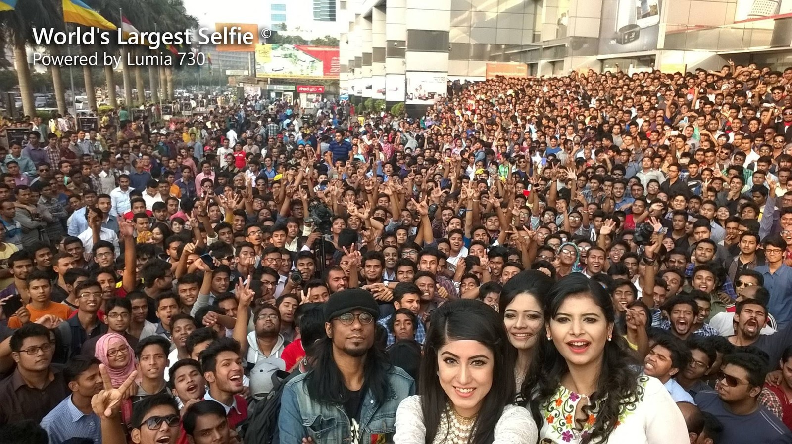

### Build 
```bash
./mvnw clean install 
```
### Input


### Output


### Result
```
2024-04-23 21:36:48 DEBUG DefaultModelZoo:67 - Scanning models in repo: class ai.djl.repository.SimpleUrlRepository, https://resources.djl.ai/test-models/pytorch/ultranet.zip
2024-04-23 21:36:49 DEBUG ModelZoo:111 - Loading model with Criteria:
        Application: UNDEFINED
        Input: interface ai.djl.modality.cv.Image
        Output: class ai.djl.modality.cv.output.DetectedObjects
        Engine: PyTorch
        ModelZoo: ai.djl.localmodelzoo

2024-04-23 21:36:49 DEBUG ModelZoo:115 - Searching model in specified model zoo: ai.djl.localmodelzoo
2024-04-23 21:36:49 DEBUG Engine:165 - Registering EngineProvider: Python
2024-04-23 21:36:49 DEBUG Engine:165 - Registering EngineProvider: MPI
2024-04-23 21:36:49 DEBUG Engine:165 - Registering EngineProvider: DeepSpeed
2024-04-23 21:36:49 DEBUG Engine:165 - Registering EngineProvider: PyTorch
2024-04-23 21:36:49 DEBUG Engine:165 - Registering EngineProvider: OnnxRuntime
2024-04-23 21:36:49 DEBUG Engine:165 - Registering EngineProvider: TensorFlow
2024-04-23 21:36:49 DEBUG Engine:95 - Found default engine: PyTorch
2024-04-23 21:36:52 DEBUG ModelZoo:151 - Checking ModelLoader: ai.djl.localmodelzoo:ultranet UNDEFINED [
        ai.djl.localmodelzoo/ultranet/ultranet {}
]
2024-04-23 21:36:52 DEBUG MRL:267 - Preparing artifact: https://resources.djl.ai/test-models/pytorch/ultranet.zip, ai.djl.localmodelzoo/ultranet/ultranet {}
2024-04-23 21:36:52 DEBUG AbstractRepository:150 - Items to download: 1
2024-04-23 21:36:52 DEBUG SimpleUrlRepository:102 - Downloading artifact: https://resources.djl.ai/test-models/pytorch/ultranet.zip ...
Downloading: 100% |████████████████████████████████████████|
Loading:     100% |████████████████████████████████████████|
2024-04-23 21:36:53 DEBUG CudaUtils:76 - No GPU device found: no CUDA-capable device is detected (100)
2024-04-23 21:36:53 DEBUG LibUtils:410 - Using cache dir: /mnt/e35d88d4-42b9-49ea-bf29-c4c3b018d429/diego/data-ai/DJL_CACHE_DIR/pytorch/2.1.1-cpu-linux-x86_64
2024-04-23 21:36:53 DEBUG LibUtils:374 - Loading native library: /mnt/e35d88d4-42b9-49ea-bf29-c4c3b018d429/diego/data-ai/DJL_CACHE_DIR/pytorch/2.1.1-cpu-linux-x86_64/libgomp-52f2fd74.so.1
2024-04-23 21:36:53 DEBUG LibUtils:374 - Loading native library: /mnt/e35d88d4-42b9-49ea-bf29-c4c3b018d429/diego/data-ai/DJL_CACHE_DIR/pytorch/2.1.1-cpu-linux-x86_64/libc10.so
2024-04-23 21:36:53 DEBUG LibUtils:374 - Loading native library: /mnt/e35d88d4-42b9-49ea-bf29-c4c3b018d429/diego/data-ai/DJL_CACHE_DIR/pytorch/2.1.1-cpu-linux-x86_64/libtorch_cpu.so
2024-04-23 21:36:53 DEBUG LibUtils:374 - Loading native library: /mnt/e35d88d4-42b9-49ea-bf29-c4c3b018d429/diego/data-ai/DJL_CACHE_DIR/pytorch/2.1.1-cpu-linux-x86_64/libtorch.so
2024-04-23 21:36:53 DEBUG LibUtils:374 - Loading native library: /mnt/e35d88d4-42b9-49ea-bf29-c4c3b018d429/diego/data-ai/DJL_CACHE_DIR/pytorch/2.1.1-cpu-linux-x86_64/0.27.0-libdjl_torch.so
2024-04-23 21:36:53 INFO  PtEngine:67 - PyTorch graph executor optimizer is enabled, this may impact your inference latency and throughput. See: https://docs.djl.ai/docs/development/inference_performance_optimization.html#graph-executor-optimization
2024-04-23 21:36:53 INFO  PtEngine:72 - Number of inter-op threads is 6
2024-04-23 21:36:53 INFO  PtEngine:73 - Number of intra-op threads is 6
2024-04-23 21:36:53 DEBUG JniUtils:1739 - mapLocation: false
2024-04-23 21:36:53 DEBUG JniUtils:1740 - extraFileKeys: []
2024-04-23 21:36:55 INFO  Main:68 - Face detection result image has been saved in: build/output/ultranet_detected.png
2024-04-23 21:36:55 INFO  Main:24 - [
        {"class": "Face", "probability": 0.99997, "bounds": {"x"=0.344, "y"=0.519, "width"=0.017, "height"=0.037}}
        {"class": "Face", "probability": 0.99996, "bounds": {"x"=0.775, "y"=0.414, "width"=0.013, "height"=0.029}}
        {"class": "Face", "probability": 0.99995, "bounds": {"x"=0.500, "y"=0.518, "width"=0.013, "height"=0.030}}
        {"class": "Face", "probability": 0.99992, "bounds": {"x"=0.568, "y"=0.527, "width"=0.016, "height"=0.036}}
        {"class": "Face", "probability": 0.99992, "bounds": {"x"=0.850, "y"=0.442, "width"=0.016, "height"=0.032}}
        {"class": "Face", "probability": 0.99992, "bounds": {"x"=0.951, "y"=0.390, "width"=0.012, "height"=0.026}}
        {"class": "Face", "probability": 0.99992, "bounds": {"x"=0.212, "y"=0.452, "width"=0.012, "height"=0.029}}
        {"class": "Face", "probability": 0.99991, "bounds": {"x"=0.636, "y"=0.661, "width"=0.050, "height"=0.129}}
        {"class": "Face", "probability": 0.99991, "bounds": {"x"=0.125, "y"=0.445, "width"=0.015, "height"=0.033}}
        {"class": "Face", "probability": 0.99991, "bounds": {"x"=0.440, "y"=0.487, "width"=0.014, "height"=0.030}}
        {"class": "Face", "probability": 0.99990, "bounds": {"x"=0.697, "y"=0.663, "width"=0.069, "height"=0.157}}
        {"class": "Face", "probability": 0.99990, "bounds": {"x"=0.551, "y"=0.750, "width"=0.071, "height"=0.169}}
        {"class": "Face", "probability": 0.99989, "bounds": {"x"=0.420, "y"=0.492, "width"=0.015, "height"=0.032}}
        {"class": "Face", "probability": 0.99987, "bounds": {"x"=0.177, "y"=0.776, "width"=0.032, "height"=0.076}}
        {"class": "Face", "probability": 0.99984, "bounds": {"x"=0.849, "y"=0.484, "width"=0.015, "height"=0.034}}
        {"class": "Face", "probability": 0.99983, "bounds": {"x"=0.196, "y"=0.466, "width"=0.014, "height"=0.030}}
        {"class": "Face", "probability": 0.99980, "bounds": {"x"=0.168, "y"=0.455, "width"=0.015, "height"=0.031}}
        {"class": "Face", "probability": 0.99979, "bounds": {"x"=0.270, "y"=0.789, "width"=0.039, "height"=0.090}}
        {"class": "Face", "probability": 0.99978, "bounds": {"x"=0.719, "y"=0.481, "width"=0.014, "height"=0.030}}
        {"class": "Face", "probability": 0.99975, "bounds": {"x"=0.876, "y"=0.608, "width"=0.025, "height"=0.055}}
        {"class": "Face", "probability": 0.99973, "bounds": {"x"=0.484, "y"=0.561, "width"=0.019, "height"=0.042}}
        {"class": "Face", "probability": 0.99973, "bounds": {"x"=0.618, "y"=0.577, "width"=0.018, "height"=0.043}}
        {"class": "Face", "probability": 0.99973, "bounds": {"x"=0.265, "y"=0.464, "width"=0.014, "height"=0.030}}
        {"class": "Face", "probability": 0.99972, "bounds": {"x"=0.745, "y"=0.404, "width"=0.011, "height"=0.024}}
        {"class": "Face", "probability": 0.99970, "bounds": {"x"=0.419, "y"=0.685, "width"=0.055, "height"=0.112}}
        {"class": "Face", "probability": 0.99970, "bounds": {"x"=0.887, "y"=0.459, "width"=0.014, "height"=0.034}}
        {"class": "Face", "probability": 0.99968, "bounds": {"x"=0.797, "y"=0.419, "width"=0.013, "height"=0.028}}
        {"class": "Face", "probability": 0.99967, "bounds": {"x"=0.362, "y"=0.499, "width"=0.014, "height"=0.033}}
        {"class": "Face", "probability": 0.99964, "bounds": {"x"=0.870, "y"=0.447, "width"=0.014, "height"=0.031}}
        {"class": "Face", "probability": 0.99963, "bounds": {"x"=0.201, "y"=0.413, "width"=0.012, "height"=0.025}}
        {"class": "Face", "probability": 0.99963, "bounds": {"x"=0.294, "y"=0.484, "width"=0.016, "height"=0.036}}
        {"class": "Face", "probability": 0.99962, "bounds": {"x"=0.877, "y"=0.512, "width"=0.017, "height"=0.036}}
        {"class": "Face", "probability": 0.99960, "bounds": {"x"=0.936, "y"=0.532, "width"=0.019, "height"=0.039}}
        {"class": "Face", "probability": 0.99954, "bounds": {"x"=0.846, "y"=0.683, "width"=0.030, "height"=0.066}}
        {"class": "Face", "probability": 0.99953, "bounds": {"x"=0.277, "y"=0.512, "width"=0.016, "height"=0.039}}
        {"class": "Face", "probability": 0.99953, "bounds": {"x"=0.927, "y"=0.350, "width"=0.012, "height"=0.025}}
        {"class": "Face", "probability": 0.99952, "bounds": {"x"=0.370, "y"=0.461, "width"=0.014, "height"=0.029}}
        {"class": "Face", "probability": 0.99951, "bounds": {"x"=0.107, "y"=0.436, "width"=0.013, "height"=0.027}}
        {"class": "Face", "probability": 0.99946, "bounds": {"x"=0.122, "y"=0.558, "width"=0.020, "height"=0.044}}
        {"class": "Face", "probability": 0.99946, "bounds": {"x"=0.151, "y"=0.400, "width"=0.011, "height"=0.025}}
        {"class": "Face", "probability": 0.99942, "bounds": {"x"=0.011, "y"=0.367, "width"=0.012, "height"=0.024}}
        {"class": "Face", "probability": 0.99936, "bounds": {"x"=0.708, "y"=0.554, "width"=0.020, "height"=0.040}}
        {"class": "Face", "probability": 0.99932, "bounds": {"x"=0.324, "y"=0.693, "width"=0.027, "height"=0.058}}
        {"class": "Face", "probability": 0.99930, "bounds": {"x"=0.891, "y"=0.343, "width"=0.011, "height"=0.024}}
        {"class": "Face", "probability": 0.99929, "bounds": {"x"=0.844, "y"=0.573, "width"=0.021, "height"=0.042}}
        {"class": "Face", "probability": 0.99927, "bounds": {"x"=0.774, "y"=0.640, "width"=0.026, "height"=0.056}}
        {"class": "Face", "probability": 0.99926, "bounds": {"x"=0.614, "y"=0.485, "width"=0.017, "height"=0.033}}
        {"class": "Face", "probability": 0.99925, "bounds": {"x"=0.819, "y"=0.411, "width"=0.013, "height"=0.027}}
        {"class": "Face", "probability": 0.99924, "bounds": {"x"=0.527, "y"=0.627, "width"=0.022, "height"=0.049}}
        {"class": "Face", "probability": 0.99922, "bounds": {"x"=0.957, "y"=0.365, "width"=0.012, "height"=0.024}}
        {"class": "Face", "probability": 0.99921, "bounds": {"x"=0.220, "y"=0.824, "width"=0.036, "height"=0.073}}
        {"class": "Face", "probability": 0.99920, "bounds": {"x"=0.869, "y"=0.370, "width"=0.011, "height"=0.024}}
        {"class": "Face", "probability": 0.99917, "bounds": {"x"=0.762, "y"=0.410, "width"=0.011, "height"=0.026}}
        {"class": "Face", "probability": 0.99917, "bounds": {"x"=0.937, "y"=0.314, "width"=0.011, "height"=0.024}}
        {"class": "Face", "probability": 0.99917, "bounds": {"x"=0.137, "y"=0.688, "width"=0.027, "height"=0.056}}
        {"class": "Face", "probability": 0.99913, "bounds": {"x"=0.226, "y"=0.636, "width"=0.023, "height"=0.050}}
        {"class": "Face", "probability": 0.99910, "bounds": {"x"=0.391, "y"=0.646, "width"=0.024, "height"=0.051}}
        {"class": "Face", "probability": 0.99909, "bounds": {"x"=0.787, "y"=0.582, "width"=0.018, "height"=0.040}}
        {"class": "Face", "probability": 0.99905, "bounds": {"x"=0.531, "y"=0.575, "width"=0.020, "height"=0.045}}
        {"class": "Face", "probability": 0.99904, "bounds": {"x"=0.313, "y"=0.511, "width"=0.019, "height"=0.040}}
        {"class": "Face", "probability": 0.99901, "bounds": {"x"=0.905, "y"=0.467, "width"=0.014, "height"=0.027}}
        {"class": "Face", "probability": 0.99901, "bounds": {"x"=0.887, "y"=0.384, "width"=0.010, "height"=0.023}}
        {"class": "Face", "probability": 0.99901, "bounds": {"x"=0.045, "y"=0.558, "width"=0.022, "height"=0.047}}
        {"class": "Face", "probability": 0.99900, "bounds": {"x"=0.844, "y"=0.377, "width"=0.011, "height"=0.023}}
        {"class": "Face", "probability": 0.99898, "bounds": {"x"=0.923, "y"=0.404, "width"=0.014, "height"=0.028}}
        {"class": "Face", "probability": 0.99896, "bounds": {"x"=0.192, "y"=0.516, "width"=0.014, "height"=0.031}}
        {"class": "Face", "probability": 0.99895, "bounds": {"x"=0.783, "y"=0.342, "width"=0.010, "height"=0.023}}
        {"class": "Face", "probability": 0.99888, "bounds": {"x"=0.896, "y"=0.271, "width"=0.010, "height"=0.021}}
        {"class": "Face", "probability": 0.99885, "bounds": {"x"=0.038, "y"=0.629, "width"=0.025, "height"=0.051}}
        {"class": "Face", "probability": 0.99885, "bounds": {"x"=0.964, "y"=0.290, "width"=0.012, "height"=0.027}}
        {"class": "Face", "probability": 0.99879, "bounds": {"x"=0.789, "y"=0.308, "width"=0.009, "height"=0.018}}
        {"class": "Face", "probability": 0.99878, "bounds": {"x"=0.496, "y"=0.710, "width"=0.026, "height"=0.055}}
        {"class": "Face", "probability": 0.99875, "bounds": {"x"=0.024, "y"=0.750, "width"=0.041, "height"=0.084}}
        {"class": "Face", "probability": 0.99869, "bounds": {"x"=0.800, "y"=0.452, "width"=0.014, "height"=0.030}}
        {"class": "Face", "probability": 0.99868, "bounds": {"x"=0.977, "y"=0.309, "width"=0.013, "height"=0.026}}
        {"class": "Face", "probability": 0.99868, "bounds": {"x"=0.218, "y"=0.720, "width"=0.026, "height"=0.057}}
        {"class": "Face", "probability": 0.99865, "bounds": {"x"=0.917, "y"=0.500, "width"=0.015, "height"=0.036}}
        {"class": "Face", "probability": 0.99862, "bounds": {"x"=0.879, "y"=0.340, "width"=0.010, "height"=0.023}}
        {"class": "Face", "probability": 0.99862, "bounds": {"x"=0.256, "y"=0.410, "width"=0.011, "height"=0.025}}
        {"class": "Face", "probability": 0.99859, "bounds": {"x"=0.741, "y"=0.565, "width"=0.023, "height"=0.046}}
        {"class": "Face", "probability": 0.99857, "bounds": {"x"=0.927, "y"=0.305, "width"=0.010, "height"=0.022}}
        {"class": "Face", "probability": 0.99850, "bounds": {"x"=0.173, "y"=0.490, "width"=0.016, "height"=0.035}}
        {"class": "Face", "probability": 0.99849, "bounds": {"x"=0.506, "y"=0.478, "width"=0.013, "height"=0.028}}
        {"class": "Face", "probability": 0.99846, "bounds": {"x"=0.213, "y"=0.361, "width"=0.009, "height"=0.018}}
        {"class": "Face", "probability": 0.99845, "bounds": {"x"=0.375, "y"=0.580, "width"=0.023, "height"=0.051}}
        {"class": "Face", "probability": 0.99842, "bounds": {"x"=0.931, "y"=0.621, "width"=0.025, "height"=0.052}}
        {"class": "Face", "probability": 0.99831, "bounds": {"x"=0.100, "y"=0.646, "width"=0.026, "height"=0.056}}
        {"class": "Face", "probability": 0.99825, "bounds": {"x"=0.025, "y"=0.428, "width"=0.013, "height"=0.029}}
        {"class": "Face", "probability": 0.99816, "bounds": {"x"=0.975, "y"=0.201, "width"=0.011, "height"=0.024}}
        {"class": "Face", "probability": 0.99814, "bounds": {"x"=0.461, "y"=0.585, "width"=0.020, "height"=0.046}}
        {"class": "Face", "probability": 0.99809, "bounds": {"x"=0.967, "y"=0.551, "width"=0.020, "height"=0.040}}
        {"class": "Face", "probability": 0.99801, "bounds": {"x"=0.742, "y"=0.461, "width"=0.011, "height"=0.025}}
        {"class": "Face", "probability": 0.99792, "bounds": {"x"=0.558, "y"=0.475, "width"=0.013, "height"=0.026}}
        {"class": "Face", "probability": 0.99776, "bounds": {"x"=0.273, "y"=0.672, "width"=0.027, "height"=0.062}}
        {"class": "Face", "probability": 0.99767, "bounds": {"x"=0.084, "y"=0.547, "width"=0.019, "height"=0.038}}
        {"class": "Face", "probability": 0.99753, "bounds": {"x"=0.933, "y"=0.681, "width"=0.032, "height"=0.074}}
        {"class": "Face", "probability": 0.99747, "bounds": {"x"=0.907, "y"=0.307, "width"=0.010, "height"=0.021}}
        {"class": "Face", "probability": 0.99747, "bounds": {"x"=0.092, "y"=0.391, "width"=0.011, "height"=0.024}}
        {"class": "Face", "probability": 0.99745, "bounds": {"x"=0.750, "y"=0.487, "width"=0.012, "height"=0.030}}
        {"class": "Face", "probability": 0.99737, "bounds": {"x"=0.217, "y"=0.498, "width"=0.013, "height"=0.027}}
        {"class": "Face", "probability": 0.99737, "bounds": {"x"=0.809, "y"=0.316, "width"=0.009, "height"=0.019}}
        {"class": "Face", "probability": 0.99718, "bounds": {"x"=0.906, "y"=0.822, "width"=0.041, "height"=0.080}}
        {"class": "Face", "probability": 0.99715, "bounds": {"x"=0.774, "y"=0.385, "width"=0.011, "height"=0.023}}
        {"class": "Face", "probability": 0.99714, "bounds": {"x"=0.853, "y"=0.311, "width"=0.010, "height"=0.023}}
        {"class": "Face", "probability": 0.99696, "bounds": {"x"=0.754, "y"=0.378, "width"=0.010, "height"=0.023}}
        {"class": "Face", "probability": 0.99694, "bounds": {"x"=0.881, "y"=0.263, "width"=0.009, "height"=0.019}}
        {"class": "Face", "probability": 0.99688, "bounds": {"x"=0.403, "y"=0.393, "width"=0.009, "height"=0.021}}
        {"class": "Face", "probability": 0.99679, "bounds": {"x"=0.813, "y"=0.776, "width"=0.033, "height"=0.069}}
        {"class": "Face", "probability": 0.99669, "bounds": {"x"=0.889, "y"=0.235, "width"=0.009, "height"=0.021}}
        {"class": "Face", "probability": 0.99664, "bounds": {"x"=0.256, "y"=0.369, "width"=0.009, "height"=0.020}}
        {"class": "Face", "probability": 0.99656, "bounds": {"x"=0.436, "y"=0.431, "width"=0.011, "height"=0.024}}
        {"class": "Face", "probability": 0.99650, "bounds": {"x"=0.989, "y"=0.247, "width"=0.009, "height"=0.026}}
        {"class": "Face", "probability": 0.99648, "bounds": {"x"=0.947, "y"=0.272, "width"=0.011, "height"=0.024}}
        {"class": "Face", "probability": 0.99637, "bounds": {"x"=0.335, "y"=0.574, "width"=0.019, "height"=0.036}}
        {"class": "Face", "probability": 0.99620, "bounds": {"x"=0.324, "y"=0.405, "width"=0.011, "height"=0.025}}
        {"class": "Face", "probability": 0.99616, "bounds": {"x"=0.269, "y"=0.614, "width"=0.020, "height"=0.045}}
        {"class": "Face", "probability": 0.99605, "bounds": {"x"=0.822, "y"=0.298, "width"=0.009, "height"=0.021}}
        {"class": "Face", "probability": 0.99596, "bounds": {"x"=0.924, "y"=0.269, "width"=0.010, "height"=0.023}}
        {"class": "Face", "probability": 0.99596, "bounds": {"x"=0.164, "y"=0.672, "width"=0.023, "height"=0.054}}
        {"class": "Face", "probability": 0.99596, "bounds": {"x"=0.353, "y"=0.671, "width"=0.023, "height"=0.053}}
        {"class": "Face", "probability": 0.99590, "bounds": {"x"=0.079, "y"=0.368, "width"=0.010, "height"=0.022}}
        {"class": "Face", "probability": 0.99577, "bounds": {"x"=0.037, "y"=0.304, "width"=0.010, "height"=0.022}}
        {"class": "Face", "probability": 0.99560, "bounds": {"x"=0.900, "y"=0.406, "width"=0.012, "height"=0.024}}
        {"class": "Face", "probability": 0.99516, "bounds": {"x"=0.937, "y"=0.163, "width"=0.009, "height"=0.020}}
        {"class": "Face", "probability": 0.99505, "bounds": {"x"=0.687, "y"=0.476, "width"=0.014, "height"=0.027}}
        {"class": "Face", "probability": 0.99498, "bounds": {"x"=-0.000, "y"=0.420, "width"=0.013, "height"=0.032}}
        {"class": "Face", "probability": 0.99492, "bounds": {"x"=0.904, "y"=0.217, "width"=0.008, "height"=0.018}}
        {"class": "Face", "probability": 0.99483, "bounds": {"x"=0.297, "y"=0.398, "width"=0.010, "height"=0.022}}
        {"class": "Face", "probability": 0.99473, "bounds": {"x"=0.986, "y"=0.480, "width"=0.012, "height"=0.035}}
        {"class": "Face", "probability": 0.99445, "bounds": {"x"=0.678, "y"=0.517, "width"=0.015, "height"=0.033}}
        {"class": "Face", "probability": 0.99441, "bounds": {"x"=0.984, "y"=0.389, "width"=0.011, "height"=0.024}}
        {"class": "Face", "probability": 0.99424, "bounds": {"x"=0.118, "y"=0.369, "width"=0.009, "height"=0.021}}
        {"class": "Face", "probability": 0.99418, "bounds": {"x"=0.063, "y"=0.309, "width"=0.009, "height"=0.019}}
        {"class": "Face", "probability": 0.99416, "bounds": {"x"=0.825, "y"=0.357, "width"=0.010, "height"=0.021}}
        {"class": "Face", "probability": 0.99410, "bounds": {"x"=0.283, "y"=0.420, "width"=0.011, "height"=0.024}}
        {"class": "Face", "probability": 0.99404, "bounds": {"x"=0.744, "y"=0.293, "width"=0.008, "height"=0.018}}
        {"class": "Face", "probability": 0.99369, "bounds": {"x"=0.787, "y"=0.254, "width"=0.008, "height"=0.017}}
        {"class": "Face", "probability": 0.99347, "bounds": {"x"=0.097, "y"=0.820, "width"=0.035, "height"=0.069}}
        {"class": "Face", "probability": 0.99345, "bounds": {"x"=0.015, "y"=0.326, "width"=0.010, "height"=0.023}}
        {"class": "Face", "probability": 0.99339, "bounds": {"x"=0.070, "y"=0.392, "width"=0.010, "height"=0.023}}
        {"class": "Face", "probability": 0.99338, "bounds": {"x"=0.837, "y"=0.536, "width"=0.014, "height"=0.030}}
        {"class": "Face", "probability": 0.99311, "bounds": {"x"=0.864, "y"=0.785, "width"=0.030, "height"=0.068}}
        {"class": "Face", "probability": 0.99304, "bounds": {"x"=0.795, "y"=0.281, "width"=0.008, "height"=0.019}}
        {"class": "Face", "probability": 0.99297, "bounds": {"x"=0.687, "y"=0.381, "width"=0.010, "height"=0.022}}
        {"class": "Face", "probability": 0.99283, "bounds": {"x"=0.829, "y"=0.264, "width"=0.009, "height"=0.020}}
        {"class": "Face", "probability": 0.99273, "bounds": {"x"=0.961, "y"=0.252, "width"=0.010, "height"=0.022}}
        {"class": "Face", "probability": 0.99245, "bounds": {"x"=0.987, "y"=0.440, "width"=0.011, "height"=0.027}}
        {"class": "Face", "probability": 0.99242, "bounds": {"x"=0.286, "y"=0.351, "width"=0.008, "height"=0.018}}
        {"class": "Face", "probability": 0.99221, "bounds": {"x"=0.582, "y"=0.403, "width"=0.011, "height"=0.024}}
        {"class": "Face", "probability": 0.99139, "bounds": {"x"=0.649, "y"=0.328, "width"=0.007, "height"=0.015}}
        {"class": "Face", "probability": 0.99133, "bounds": {"x"=0.937, "y"=0.466, "width"=0.016, "height"=0.032}}
        {"class": "Face", "probability": 0.99130, "bounds": {"x"=0.588, "y"=0.315, "width"=0.006, "height"=0.014}}
        {"class": "Face", "probability": 0.99128, "bounds": {"x"=0.478, "y"=0.445, "width"=0.012, "height"=0.025}}
        {"class": "Face", "probability": 0.99101, "bounds": {"x"=0.892, "y"=0.431, "width"=0.011, "height"=0.025}}
        {"class": "Face", "probability": 0.99042, "bounds": {"x"=0.704, "y"=0.381, "width"=0.011, "height"=0.024}}
        {"class": "Face", "probability": 0.99039, "bounds": {"x"=0.004, "y"=0.456, "width"=0.016, "height"=0.036}}
        {"class": "Face", "probability": 0.99022, "bounds": {"x"=0.050, "y"=0.375, "width"=0.011, "height"=0.024}}
        {"class": "Face", "probability": 0.99017, "bounds": {"x"=0.424, "y"=0.301, "width"=0.008, "height"=0.017}}
        {"class": "Face", "probability": 0.98996, "bounds": {"x"=0.823, "y"=0.645, "width"=0.021, "height"=0.049}}
        {"class": "Face", "probability": 0.98993, "bounds": {"x"=0.302, "y"=0.557, "width"=0.019, "height"=0.040}}
        {"class": "Face", "probability": 0.98970, "bounds": {"x"=0.775, "y"=0.283, "width"=0.008, "height"=0.019}}
        {"class": "Face", "probability": 0.98960, "bounds": {"x"=0.832, "y"=0.334, "width"=0.009, "height"=0.020}}
        {"class": "Face", "probability": 0.98958, "bounds": {"x"=0.879, "y"=0.549, "width"=0.021, "height"=0.042}}
        {"class": "Face", "probability": 0.98954, "bounds": {"x"=0.018, "y"=0.584, "width"=0.022, "height"=0.044}}
        {"class": "Face", "probability": 0.98872, "bounds": {"x"=0.704, "y"=0.451, "width"=0.011, "height"=0.025}}
        {"class": "Face", "probability": 0.98868, "bounds": {"x"=0.088, "y"=0.447, "width"=0.011, "height"=0.024}}
        {"class": "Face", "probability": 0.98835, "bounds": {"x"=0.231, "y"=0.379, "width"=0.010, "height"=0.022}}
        {"class": "Face", "probability": 0.98835, "bounds": {"x"=0.147, "y"=0.362, "width"=0.008, "height"=0.018}}
        {"class": "Face", "probability": 0.98742, "bounds": {"x"=0.840, "y"=0.208, "width"=0.008, "height"=0.017}}
        {"class": "Face", "probability": 0.98734, "bounds": {"x"=0.525, "y"=0.395, "width"=0.008, "height"=0.018}}
        {"class": "Face", "probability": 0.98666, "bounds": {"x"=0.549, "y"=0.395, "width"=0.008, "height"=0.017}}
        {"class": "Face", "probability": 0.98664, "bounds": {"x"=0.822, "y"=0.219, "width"=0.007, "height"=0.016}}
        {"class": "Face", "probability": 0.98652, "bounds": {"x"=0.178, "y"=0.917, "width"=0.046, "height"=0.090}}
        {"class": "Face", "probability": 0.98595, "bounds": {"x"=0.319, "y"=0.447, "width"=0.013, "height"=0.025}}
        {"class": "Face", "probability": 0.98592, "bounds": {"x"=0.244, "y"=0.932, "width"=0.047, "height"=0.076}}
        {"class": "Face", "probability": 0.98574, "bounds": {"x"=0.813, "y"=0.231, "width"=0.008, "height"=0.018}}
        {"class": "Face", "probability": 0.98547, "bounds": {"x"=0.860, "y"=0.238, "width"=0.008, "height"=0.018}}
        {"class": "Face", "probability": 0.98472, "bounds": {"x"=0.763, "y"=0.449, "width"=0.012, "height"=0.028}}
        {"class": "Face", "probability": 0.98468, "bounds": {"x"=0.730, "y"=0.399, "width"=0.010, "height"=0.021}}
        {"class": "Face", "probability": 0.98445, "bounds": {"x"=0.078, "y"=0.313, "width"=0.009, "height"=0.018}}
        {"class": "Face", "probability": 0.98391, "bounds": {"x"=0.275, "y"=0.397, "width"=0.010, "height"=0.022}}
        {"class": "Face", "probability": 0.98273, "bounds": {"x"=0.214, "y"=0.548, "width"=0.017, "height"=0.038}}
        {"class": "Face", "probability": 0.98215, "bounds": {"x"=0.868, "y"=0.178, "width"=0.009, "height"=0.018}}
        {"class": "Face", "probability": 0.98156, "bounds": {"x"=0.553, "y"=0.549, "width"=0.015, "height"=0.034}}
        {"class": "Face", "probability": 0.98134, "bounds": {"x"=0.651, "y"=0.446, "width"=0.012, "height"=0.025}}
        {"class": "Face", "probability": 0.98096, "bounds": {"x"=0.921, "y"=0.247, "width"=0.009, "height"=0.019}}
        {"class": "Face", "probability": 0.98094, "bounds": {"x"=0.805, "y"=0.247, "width"=0.007, "height"=0.016}}
        {"class": "Face", "probability": 0.98083, "bounds": {"x"=0.949, "y"=0.433, "width"=0.015, "height"=0.029}}
        {"class": "Face", "probability": 0.98071, "bounds": {"x"=0.550, "y"=0.344, "width"=0.007, "height"=0.015}}
        {"class": "Face", "probability": 0.98069, "bounds": {"x"=0.335, "y"=0.357, "width"=0.008, "height"=0.017}}
        {"class": "Face", "probability": 0.98056, "bounds": {"x"=0.885, "y"=0.299, "width"=0.009, "height"=0.020}}
        {"class": "Face", "probability": 0.98001, "bounds": {"x"=0.990, "y"=0.159, "width"=0.008, "height"=0.020}}
        {"class": "Face", "probability": 0.97984, "bounds": {"x"=0.344, "y"=0.413, "width"=0.011, "height"=0.026}}
        {"class": "Face", "probability": 0.97975, "bounds": {"x"=0.593, "y"=0.352, "width"=0.007, "height"=0.015}}
        {"class": "Face", "probability": 0.97891, "bounds": {"x"=0.655, "y"=0.473, "width"=0.012, "height"=0.028}}
        {"class": "Face", "probability": 0.97889, "bounds": {"x"=0.986, "y"=0.357, "width"=0.011, "height"=0.023}}
        {"class": "Face", "probability": 0.97874, "bounds": {"x"=0.931, "y"=0.217, "width"=0.009, "height"=0.019}}
        {"class": "Face", "probability": 0.97854, "bounds": {"x"=0.581, "y"=0.627, "width"=0.021, "height"=0.043}}
        {"class": "Face", "probability": 0.97836, "bounds": {"x"=0.503, "y"=0.326, "width"=0.006, "height"=0.013}}
        {"class": "Face", "probability": 0.97829, "bounds": {"x"=0.409, "y"=0.344, "width"=0.008, "height"=0.018}}
        {"class": "Face", "probability": 0.97753, "bounds": {"x"=0.953, "y"=0.310, "width"=0.010, "height"=0.022}}
        {"class": "Face", "probability": 0.97737, "bounds": {"x"=0.950, "y"=0.157, "width"=0.008, "height"=0.019}}
        {"class": "Face", "probability": 0.97715, "bounds": {"x"=0.130, "y"=0.364, "width"=0.009, "height"=0.020}}
        {"class": "Face", "probability": 0.97655, "bounds": {"x"=0.155, "y"=0.326, "width"=0.008, "height"=0.017}}
        {"class": "Face", "probability": 0.97655, "bounds": {"x"=0.787, "y"=0.527, "width"=0.015, "height"=0.035}}
        {"class": "Face", "probability": 0.97639, "bounds": {"x"=0.865, "y"=0.285, "width"=0.010, "height"=0.022}}
        {"class": "Face", "probability": 0.97633, "bounds": {"x"=0.485, "y"=0.370, "width"=0.009, "height"=0.020}}
        {"class": "Face", "probability": 0.97632, "bounds": {"x"=0.711, "y"=0.248, "width"=0.006, "height"=0.013}}
        {"class": "Face", "probability": 0.97609, "bounds": {"x"=0.811, "y"=0.355, "width"=0.010, "height"=0.022}}
        {"class": "Face", "probability": 0.97473, "bounds": {"x"=0.520, "y"=0.371, "width"=0.008, "height"=0.018}}
        {"class": "Face", "probability": 0.97429, "bounds": {"x"=0.778, "y"=0.200, "width"=0.006, "height"=0.014}}
        {"class": "Face", "probability": 0.97339, "bounds": {"x"=0.104, "y"=0.372, "width"=0.009, "height"=0.021}}
        {"class": "Face", "probability": 0.97293, "bounds": {"x"=0.972, "y"=0.169, "width"=0.009, "height"=0.019}}
        {"class": "Face", "probability": 0.97240, "bounds": {"x"=0.593, "y"=0.555, "width"=0.018, "height"=0.037}}
        {"class": "Face", "probability": 0.97171, "bounds": {"x"=0.656, "y"=0.358, "width"=0.009, "height"=0.019}}
        {"class": "Face", "probability": 0.97128, "bounds": {"x"=0.680, "y"=0.409, "width"=0.010, "height"=0.022}}
        {"class": "Face", "probability": 0.96878, "bounds": {"x"=0.099, "y"=0.295, "width"=0.008, "height"=0.017}}
        {"class": "Face", "probability": 0.96819, "bounds": {"x"=0.054, "y"=0.420, "width"=0.011, "height"=0.024}}
        {"class": "Face", "probability": 0.96808, "bounds": {"x"=0.754, "y"=0.344, "width"=0.010, "height"=0.021}}
        {"class": "Face", "probability": 0.96776, "bounds": {"x"=0.909, "y"=0.338, "width"=0.011, "height"=0.022}}
        {"class": "Face", "probability": 0.96720, "bounds": {"x"=0.353, "y"=0.350, "width"=0.007, "height"=0.015}}
        {"class": "Face", "probability": 0.96631, "bounds": {"x"=0.430, "y"=0.580, "width"=0.018, "height"=0.040}}
        {"class": "Face", "probability": 0.96504, "bounds": {"x"=0.651, "y"=0.414, "width"=0.012, "height"=0.024}}
        {"class": "Face", "probability": 0.96341, "bounds": {"x"=0.877, "y"=0.674, "width"=0.022, "height"=0.055}}
        {"class": "Face", "probability": 0.95957, "bounds": {"x"=0.682, "y"=0.324, "width"=0.007, "height"=0.017}}
        {"class": "Face", "probability": 0.95881, "bounds": {"x"=0.509, "y"=0.403, "width"=0.009, "height"=0.020}}
        {"class": "Face", "probability": 0.95854, "bounds": {"x"=0.328, "y"=0.620, "width"=0.022, "height"=0.050}}
        {"class": "Face", "probability": 0.95836, "bounds": {"x"=0.869, "y"=0.257, "width"=0.009, "height"=0.019}}
        {"class": "Face", "probability": 0.95809, "bounds": {"x"=0.611, "y"=0.654, "width"=0.021, "height"=0.049}}
        {"class": "Face", "probability": 0.95757, "bounds": {"x"=0.773, "y"=0.176, "width"=0.006, "height"=0.012}}
        {"class": "Face", "probability": 0.95663, "bounds": {"x"=0.600, "y"=0.299, "width"=0.006, "height"=0.012}}
        {"class": "Face", "probability": 0.95663, "bounds": {"x"=0.203, "y"=0.307, "width"=0.007, "height"=0.015}}
        {"class": "Face", "probability": 0.95549, "bounds": {"x"=0.470, "y"=0.310, "width"=0.006, "height"=0.013}}
        {"class": "Face", "probability": 0.95474, "bounds": {"x"=0.716, "y"=0.318, "width"=0.008, "height"=0.019}}
        {"class": "Face", "probability": 0.95444, "bounds": {"x"=0.942, "y"=0.248, "width"=0.010, "height"=0.021}}
        {"class": "Face", "probability": 0.95434, "bounds": {"x"=0.211, "y"=0.393, "width"=0.009, "height"=0.020}}
        {"class": "Face", "probability": 0.95365, "bounds": {"x"=0.525, "y"=0.335, "width"=0.007, "height"=0.015}}
        {"class": "Face", "probability": 0.95359, "bounds": {"x"=0.439, "y"=0.376, "width"=0.009, "height"=0.020}}
        {"class": "Face", "probability": 0.95349, "bounds": {"x"=0.739, "y"=0.379, "width"=0.010, "height"=0.023}}
        {"class": "Face", "probability": 0.95349, "bounds": {"x"=0.128, "y"=0.291, "width"=0.007, "height"=0.015}}
        {"class": "Face", "probability": 0.95305, "bounds": {"x"=0.671, "y"=0.264, "width"=0.005, "height"=0.012}}
        {"class": "Face", "probability": 0.95296, "bounds": {"x"=0.187, "y"=0.421, "width"=0.012, "height"=0.023}}
        {"class": "Face", "probability": 0.95273, "bounds": {"x"=0.484, "y"=0.309, "width"=0.006, "height"=0.012}}
        {"class": "Face", "probability": 0.95243, "bounds": {"x"=0.913, "y"=0.151, "width"=0.008, "height"=0.019}}
        {"class": "Face", "probability": 0.95237, "bounds": {"x"=0.223, "y"=0.352, "width"=0.008, "height"=0.017}}
        {"class": "Face", "probability": 0.95145, "bounds": {"x"=0.606, "y"=0.390, "width"=0.009, "height"=0.018}}
        {"class": "Face", "probability": 0.95134, "bounds": {"x"=0.913, "y"=0.195, "width"=0.008, "height"=0.017}}
        {"class": "Face", "probability": 0.95131, "bounds": {"x"=0.663, "y"=0.299, "width"=0.006, "height"=0.013}}
        {"class": "Face", "probability": 0.94640, "bounds": {"x"=0.180, "y"=0.353, "width"=0.009, "height"=0.019}}
        {"class": "Face", "probability": 0.94560, "bounds": {"x"=0.929, "y"=0.190, "width"=0.008, "height"=0.017}}
        {"class": "Face", "probability": 0.94520, "bounds": {"x"=0.538, "y"=0.337, "width"=0.007, "height"=0.016}}
        {"class": "Face", "probability": 0.94448, "bounds": {"x"=0.177, "y"=0.327, "width"=0.008, "height"=0.017}}
        {"class": "Face", "probability": 0.94332, "bounds": {"x"=0.799, "y"=0.167, "width"=0.005, "height"=0.012}}
        {"class": "Face", "probability": 0.94254, "bounds": {"x"=0.240, "y"=0.301, "width"=0.006, "height"=0.014}}
        {"class": "Face", "probability": 0.94096, "bounds": {"x"=0.446, "y"=0.312, "width"=0.007, "height"=0.015}}
        {"class": "Face", "probability": 0.93783, "bounds": {"x"=0.338, "y"=0.456, "width"=0.011, "height"=0.024}}
        {"class": "Face", "probability": 0.93644, "bounds": {"x"=0.315, "y"=0.366, "width"=0.009, "height"=0.020}}
        {"class": "Face", "probability": 0.93610, "bounds": {"x"=0.882, "y"=0.161, "width"=0.008, "height"=0.018}}
        {"class": "Face", "probability": 0.93582, "bounds": {"x"=0.163, "y"=0.316, "width"=0.007, "height"=0.015}}
        {"class": "Face", "probability": 0.93362, "bounds": {"x"=0.510, "y"=0.559, "width"=0.018, "height"=0.036}}
        {"class": "Face", "probability": 0.93226, "bounds": {"x"=0.568, "y"=0.450, "width"=0.009, "height"=0.020}}
        {"class": "Face", "probability": 0.93154, "bounds": {"x"=0.916, "y"=0.216, "width"=0.009, "height"=0.019}}
        {"class": "Face", "probability": 0.93100, "bounds": {"x"=0.135, "y"=0.765, "width"=0.030, "height"=0.066}}
        {"class": "Face", "probability": 0.92920, "bounds": {"x"=0.039, "y"=0.433, "width"=0.010, "height"=0.024}}
        {"class": "Face", "probability": 0.92915, "bounds": {"x"=0.090, "y"=0.303, "width"=0.007, "height"=0.016}}
        {"class": "Face", "probability": 0.92812, "bounds": {"x"=0.845, "y"=0.237, "width"=0.008, "height"=0.018}}
        {"class": "Face", "probability": 0.92670, "bounds": {"x"=0.512, "y"=0.351, "width"=0.007, "height"=0.017}}
        {"class": "Face", "probability": 0.92583, "bounds": {"x"=0.696, "y"=0.313, "width"=0.007, "height"=0.016}}
        {"class": "Face", "probability": 0.92501, "bounds": {"x"=0.503, "y"=0.362, "width"=0.007, "height"=0.016}}
        {"class": "Face", "probability": 0.92417, "bounds": {"x"=0.725, "y"=0.308, "width"=0.007, "height"=0.016}}
        {"class": "Face", "probability": 0.92204, "bounds": {"x"=0.761, "y"=0.279, "width"=0.008, "height"=0.018}}
        {"class": "Face", "probability": 0.92091, "bounds": {"x"=0.737, "y"=0.337, "width"=0.008, "height"=0.019}}
        {"class": "Face", "probability": 0.91451, "bounds": {"x"=0.474, "y"=0.474, "width"=0.013, "height"=0.028}}
        {"class": "Face", "probability": 0.91416, "bounds": {"x"=0.690, "y"=0.290, "width"=0.007, "height"=0.015}}
        {"class": "Face", "probability": 0.91406, "bounds": {"x"=0.648, "y"=0.392, "width"=0.009, "height"=0.020}}
        {"class": "Face", "probability": 0.91162, "bounds": {"x"=0.893, "y"=0.169, "width"=0.008, "height"=0.017}}
        {"class": "Face", "probability": 0.90744, "bounds": {"x"=0.584, "y"=0.297, "width"=0.005, "height"=0.012}}
        {"class": "Face", "probability": 0.90657, "bounds": {"x"=0.710, "y"=0.267, "width"=0.006, "height"=0.014}}
        {"class": "Face", "probability": 0.90337, "bounds": {"x"=0.366, "y"=0.306, "width"=0.006, "height"=0.014}}
        {"class": "Face", "probability": 0.90225, "bounds": {"x"=0.205, "y"=0.356, "width"=0.007, "height"=0.017}}
        {"class": "Face", "probability": 0.90126, "bounds": {"x"=0.527, "y"=0.354, "width"=0.007, "height"=0.015}}
        {"class": "Face", "probability": 0.89752, "bounds": {"x"=0.838, "y"=0.284, "width"=0.008, "height"=0.019}}
        {"class": "Face", "probability": 0.89733, "bounds": {"x"=0.708, "y"=0.307, "width"=0.007, "height"=0.016}}
        {"class": "Face", "probability": 0.89663, "bounds": {"x"=0.425, "y"=0.366, "width"=0.010, "height"=0.023}}
        {"class": "Face", "probability": 0.89255, "bounds": {"x"=0.297, "y"=0.323, "width"=0.007, "height"=0.015}}
        {"class": "Face", "probability": 0.89089, "bounds": {"x"=0.562, "y"=0.337, "width"=0.007, "height"=0.015}}
        {"class": "Face", "probability": 0.88557, "bounds": {"x"=0.779, "y"=0.228, "width"=0.007, "height"=0.014}}
        {"class": "Face", "probability": 0.88529, "bounds": {"x"=0.366, "y"=0.280, "width"=0.005, "height"=0.012}}
        {"class": "Face", "probability": 0.88342, "bounds": {"x"=0.514, "y"=0.456, "width"=0.009, "height"=0.020}}
        {"class": "Face", "probability": 0.87772, "bounds": {"x"=0.605, "y"=0.414, "width"=0.010, "height"=0.022}}
        {"class": "Face", "probability": 0.87660, "bounds": {"x"=0.114, "y"=0.294, "width"=0.007, "height"=0.016}}
        {"class": "Face", "probability": 0.87560, "bounds": {"x"=0.712, "y"=0.224, "width"=0.005, "height"=0.011}}
        {"class": "Face", "probability": 0.87467, "bounds": {"x"=0.685, "y"=0.267, "width"=0.006, "height"=0.012}}
        {"class": "Face", "probability": 0.87393, "bounds": {"x"=0.811, "y"=0.277, "width"=0.009, "height"=0.020}}
        {"class": "Face", "probability": 0.87124, "bounds": {"x"=0.282, "y"=0.317, "width"=0.006, "height"=0.014}}
        {"class": "Face", "probability": 0.86985, "bounds": {"x"=0.789, "y"=0.179, "width"=0.006, "height"=0.012}}
        {"class": "Face", "probability": 0.86624, "bounds": {"x"=0.724, "y"=0.227, "width"=0.006, "height"=0.013}}
        {"class": "Face", "probability": 0.86567, "bounds": {"x"=0.245, "y"=0.457, "width"=0.012, "height"=0.029}}
        {"class": "Face", "probability": 0.86351, "bounds": {"x"=0.601, "y"=0.367, "width"=0.008, "height"=0.018}}
        {"class": "Face", "probability": 0.86300, "bounds": {"x"=0.324, "y"=0.305, "width"=0.006, "height"=0.014}}
        {"class": "Face", "probability": 0.86100, "bounds": {"x"=0.168, "y"=0.334, "width"=0.007, "height"=0.016}}
        {"class": "Face", "probability": 0.85771, "bounds": {"x"=0.654, "y"=0.249, "width"=0.005, "height"=0.011}}
        {"class": "Face", "probability": 0.85280, "bounds": {"x"=0.748, "y"=0.206, "width"=0.006, "height"=0.013}}
        {"class": "Face", "probability": 0.85180, "bounds": {"x"=0.238, "y"=0.334, "width"=0.007, "height"=0.016}}
]
```