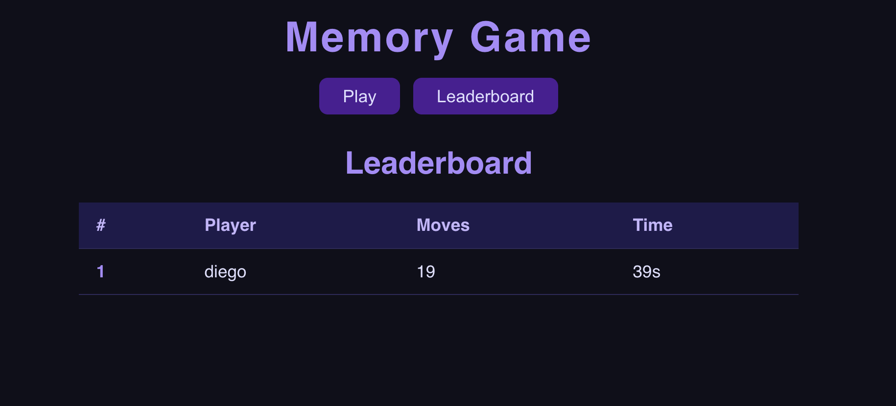
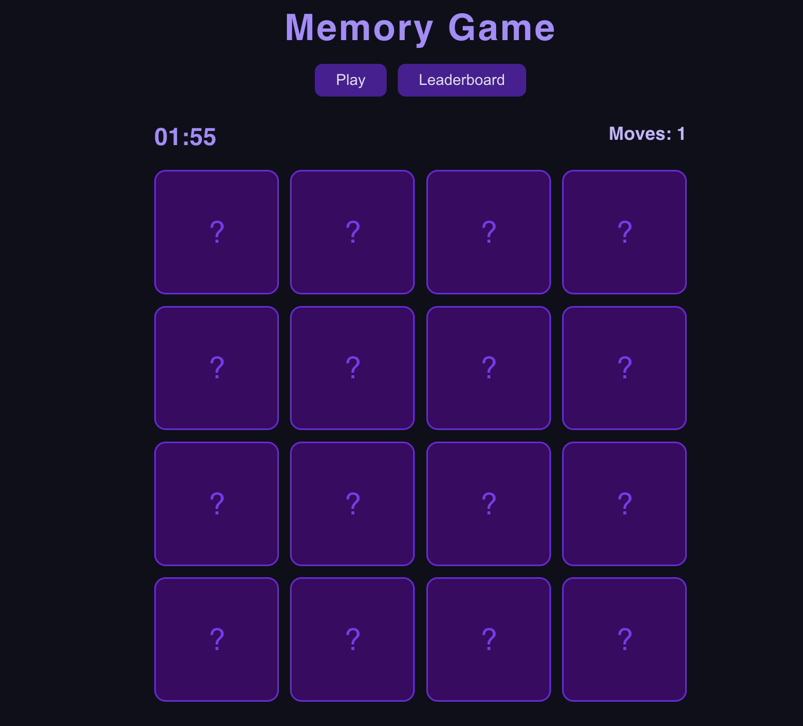

# Ghost

https://github.com/adamveld12/ghost

Commit intentions, not code.

Ghost is a CLI that flips the git workflow: instead of committing code, you commit prompts. An AI coding agent generates the artifacts; the commit captures both the intent and the output. Your git history becomes a chain of prompts + their results.

Supports claude, gemini, codex, and opencode — swap agents per-commit or set a default.

## Experience Notes

* Installion was easy
* Did not like Opus was not the default model for claude
* It works

## Result APP

Memory Game 1 <br/>


Memory Game 2 <br/>



## Result

```
ghost commit -m "create a memory game with frontend written in React, Tanstack, vite, bun and the backend in rust with sqllite. make sure there is a leaderboard ui, there is a timmer for 120s to finish the game and the game tracks how many moves."
```

```
  ▸ ghost
  agent     claude
  model     claude-sonnet-4-6
  intent    create a memory game with frontend written in React, Tanstack, vite, bun and the backend in rust with sqllite. make sure there is a leaderboard ui, there is a timmer for 120s to finish the game and the game tracks how many moves.

⠙ running claude…
```

```
⠴ running claude…Everything is built and tested. Here's the full project structure:

app/
├── start.sh          # starts backend + frontend
├── stop.sh           # stops both
├── backend/          # Rust + actix-web + rusqlite
│   ├── Cargo.toml
│   └── src/main.rs
└── frontend/         # React + Vite + Bun + TanStack Query
    └── src/
        ├── main.tsx
        ├── App.tsx
        ├── App.css
        ├── index.css
        ├── api.ts
        └── components/
            ├── Board.tsx   # game logic + timer + move counter
            ├── Card.tsx    # flip animation
            ├── Timer.tsx   # countdown with danger pulse
            └── Leaderboard.tsx  # TanStack Query, auto-refreshes


**How to run:**

cd app
./start.sh
# Backend: http://localhost:8080
# Frontend: http://localhost:5173

**Features implemented:**
- **16 cards** (8 emoji pairs), shuffled each game
- **120s countdown timer** — turns red and pulses at ≤20s
- **Move counter** — increments each time you flip a second card
- **Win modal** — shows moves + time used, lets you enter name and save score
- **Time's up modal** — shown if timer hits 0
- **Leaderboard** — sorted by fewest moves then fastest time, auto-refreshes every 5s
- **Backend** — Rust/actix-web with SQLite via rusqlite (bundled, no system dep)
[main bceb7426] added Ghost ghost-meta ghost-prompt: create a memory game with frontend written in React, Tanstack, vite, bun and the backend in rust with sqllite. make sure there is a leaderboard ui, there is a timmer for 120s to finish the game and the game tracks how many moves. ghost-agent: claude ghost-model: claude-sonnet-4-6 ghost-session: f1ad9cbd-1392-4652-885b-94077c4a31e7 ghost-files: pocs/Ghost-Fun/app/frontend/src/App.css,pocs/Ghost-Fun/app/frontend/src/App.tsx,pocs/Ghost-Fun/app/frontend/src/components/Board.tsx,pocs/Ghost-Fun/app/frontend/src/components/Card.tsx,pocs/Ghost-Fun/app/frontend/src/components/Leaderboard.tsx,pocs/Ghost-Fun/app/frontend/src/components/Timer.tsx
 Date: Mon Mar 2 22:17:51 2026 -0800
 6 files changed, 481 insertions(+), 54 deletions(-)
 create mode 100644 pocs/Ghost-Fun/app/frontend/src/components/Board.tsx
 create mode 100644 pocs/Ghost-Fun/app/frontend/src/components/Card.tsx
 create mode 100644 pocs/Ghost-Fun/app/frontend/src/components/Leaderboard.tsx
 create mode 100644 pocs/Ghost-Fun/app/frontend/src/components/Timer.tsx

  ✓ ghost: tagged agent commit with ghost-meta 'create a memory game with frontend written in React, Tanstack, vite, bun and the backend in rust with sqllite. make sure there is a leaderboard ui, there is a timmer for 120s to finish the game and the game tracks how many moves.'
[main 2d0a074a] create a memory game with frontend written in React, Tanstack, vite, bun and the backend in rust with sqllite. make sure there is a leaderboard ui, there is a timmer for 120s to finish the game and the game tracks how many moves. (follow-up)
 3 files changed, 25 insertions(+), 61 deletions(-)
 create mode 100755 pocs/Ghost-Fun/app/start.sh
 create mode 100755 pocs/Ghost-Fun/app/stop.sh
you  ░░░░░░░░░░░░░░░░░░░░░░░░░░░░░░░░░░░░░░░░ ai
     0%                                  100%
     100% AI code accepted

  ✓ ghost: committed follow-up changes 'create a memory game with frontend written in React, Tanstack, vite, bun and the backend in rust with sqllite. make sure there is a leaderboard ui, there is a timmer for 120s to finish the game and the game tracks how many moves.'
```

```
❯ ghost commit -m "Add a run.sh and stop.sh to run the whole app and stop it all."

  ▸ ghost
  agent     claude
  model     claude-sonnet-4-6
  intent    Add a run.sh and stop.sh to run the whole app and stop it all.

⠇ running claude…
```

```
⠏ running claude…Done. `run.sh` builds the Rust backend and starts both services:

- Backend on `http://localhost:8080`
- Frontend on `http://localhost:5173`

PIDs are saved to `/tmp/memory-backend.pid` and `/tmp/memory-frontend.pid`, which the existing `stop.sh` uses to kill both processes.
[main 4f187994] added Ghost ghost-meta ghost-prompt: Add a run.sh and stop.sh to run the whole app and stop it all. ghost-agent: claude ghost-model: claude-sonnet-4-6 ghost-session: 9ffcc530-e642-41c9-82e7-c4076878dde3 ghost-files: pocs/Ghost-Fun/app/run.sh
 Date: Mon Mar 2 22:25:46 2026 -0800
 1 file changed, 11 insertions(+)
 create mode 100644 pocs/Ghost-Fun/app/run.sh

  ✓ ghost: tagged agent commit with ghost-meta 'Add a run.sh and stop.sh to run the whole app and stop it all.'
[main d2a473ee] Add a run.sh and stop.sh to run the whole app and stop it all. (follow-up)
 1 file changed, 0 insertions(+), 0 deletions(-)
 mode change 100644 => 100755 pocs/Ghost-Fun/app/run.sh
you  ░░░░░░░░░░░░░░░░░░░░░░░░░░░░░░░░░░░░░░░░ ai
     0%                                    0%

  ✓ ghost: committed follow-up changes 'Add a run.sh and stop.sh to run the whole app and stop it all.'
```

## Logs

```
❯ ghost log
b63c5b4 2026-03-02 (diegopacheco)
  intent   run.sh still with errors: ❯ ./run.sh
  agent    claude
  model    claude-sonnet-4-6
  session  d1bc6514-c1c9-44b6-ad21-0ee19035623f
  files    run.sh

3fb814c 2026-03-02 (diegopacheco)
  intent   run.sh still have erors - Error: Os { code: 48, kind: AddrInUse, message: Address already in use }
  agent    claude
  model    claude-sonnet-4-6
  session  084cc1b6-7ece-422a-92c1-f10d04e47404
  files    run.sh

e5870fb 2026-03-02 (diegopacheco)
  intent   fix the bug on run.sh ❯ ./run.sh
  agent    claude
  model    claude-sonnet-4-6
  session  230994cd-32cc-46c5-a9e4-820dfdd6653f                                                                                                  files    run.sh
                                                                                                                                               d2a473e 2026-03-02 (diegopacheco)
  intent   Add a run.sh and stop.sh to run the whole app and stop it all.                                                                        agent    claude                                                                                                                                model    claude-sonnet-4-6                                                                                                                     session  9ffcc530-e642-41c9-82e7-c4076878dde3
  files    run.sh

4f18799 2026-03-02 (diegopacheco)
  intent   Add a run.sh and stop.sh to run the whole app and stop it all.
  agent    claude
  model    claude-sonnet-4-6
  session  9ffcc530-e642-41c9-82e7-c4076878dde3
  files    pocs/Ghost-Fun/app/run.sh

2d0a074 2026-03-02 (diegopacheco)
  intent   create a memory game with frontend written in React, Tanstack, vite, bun and the backend in rust with sqllite. make sure there is a leaderboard ui, there is a timmer for 120s to finish the game and the game tracks how many moves.
  agent    claude
  model    claude-sonnet-4-6
  session  f1ad9cbd-1392-4652-885b-94077c4a31e7
  files    frontend/src/index.css,start.sh,stop.sh

bceb742 2026-03-02 (diegopacheco)
  intent   create a memory game with frontend written in React, Tanstack, vite, bun and the backend in rust with sqllite. make sure there is a leaderboard ui, there is a timmer for 120s to finish the game and the game tracks how many moves.
  agent    claude
  model    claude-sonnet-4-6
  session  f1ad9cbd-1392-4652-885b-94077c4a31e7
  files    pocs/Ghost-Fun/app/frontend/src/App.css,pocs/Ghost-Fun/app/frontend/src/App.tsx,pocs/Ghost-Fun/app/frontend/src/components/Board.tsx,pocs/Ghost-Fun/app/frontend/src/components/Card.tsx,pocs/Ghost-Fun/app/frontend/src/components/Leaderboard.tsx,pocs/Ghost-Fun/app/frontend/src/components/Timer.tsx
```