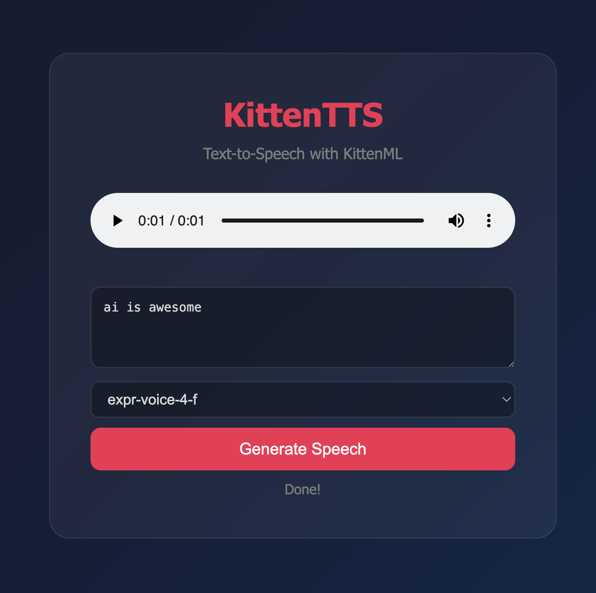

# KittenTTS Fun

Text-to-Speech POC using [KittenTTS](https://github.com/KittenML/KittenTTS) - an open-source TTS library with ultra-compact ONNX models that runs on CPU without GPU.

## What it does

- Generates speech audio from text using KittenTTS (kitten-tts-nano model, 15M params)
- Serves a web UI on port 8080 where you can play the generated audio
- Supports 8 built-in voices (male and female variants)
- Allows generating new audio from custom text directly in the browser

## Model Details

- **Model**: kitten-tts-nano
- **Parameters**: 15M
- **Format**: ONNX
- **Output sample rate**: 24kHz
- **Model size on disk**: ~60MB
- **Generation time**: ~1-3 seconds per sentence on CPU
- **Hardware required**: CPU only, no GPU needed
- **Voices available**: 8 built-in voices (4 male, 4 female)

## Stack

- Python 3.13
- [KittenTTS](https://github.com/KittenML/KittenTTS) (ONNX-based TTS)
- Flask (web server)
- soundfile (audio I/O)
- espeak (phonemizer backend)

## How to run

```bash
./install-deps.sh
./run.sh
```

Open http://localhost:8080 in your browser to play audio and generate new speech.

## Result


