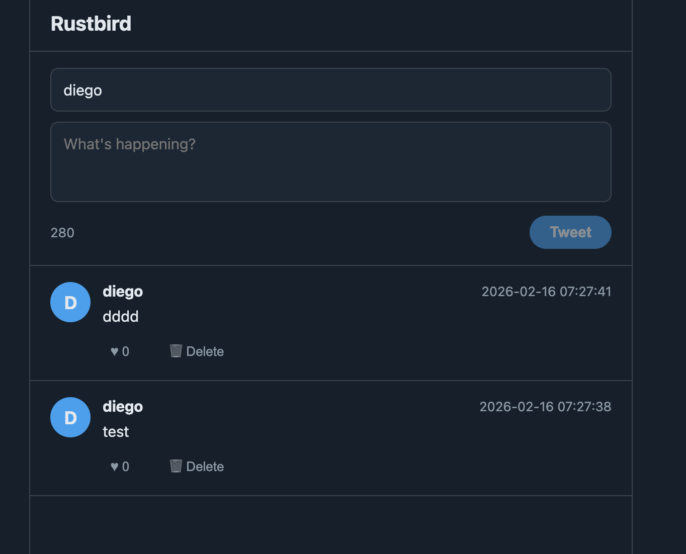

# SuperClaude

https://github.com/SuperClaude-Org/SuperClaude_Framework

## Install

```
pip3 install superclaude
superclaude install
```

## SuperClaude Experience Notes

* Used with Opus 4.5
* I asked to build a twitter like app
* It used old rust edition 2021 (should be 2024)
* It was fast, very fast. /sc:implement twitter like application with run.sh
* However monolith rust application - 1 file
* SQL and HTML and backend inside of the same file.
* Twtter like did not had login, register, or profile, just post.

## Result



## /sc:estimate

```
❯ /sc:estimate

⏺ What would you like me to estimate? Please provide:

  1. Target - What feature, task, or project to estimate
  2. Type - Time, effort, or complexity assessment
  3. Any context - Requirements, constraints, existing codebase details

  For example:
  - "Add WebSocket real-time notifications" --type time --breakdown
  - "Refactor database layer to support multi-tenancy" --type complexity
  - A description of what you're building

❯ "Twitter like application " --type time --breakdown

⏺ Let me first analyze the current project context, then provide a comprehensive estimate.

⏺ Searched for 1 pattern, read 3 files (ctrl+o to expand)

⏺ ---
  Development Estimate: Twitter-Like Application ("Rustbird")

  Current State Analysis

  Existing: Rust/Actix-web backend + SQLite + embedded HTML frontend
  Features Built: Create tweet, list tweets, like, delete, 280-char limit, auto-refresh
  Complexity Score: 0.2/1.0 (basic CRUD)

  ---
  Feature Breakdown & Estimates

  Phase 1: Core Social Features

  ┌─────────────────────────────────────────┬────────────┬───────────┬────────────┐
  │                 Feature                 │ Complexity │ Estimate  │ Confidence │
  ├─────────────────────────────────────────┼────────────┼───────────┼────────────┤
  │ User registration/login (session-based) │ Medium     │ 3 days    │ 85%        │
  ├─────────────────────────────────────────┼────────────┼───────────┼────────────┤
  │ User profiles (bio, avatar, join date)  │ Low        │ 1 day     │ 90%        │
  ├─────────────────────────────────────────┼────────────┼───────────┼────────────┤
  │ Follow/unfollow system                  │ Medium     │ 2 days    │ 85%        │
  ├─────────────────────────────────────────┼────────────┼───────────┼────────────┤
  │ Personalized timeline (followed users)  │ Medium     │ 2 days    │ 80%        │
  ├─────────────────────────────────────────┼────────────┼───────────┼────────────┤
  │ Retweet/repost                          │ Medium     │ 1.5 days  │ 85%        │
  ├─────────────────────────────────────────┼────────────┼───────────┼────────────┤
  │ Reply/thread system                     │ High       │ 3 days    │ 75%        │
  ├─────────────────────────────────────────┼────────────┼───────────┼────────────┤
  │ Phase 1 Total                           │            │ 12.5 days │ 80%        │
  └─────────────────────────────────────────┴────────────┴───────────┴────────────┘

  Phase 2: Engagement Features

  ┌──────────────────────────────┬────────────┬──────────┬────────────┐
  │           Feature            │ Complexity │ Estimate │ Confidence │
  ├──────────────────────────────┼────────────┼──────────┼────────────┤
  │ Hashtags (parsing + search)  │ Medium     │ 1.5 days │ 85%        │
  ├──────────────────────────────┼────────────┼──────────┼────────────┤
  │ @mentions with notifications │ Medium     │ 2 days   │ 80%        │
  ├──────────────────────────────┼────────────┼──────────┼────────────┤
  │ Search (users + tweets)      │ Medium     │ 2 days   │ 80%        │
  ├──────────────────────────────┼────────────┼──────────┼────────────┤
  │ Bookmark/save tweets         │ Low        │ 0.5 days │ 95%        │
  ├──────────────────────────────┼────────────┼──────────┼────────────┤
  │ Trending topics              │ High       │ 2 days   │ 70%        │
  ├──────────────────────────────┼────────────┼──────────┼────────────┤
  │ Phase 2 Total                │            │ 8 days   │ 80%        │
  └──────────────────────────────┴────────────┴──────────┴────────────┘

  Phase 3: Media & UX

  ┌───────────────────────────────────┬────────────┬──────────┬────────────┐
  │              Feature              │ Complexity │ Estimate │ Confidence │
  ├───────────────────────────────────┼────────────┼──────────┼────────────┤
  │ Image upload on tweets            │ High       │ 3 days   │ 70%        │
  ├───────────────────────────────────┼────────────┼──────────┼────────────┤
  │ Responsive mobile-first redesign  │ Medium     │ 2 days   │ 80%        │
  ├───────────────────────────────────┼────────────┼──────────┼────────────┤
  │ Infinite scroll / pagination      │ Low        │ 1 day    │ 90%        │
  ├───────────────────────────────────┼────────────┼──────────┼────────────┤
  │ Real-time updates (WebSocket/SSE) │ High       │ 2 days   │ 75%        │
  ├───────────────────────────────────┼────────────┼──────────┼────────────┤
  │ Dark/light theme toggle           │ Low        │ 0.5 days │ 95%        │
  ├───────────────────────────────────┼────────────┼──────────┼────────────┤
  │ Phase 3 Total                     │            │ 8.5 days │ 78%        │
  └───────────────────────────────────┴────────────┴──────────┴────────────┘

  Phase 4: Moderation & Polish

  ┌──────────────────────────────────┬────────────┬──────────┬────────────┐
  │             Feature              │ Complexity │ Estimate │ Confidence │
  ├──────────────────────────────────┼────────────┼──────────┼────────────┤
  │ Report/block users               │ Medium     │ 1.5 days │ 85%        │
  ├──────────────────────────────────┼────────────┼──────────┼────────────┤
  │ Content moderation (word filter) │ Low        │ 1 day    │ 90%        │
  ├──────────────────────────────────┼────────────┼──────────┼────────────┤
  │ Rate limiting                    │ Low        │ 0.5 days │ 90%        │
  ├──────────────────────────────────┼────────────┼──────────┼────────────┤
  │ Database migration to PostgreSQL │ Medium     │ 2 days   │ 80%        │
  ├──────────────────────────────────┼────────────┼──────────┼────────────┤
  │ API error handling & validation  │ Low        │ 1 day    │ 90%        │
  ├──────────────────────────────────┼────────────┼──────────┼────────────┤
  │ Phase 4 Total                    │            │ 6 days   │ 85%        │
  └──────────────────────────────────┴────────────┴──────────┴────────────┘

  ---
  Summary
                                                                                                                                     ┌──────────────────────┬──────┬────────────┐
  │        Phase         │ Days │ Cumulative │
  ├──────────────────────┼──────┼────────────┤
  │ Phase 1: Core Social │ 12.5 │ 12.5       │
  ├──────────────────────┼──────┼────────────┤
  │ Phase 2: Engagement  │ 8    │ 20.5       │
  ├──────────────────────┼──────┼────────────┤
  │ Phase 3: Media & UX  │ 8.5  │ 29         │
  ├──────────────────────┼──────┼────────────┤
  │ Phase 4: Moderation  │ 6    │ 35 days    │
  └──────────────────────┴──────┴────────────┘

  Aggregate Estimate

  ┌─────────────────────────────────────┬──────────┬────────────┐
  │              Scenario               │ Duration │ Confidence │
  ├─────────────────────────────────────┼──────────┼────────────┤
  │ Optimistic (MVP, phases 1-2 only)   │ 20 days  │ 80%        │
  ├─────────────────────────────────────┼──────────┼────────────┤
  │ Realistic (full feature set)        │ 35 days  │ 75%        │
  ├─────────────────────────────────────┼──────────┼────────────┤
  │ Pessimistic (scope creep, unknowns) │ 45 days  │ 65%        │
  └─────────────────────────────────────┴──────────┴────────────┘

  ---
  Risk Factors

  - High Risk: Image upload (file storage, size limits, format validation) adds backend complexity
  - Medium Risk: WebSocket real-time updates require connection management and state handling
  - Medium Risk: SQLite Mutex<Connection> will not scale - PostgreSQL migration needed for concurrent users
  - Low Risk: Auth system - well-understood patterns but touches every endpoint

  Assumptions

  - Single developer working full-time
  - Rust/Actix-web stack continues (no framework switch)
  - SQLite acceptable for phases 1-2, PostgreSQL for production
  - No mobile app (web only)
  - No DM/messaging system (would add ~5 days)
  - No email verification or OAuth (would add ~3 days)

  Recommendation

  Start with Phase 1 as MVP. The current codebase at src/main.rs:1-259 is a solid foundation but needs restructuring into modules
  before adding auth and user relationships. The Mutex<Connection> pattern at line 8 will need replacement with a connection pool
  (r2d2 or deadpool) before Phase 3.
```

## /sc:brainstorm

```
❯ /sc:brainstorm

⏺ Brainstorming: Twitter-Like Application ("Rustbird")

  Based on the estimate we just reviewed, I see you already have a working foundation. Let me guide the discovery process to
  sharpen what "Twitter-like" means for your vision.

  ---
  Round 1: Core Vision

  What problem does Rustbird solve that Twitter/X doesn't?

  A few directions to consider:

  1. Privacy-first - No tracking, no algorithm, chronological timeline only
  2. Developer-focused - Code snippets, markdown support, technical community
  3. Lightweight/self-hosted - Single binary, runs anywhere, community-owned
  4. Learning project - Explore Rust web development patterns at production-like scale

  What's your target user count?
  - Single user / personal microblog
  - Small community (10-100 users)
  - Medium scale (100-10K users)
  - Large scale (10K+ users)

  This changes the architecture significantly. Your current Mutex<Connection> at src/main.rs:8 works for small scale but needs
  rethinking beyond ~50 concurrent users.

  ---
  Round 2: Feature Priority

  From the estimate, here are the feature clusters. Which matter most to you?

  ┌──────────────┬───────────────┬────────────────────────────────────────┐
  │   Priority   │    Cluster    │                Features                │
  ├──────────────┼───────────────┼────────────────────────────────────────┤
  │ Must Have    │ Social Graph? │ Follow/unfollow, personalized timeline │
  ├──────────────┼───────────────┼────────────────────────────────────────┤
  │ Must Have    │ Identity?     │ User auth, profiles                    │
  ├──────────────┼───────────────┼────────────────────────────────────────┤
  │ Should Have  │ Discovery?    │ Hashtags, search, trending             │
  ├──────────────┼───────────────┼────────────────────────────────────────┤
  │ Should Have  │ Engagement?   │ Replies, threads, retweets             │
  ├──────────────┼───────────────┼────────────────────────────────────────┤
  │ Nice to Have │ Media?        │ Image uploads, rich previews           │
  ├──────────────┼───────────────┼────────────────────────────────────────┤
  │ Nice to Have │ Real-time?    │ WebSocket live updates                 │
  └──────────────┴───────────────┴────────────────────────────────────────┘

  ---
  Round 3: Technical Direction

  Your current stack is solid. Some questions to shape the path:

  Frontend approach?
  - Keep embedded HTML in Rust (current approach - simple, single binary)
  - Separate frontend (React/HTMX/Leptos) with API backend
  - Server-side rendering with templates (Tera/Askama)

  Database strategy?
  - Stay with SQLite (great for self-hosted/small scale)
  - Migrate to PostgreSQL (needed for concurrent users at scale)
  - Both (SQLite dev, PostgreSQL prod)

  Auth model?
  - Session-based (cookies, server-side state)
  - JWT tokens (stateless, API-friendly)
  - No auth (anonymous/open posting, current behavior)

  ---
  What should we explore further?

  Tell me:
  1. Which vision resonates (privacy-first, dev-focused, self-hosted, learning)?
  2. Which feature clusters are must-haves vs. cut?
  3. Any technical preferences from the questions above?

  This will let me refine the estimate and produce a concrete implementation brief.

❯ 1. dev and self hosted
  2. all
  3. tanstack and rust

⏺ Rustbird: Dev-Focused, Self-Hosted Microblog

  Great choices. TanStack (Query + Router) with Rust/Actix-web is a strong combo for a self-hosted dev tool. Let me drill deeper.

  ---
  Round 4: Developer-Focused Features

  Since this targets developers, what dev-specific features matter?

  Content formatting:
  - Markdown rendering in tweets (code blocks, links, bold/italic)
  - Syntax-highlighted code snippets (which languages primarily?)
  - LaTeX/math support
  - Or keep it plain text like classic Twitter?

  Developer identity:
  - GitHub profile linking / GitHub OAuth login?
  - Show tech stack badges on profiles (Rust, Go, Python, etc.)?
  - Or simple username/password auth?

  Developer workflows:
  - API-first design (so devs can build bots/integrations)?
  - Webhook support for tweet events?
  - RSS feed per user?
  - CLI client possibility (post from terminal)?

  ---
  Round 5: Self-Hosted Architecture

  Single binary is a huge selling point for self-hosted. This shapes decisions:

  Deployment model:
  - Single binary with embedded SQLite + embedded frontend assets (simplest)
  - Single binary + external PostgreSQL (more scalable)
  - Container-based with podman-compose

  Configuration:
  - Config file (TOML, since it's Rust-native)?
  - Environment variables?
  - Both with env overriding file?

  Admin features for self-hosted:
  - Instance admin panel (manage users, moderation)?
  - User registration: open, invite-only, or admin-approved?
  - Instance limits (max users, storage quotas)?

  ---
  Round 6: TanStack Frontend Details

  TanStack stack specifics:
  - TanStack Query + TanStack Router (full TanStack)?
  - React or Solid as the UI layer under TanStack?
  - Styling: Tailwind CSS, vanilla CSS, or something else?
  - Bundler: Vite?

  Frontend serving:
  - Build frontend separately, serve static files from Actix-web (single binary embeds dist/)
  - Separate dev servers during development, unified for production
  - Or keep them as separate deployable units?

  ---
  Emerging Architecture

  ┌─────────────────────────────────────┐
  │          Rustbird Binary            │
  │                                     │
  │  ┌──────────┐    ┌───────────────┐  │
  │  │ Actix-web │    │ Embedded SPA  │  │
  │  │ REST API  │◄──►│ TanStack +    │  │
  │  │ + WebSocket│    │ React + Vite  │  │
  │  └─────┬─────┘    └───────────────┘  │
  │        │                             │
  │  ┌─────▼─────┐                       │
  │  │  SQLite    │                       │
  │  │ (bundled)  │                       │
  │  └────────────┘                       │
  └─────────────────────────────────────┘

  This gives you: ./rustbird → runs everything on port 8080.

  ---
  Key Decisions Needed

  1. Markdown in tweets - yes/no? (adds ~1 day but huge for dev audience)
  2. Auth method - GitHub OAuth vs simple username/password vs both?
  3. React or Solid under TanStack?
  4. Tailwind for styling?
  5. Registration model - open, invite-only, or admin-approved?
  6. Separate frontend repo or monorepo with frontend/ directory?

  Once you answer these, I can produce a final implementation brief with updated estimates for the full TanStack + Rust
  architecture.

❯ 1. yes
  2. user/pass
  3. react
  4. tailwind
  5. open
  6. monorepo

⏺ Rustbird - Implementation Brief

  Final Specification

  ┌──────────────┬────────────────────────────────────────────────────────────────┐
  │    Aspect    │                            Decision                            │
  ├──────────────┼────────────────────────────────────────────────────────────────┤
  │ Vision       │ Dev-focused, self-hosted microblog                             │
  ├──────────────┼────────────────────────────────────────────────────────────────┤
  │ Backend      │ Rust + Actix-web + SQLite (bundled)                            │
  ├──────────────┼────────────────────────────────────────────────────────────────┤
  │ Frontend     │ React + TanStack Query + TanStack Router + Tailwind CSS + Vite │
  ├──────────────┼────────────────────────────────────────────────────────────────┤
  │ Auth         │ Username/password, session-based                               │
  ├──────────────┼────────────────────────────────────────────────────────────────┤
  │ Registration │ Open                                                           │
  ├──────────────┼────────────────────────────────────────────────────────────────┤
  │ Content      │ Markdown with syntax-highlighted code blocks                   │
  ├──────────────┼────────────────────────────────────────────────────────────────┤
  │ Structure    │ Monorepo: src/ (Rust) + frontend/ (React)                      │
  ├──────────────┼────────────────────────────────────────────────────────────────┤
  │ Deploy       │ Single binary embeds built frontend assets                     │
  └──────────────┴────────────────────────────────────────────────────────────────┘

  ---
  Revised Estimate (All Features)

  Phase 1: Foundation & Auth (5 days)

  ┌──────────────────────────────────────────────────────────────────────────────────────┬──────┬───────┐
  │                                         Task                                         │ Days │ Notes │
  ├──────────────────────────────────────────────────────────────────────────────────────┼──────┼───────┤
  │ Restructure to monorepo (frontend/ scaffold with Vite + React + TanStack + Tailwind) │ 0.5  │       │
  ├──────────────────────────────────────────────────────────────────────────────────────┼──────┼───────┤
  │ Actix-web serves embedded static files via rust-embed or include_dir                 │ 0.5  │       │
  ├──────────────────────────────────────────────────────────────────────────────────────┼──────┼───────┤
  │ User table + registration + password hashing (argon2)                                │ 1    │       │
  ├──────────────────────────────────────────────────────────────────────────────────────┼──────┼───────┤
  │ Session-based login/logout (cookie + server state)                                   │ 1    │       │
  ├──────────────────────────────────────────────────────────────────────────────────────┼──────┼───────┤
  │ User profile page (bio, join date, tech tags)                                        │ 1    │       │
  ├──────────────────────────────────────────────────────────────────────────────────────┼──────┼───────┤
  │ Auth-aware API middleware + protected routes                                         │ 1    │       │
  └──────────────────────────────────────────────────────────────────────────────────────┴──────┴───────┘

  Phase 2: Core Social (5 days)

  ┌───────────────────────────────────────────────────────────┬──────┬───────┐
  │                           Task                            │ Days │ Notes │
  ├───────────────────────────────────────────────────────────┼──────┼───────┤
  │ Follow/unfollow system (followers/following tables)       │ 1.5  │       │
  ├───────────────────────────────────────────────────────────┼──────┼───────┤
  │ Personalized timeline (tweets from followed users)        │ 1.5  │       │
  ├───────────────────────────────────────────────────────────┼──────┼───────┤
  │ Retweet/repost                                            │ 1    │       │
  ├───────────────────────────────────────────────────────────┼──────┼───────┤
  │ Reply/thread system (parent_id on tweets, nested display) │ 1    │       │
  └───────────────────────────────────────────────────────────┴──────┴───────┘

  Phase 3: Developer Features (4 days)

  ┌─────────────────────────────────────────────────────────────────────────────────────┬──────┬───────┐
  │                                        Task                                         │ Days │ Notes │
  ├─────────────────────────────────────────────────────────────────────────────────────┼──────┼───────┤
  │ Markdown rendering in tweets (pulldown-cmark backend or client-side react-markdown) │ 1    │       │
  ├─────────────────────────────────────────────────────────────────────────────────────┼──────┼───────┤
  │ Syntax-highlighted code blocks (Prism.js or Shiki on client)                        │ 1    │       │
  ├─────────────────────────────────────────────────────────────────────────────────────┼──────┼───────┤
  │ Hashtag parsing + hashtag search page                                               │ 1    │       │
  ├─────────────────────────────────────────────────────────────────────────────────────┼──────┼───────┤
  │ @mentions with in-app notifications                                                 │ 1    │       │
  └─────────────────────────────────────────────────────────────────────────────────────┴──────┴───────┘

  Phase 4: Discovery & Engagement (4 days)

  ┌──────────────────────────────────────────────────────┬──────┬───────┐
  │                         Task                         │ Days │ Notes │
  ├──────────────────────────────────────────────────────┼──────┼───────┤
  │ Full-text search (SQLite FTS5 for tweets + users)    │ 1.5  │       │
  ├──────────────────────────────────────────────────────┼──────┼───────┤
  │ Trending topics (hashtag frequency over time window) │ 1.5  │       │
  ├──────────────────────────────────────────────────────┼──────┼───────┤
  │ Bookmark/save tweets                                 │ 0.5  │       │
  ├──────────────────────────────────────────────────────┼──────┼───────┤
  │ Pagination / infinite scroll with TanStack Query     │ 0.5  │       │
  └──────────────────────────────────────────────────────┴──────┴───────┘

  Phase 5: Media & Real-time (5 days)

  ┌────────────────────────────────────────────────────┬──────┬───────┐
  │                        Task                        │ Days │ Notes │
  ├────────────────────────────────────────────────────┼──────┼───────┤
  │ Image upload (store on disk, serve from Actix-web) │ 2    │       │
  ├────────────────────────────────────────────────────┼──────┼───────┤
  │ Image display in tweet cards + lightbox            │ 1    │       │
  ├────────────────────────────────────────────────────┼──────┼───────┤
  │ WebSocket real-time timeline updates (actix-ws)    │ 2    │       │
  └────────────────────────────────────────────────────┴──────┴───────┘

  Phase 6: Self-Hosted Polish (3 days)

  ┌───────────────────────────────────────────────────────────────────┬──────┬───────┐
  │                               Task                                │ Days │ Notes │
  ├───────────────────────────────────────────────────────────────────┼──────┼───────┤
  │ TOML config file (port, instance name, limits, registration mode) │ 0.5  │       │
  ├───────────────────────────────────────────────────────────────────┼──────┼───────┤
  │ Admin panel (user management, content moderation)                 │ 1.5  │       │
  ├───────────────────────────────────────────────────────────────────┼──────┼───────┤
  │ Rate limiting middleware                                          │ 0.5  │       │
  ├───────────────────────────────────────────────────────────────────┼──────┼───────┤
  │ RSS feed per user                                                 │ 0.5  │       │
  └───────────────────────────────────────────────────────────────────┴──────┴───────┘

  ---
  Total

  ┌───────────────────────────┬──────┬────────────┐
  │           Phase           │ Days │ Cumulative │
  ├───────────────────────────┼──────┼────────────┤
  │ 1. Foundation & Auth      │ 5    │ 5          │
  ├───────────────────────────┼──────┼────────────┤
  │ 2. Core Social            │ 5    │ 10         │
  ├───────────────────────────┼──────┼────────────┤
  │ 3. Developer Features     │ 4    │ 14         │
  ├───────────────────────────┼──────┼────────────┤
  │ 4. Discovery & Engagement │ 4    │ 18         │
  ├───────────────────────────┼──────┼────────────┤
  │ 5. Media & Real-time      │ 5    │ 23         │
  ├───────────────────────────┼──────┼────────────┤
  │ 6. Self-Hosted Polish     │ 3    │ 26 days    │
  └───────────────────────────┴──────┴────────────┘

  ┌─────────────┬──────────┬────────────┐
  │  Scenario   │ Duration │ Confidence │
  ├─────────────┼──────────┼────────────┤
  │ Optimistic  │ 22 days  │ 75%        │
  ├─────────────┼──────────┼────────────┤
  │ Realistic   │ 26 days  │ 80%        │
  ├─────────────┼──────────┼────────────┤
  │ Pessimistic │ 33 days  │ 70%        │
  └─────────────┴──────────┴────────────┘

  ---
  Dependency Stack

  Backend: actix-web, rusqlite (bundled), serde, chrono, argon2, actix-ws, rust-embed, pulldown-cmark (optional)

  Frontend: react, @tanstack/react-query, @tanstack/react-router, tailwindcss, vite, react-markdown, prism-react-renderer

  ---
  Risk Register

  ┌────────────────────────────────────────────────┬────────┬────────────────────────────────────────────────────────────────┐
  │                      Risk                      │ Impact │                           Mitigation                           │
  ├────────────────────────────────────────────────┼────────┼────────────────────────────────────────────────────────────────┤
  │ rust-embed build complexity with Vite output   │ Medium │ Build frontend first in CI, embed dist/                        │
  ├────────────────────────────────────────────────┼────────┼────────────────────────────────────────────────────────────────┤
  │ SQLite FTS5 availability in rusqlite bundled   │ Low    │ Bundled mode includes FTS5 by default                          │
  ├────────────────────────────────────────────────┼────────┼────────────────────────────────────────────────────────────────┤
  │ WebSocket state management with TanStack Query │ Medium │ Use query invalidation on WS events, not direct cache mutation │
  ├────────────────────────────────────────────────┼────────┼────────────────────────────────────────────────────────────────┤
  │ Image storage on single-server disk            │ Low    │ Acceptable for self-hosted, document backup strategy           │
  └────────────────────────────────────────────────┴────────┴────────────────────────────────────────────────────────────────┘

  ---
  Ready to start implementation? I can begin with Phase 1 (monorepo scaffold + auth system).
```