# Admin Console

A single web console for **Cassandra, MySQL, Postgres, Redis, etcd, Kafka and Elasticsearch** — as many servers as you want, grouped into projects.

Every console works the same way: browse the schema on the left, write a query in the middle, read results at the bottom. Every statement is **read-only** and **audited**.

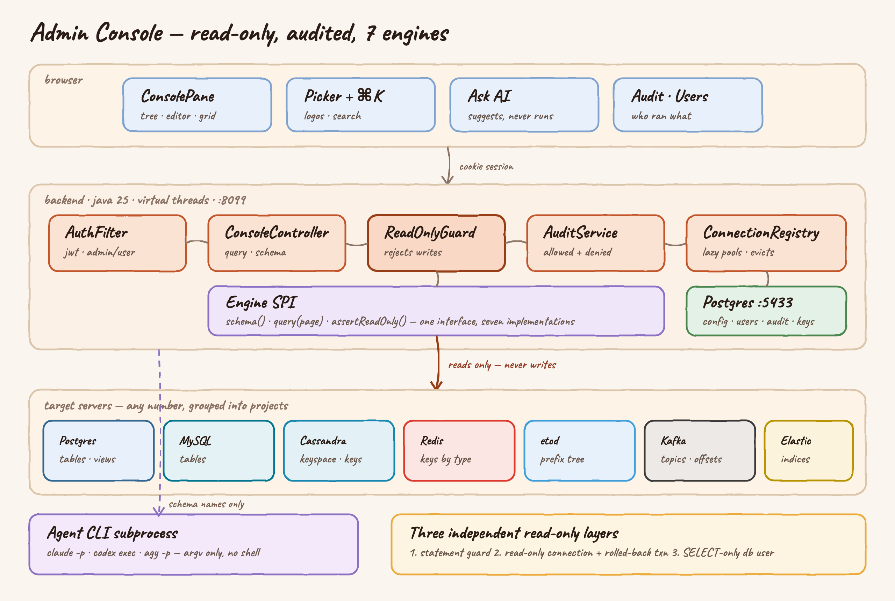

## Features

**Querying**
| | |
|---|---|
| Seven engines, one console | Cassandra, MySQL, Postgres, Redis, etcd, Kafka, Elasticsearch — the same three-pane layout drives all of them |
| Schema tree | Foldable, lazy, engine-shaped: `schema→table→column`, `keyspace→table→column`, `key→field`, `prefix→prefix→key`, `topic→partition`, `index→field` |
| Editor | CodeMirror 6, syntax highlighting, autocomplete fed from the **live** schema, `⌘↵` (and `Ctrl↵`) to run |
| Pagination | Server-side and cursor-based — Cassandra paging state, Kafka offsets, Elasticsearch `search_after`, SQL offsets |
| Row detail | Double-click any row for the full record, JSON pretty-printed, copy per field or whole row, `↑↓` to walk rows |
| Recent queries | Your own history per connection, loads into the editor without running |
| Saved queries | Shared with the whole project, optionally pinned to one connection |
| Row count | Opt-in `count(*)` on SQL engines only — never on engines where counting means a full scan |

**Beyond one engine**
| | |
|---|---|
| **Entity trace** | One value, found across *every* connection in the project, placed on a timeline |
| **Cross-engine join** | `SELECT … FROM demo-mysql.invoices a JOIN demo-elasticsearch.products b ON a.id = b._id` |
| **Discovery** | Finds running containers, detects the engine and credentials, imports the ones you tick |

**Safety**
| | |
|---|---|
| Read-only, three layers | Statement guard · read-only connection in a rolled-back transaction · `SELECT`-only DB account |
| Kafka observer semantics | Never joins a consumer group, never commits an offset — cannot disturb your real consumers |
| Audit trail | Every statement, allowed or denied, grouped by query, with the denial reason and timing |
| Encrypted secrets | AES-256-GCM; passwords never appear in a `SELECT`, screenshot or log, and no API ever returns one |
| Users and roles | `admin` manages config, users and audit; `user` queries. PBKDF2, no hardcoded credential |

**AI**
| | |
|---|---|
| Query authoring | `claude -p`, `codex exec` or `agy -p` writes the query in the right grammar for that engine |
| Your choice, remembered | Per-user CLI + model, stored in Postgres so it follows you across machines |
| Guarded | Suggestions pass the same read-only guard and **never execute on their own** |
| Bounded disclosure | Schema **names** only — never credentials, hostnames or row data |

**Getting around**
| | |
|---|---|
| `⌘K` palette | Jump to any page; two columns, everything visible without scrolling; `⌘K → Consoles` chains into the connection picker |
| Connection picker | Searchable modal with engine logos — matches name, engine **and host** |
| Grid keyboard | `↑↓←→` navigate both modals as real grids; `↵` opens, `esc` closes |

## Quick start

```bash
./start.sh            # metadata postgres + backend + frontend, then prints all links
./demo/demo-start.sh  # 7 seeded target servers, auto-registered as the "demo" project
./links.sh            # every URL
./stop.sh             # stop everything — your data is kept
./destroy-all.sh      # purge everything, including all data (asks for confirmation)
```

`start.sh` is idempotent and `stop.sh` is non-destructive: your projects, connections, users,
saved queries and audit trail live in a named volume and survive restarts. `destroy-all.sh` is
the only script that deletes data, and it makes you type `DESTROY` to confirm.

Then open <http://localhost:4321> and log in with **admin / admin**.

| URL | What |
|---|---|
| `http://localhost:4321/` | consoles |
| `http://localhost:4321/projects` | projects and connections |
| `http://localhost:4321/discovery` | import running containers |
| `http://localhost:4321/audit-trail` | audit trail |
| `http://localhost:4321/users` | user management |
| `http://localhost:4321/settings/ai` | AI query authoring |
| `http://localhost:8099/swagger` | Swagger UI |
| `http://localhost:6006/` | Storybook (`cd frontend && bun run storybook`) |

## The console

Browse tables on the left, write a query, page through results. `⌘↵` runs it.

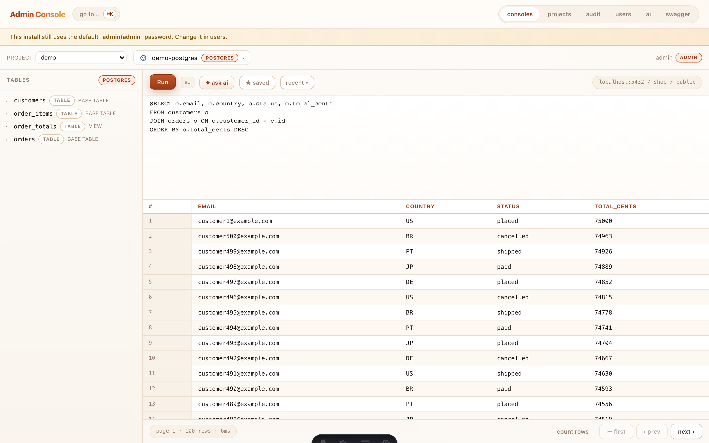

### Pick a connection

A searchable picker rather than tabs — tabs stop scaling once you have more than a handful of servers. Search matches connection name, engine, **and host**, because `prod` vs `staging` is usually a host distinction.

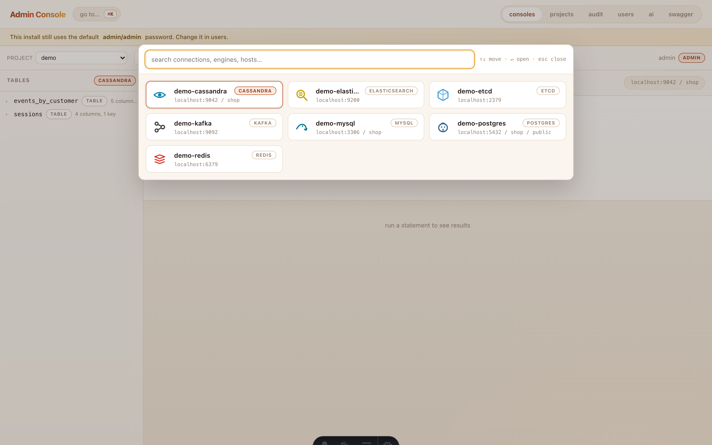

### Go anywhere with ⌘K

Everything fits without scrolling. `⌘K → Consoles` chains straight into the connection picker.

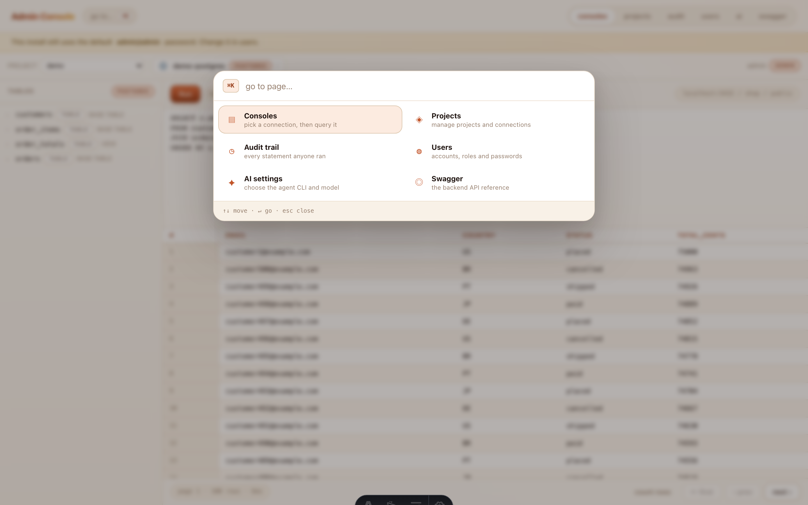

### Inspect a row

**Double**-click a row — not single, so selecting and copying cell text still works. JSON values are pretty-printed; `↑↓` walks rows without closing.

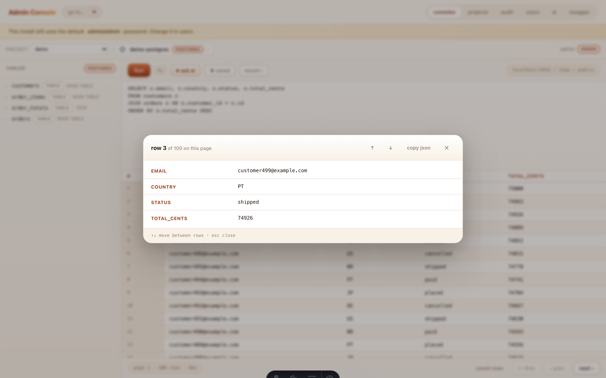

### Save queries for the project

Shared with everyone on the project, optionally pinned to one connection — or left loose so the same SQL runs against staging and prod.

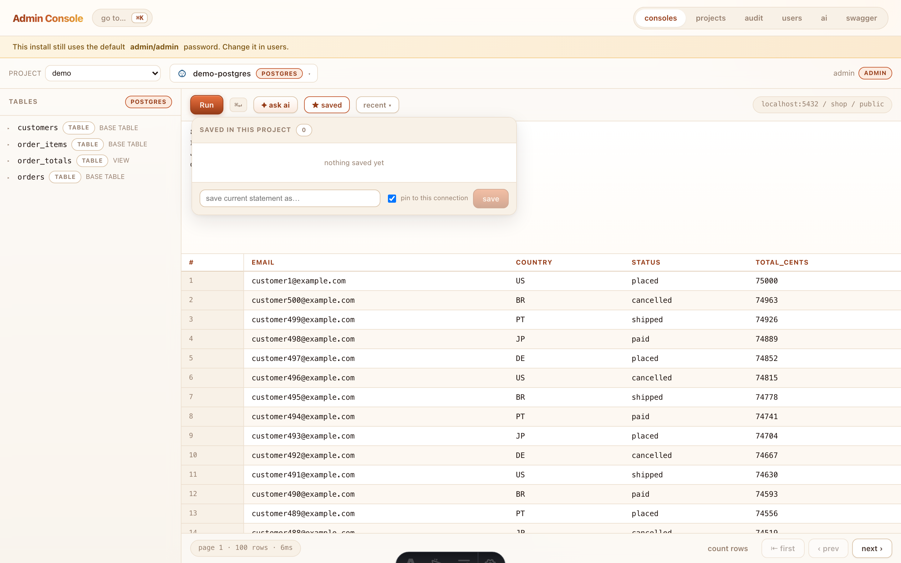

## Every engine, same console

Kafka: topics and partitions on the left, a bounded `consume` in the middle. The console **never joins a consumer group and never commits an offset**, so it cannot disturb your real consumers.

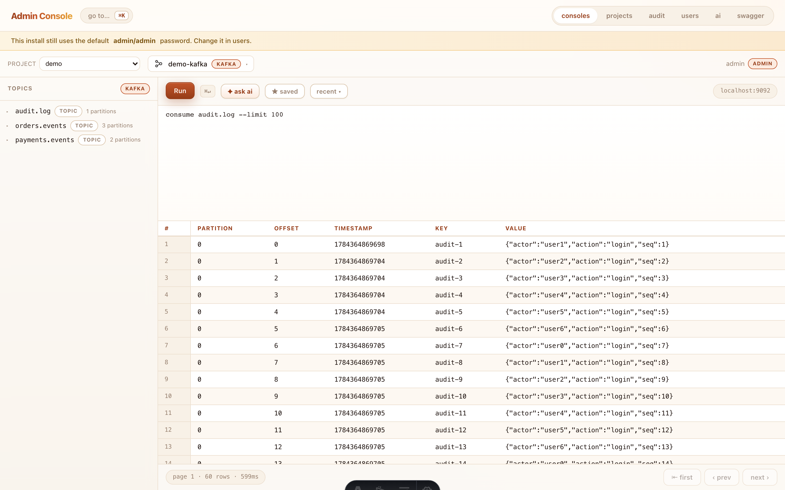

Redis: keys badged by type; folding a hash shows its fields.

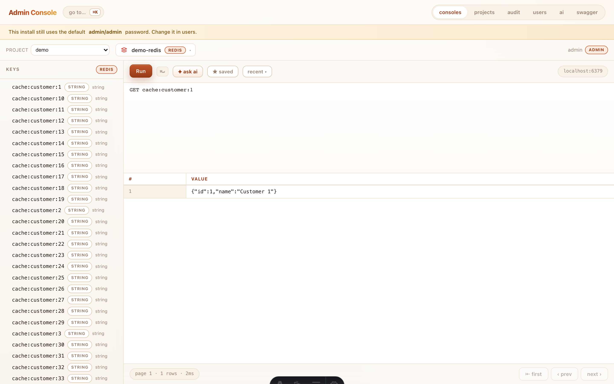

## Read-only means read-only

Writes are refused with an engine-appropriate reason, and nothing renders that could be mistaken for success.

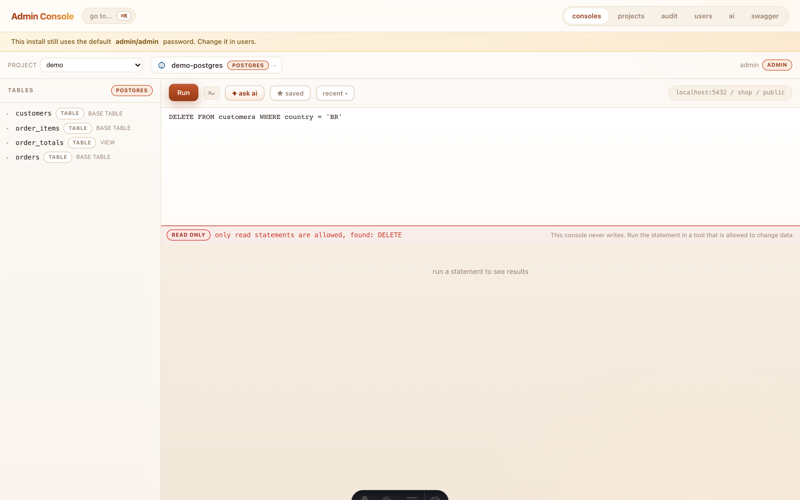

| Engine | Allowed | Rejected |
|---|---|---|
| MySQL / Postgres | `SELECT`, `SHOW`, `DESCRIBE`, `EXPLAIN` | writes, DDL, a second `;` statement, writes hidden in a CTE |
| Cassandra | `SELECT` | all DML, DDL, `TRUNCATE` |
| Redis | commands the server itself flags `readonly` | writes, admin, `EVAL` (Lua can write) |
| etcd | `get`, `get --prefix`, `range` | `put`, `del`, `txn`, `compact` |
| Kafka | `list`, `describe`, `offsets`, bounded `consume` | produce, topic admin, offset resets |
| Elasticsearch | `GET`/`HEAD` on `_search`, `_count`, `_mapping`, `_cat` | every other verb, plus `_bulk`, `_delete_by_query`, `_reindex` **even as `GET`** |

## Entity trace

One value, everywhere it exists. Searching `42` finds the Postgres rows, the MySQL invoices, the Kafka messages, the Elasticsearch document and the Redis cache key — in one request, in parallel, read-only.

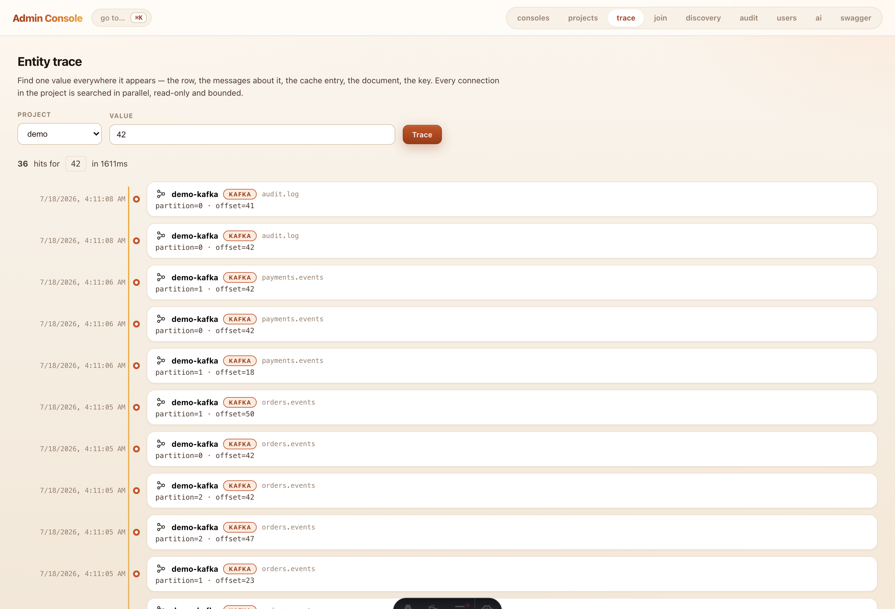

Every connection is searched the way it can be searched *efficiently*, under an explicit budget (12 sources per connection, 5s each, 200 hits total). Where an engine can't answer cheaply it **says so instead of doing something expensive** — Cassandra refuses a non-partition-key search rather than running `ALLOW FILTERING` across the cluster.

Hits with a readable timestamp go on the timeline. Hits without one are listed separately rather than being given an invented order.

## Cross-engine join

```sql
SELECT a.number, a.customer_email, b.name, b.price_cents
FROM demo-mysql.invoices a
JOIN demo-elasticsearch.products b ON a.id = b._id
LIMIT 25
```

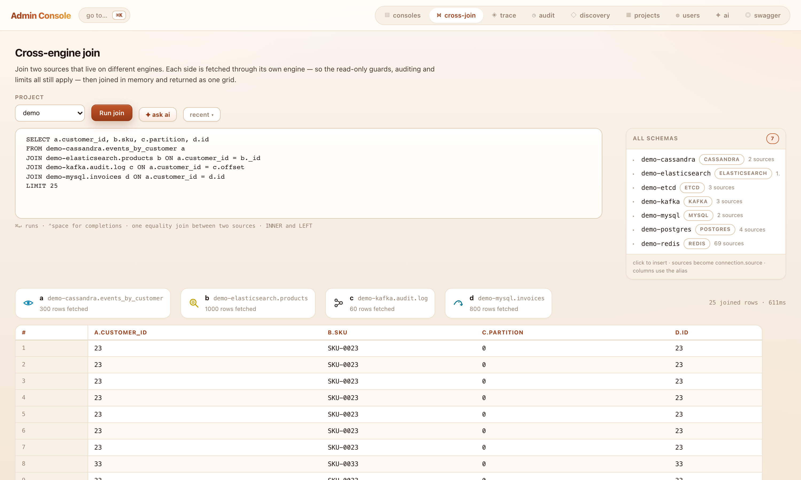

A bounded hash join over two native queries — **not** a query planner. Each side is fetched through its own engine, so read-only guards, auditing and paging all still apply; then the two are joined in memory.

Supported: `INNER` and `LEFT`, one equality key, `LIMIT`, column projection. Each side is capped (5,000 rows) and the cap is **reported per side**, so a partial join is labelled as partial rather than passed off as complete.

**Any engine can be either side** — MySQL⋈Elasticsearch, Postgres⋈Kafka, Cassandra⋈Kafka, etcd⋈Elasticsearch, Redis⋈etcd all work, including two connections of the same kind.

Three things make it writable rather than a guessing game:

- **A schema panel listing every connection** in the project. Click a source and it inserts `connection.source`; click a column and it inserts `alias.column`, using the alias already bound to that source in your statement.
- **Autocomplete** in the editor, built from the same live schemas.
- **Ask AI**, which writes the whole join from a plain-language description. It knows each engine's real result columns — `_id` on Elasticsearch, `offset` and `key` on Kafka — and will tell you when two sources genuinely share no comparable key rather than inventing one.

Mistakes explain themselves instead of failing silently:

```
no source named "shop" on demo-cassandra
  — available: events_by_customer, sessions ("shop" is the keyspace, not a table)

no column named "id" on demo-cassandra.events_by_customer (alias x)
  — did you mean "event_id"? — available: customer_id, event_time, event_id, event_type, payload
```

## Discovery

Running containers that look like a supported engine, with the engine and credentials detected. Tick the ones you want and import them as a project.

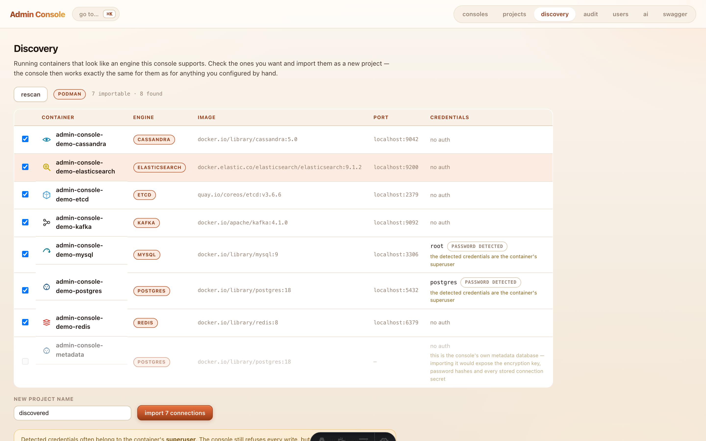

Two things it deliberately refuses:

- **Containers with no published port** are listed but not importable — the backend runs on the host and genuinely cannot reach them.
- **The console's own metadata database** is never importable. It holds the master encryption key and the JWT secret, so importing it would let any logged-in user decrypt every stored password and forge an admin token.

Detected credentials are usually the container's superuser, which the UI says plainly and recommends replacing. Read-only still holds either way. Passwords are never sent to the browser — import sends container ids and the backend re-reads the credentials itself.

## Audit trail

Grouped by query, so paging through 6 pages reads as one entry. Denials are highlighted with their reason.

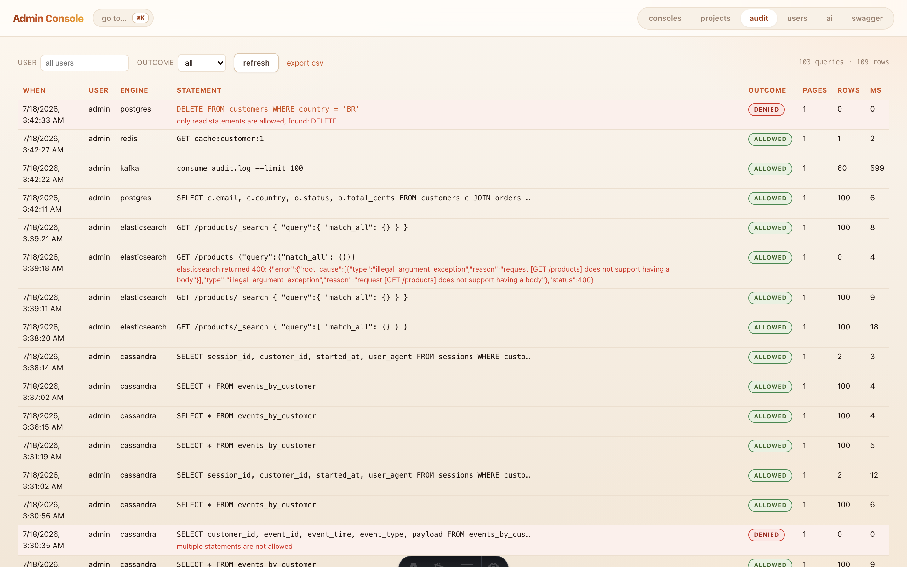

## Projects and connections

Connections are stored encrypted. The form tells you to use a `SELECT`-only database account, because that's the layer that still holds if the guard is ever bypassed.

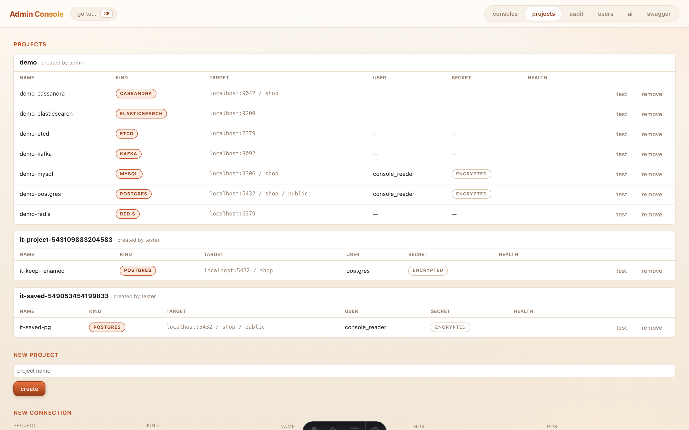

## AI query authoring

Pick which agent CLI writes your queries. The choice is remembered per user, in the database, so it follows you across machines.

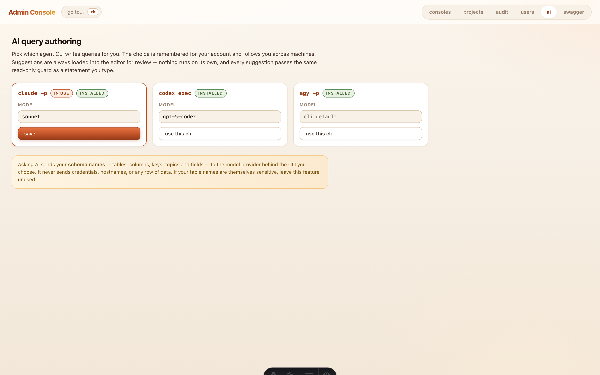

**What is sent:** the engine's grammar, your schema **names** (tables, columns, keys, topics, fields), and your request.
**What is never sent:** credentials, hostnames, or any row of data.

Suggestions pass the same read-only guard as anything you type, and never execute on their own.

## Users

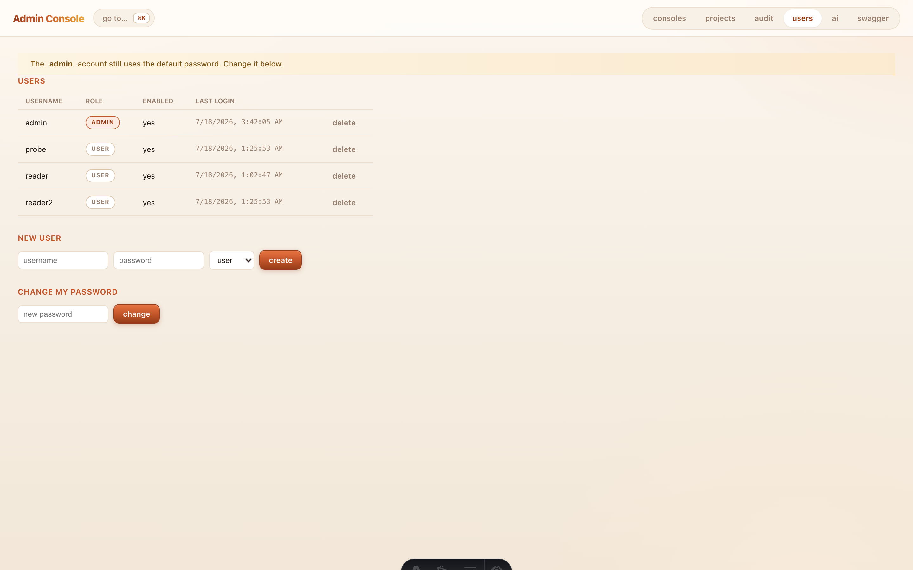

## Design system

Every component has stories and tests.

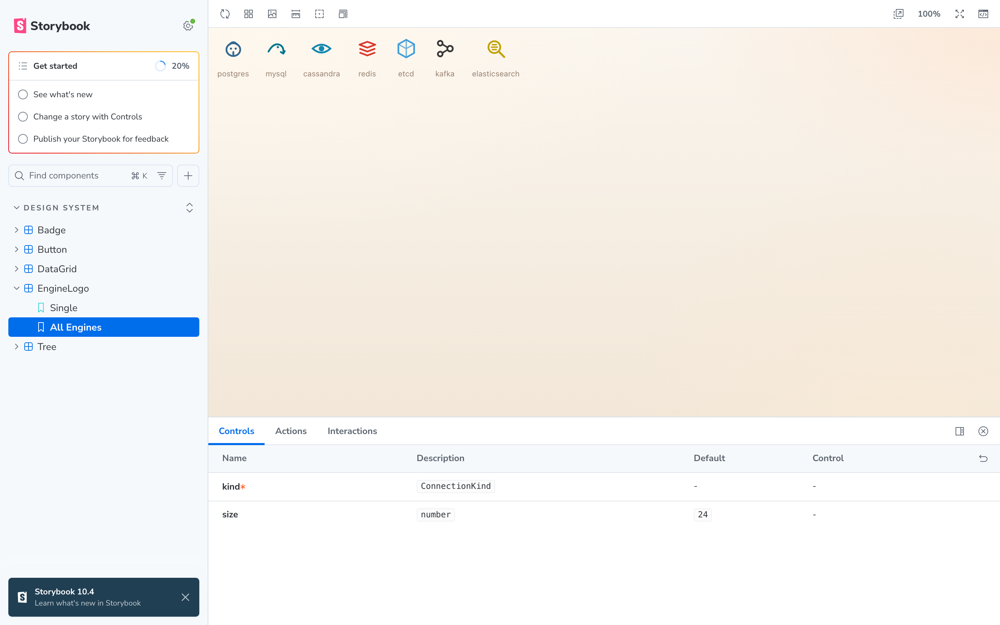

## Stack

**Backend** — Java 25, Maven, Spring Boot 4.1.0 on virtual threads, HikariCP (one dynamic pool per connection), Spring JDBC, Postgres + MySQL drivers, Lettuce, DataStax driver, jetcd, kafka-clients. Elasticsearch uses the JDK's `HttpClient`, so it needs no extra dependency.

**Frontend** — Astro 7, React 19 islands, TypeScript 7, bun, CodeMirror 6, Storybook 10, Jest 30.

**Storage** — one Postgres holds projects, connections, users, saved queries, the audit log and the encryption key.

## Testing

```bash
cd backend && mvn test        # unit tests only — integration tests are excluded
cd frontend && bun run test   # jest
./it.sh                       # brings up all 7 servers, then runs integration tests
```

Integration tests are tagged `integration-test` and excluded from the normal build, so `mvn test` and `mvn package` never need a database. `it.sh` flips the tag on.

Every integration test runs against a **real** server — no mocked databases. That includes paging correctness on all seven engines (page 2 continues exactly where page 1 ended), writes being rejected by the database itself when the guard is bypassed, and a test that consumes 50 Kafka messages then asserts a real consumer group's committed offsets are **byte-identical** before and after.

## Security

What this commits to:

- Read-only everywhere, in three independent layers, with no UI toggle to disable it
- Connection secrets encrypted with AES-256-GCM
- PBKDF2 password hashing, two roles, no hardcoded credential (`admin/admin` is a first-boot seed the UI nags you to change)
- Append-only audit of every statement, allowed or denied
- Backend binds `127.0.0.1` by default
- Secrets are never returned by any API, never logged, never in audit rows

What it does **not** do — stated plainly rather than left implicit:

- **The encryption key lives in the same Postgres as the ciphertext.** A `pg_dump` contains both halves. This protects against casual disclosure, not against someone who obtains the database. Moving the key to an env var is a one-class change (`MasterKeyProvider`).
- No TLS between browser and backend — loopback-only deployment is the mitigation
- No login rate limiting
- No audit-log tamper evidence (hash chaining)
- No MFA, SSO, or per-connection ACLs
- **AI sends schema names off the machine.** Opt-in per user, disableable globally, flagged in the UI at the point of use.

Do not deploy this to a shared or public host as-is.

## Docs

[`design-doc.md`](design-doc.md) has the full design: why Postgres is the system of record, why cursors are forward-only (Cassandra's paging state forces it), why modals portal to `document.body`, and a decisions log recording every choice and its reasoning.
