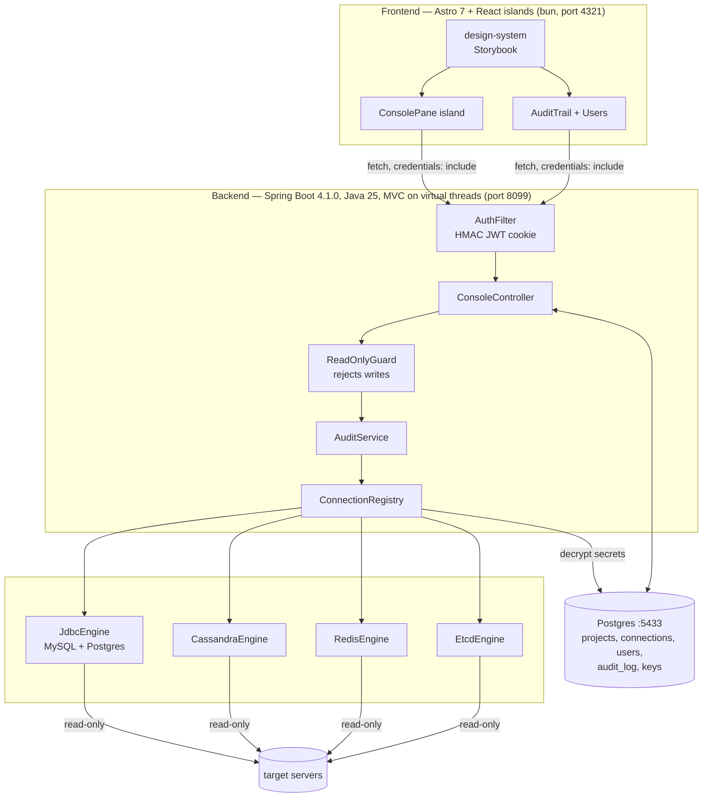

# Generic Admin Console — Design Doc

Status: **approved**. Build follows §11.

## 1. What this is

A single web console that connects to **any number** of Cassandra, MySQL, Postgres, Redis, etcd, Kafka and Elasticsearch servers, grouped into **projects**, and gives each one the same three-pane workflow: browse the schema on the left, write and run a **read-only** query in the middle, read the result at the bottom. Every statement anyone runs is recorded in an audit trail.

It is a generalization of the admin section of `simple-system-design/social-network-java25`. That project hardcodes one MySQL, one Cassandra and one Redis into `AdminDataService`, and its schema queries hardcode the `social_network` keyspace name. Here every connection is user-supplied at runtime, stored encrypted, and access-controlled.

## 2. Assumptions

Stated up front so you can correct them before any code exists.

1. Results are **server-side paginated** (your call, resolving the "one page" wording). One result grid sized to the bottom pane, 100 rows per page, with page controls in the pane footer. The grid itself never scrolls the browser window — "all fit in one page" is satisfied by the pane being self-contained, not by capping the result set. See 4.3 for why the controls are Prev/Next rather than jump-to-page.
2. Multi-project means: a project is a named bag of connections (e.g. project `social-network` holds its MySQL + Cassandra + Redis). You switch projects in the header; the left panel then lists that project's connections.
3. `admin/admin` is the **bootstrap** account, seeded on first boot only. After that, users are managed in the UI. It is not a hardcoded backdoor.
4. Read-only is enforced **server-side** and is not user-toggleable. There is no "I know what I'm doing" escape hatch in this iteration.

## 3. Six conflicts between the requested stack and a *generic, secured* console

These are the parts I'd push back on. Each has a recommendation.

### 3.1 "Encrypted configs in the FS" vs "store configs in Postgres" — resolved: Postgres

You asked for both; they're mutually exclusive as a system of record. **Decided (confirmed): Postgres is the system of record — everything lives there.** Projects, connections, users and the audit trail. You need Postgres regardless for the audit trail — an append-only log of every query by every user is a database workload, not a JSON-file workload, and concurrent users would corrupt a file.

The "encrypted at rest" requirement is honored by **envelope encryption of the secret fields** (passwords, TLS keys) inside those Postgres rows — see 3.2. So config is encrypted *and* in Postgres; what's dropped is the plain-JSON-file-on-disk store from the original brief.

The one thing that cannot live in Postgres is the console's *own* Postgres connection — that bootstraps from `application.yml` / env vars.

### 3.2 Key storage — decided: Postgres, alongside the ciphertext

**Decided: SQLite is dropped. Everything, including the master key, lives in Postgres.** One store, one dependency-free crypto path, no extra moving part.

- **Postgres** holds connection rows whose secret fields are AES-256-GCM ciphertext, and a `keys` table holding the master key, generated on first boot.
- Encryption is JDK-only (`javax.crypto`, AES/GCM/NoPadding, random 96-bit IV per value, IV prepended to ciphertext). Zero dependencies. `org.xerial:sqlite-jdbc` is no longer needed.

**What this protects against, stated honestly so nobody later assumes more:** with the key sitting next to the ciphertext, a single `pg_dump` contains both halves. Anyone who can read the database can decrypt every stored password. So this defends against **casual disclosure** — someone glancing at a `SELECT * FROM connections`, a screenshot, a log line, a `\d` in psql — and not against anyone who takes the database.

Concretely, the "encrypted at rest" property in §10 is therefore **obfuscation, not a security boundary**. That's a deliberate, informed trade for simplicity, not an oversight. If you later want it to be a real boundary, the change is small and localized: move the key out of Postgres into an env var read at boot (`MasterKeyProvider` is a one-method interface precisely so this stays a one-class swap), at which point stolen dumps, replicas and backups become useless without it.

The same `keys` table holds the JWT signing secret, for the same reason.

### 3.3 Spring Data JDBC assumes one static datasource — decided: dynamic pools

`spring-boot-starter-data-jdbc` autoconfigures **one** `DataSource` from `application.yml` and wires repositories to it at startup. That is exactly right for the console's own Postgres metadata store — but wrong for target connections, which are created on demand from encrypted DB rows.

**Decided (confirmed):** the autoconfigured `DataSource` + Spring Data JDBC repositories serve the **metadata store only**. Target connections get **dynamic HikariCP pools** — `ConnectionRegistry` builds and caches one `HikariDataSource` per configured JDBC connection, lazily on first query, evicting and closing it when the config changes.

Because these pools are created at runtime from user input rather than from static config, the registry owns their whole lifecycle:

- **Sizing** — small per pool (`maximumPoolSize` 4, `minimumIdle` 0), since a console issues interactive queries, not load. Twenty configured connections then cost at most 80 sockets, not 20 × default-10.
- **Idle eviction** — a pool with no query for 10 minutes is closed entirely, not just idled down. An admin console spends most of its life with nobody looking at it, and holding connections open against twenty production databases overnight is antisocial.
- **Failure isolation** — `connectionTimeout` 5s and `initializationFailTimeout` -1, so an unreachable target surfaces as one broken pane instead of blocking startup or wedging the registry for every other connection.
- **Eviction correctness** — editing or deleting a connection closes its pool and invalidates any open result cursors (4.3) bound to it, so a config change can never serve rows from the old target.

Same reasoning for Redis and Cassandra: use the **raw Lettuce client and raw DataStax `CqlSession`** for targets, not Spring Data Redis / Spring Data Cassandra, whose autoconfiguration binds one server from properties. Both are cached and evicted by the same registry on the same rules.

Net effect on your stack list: everything stays. Spring Data JDBC just points at the console's own database instead of the targets.

### 3.4 etcd has no tables or columns

etcd is a flat, ordered key→value store with no schema. "List all tables, all columns (foldable)" has no meaning there.

**Recommendation:** the left panel shows a **prefix tree** synthesized by splitting keys on `/` — so `/config/app/db` folds under `/config` → `/app` → `db`. Folding a leaf shows value, revision and lease. The middle pane accepts an etcdctl-style grammar restricted to reads (`get`, `get --prefix`, `range`), consistent with how the Redis pane accepts Redis commands.

etcd speaks gRPC/protobuf, so **jetcd** is unavoidable.

Related: Redis keys have types, not columns. The left panel lists keys with a type badge (the reference project's `redisAll()` already returns `{key, type}` pairs). Folding a key renders per type: hash → field/value table, list/set/zset → members, string → value, stream → recent entries.

### 3.5 Kafka — the console must be invisible to the cluster

Kafka fits the tree and the grid better than I first assumed. `cluster → topic → partition` is a natural `SchemaNode`, with `detail` carrying leader, replicas, ISR, earliest/latest offset and lag; consumer groups form a second root. A bounded consume is genuinely a table: columns `[partition, offset, timestamp, key, value, headers]`. And Kafka is **offset-native**, so it's the cleanest fit of all seven engines for cursor paging (4.3) — the cursor is literally a partition→next-offset map.

**The one thing that must not be got wrong:** a console that consumes carelessly will perturb the cluster it is inspecting. If it joins a consumer group, it triggers a rebalance of that group's real consumers. If it commits offsets, it corrupts their progress and can skip unprocessed messages in production. Either would make this tool actively dangerous on a live system, and both are the *default* behavior of a naively configured consumer.

So the Kafka engine is pinned to observer semantics, non-negotiably:

- `assign()` to explicit partitions — **never** `subscribe()`, so no group is ever joined and no rebalance is ever triggered.
- `enable.auto.commit=false`, and no code path calls `commitSync`/`commitAsync`. The consumer has no group to commit to anyway.
- A unique random `client.id` per query, so the console is identifiable in broker logs and never collides with a real client.
- Bounded reads only: every consume has an explicit start (`earliest`/`latest`/offset/timestamp) and a row limit, with `max.poll.records` and a poll timeout — no open-ended tailing that pins a broker connection.

Grammar (reads only): `list topics`, `describe topic <t>`, `list groups`, `describe group <g>`, `offsets <t>`, and `consume <t> [--partition N] [--from earliest|latest|offset N|timestamp T] [--limit N]`.

Rejected: `produce`/`send`, topic create/delete/alter, config alter, `delete records`, consumer-group offset reset, and group deletion. Read-only here protects other people's runtime state, not just data.

Dependency: `kafka-clients` (`AdminClient` for the tree, `KafkaConsumer` for reads). One new dependency.

### 3.6 Elasticsearch — no new dependency needed

`index → mapping field` maps onto `SchemaNode` directly, with the field type in `detail` and object/nested fields folding naturally. Aliases and `_cat/indices` metadata form the tree's second root.

The middle pane works like Kibana's Dev Tools, which is the interface people already know: `GET /index/_search` followed by a JSON body, plus shorthands `GET /_cat/indices`, `GET /index/_mapping`, `GET /index/_count`.

**Read-only is enforced by method and endpoint, not by parsing JSON:** only `GET`/`HEAD` verbs are accepted, and `_bulk`, `_update_by_query`, `_delete_by_query`, `_reindex`, `_close`, `_open` and any index-management endpoint are rejected outright even when someone dresses them as a `GET` — several of those genuinely accept `GET` and would happily mutate. Whitelisting endpoints is the reliable check; inspecting the body is not.

Paging uses **`search_after` with a point-in-time**, not `from`/`size`. `from` breaks past `index.max_result_window` (10k by default) and gets more expensive the deeper you go — precisely the "browse a big index" case a console is for. The cursor carries the PIT id plus the last sort values, and the PIT is released when the cursor expires or the user closes the tab. Aggregation results come back as a second table rather than being flattened into hits.

Result mapping: columns are `_id`, `_score`, `_index` plus the union of `_source` keys across the page, with nested objects rendered as dotted paths.

**No new dependency.** Elasticsearch is plain REST over HTTP, so the JDK's `HttpClient` plus the Jackson that Spring Boot already ships is enough. The official `co.elastic.clients` library would pull a large transitive tree to do what four HTTP calls do, so it's deliberately skipped — this is one of the rare cases where your least-libraries rule and the pragmatic choice agree completely.

## 4. Architecture



### 4.1 The Engine SPI — the thing that makes it generic

Every console pane in the UI is the same React component. That only works if every backend engine returns the same shapes:

```java
public interface Engine {
    String kind();
    SchemaTree schema(ConnectionConfig config);
    QueryResult query(ConnectionConfig config, String statement, PageRequest page);
    Health ping(ConnectionConfig config);
    void assertReadOnly(String statement);
}

public record SchemaNode(String name, String kind, String detail, List<SchemaNode> children) {}
public record SchemaTree(List<SchemaNode> roots) {}
public record PageRequest(int size, String cursor) {}
public record QueryResult(List<String> columns, List<Map<String,Object>> rows, long elapsedMs,
                          int pageNumber, String nextCursor, boolean hasMore, Long totalRows) {}
```

`SchemaNode` is deliberately recursive, because the engines nest differently: JDBC is `schema → table → column`, Cassandra is `keyspace → table → column` (with partition/clustering key markers in `detail`), Redis is `key → field`, etcd is `prefix → prefix → key`. One tree component renders all four.

`QueryResult` is already column/row shaped for SQL and CQL. Redis and etcd responses are normalized into it — `KEYS` becomes columns `[key, type]`, a hash becomes `[field, value]`, an etcd range becomes `[key, value, revision]`. This is the main new work versus the reference project, which returns a bare `Object` for Redis and makes the frontend guess.

Adding a sixth engine later = one class + one autocomplete token file, plus a paging strategy (4.3).

### 4.2 Read-only enforcement — three independent layers

A parser alone is not enough; anything that only inspects a string can eventually be worked around. Defense in depth:

**Layer 1 — statement guard (`assertReadOnly`), per engine:**

| Engine | Allowed | Rejected |
|---|---|---|
| MySQL / Postgres | `SELECT`, `SHOW`, `DESCRIBE`, `EXPLAIN` (without `ANALYZE`), `WITH` whose body is a `SELECT` | everything else, **any** `;`-separated second statement, and CTEs containing `INSERT`/`UPDATE`/`DELETE` |
| Cassandra | `SELECT` only | all DML, DDL, `TRUNCATE`, `USE` |
| Redis | commands whose `COMMAND INFO` flags include `readonly` and exclude `write`/`admin` | everything else, plus `EVAL`/`EVALSHA`/`FCALL` (Lua can write), `SUBSCRIBE`, `MONITOR` |
| etcd | `get`, `get --prefix`, `range` | `put`, `del`, `txn`, `compact`, lease and auth operations |
| Kafka | `list`/`describe` topics and groups, `offsets`, bounded `consume` | produce, topic create/delete/alter, config alter, `delete records`, group offset reset or deletion (3.5) |
| Elasticsearch | `GET`/`HEAD` on `_search`, `_count`, `_mapping`, `_cat`, `_msearch` | every other verb, plus `_bulk`, `_update_by_query`, `_delete_by_query`, `_reindex`, `_open`, `_close` and index management **even when sent as `GET`** (3.6) |

Redis uses the server's own command metadata rather than a hand-maintained list, so it stays correct as Redis adds commands.

**Layer 2 — connection-level read-only:** JDBC connections open with `setReadOnly(true)`, and Postgres sessions additionally set `default_transaction_read_only=on`, so the *server* rejects writes even if the parser is fooled. Queries run inside a rolled-back transaction with a statement timeout (30s default).

**Layer 3 — credentials:** the docs and the connection form both state that connections should use a database user granted only `SELECT`. The console cannot enforce this, but it's the layer that actually holds if 1 and 2 both fail, so it's surfaced in the UI rather than buried in a README. `demo/` sets up exactly such users, so the default path models the right thing.

A rejected statement is still written to the audit trail with `allowed=false` and the reason. Denied attempts are the most interesting rows in the log.

### 4.3 Pagination — cursor-based, because Cassandra forces it

Server-side paging, 100 rows per page. The awkward part is that no two engines page the same way, and one of them can't do random access at all.

| Engine | Mechanism | Random access? |
|---|---|---|
| MySQL / Postgres | scrollable `ResultSet` held open in a read-only transaction; the cursor token identifies the held statement + absolute row offset | yes, but see below |
| Cassandra | native driver paging state (`ExecutionInfo.getSafePagingState()`), passed back as the cursor | **no — forward-only** |
| Redis | `SCAN` cursor for key listing; materialized values (hash fields, list members) sliced in memory | yes |
| etcd | `range` with `limit` + start-key, the cursor being the last key seen | forward-only in practice |
| Kafka | partition → next-offset map as the cursor; offsets are native, so this is the cleanest fit | yes — offsets are addressable |
| Elasticsearch | `search_after` + point-in-time; **not** `from`/`size`, which breaks past `max_result_window` (3.6) | forward-only |

Cassandra's paging state is opaque and strictly forward-only — there is no "jump to page 47" without re-scanning from the start, which on a large table is exactly the query you don't want an admin console issuing casually.

**Decision: cursor paging with Prev/Next controls, not numbered page jumps.** The pane footer shows `page N · 100 rows · 42ms` with Prev/Next/First. This is the honest common denominator; offering a page-number box that silently degrades to a full re-scan on four of seven engines would be worse than not offering it.

`totalRows` is nullable and populated **only when it's cheap**: never for Cassandra (counting means scanning), never for etcd, and for SQL only when the user opts in via a "count rows" button that runs a separate `SELECT count(*)` over the statement as a subquery. Guessing a total by scanning is the classic way an admin console takes down the database it's inspecting.

Held cursors are resources, so `ConnectionRegistry` expires them after 5 minutes idle and caps concurrent open cursors per user. An expired cursor returns `410 Gone` and the UI offers to re-run the statement rather than silently returning wrong rows.

### 4.4 Data model (Postgres, port 5433)

```sql
keys(id, purpose unique, key_material bytea, created_at)
users(id, username unique, password_hash, password_salt, role, enabled, created_at, last_login_at)
projects(id, name unique, created_at, created_by)
connections(id, project_id fk, name, kind, host, port, database, keyspace, datacenter,
            username, secret_ciphertext bytea, options_json, created_at, created_by)
audit_log(id, query_id, page, at, username, connection_id, project_id, kind, statement,
          allowed, denial_reason, elapsed_ms, row_count, error, client_ip,
          ai_cli, ai_model, ai_prompt)
ai_settings(id, scope, username, cli, model, enabled, updated_at,
            unique(scope, username, cli))
saved_queries(id, project_id fk, connection_id fk nullable, name, statement, kind,
              description, created_by, created_at, updated_at,
              unique(project_id, name))
```

**Saved queries** are shared per project — anyone with access to the project sees them, which is the point: the useful queries stop living in someone's local notes. `connection_id` is nullable so a query can be pinned to one connection or left loose to run against any connection of the same `kind` (the same "find the stuck rows" SQL usually wants running against staging *and* prod). Editing is not restricted to the author — a shared library that only its creator can fix goes stale fast — but `updated_at` and `created_by` are shown, and every execution still lands in the audit trail under the person who ran it, not the person who saved it.

**Paging and the audit trail.** You flagged that paging means more audit rows, so the model separates the two: a statement execution gets a fresh `query_id` and `page=1`; each subsequent page fetch writes a row with the **same** `query_id` and an incrementing `page`. `/audit-trail` groups by `query_id` by default and shows `page 1 of 6` on the group, with an expander for per-page timing — so browsing a result set reads as one entry, not six, while the detail is still there for forensics. Denials never have follow-on pages.

`keys` holds two rows — `master` (secret encryption) and `jwt` (token signing) — both generated on first boot. `secret_ciphertext` is AES-256-GCM over a small JSON blob (`{"password": "...", "tlsKey": "..."}`), so adding future secret fields doesn't need a migration. `audit_log` is append-only — no `UPDATE`/`DELETE` grants for the application role — and indexed on `(at desc)`, `(username, at desc)` and `(connection_id, at desc)`.

Schema is created at startup from `schema.sql`, following the reference project's approach.

Password hashing is **PBKDF2WithHmacSHA256**, 600k iterations, 16-byte random salt, via the JDK — no Spring Security dependency, consistent with the dependency-free HMAC JWT below.

### 4.5 Backend package layout

```
backend/src/main/java/com/github/diegopacheco/adminconsole/
  AdminConsoleApplication.java
  auth/        Jwt, AuthFilter, AuthController, PasswordHasher, CurrentUser
  user/        User, UserRepository, UserService, UserController, BootstrapAdmin
  crypto/      MasterKeyProvider, PostgresKeyStore, SecretCipher (AES-GCM)
  config/      OpenApiConfig, WebConfig, VirtualThreadConfig, MetadataDataSourceConfig
  project/     Project, ConnectionConfig, ProjectRepository, ConnectionRepository, ProjectController
  registry/    ConnectionRegistry, PoolKey, CursorCache, CursorExpiredException
  audit/       AuditEntry, AuditRepository, AuditService, AuditController, HistoryController
  engine/      Engine, EngineRegistry, SchemaTree, QueryResult, Health, ReadOnlyViolation
  engine/jdbc/      JdbcEngine, JdbcSchemaReader, SqlReadOnlyGuard
  engine/cassandra/ CassandraEngine, CqlReadOnlyGuard
  engine/redis/     RedisEngine, RedisCommandParser, RedisReadOnlyGuard, RedisValueReader
  engine/etcd/      EtcdEngine, EtcdCommandParser, EtcdReadOnlyGuard, PrefixTreeBuilder
  engine/kafka/     KafkaEngine, KafkaCommandParser, KafkaReadOnlyGuard, ObserverConsumerFactory
  engine/elastic/   ElasticEngine, ElasticCommandParser, ElasticEndpointGuard, PitCursor
  saved/       SavedQuery, SavedQueryRepository, SavedQueryController
  console/     ConsoleController, QueryRequest, ApiExceptionHandler
```

**Spring MVC on virtual threads, not WebFlux.** The reference project is WebFlux and wraps every blocking driver call in `Mono.fromCallable(...).subscribeOn(Schedulers.boundedElastic())` — ceremony that buys nothing, since JDBC, `CqlSession.execute` and jetcd all block anyway. On Java 25 with `spring.threads.virtual.enabled=true` the same code is plain synchronous methods. Fewer moving parts, simpler tests, and wrapping every query in audit timing is straightforward `try-finally` rather than reactive operators. Flagging this as a deliberate deviation from the reference.

### 4.6 HTTP API

| Method | Path | Role | Purpose |
|---|---|---|---|
| `POST` | `/api/auth/login` | — | username/password → JWT cookie |
| `POST` | `/api/auth/logout` | user | clear cookie |
| `GET` | `/api/auth/session` | user | current user and role |
| `POST` | `/api/auth/password` | user | change own password |
| `GET` | `/api/users` | admin | list users |
| `POST` | `/api/users` | admin | create user |
| `PUT` | `/api/users/{id}` | admin | role / enabled |
| `POST` | `/api/users/{id}/password` | admin | reset password |
| `DELETE` | `/api/users/{id}` | admin | delete user |
| `GET` | `/api/projects` | user | projects and connections (secrets never returned) |
| `POST` `PUT` `DELETE` | `/api/projects/{id}` | admin | manage projects |
| `POST` `PUT` `DELETE` | `/api/projects/{id}/connections/{cid}` | admin | manage connections |
| `GET` | `/api/connections/{cid}/ping` | user | health check |
| `GET` | `/api/connections/{cid}/schema` | user | `SchemaTree` |
| `GET` | `/api/connections/{cid}/node?path=` | user | lazy-expand one node |
| `POST` | `/api/connections/{cid}/query` | user | `{statement, pageSize}` → first page + `query_id` + cursor |
| `GET` | `/api/connections/{cid}/query/{queryId}?cursor=` | user | next page; `410` if the cursor expired |
| `DELETE` | `/api/connections/{cid}/query/{queryId}` | user | release a held cursor |
| `POST` | `/api/connections/{cid}/query/count` | user | opt-in `SELECT count(*)`, SQL only |
| `GET` | `/api/history?connection=&limit=` | user | **own** recent distinct statements |
| `GET` | `/api/projects/{id}/saved` | user | saved queries for the project |
| `POST` `PUT` `DELETE` | `/api/projects/{id}/saved/{sid}` | user | manage saved queries |
| `GET` | `/api/audit?user=&connection=&allowed=&from=&to=&page=` | admin | audit trail, grouped by `query_id` |
| `GET` | `/api/audit/export.csv` | admin | audit export |
| `GET` | `/swagger` | user | redirect → `/swagger-ui/index.html` |

Two roles: `admin` (everything) and `user` (query and read schema; no config, no audit, no user management). One controller family serves all seven engines — the reference project's separate `/mysql/*`, `/cassandra/*`, `/redis/*` route families are what forces per-engine frontend code.

Connection responses **never** include secrets, not even masked ciphertext.

`/api/history` is scoped to the caller — it reads `audit_log` filtered to their own username, server-side, never by a client-supplied user parameter. A `user` seeing another user's queries would be an audit-trail leak through the back door, so the endpoint takes no user argument at all.

### 4.7 Auth

Built on the reference project's `AdminJwt` + `AdminWebFilter`, which are dependency-free HMAC-SHA256 and work well, extended for real users:

- Login checks the `users` table with PBKDF2 and a constant-time comparison, then issues an 8h HS256 token carrying `sub` (username) and `role`, set as an `HttpOnly` `SameSite=Lax` cookie `admin_console_token`.
- A `OncePerRequestFilter` at highest precedence rejects unauthenticated requests to `/api/**` (except `/api/auth/login`), `/swagger*` and `/v3/api-docs*` with `401`, and role-violating requests with `403`.
- The JWT secret is generated on first boot into the `keys` table — no committed default, and it survives restarts so sessions aren't silently invalidated.
- `BootstrapAdmin` seeds `admin`/`admin` **only when the users table is empty**, and the UI shows a persistent banner until that password is changed.

## 5. Frontend

### 5.1 Structure

Astro 7 renders the shell and routes; every interactive surface is a React island hydrated with `client:load`. Astro's dev server *is* Vite, so "vite + astro" is satisfied by Astro's built-in pipeline rather than a second config.

```
frontend/
  src/
    design-system/          Storybook lives here — zero app knowledge
      tokens/               colors.ts, spacing.ts, typography.ts
      Button/ Badge/ Tree/ DataGrid/ Pager/ EngineLogo/ RowDetail/
        <Name>.tsx  <Name>.stories.tsx  <Name>.test.tsx  <Name>.css
    navigation/
      CommandPalette.tsx    ⌘K go-to-page, two columns, no scrolling (5.4)
    console/
      ConsolePane.tsx           three-pane layout, used by all seven kinds
      ConnectionPicker.tsx      logo grid modal, search + keyboard (5.4)
      SchemaTreePanel.tsx       left, foldable, lazy-expanding
      QueryEditor.tsx           CodeMirror 6 + CMD+Enter
      AskAi.tsx                 prompt dialog, suggestion, CLI/model picker (6)
      RecentQueries.tsx         own history dropdown, from /api/history
      SavedQueries.tsx          project-shared library, save/load/rename/delete
      ResultGrid.tsx            bottom pane, self-contained, internal scroll
      Pager.tsx                 Prev/Next/First, page number, opt-in row count
      ReadOnlyNotice.tsx        renders a rejected statement and why
    engines/                only per-engine knowledge in the whole frontend
      mysql.ts postgres.ts cassandra.ts redis.ts etcd.ts kafka.ts elastic.ts types.ts
    projects/               ProjectSwitcher, ConnectionForm, ConnectionList
    audit/                  AuditTable, AuditFilters, AuditDetail
    users/                  UserTable, UserForm, PasswordForm
    lib/                    api.ts, types.ts, session.ts
    pages/
      index.astro  login.astro  console/[connection].astro
      projects.astro  audit-trail.astro  users.astro
  .storybook/
```

The modularity requirement is enforced by `engines/` being the only place a database name appears in the frontend. `ConsolePane` receives an `EngineDescriptor` and never branches on kind.

### 5.2 Editor

CodeMirror 6 with `@codemirror/lang-sql` for the MySQL/Postgres/Cassandra dialects, and a custom `StreamLanguage` for the Redis and etcd command grammars. Autocomplete is fed from the live `SchemaTree` — table and column names come from the same fetch that populates the left panel, so completions are always real. `Mod-Enter` runs the query (`Mod` maps to CMD on macOS, Ctrl elsewhere). Write keywords are highlighted in the error color as a hint before the server rejects them.

`RecentQueries` sits in the editor toolbar: the caller's own last 20 distinct statements for the current connection, from `/api/history`. Picking one loads it into the editor without running it — a history dropdown that executes on click is how someone accidentally re-runs a 40-second scan.

### 5.3 Audit trail UI (`/audit-trail`)

Admin-only. A filterable table over `audit_log`, **grouped by `query_id`** so a six-page browse reads as one entry: who, when, which project/connection, the statement, allowed or denied (denials in terracotta with the reason), pages fetched, total elapsed ms, rows, and error if any. Expanding a group shows per-page timing. Filters for user, connection, allowed/denied and time range; server-side paging; CSV export (ungrouped — one row per audit record, since an export is for forensics). Clicking a row opens the full statement in a read-only CodeMirror instance so long SQL stays legible.

### 5.4 Navigation and selection — three modals, one interaction language

The console is keyboard-first. Three surfaces share the same pattern — search box focused on open, arrow keys to move, Enter to commit, Escape to cancel — so learning one teaches the others.

**Connection picker (AWS-console style).** Connections are chosen from a **button + modal**, not tabs. Tabs stop scaling past a handful of connections, and this console is explicitly built for "as many as you want". The modal shows a grid of cards, each with an **engine logo**, connection name, kind badge and target. Search matches name, engine kind *and host* — because `prod` vs `staging` is usually a host distinction, and typing `kafka` should find every Kafka connection.

**Command palette (`⌘K` / `Ctrl+K`).** Opens anywhere, jumps to any page. Two-column grid sized so **every destination fits without scrolling** — a palette that scrolls has already failed at being faster than clicking. Ranking prefers a name prefix over a name substring over a keyword match, so typing `users` goes to Users rather than to whatever mentions "user" in its description. Background scroll is locked while open.

**Chained flow:** `⌘K → Consoles` navigates *and* opens the connection picker, so "go somewhere and pick a thing" is one gesture. The `?pick=1` flag that carries this is stripped with `history.replaceState` immediately, so a refresh doesn't reopen the picker.

**Row detail (double-click).** Double-clicking a result row opens the full record: every column, JSON values pretty-printed, per-field and whole-row copy, `↑↓` to walk rows without closing. Deliberately **double**-click, not single — a grid is text people select and copy, and popping a modal on every stray click makes that miserable.

All three modals render through a **portal to `document.body`**. This is not incidental: the toolbars use `backdrop-filter`, which creates a stacking context, and a modal rendered inside one gets trapped behind other chrome regardless of `z-index`. Tests assert the portal target so this cannot regress.

### 5.5 Palette — warm light, copper accent

```
--bg           #FAF5EE   warm ivory (layered radial gradients, fixed)
--surface      #FFFFFF   crisp white cards, for contrast against the warm field
--surface-sunken #F8F1E7 recessed chrome, chips, code blocks
--border       #ECDFCF   hairline
--border-strong #DBC5AB  emphasis edge
--text         #1F1410   near-black espresso, high contrast
--text-soft    #4A3830   secondary copy
--muted        #97806F   tertiary, metadata
--accent       #C2552A   copper — primary actions
--accent-strong #963C18  pressed / active
--accent-bright #E97341  gradient top
--accent-wash  #FCEBE0   hover and selection field
--accent-soft  #EBAA3A   honey — focus ring
--ok           #4A8750   allowed
--error        #C9382A   denied, errors
```

Light theme only, as requested. The look is warm-ivory ground with **white elevated surfaces** and a copper accent — the contrast between warm background and crisp white is what stops it reading as flat parchment. Chrome (header, toolbars, pager) uses translucency plus `backdrop-filter` so panels feel layered rather than stacked. Tokens live in `design-system/tokens/colors.ts` and are mirrored as CSS custom properties, so Storybook and the app cannot drift.

## 6. AI query authoring

Every console gets an **Ask AI** affordance: describe what you want in plain language, and a local agent CLI writes the query for the engine you are looking at. The user picks which CLI and which model, and that choice is remembered.

### 6.1 Agent CLIs

Three supported, each invoked as a local subprocess on the backend host:

| CLI | Invocation | Model flag |
|---|---|---|
| Claude Code | `claude -p <prompt>` | `--model <model>` |
| Codex | `codex exec <prompt>` | `--model <model>` |
| agy | `agy -p <prompt>` | `--model <model>` |

Each CLI carries **its own model setting**, because the model names are not interchangeable. Switching CLI therefore switches model too, rather than carrying an invalid name across.

Availability is detected at startup and on demand: the backend resolves each binary on `PATH` and marks unavailable ones disabled in the UI with the reason ("`agy` not found on PATH"), instead of failing at query time. The CLIs authenticate themselves — the console never handles their API keys and never asks for one.

### 6.2 Configuration and how the choice is remembered

Two layers, because CLI availability is a property of the machine while model preference is a property of the person:

- **Global (admin)** — which CLIs are enabled at all, and the default model per CLI. Set in the config UI at `/settings/ai`.
- **Per user** — the selected CLI and model, remembered in `ai_settings` keyed by username, changeable any time from the same config UI or from the picker in the console toolbar.

The user's choice persists in Postgres, not browser storage, so it follows them across machines. First use falls back to the global default; if the chosen CLI later becomes unavailable the UI says so and offers the fallback rather than silently switching.

### 6.3 What the model is told, and what it is never told

The prompt is assembled server-side from three parts:

1. The engine kind and its grammar — so the model writes CQL for Cassandra, an etcdctl-style `get` for etcd, a Redis command for Redis, Query DSL for Elasticsearch, and dialect-correct SQL for MySQL vs Postgres.
2. **Schema names only** — table, column, key, topic and field names from the `SchemaTree` already fetched for the left panel, plus types.
3. The user's natural-language request.

**Never sent:** connection credentials, hostnames, the contents of any row, any query result, or the audit trail. The prompt carries structure, never data. This is enforced by building the prompt from `SchemaTree` (which contains no values) rather than from anything that has touched a result set — except Redis and etcd, where key *names* are themselves the schema, so key names do leave the machine and nothing else does.

### 6.4 Generated queries are untrusted input

The model's output is treated exactly like something typed by an anonymous user:

- It is **loaded into the editor, never auto-executed.** The human presses CMD+Enter. An AI feature that runs its own output against a production database is a bad idea regardless of how good the model is.
- It goes through the **same `assertReadOnly` guard** as any typed statement (4.2). If the model writes an `UPDATE`, the console refuses it at the same boundary, and the refusal is shown next to the suggestion.
- The suggestion is rendered with write keywords highlighted, so a rejected suggestion is obvious before it is run.

### 6.5 Subprocess execution safety

Shelling out from a web backend is the part most likely to become a vulnerability, so the rules are explicit:

- **No shell.** `ProcessBuilder` with an explicit argv list — never `sh -c`, never string concatenation. The user's prompt is a single argv element and can therefore contain quotes, semicolons, backticks and newlines without meaning anything to a shell.
- **The binary is chosen from a fixed enum**, never from user input. A request names `claude`/`codex`/`agy`; it cannot name `/bin/rm`.
- **Timeout 60s**, then `destroyForcibly()`. A wedged CLI cannot pin a request thread.
- **Prompt size cap** (16 KB) so a giant schema cannot blow up the command line.
- **No inherited stdin**, output captured and size-capped.
- Runs on a **virtual thread** like every other blocking call.

### 6.6 Auditing AI usage

`audit_log` gains `ai_cli`, `ai_model` and `ai_prompt`. When a statement originated from a suggestion, the audit row records which CLI and model produced it and the natural-language prompt that led to it — so `/audit-trail` can answer "who asked an AI for this, and what did they actually ask?" A generated statement that the user never runs is still recorded, as an AI request with no execution, because knowing what people asked for is as interesting as knowing what they ran.

### 6.7 API

| Method | Path | Role | Purpose |
|---|---|---|---|
| `GET` | `/api/ai/clis` | user | available CLIs, per-CLI models, availability + reason |
| `GET` | `/api/ai/settings` | user | the caller's remembered CLI and model |
| `PUT` | `/api/ai/settings` | user | change the caller's CLI and model |
| `PUT` | `/api/ai/settings/global` | admin | enabled CLIs and default models |
| `POST` | `/api/connections/{cid}/ai/query` | user | `{prompt}` → `{statement, cli, model, readOnlyOk, denialReason}` |

### 6.8 Backend and frontend shape

```
backend .../ai/   AgentCli, AiSettings, AiSettingsRepository, AiSettingsController,
                  CliAvailability, PromptBuilder, AgentCliRunner, AiQueryController
frontend src/ai/  AskAiButton.tsx, AiPromptDialog.tsx, AiSuggestion.tsx, AiSettingsForm.tsx
frontend pages/   settings/ai.astro
```

`PromptBuilder` is per-engine and lives beside the engines, so adding an eighth engine adds its prompt grammar in the same place as its `Engine` implementation. `AgentCliRunner` is the only class allowed to spawn a process, which keeps the audit and safety rules in exactly one file.

## 6b. Container discovery

Most of the time the servers you want are already running on your machine. **Discovery** lists running containers, works out which are engines this console supports, and lets you tick the ones to import as a new project. From then on they behave exactly like a connection you configured by hand.

### 6b.1 Detection

`podman ps --format json` (falling back to `docker`) gives image, published ports and state. `EngineDetector` matches the image repository against a token list per engine, so forks and drop-in replacements are recognised, not just the canonical image:

| Engine | Recognised images |
|---|---|
| Postgres | `postgres`, `postgresql`, `timescale`, `pgvector` |
| MySQL | `mysql`, `mariadb`, `percona` |
| Cassandra | `cassandra`, `scylla` |
| Redis | `redis`, `valkey`, `keydb` |
| etcd | `etcd` |
| Kafka | `kafka`, `redpanda` |
| Elasticsearch | `elasticsearch`, `opensearch` |

Anything else is ignored silently — a discovery page that lists nginx is noise.

### 6b.2 Reachability decides importability

The backend runs on the host, so it can only reach a container through a **published host port**. A container with no published port is listed but marked not importable, with that as the stated reason, rather than being hidden (invisible is indistinguishable from broken) or offered and then failing at query time.

Port matching prefers the engine's own default (`5432` for Postgres and so on) and falls back to the first published port, so a Postgres remapped to `5440` still imports correctly.

### 6b.3 Credentials — convenient, and honest about what they are

Container environments carry credentials (`POSTGRES_PASSWORD`, `MYSQL_ROOT_PASSWORD`, `ELASTIC_PASSWORD`), and discovery reads them so imported connections work immediately. Two rules keep this from being sloppy:

- **They are almost always the superuser.** `POSTGRES_PASSWORD` is the `postgres` superuser; `MYSQL_ROOT_PASSWORD` is `root`. That directly contradicts §4.2 layer 3, which asks for a `SELECT`-only account. Discovery therefore *detects* whether the credentials are a superuser and says so in the UI, next to the row, recommending replacement. Layers 1 and 2 still hold regardless, so an imported superuser connection is still read-only.
- **Detected passwords never reach the browser.** The scan response carries `hasPassword: true`, never the value. Import sends **container ids**; the backend re-scans and reads the credentials itself. This keeps the §4.6 rule — *no API ever returns a secret* — intact for discovery too.

### 6b.4 The console's own database is excluded

Discovery finds the console's **own** metadata Postgres, because it is a running Postgres container like any other. Importing it would be a privilege escalation: the `keys` table holds the master encryption key and the JWT signing secret, so any logged-in `user` could read the key, decrypt every stored connection password, and forge an admin token.

`ContainerScanner` therefore compares each discovered host port against the port in the console's own `spring.datasource.url` and marks that container **not importable**, with the reason spelled out. This was found by running discovery against a real environment, importing the result, and querying the `keys` table through the console — it returned the master key. Excluding it is not a nicety.

### 6b.5 Subprocess safety

Same rules as the agent CLI (6.5), for the same reason: `ProcessBuilder` with an explicit argv list and no shell, a binary chosen from a fixed list (`podman`, `docker`) and never from request input, a 20s timeout with `destroyForcibly`, and a capped output read. Discovery takes no user input at all at the scanning stage, so there is nothing to inject.

### 6b.6 API

| Method | Path | Role | Purpose |
|---|---|---|---|
| `GET` | `/api/discovery` | user | running containers, detected engine, reachability, whether credentials were found |
| `POST` | `/api/discovery/import` | admin | `{projectName, containerIds}` → creates a project and its connections |

Import is admin-only, because it creates connections — the same rule as every other config change (4.6).

## 6c. Entity trace — one record, across the whole stack

Type a value — `1001`, `customer42@example.com` — and get every place it appears across every connection in the project, ordered into a timeline. The Postgres row, the Kafka messages about it, the Redis cache entry, the Elasticsearch document, the etcd key.

This is the feature the seven-engine SPI actually earns. Everything else in this console is seven good consoles sharing a shell; trace is one thing that understands the whole stack.

### 6c.1 Searching is not free — the budget is the design

A naive implementation scans every column of every table on every server. That is exactly the query an admin console must never fire casually (4.3). So trace runs under an explicit **budget**, and every engine's search is written against it:

| Bound | Default | Why |
|---|---|---|
| per-connection timeout | 5s | one slow server cannot stall the whole trace |
| tables/topics/indices per connection | 12 | bounds the fan-out on a wide schema |
| rows returned per source | 20 | a trace is a set of pointers, not a data dump |
| total hits | 200 | keeps the response and the UI honest |

Connections are traced **in parallel on virtual threads**, and a connection that fails or times out is reported as a failed source rather than failing the whole trace — a trace that dies because one server is down is useless.

### 6c.2 What "search" means per engine, and where it refuses

Each engine searches the way it can be searched *efficiently*. Where it can't, it says so instead of doing something expensive:

| Engine | How | Refuses when |
|---|---|---|
| Postgres / MySQL | candidate columns only — key-ish (`id`, `*_id`, `uuid`, `key`) and text-ish columns, cast to text and compared for equality, one statement per table | a table has no candidate column |
| Cassandra | **partition-key equality only** | the term does not match a partition key — a non-key scan needs `ALLOW FILTERING`, which is a cluster-wide scan, so it is refused with that as the reason |
| Redis | exact `GET`/`TYPE` on the term as a key, plus a bounded `SCAN MATCH *term*` | — |
| etcd | exact key, prefix match, and a value match over the bounded key set | — |
| Kafka | consumes a bounded recent window per topic and matches key or value; observer semantics from 3.5 apply unchanged — no group, no commits | topic is empty |
| Elasticsearch | `query_string` across all fields, which is what the engine is for | — |

Cassandra refusing is the interesting case: the honest answer to "can you find this?" is sometimes "not without hurting the cluster", and saying that is better than a `ALLOW FILTERING` scan that appears to work in the demo and melts in production.

### 6c.3 Building the timeline

A hit is placed on the timeline when the engine can supply a time: a temporal-looking column (`*_at`, `time`, `timestamp`, `date`), the Kafka record timestamp, or the Elasticsearch `@timestamp`/date field. Hits without a time are shown in a separate "no timestamp" group rather than being given a fake one — inventing an ordering across seven systems would be worse than admitting there isn't one.

### 6c.4 Read-only and audited

Trace runs through the existing engines, so the read-only guards apply unchanged. Each traced source is written to the audit trail as a normal query, so "who went looking for this customer" is as visible as "who ran this SELECT".

`GET /api/projects/{id}/trace?term=…` → `{term, hits[], failures[], elapsedMs}`.

## 6d. Cross-engine JOIN — a small federated query engine

```sql
SELECT c.email, o.status, p.name
FROM demo-postgres.customers c
JOIN demo-elasticsearch.products p ON p.sku = c.country
LIMIT 50
```

Two sources on **different engines**, joined into one grid.

### 6d.1 What it is, and what it deliberately is not

It is a **bounded hash join over two native queries**. It is not a query planner, has no cost model, does not push predicates down, and does not do aggregation. Saying that plainly matters, because "federated SQL" implies a great deal more than this delivers.

Execution is four steps:

1. **Parse** `alias.source` on each side, the `ON a.x = b.y` equality, optional `WHERE` per side, and `LIMIT`.
2. **Resolve** each alias to a connection **in the current project** by name.
3. **Fetch** each side through its own `Engine` — the same `query()` every console uses, so read-only guards, auditing and paging all apply. Each engine gets a native "read rows from this source" statement built for its grammar.
4. **Join** in memory: build a hash table on the smaller side, probe with the larger, project the requested columns.

Supported: `INNER` and `LEFT` joins, a single equality key, `LIMIT`, and column projection. Everything else is rejected with a clear message rather than silently ignored.

### 6d.2 Memory is the hard bound

An in-memory join is a memory risk, so the fetch is capped **before** the join: **5,000 rows per side** by default, and the join result is capped at the requested `LIMIT` (default 100, max 1,000). Exceeding the per-side cap does not truncate silently — the response carries `truncated: true` per side and the UI says which side was cut and that the join may therefore be incomplete. A wrong answer presented as complete is worse than a partial answer labelled as partial.

Join keys are compared as strings. Every engine already normalises values to strings in `QueryResult` (4.1), so `1001` from Postgres matches `"1001"` from Kafka — which is what makes cross-engine joining work at all, and is also its main sharp edge: `1.0` and `1` will not match.

### 6d.3 Why this is safe by construction

Federation adds no new path to the data. Both sides go through `Engine.query()`, so a federated query cannot write, cannot escape the read-only guard, and is audited per side. The only new powers are *combining* two read results and *reading two servers in one request*.

### 6d.4 Failing usefully

A federated query has two failure modes that were both silent, and both are now named:

- **Source does not exist.** `demo-cassandra.shop` is the *keyspace*, not a table. Each side is validated against the engine's real schema before fetching, and the error says what is actually there: *no source named "shop" on demo-cassandra — available: events_by_customer, sessions ("shop" is the keyspace, not a table)*.
- **Join key does not exist.** Joining `ON x.id = y.id` when the table has no `id` column produced **zero rows and no explanation** — indistinguishable from "no matching data". The key is now checked against the fetched columns, with a closest-match hint: *no column named "id" … did you mean "event_id"? — available: customer_id, event_time, event_id, …*.

Unhandled engine errors previously surfaced as a bare `500 Internal Server Error`. The exception handler now unwraps to the root cause so the driver's own message reaches the user.

Related: the source pattern accepts `/` and `:`, because etcd sources are paths and Redis keys contain colons. Without that, three of the seven engines could not be named on either side of a join at all.

### 6d.5 Ask AI for a join

Writing a federated join by hand means knowing two schemas and the alias rules, so the join page has its own **Ask AI**. It builds a prompt from the federated grammar plus every source in the project with its columns, and validates the answer through `FederatedQueryParser` before offering it.

Two details make it work rather than merely appear to:

- **The model sees the columns a query actually returns**, not just the schema tree — including each engine's synthetic columns (`_id`, `_score` for Elasticsearch; `partition`, `offset`, `timestamp`, `key`, `value` for Kafka; `key`, `value`, `version` for etcd). Without them the model declined correct requests, because the column needed for the join was invisible to it.
- **A refusal is reported as a refusal.** When the model answers in prose — *"these two sources have no comparable column, I won't invent one"* — that is shown as **no join possible** with its explanation, not as a parse error. Declining is often the right answer, and mislabelling it as broken output teaches people to ignore it.

The suggestion loads into the editor for review, and `use this join` stays disabled unless it parses. Nothing runs on its own.

### 6d.6 Writing the query: autocomplete and the schema panel

A federated join asks you to hold two schemas and the alias rules in your head at once, so the page provides both an editor and a browser:

- **The editor is CodeMirror**, not a textarea, with completions built from every connection's live schema — connection names, qualified sources (`demo-mysql.invoices`), and column names — plus the join keywords. `⌘↵` runs.
- **A schema panel on the right lists every connection in the project**, foldable to sources and columns. Clicking inserts the *correctly qualified* form for where you are: a source becomes `connection.source`, and a column becomes `alias.column` **using the alias already bound to that source in the statement you are writing**. If that source has no alias yet, the bare column name is inserted rather than a wrong guess.

Alias resolution handles the awkward sources deliberately — Kafka topics contain dots, etcd sources are paths, Redis keys contain colons — so `demo-kafka.orders.events x` still resolves to alias `x`, and keywords like `JOIN` are never mistaken for an alias.

`POST /api/projects/{id}/federated` → `{statement}` → `{columns, rows, sides[], elapsedMs}`.
`POST /api/projects/{id}/federated/ai` → `{prompt}` → `{statement, cli, model, parses, declined, problem}`.

## 7. The `demo/` folder

A note on naming: my standing instruction is never to use the word "demo", but you named `demo-start.sh` and `demo-stop.sh` explicitly, so I'm following your naming here. Say the word if you'd rather it be `sandbox/`.

`demo/` is a self-contained, fully seeded environment for exercising the console against real servers:

```
demo/
  podman-compose.yml      mysql, postgres, cassandra, redis, etcd, kafka, elasticsearch
  seed/
    mysql.sql             tables with realistic rows
    postgres.sql          schemas, views, foreign keys
    cassandra.cql         keyspace with partition + clustering keys
    redis.sh              string, hash, list, set, zset, stream keys
    etcd.sh               nested /config/... and /service/... prefixes
    kafka.sh              multi-partition topics, enough messages to page, a live
                          consumer group so lag is non-zero and paging is observable
    elastic.sh            index with a real mapping, nested objects, >10k docs so
                          search_after is exercised past max_result_window
  readonly-users.sql      SELECT-only DB users the console connects as
  demo-start.sh           up, wait, seed, register connections, print all configs
  demo-stop.sh            tear down containers, volumes and network
```

`demo-start.sh` brings the containers up with `podman-compose`, polls each for readiness in a 1-second loop, applies the seeds, creates the read-only users, then calls the console API to create a `demo` project with all seven connections already wired — so when it finishes you log in and every console works against real data. It ends by printing every credential, host, port and URL it used, so the environment is fully inspectable.

This doubles as the fixture for integration tests (8.2), so there is one seeded environment rather than two that drift.

## 8. Testing

### 8.1 Unit — every class

**Java, JUnit 6** (ships with Boot 4.1). One test class per production class, plus a smoke test asserting every `@Component`/`@Service` has one, so the "all classes" requirement can't silently rot.

Engines are tested against mocked drivers (`JdbcTemplate`, `CqlSession`, Lettuce `RedisCommands`, jetcd `KV`) — no containers, so `mvn test` stays fast.

The highest-value tests, per Rule 9, encode *why* the behavior matters:

- **Read-only guards** — the security boundary, so they get adversarial cases: `SELECT` with a trailing `; DROP TABLE`, `WITH x AS (DELETE ... RETURNING *) SELECT`, comment-obfuscated `SEL/**/ECT`, mixed case, leading whitespace/newlines, `EXPLAIN ANALYZE` (which executes), Redis `EVAL` with a writing script, etcd `put` disguised by flags.
- **`SecretCipher`** — round-trip, distinct IV per encryption, tampered ciphertext fails GCM auth rather than returning garbage.
- **`PostgresKeyStore`** — generates each key once, reuses it after restart, and two concurrent boots don't race into two different master keys (which would make already-stored secrets undecryptable).
- **`PasswordHasher`** — same password yields different hashes, verification is constant-time, wrong password fails.
- **`Jwt`** — expiry, tampered signature, wrong secret, role claim cannot be edited client-side.
- **`AuditService`** — a denied statement is still logged; a thrown engine error still logs elapsed time and the error; page 2 reuses the `query_id` of page 1 rather than opening a new one.
- **`CursorCache`** — a cursor expires after its idle window, an expired cursor raises rather than returning stale rows, cursors are released when the pool is evicted, and one user cannot fetch another user's cursor by guessing its id.
- **`HistoryController`** — returns only the caller's statements; a forged user parameter is ignored rather than honored.
- **`AgentCliRunner`** — the process-spawning boundary, so it gets adversarial cases: a prompt containing `; rm -rf /`, backticks, `$(...)`, quotes and newlines is passed through as **one argv element** and never interpreted; the binary comes from the enum and cannot be redirected by request input; a CLI that never exits is killed at the timeout; oversized prompts are rejected before spawning.
- **`PromptBuilder`** — the disclosure boundary: the assembled prompt contains schema names and never a password, hostname, or any value from a result row. Asserted per engine, since a regression here silently exfiltrates data to a third party.
- **AI suggestions are guarded** — a model that returns `UPDATE users SET admin = true` is refused by the same `assertReadOnly` as a typed statement, and is never executed automatically.
- **Parsers** — `RedisCommandParser`, `EtcdCommandParser` and `KafkaCommandParser` quoting/escaping/malformed input; `PrefixTreeBuilder` `/`-splitting.
- **`ObserverConsumerFactory`** — the highest-stakes test in the suite: the built consumer has `enable.auto.commit=false`, uses `assign()` and **never** `subscribe()`, carries no `group.id`, and no code path reaches a commit call. A regression here silently damages other people's production consumers (3.5), so it's asserted on the constructed config, not just on behavior.
- **`ElasticEndpointGuard`** — `_delete_by_query` and `_bulk` are rejected even when sent as `GET`, since several mutating ES endpoints accept it.
- **`PitCursor`** — the point-in-time is released on cursor expiry, so an abandoned browse doesn't leak PIT resources on the cluster.
- **`ConnectionRegistry`** — pool reuse, eviction on config change, no pool leak on connect failure.

**TypeScript, Jest** with `@swc/jest` and jsdom, matching the reference project's setup, `@testing-library/react`, one `.test.tsx` beside each component. Covers `ConsolePane` keyboard handling (CMD+Enter fires, plain Enter does not), `SchemaTreePanel` fold/unfold and lazy-load, `Pager` (Next disabled when `hasMore` is false, Prev hidden on page 1, `410` offering re-run rather than showing stale rows), `RecentQueries` loading a statement into the editor **without** executing it, `ReadOnlyNotice` rendering a denial, audit filters building the right query string, `api.ts` error/401/403/410 paths, and every design-system component's states.

### 8.2 Integration — `it.sh` only, never in the build

Tagged `@Tag("integration-test")`. `pom.xml` sets `<excluded.groups>integration-test</excluded.groups>`, so `mvn test` and `mvn package` skip them; `it.sh` flips it with `-Dexcluded.groups= -Dincluded.groups=integration-test`. Exactly the reference project's mechanism.

`it.sh` reuses `demo/` for its environment, then runs tagged tests covering: schema listing per engine, query execution per engine, **paging across all seven engines against real data** (page 2 continues where page 1 ended, with no gaps or repeats — the failure mode that silently corrupts what an operator believes they're looking at), cursor expiry returning `410`, **write statements rejected against real servers** (the layer-2 and layer-3 check — a write must fail even with the guard bypassed in the test), auth rejection, role enforcement, audit rows written for both allowed and denied statements, secrets round-tripping through Postgres encrypted, and config surviving a backend restart.

## 9. Scripts and ports

| Script | Does |
|---|---|
| `start.sh` | starts metadata Postgres, backend and frontend, waits for health, prints `links.sh`. **Idempotent** — stops any running instance first, so it can never leave a stale process serving a stale database |
| `stop.sh` | stops all three. **Non-destructive** — the metadata container is stopped, not removed, and its volume is kept |
| `destroy-all.sh` | the only destructive script. Removes every container, **volume**, network and build artifact. Requires typing `DESTROY` unless run with `--yes` |
| `it.sh` | demo env up, run tagged integration tests, tear down |
| `links.sh` | prints every URL |
| `demo/demo-start.sh` `demo/demo-stop.sh` | seeded target servers + auto-registered connections |
| `backend/start.sh` `backend/stop.sh`, `frontend/start.sh` `frontend/stop.sh` | each alone |

All bash, no comments, no emoji, no sleep longer than 1, readiness by polling loop — per your bash rules. Containers use `podman-compose`.

**Persistence is a correctness property, not a convenience.** Postgres is the system of record for config, users, saved queries and an append-only audit trail (3.1), so any script that silently drops that data destroys the audit trail the design promises. Three rules follow, each of which was violated by the first version and fixed after being caught:

- The metadata Postgres has a **named volume**, mounted at `/var/lib/postgresql` — Postgres 18 stores data in a version-specific subdirectory and refuses to start if the volume is mounted at `/data`.
- `start.sh` and `demo-start.sh` use `up -d`, never `--force-recreate`; `stop.sh` uses `stop`, never `rm -f`.
- `start.sh` is **idempotent**: it stops a running instance before starting. Without this, a second backend fails on "port already in use" while the *stale* one keeps answering the health check — so the script reports success while serving the wrong database.

Destruction is opt-in and loud, in exactly one script: `destroy-all.sh`.

| Service | Port |
|---|---|
| frontend (Astro) | 4321 |
| backend | 8099 |
| Storybook | 6006 |
| console metadata Postgres | 5433 |
| target MySQL / Postgres / Cassandra / Redis / etcd | 3306 / 5432 / 9042 / 6379 / 2379 |
| target Kafka / Elasticsearch | 9092 / 9200 |

Backend is on 8099 rather than the reference project's 8095, and the metadata Postgres on 5433, so this can run alongside both the reference project and the `demo/` Postgres.

`links.sh` prints:

```
http://localhost:4321/               console
http://localhost:4321/projects       project and connection config
http://localhost:4321/audit-trail    audit trail
http://localhost:4321/users          user management
http://localhost:8099/swagger        swagger ui
http://localhost:8099/v3/api-docs    openapi json
http://localhost:8099/actuator/health
http://localhost:6006/               storybook
```

## 10. Security posture

What this design commits to:

- **Read-only everywhere**, enforced in three independent layers (4.2). No UI toggle to disable it.
- **Secrets encrypted at rest** with AES-256-GCM, so they never appear in a `SELECT`, a screenshot or a log line. Per 3.2 the key lives in the same database, which makes this **obfuscation against casual disclosure, not a boundary against anyone who obtains the database**. Listed here as a real property, described as what it is.
- **Real user accounts** with PBKDF2 password hashing, two roles, no hardcoded credential — `admin/admin` is a first-boot seed the UI nags you to change.
- **Full audit trail** of every statement, allowed or denied, append-only, admin-visible at `/audit-trail`.
- **Backend binds `127.0.0.1`** by default.
- Secrets are never returned by any API, never logged, and never included in audit rows.

What it does **not** do, stated so the boundary is explicit rather than accidental:

- **No protection against anyone who obtains the metadata database** — a `pg_dump` carries both the ciphertext and the key, so every stored connection password is recoverable (3.2). This is the single biggest gap and it is a deliberate simplicity trade; the fix is a one-class swap to an env-var key.
- No TLS between browser and backend. Loopback-only deployment is the mitigation; a shared host needs a TLS terminator in front.
- No rate limiting on login. Brute-forcing `admin/admin` from localhost is possible until the password is changed.
- No audit-log tamper-evidence (hash chaining). Append-only grants stop the application from rewriting history; they do not stop a Postgres superuser.
- No MFA, no SSO, no per-connection ACLs — any `user` can query any connection in any project.
- **AI query authoring sends your schema off the machine.** The agent CLI talks to a third-party model provider, so table, column, key, topic and field names leave the host — never credentials, hostnames or row data (6.3), but names alone can be sensitive (`patients`, `salaries`, `layoff_plan_2026`). The feature is opt-in per user and can be disabled globally by an admin, and this is called out in the UI at the point of use rather than buried here.
- **AI runs a local subprocess as the backend's OS user.** Hardened per 6.5 (no shell, fixed binary enum, timeout, size caps), but a compromised or trojaned `claude`/`codex`/`agy` binary on `PATH` runs with the console's privileges. That is inherent to invoking local CLIs and is the reason the binary can never be chosen by request input.

## 11. Build order

1. Backend skeleton — Boot 4.1.0, Java 25, virtual threads, metadata Postgres + `schema.sql`, OpenAPI, health.
2. Crypto — `PostgresKeyStore`, `MasterKeyProvider`, `SecretCipher`, unit tests. Everything else depends on it.
3. Users and auth — `PasswordHasher`, `Jwt`, `AuthFilter`, `UserService`, `BootstrapAdmin`, unit tests.
4. Projects and connections — repositories with encrypted secrets, `ProjectController`, unit tests.
5. Audit — `AuditService`, `AuditRepository`, `AuditController`, wrapped around every query.
6. `Engine` SPI + `ConnectionRegistry` (dynamic Hikari pools) + `CursorCache` + `JdbcEngine` + `SqlReadOnlyGuard` (MySQL and Postgres both land here).
7. `CassandraEngine`, `RedisEngine`, `EtcdEngine`, `KafkaEngine`, `ElasticEngine` + parsers, guards and per-engine paging, unit tests each.
8. `demo/` — containers, seeds, read-only users, `demo-start.sh` / `demo-stop.sh`.
9. Frontend design system + Storybook + tokens, component tests.
10. `ConsolePane`, `Pager`, `RecentQueries` and the `engines/` descriptors; wire all seven kinds.
11. Saved queries — table, `SavedQueryController`, `SavedQueries.tsx`.
12. AI query authoring — `AgentCliRunner` and `PromptBuilder` first with their adversarial tests, then settings persistence, then `AskAi.tsx` and `/settings/ai`.
13. Projects, users and audit-trail UIs.
14. Scripts, `podman-compose`, integration tests against `demo/`.
15. Playwright screenshots into `printscreens/`, Excalidraw-style architecture diagram, `README.md`.

## 12. Decisions log

All open questions are resolved. Recorded here so the reasoning survives.

| # | Question | Decision |
|---|---|---|
| 1 | Results: one page or pagination? | **Pagination.** Server-side, 100 rows/page, cursor-based with Prev/Next — not numbered jumps, because Cassandra paging state is forward-only (4.3). |
| 2 | Store configs in FS or Postgres? | **Postgres, everything.** Single system of record (3.1). |
| 3 | Where does the master key live? | **Postgres `keys` table**, alongside the ciphertext. SQLite dropped, one less dependency. Makes encryption obfuscation rather than a boundary — accepted knowingly (3.2, §10). |
| 4 | Static or dynamic connection pools? | **Dynamic.** One HikariCP pool per connection, built lazily, idle-evicted, failure-isolated (3.3). |
| 5 | `demo/` naming | **Keep `demo/`, `demo-start.sh`, `demo-stop.sh`** as specified, overriding the standing no-"demo" rule. |
| 6 | Metadata Postgres lifecycle | **`start.sh` owns it** as a podman container. No external Postgres required to run this. |
| 7 | Is `EXPLAIN` allowed? | **Yes.** `EXPLAIN ANALYZE` stays rejected — it executes the statement. |
| 8 | etcd grammar | **Mirror `etcdctl`** (`get --prefix /foo`), reads only. |
| 9 | Query history | **Both.** A "recent queries" dropdown in the editor (own history, loads without executing) *and* the full `/audit-trail` for admins (4.6, 5.2, 5.3). |
| 10 | Kafka support | **Added** (3.5). Observer semantics are non-negotiable: `assign()` only, no group, no commits — a console must not trigger rebalances or corrupt real consumers' offsets. |
| 11 | Elasticsearch support | **Added** (3.6). Dev-Tools-style grammar, endpoint whitelist rather than body parsing, `search_after` + PIT paging. No new dependency — JDK `HttpClient` + Boot's Jackson. |
| 12 | Saved queries | **Added.** Shared per project, editable by anyone with project access, optionally pinned to one connection (4.4). |
| 13 | Connection selection | **Button + modal picker with engine logos**, not tabs (5.4). Tabs do not scale to "as many connections as you want"; search covers name, engine and host. |
| 14 | Global navigation | **⌘K command palette** (5.4). Two columns, everything visible without scrolling, name-prefix ranking. `⌘K → Consoles` chains straight into the connection picker. |
| 15 | Row inspection | **Double-click** a result row for the full record (5.4). Double, not single, so selecting and copying cell text still works. |
| 16 | Modal layering | **All modals portal to `document.body`.** Toolbars use `backdrop-filter`, which creates a stacking context that traps nested modals behind chrome no matter the `z-index`. Asserted in tests. |
| 18 | Container discovery | **Added** (§6b). Scans running podman/docker containers, detects supported engines by image, imports checked ones as a new project. Credentials are read from the container env but **never returned to the browser** — import sends container ids and the backend re-reads them. |
| 19 | Discovery excludes the console's own database | **Enforced** (§6b.4). Importing the metadata Postgres would expose the master encryption key and JWT secret to any logged-in user. Found by actually importing it and reading the `keys` table. |
| 17 | AI query authoring | **Added** (§6). Three agent CLIs (`claude -p`, `codex exec`, `agy -p`), each with its own model setting; choice remembered per user in Postgres and changeable in the config UI. Suggestions are loaded into the editor, never auto-executed, and pass through the same read-only guard as typed statements. |

## 13. Not in scope — candidate follow-ups

Deliberately excluded from this build so the first version stays finishable. Listed so they're visible choices rather than forgotten ones: additional engines (MongoDB, ClickHouse, DynamoDB, S3, RabbitMQ — see below), schema diffing across environments, result export to CSV/JSON, a connection-health dashboard, an `EXPLAIN` plan visualizer, per-connection ACLs, an env-var master key, and audit-log hash chaining.

**RabbitMQ** is worth a note because it does *not* work the way Kafka does. Kafka reads are non-destructive — consuming never removes messages, retention does, so 3.5's observer consumer can browse a topic freely. RabbitMQ queues are destructive by nature: `basic.get` removes a message, and requeueing it sets the `redelivered` flag and disturbs ordering, which can trip real consumers and dead-letter policies. There is no reliable way to browse queue *contents* without side effects. So if RabbitMQ is added, the honest scope is **metadata only** — vhosts, exchanges, queues, depths, rates, consumers, bindings, via the read-only management HTTP API — with message peeking deliberately absent and the UI saying why, rather than shipping a footgun that looks like the other consoles.
