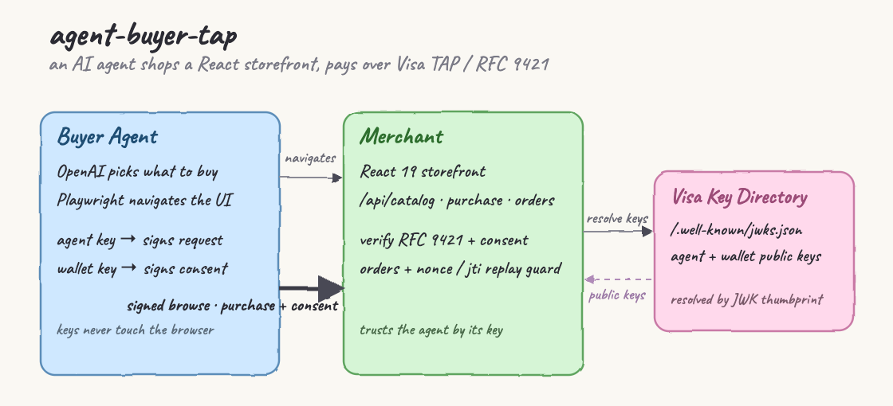
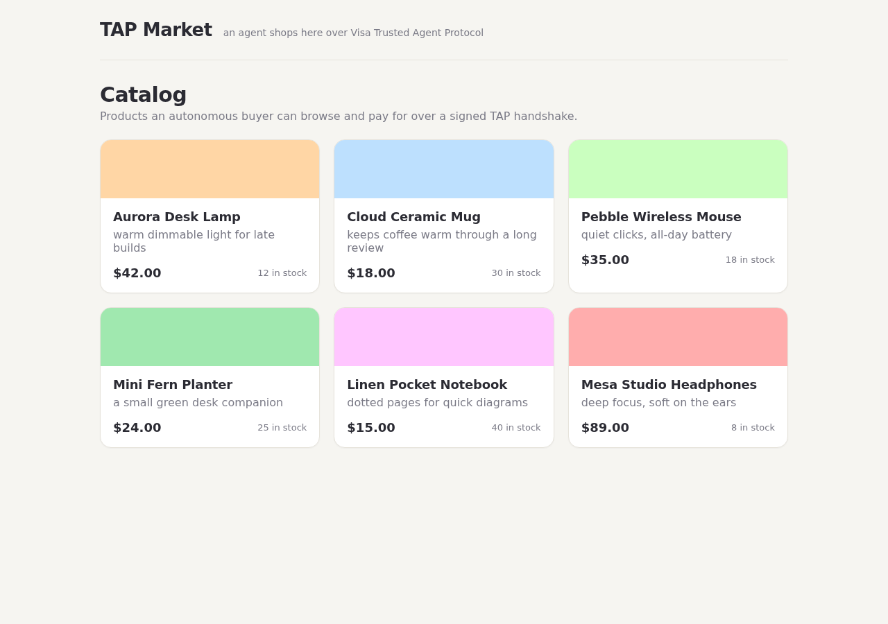
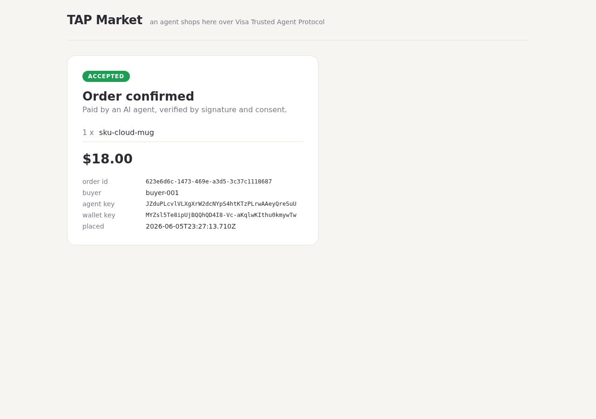

# agent-buyer-tap

A local playground for Visa's **Trusted Agent Protocol (TAP)** on top of **RFC 9421 HTTP Message Signatures**.

An AI buyer agent navigates a real React 19 storefront with Playwright, lets **OpenAI** pick what to buy, then pays over a **cryptographically signed handshake** instead of a scraped checkout form. The merchant decides whether to trust the agent by resolving its public key from a mock Visa key directory and verifying two things: that the request was really signed by that agent, and that a human's **consent** to spend was signed by a separate wallet key.

Everything runs locally as three podman services.

## Two halves, one flow

The POC deliberately keeps two different worlds side by side:

- **Discovery is human-shaped.** The agent opens the same storefront a person would and reads the product cards with a real browser (Playwright). An LLM looks at what it found and decides what to buy. Nothing about this part is privileged — it is just an agent reading a web page.
- **Payment is machine-trusted.** When it is time to pay, the agent does *not* fill in a card form. It sends a signed HTTP request that proves who the agent is and that the buyer consented. The merchant verifies the cryptography before it accepts anything.

The agent's private keys live in the buyer service and never reach the browser, which is exactly how trusted agentic payments are meant to work.

## Architecture



The diagram above is the whole system on one page. Reading it left to right:

- **Buyer Agent** (blue) holds two private keys. It uses Playwright to *navigate* the storefront and OpenAI to *choose*. The **agent key** signs the HTTP request; the **wallet key** signs the consent claim. The thin top arrow (`navigates`) is the ordinary browser traffic to the UI. The **thick solid arrow** is the trusted path — the signed browse and the signed `purchase + consent`.
- **Merchant** (green) serves the React storefront *and* the signed API (`/api/catalog`, `/api/purchase`, `/api/orders`). It verifies every signed request against RFC 9421, checks the consent, and guards against replays before it records an order.
- **Visa Key Directory** (pink) is the trust root. It publishes the agent and wallet **public** keys at `/.well-known/jwks.json`. The merchant resolves keys from it by thumbprint (the `resolve keys` arrow) and gets the public keys back (the dashed `public keys` arrow).

## How the Trusted Agent Protocol works

The problem TAP solves: when an AI agent shows up at a merchant, the merchant has no idea **who** the agent is or whether the **human actually agreed** to the purchase. A username and password would just get shared around; a card number alone proves nothing about consent. TAP answers both questions with public-key cryptography over plain HTTP, reusing existing web standards.

It rests on a few moving parts.

**1. Identity is a key in a directory.** Each actor owns an Ed25519 key pair. The public keys are published in a directory the merchant can fetch — here, a JWKS document at `/.well-known/jwks.json`. An actor is named by the **thumbprint** of its key (RFC 7638): a SHA-256 hash of the key's canonical JSON. The thumbprint is the `keyid`. There is nothing to leak — the merchant only ever sees public keys.

**2. The request is signed, not just sent (RFC 9421).** HTTP Message Signatures define a deterministic **signature base**: a short text block listing exactly which parts of the request are covered — the method, the path, the host, and a digest of the body — followed by the signature parameters. The agent signs that text with its private key. Two headers carry the result:

```
Content-Digest: sha-256=:<sha256 of the body>:
Signature-Input: sig1=("@method" "@path" "@authority" "content-digest");created=...;keyid="<agent thumbprint>";nonce="<random>";tag="visa-tap";alg="ed25519"
Signature:       sig1=:<ed25519 signature bytes>:
```

The verifier rebuilds the *same* signature base from the request it received and checks the bytes against the public key named by `keyid`. If anything was changed in transit — a different amount, a different path — the rebuilt base no longer matches and the signature fails.

**3. The parameters stop abuse.** `created` is a timestamp, so the merchant can reject anything outside a short window. `nonce` is a random per-request token the merchant remembers, so a captured request cannot be replayed. `tag` marks the request as a TAP request (`visa-tap`). `content-digest` binds the exact bytes of the body, so the items and amount cannot be swapped after signing.

**4. Consent is a separate signature (the mandate).** Proving the agent is genuine is not enough — the merchant also wants proof the **buyer** agreed to spend. That is a second, independent signature: a compact JWS (a JWT) signed by the buyer's **wallet key**, carried in a `Consent-Claim` header. It states the audience (which merchant), the items, the amount, an expiry, and a unique id. Crucially the wallet key is *different* from the agent key — the consumer authorizes the spend, the agent merely carries and signs the request. The merchant resolves the wallet key from the same directory and verifies it too.

**5. The merchant only accepts when everything lines up.** Valid agent signature, fresh and unseen request, untampered body, valid wallet-signed consent, consent addressed to this merchant, not expired, not already spent, and an amount that matches both the body and the merchant's own catalog price.

## How this POC works

A full run goes like this:

1. **`key-directory` boots.** On first start it generates two Ed25519 key pairs — one for the agent, one for the wallet — writes the private halves into a shared volume and publishes both public keys at `http://key-directory:8801/.well-known/jwks.json`.
2. **`merchant` boots.** It fetches the JWKS, builds a map of `thumbprint → public key`, loads its product catalog, and starts serving both the React storefront and the signed API on port 8802.
3. **`buyer-agent` boots.** It waits for the keys and for the merchant to be healthy, then loads the two private keys.
4. **The agent opens the storefront** in a real Chromium browser via Playwright and reads the product cards (this is the first screenshot below).
5. **Signed browse.** It sends a `GET /api/catalog` request signed with the agent key. The merchant verifies the signature and returns the catalog with an `x-trusted-agent` header echoing the agent's thumbprint — the merchant now knows a recognized agent is browsing.
6. **OpenAI chooses.** The agent hands the product list to OpenAI, which replies with one `sku` to buy. (With no API key set, the agent falls back to a deterministic pick so the protocol path still runs.)
7. **Mint consent + sign + pay.** The agent mints a consent claim signed by the **wallet** key, builds the purchase body, signs the `POST /api/purchase` request with the **agent** key (including the body digest), attaches the consent, and sends it.
8. **The merchant verifies** the request signature, the consent signature, the freshness/replay guards, the body digest, and that the amount matches the catalog — then records the order and returns an order id.
9. **The agent navigates to the confirmation page** for that order (the second screenshot below), where the storefront shows the accepted order and the two key thumbprints that authorized it.

## What the agent sees

When the agent opens the storefront, it sees the catalog the merchant serves — six products, each a card with a name, price and stock. This is rendered by the React 19 app and captured by the agent's own browser during the run:



The header line — *"an agent shops here over Visa Trusted Agent Protocol"* — is the only hint that the buyer is not human. The agent reads these cards (each carries the `sku` and price as data attributes) and that list is what OpenAI uses to choose.

After the signed purchase is accepted, the agent navigates to the order confirmation page for the order it just placed:



This page is the visible proof that the handshake worked. The green **ACCEPTED** badge means the merchant verified the request signature *and* the wallet-signed consent. Below the total it shows the **order id**, the **buyer**, and — most importantly — the two distinct thumbprints that authorized the payment: the **agent key** (which signed the request) and the **wallet key** (which signed the consent). Those being two different keys is the whole point: the agent that acted and the wallet that consented are separate identities.

## Run it

The agent's product choice uses OpenAI. Export your key in the terminal before running — it is never stored in the repo:

```bash
export OPENAI_API_KEY=sk-...
./start.sh                          # builds + starts key-directory + merchant
podman-compose run --rm buyer-agent # the agent shops and pays once
./stop.sh
```

`./test.sh` runs the whole thing non-interactively: the crypto self-test, the stack, and one agent purchase.

Open `http://localhost:8802` yourself to browse the same storefront the agent uses.

test.sh
```
PASS valid signed purchase verifies
PASS replayed nonce rejected
PASS tampered body rejected
PASS unknown keyid rejected
PASS consent verifies with wallet key
PASS forged consent rejected
PASS agent and wallet kids differ
ALL PASS
Successfully tagged localhost/agent-buyer-tap_merchant:latest
a37ce4fb4dec8e7d0dbe94a0d3497aa876912b5be78ea6b19de95636e3e8ca33
agent-buyer-tap_key-directory_1
agent-buyer-tap_merchant_1
agent-buyer-tap_merchant_1
agent-buyer-tap_key-directory_1
d58af93406dde30bc260e847fda070346a0ada6aa785d3e7506266bf9fbc300d
10ec7bd7ed0f18902c315d7716b365a1935b1985773d9b5faec960ebb701a8e6
agent-buyer-tap_key-directory_1
agent-buyer-tap_merchant_1
Successfully tagged localhost/agent-buyer-tap_buyer-agent:latest
5f8620600e14a146c5e344e8a9e532a4786ad00d33025ef34d42338a67b147dc
navigated storefront, saw 6 products
signed browse ok, trusted-agent header: JZduPLcvlVLXgXrW2dcNYpS4htKTzPLrwAAeyQreSuU
OpenAI (gpt-4o-mini) chose sku-cloud-mug
buying 1 x Cloud Ceramic Mug for 1800 USD
PURCHASE ACCEPTED orderId=623e6d6c-1473-469e-a3d5-3c37c1118687
E2E OK
```

## Faithful vs mocked

| Aspect | Status |
|--------|--------|
| Ed25519 signing + verification | faithful |
| RFC 9421 signature base reconstruction | faithful |
| `keyid` = RFC 7638 JWK thumbprint, JWKS resolution | faithful |
| Replay protection (nonce + `created` window) | faithful |
| Body integrity via `Content-Digest` | faithful |
| Consent claim (wallet-signed JWS) + validation | faithful in shape |
| Wallet key distinct from agent key | faithful (separate directory identity) |
| Visa directory authority / consent trust root | mocked locally |
| Card rails / settlement | out of scope |

## Verified

Crypto core (`node shared/selftest.mjs`):

```
PASS valid signed purchase verifies
PASS replayed nonce rejected
PASS tampered body rejected
PASS unknown keyid rejected
PASS consent verifies with wallet key
PASS forged consent rejected
PASS agent and wallet kids differ
ALL PASS
```

End-to-end in podman (`podman-compose run --rm buyer-agent`):

```
navigated storefront, saw 6 products
signed browse ok, trusted-agent header: JZduPLcvlVLXgXrW2dcNYpS4htKTzPLrwAAeyQreSuU
buying 1 x Aurora Desk Lamp for 4200 USD
PURCHASE ACCEPTED orderId=c379dc8a-907d-43fc-bb26-9859711b140f
```

## Layout

```
agent-buyer-tap/
  design-doc.md
  podman-compose.yml
  start.sh  stop.sh  test.sh
  shared/        rfc9421.mjs, jwk.mjs, consent.mjs, selftest.mjs
  key-directory/ Containerfile, server.mjs
  merchant/      Containerfile, server.mjs, catalog.json
  storefront/    React 19 + Vite + TanStack + TS 6
  buyer-agent/   Containerfile, agent.mjs
  printscreens/  architecture + storefront + confirmation
```

## Stack

React 19, Vite 8, TanStack Router + Query, TypeScript 6 (storefront); Node 24 plain ESM with only `node:crypto` and `node:http` (the three backend services); Playwright + OpenAI (buyer-agent); podman-compose.
