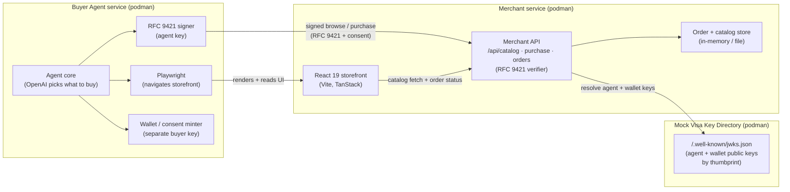
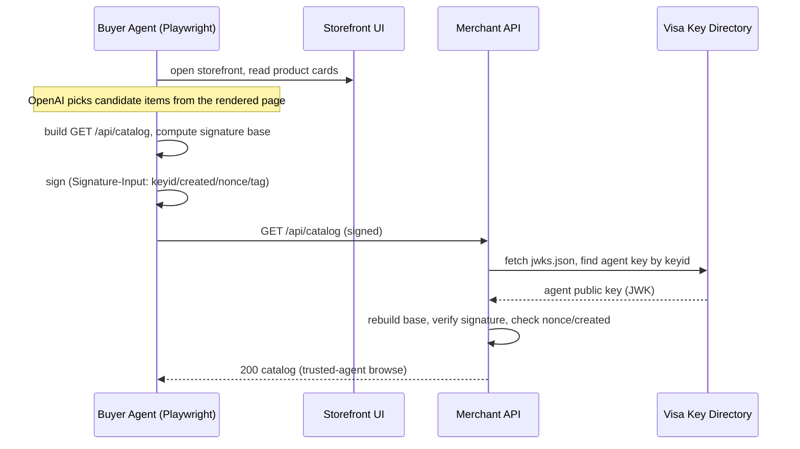
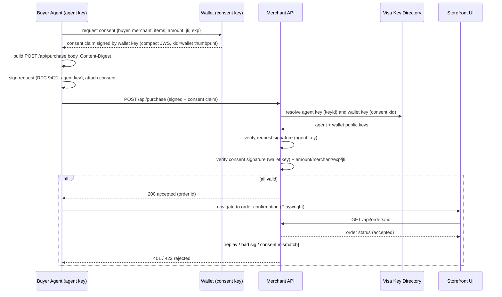

# agent-buyer-tap — Design Doc

## Summary

A local playground for Visa's **Trusted Agent Protocol (TAP)** built on **RFC 9421 HTTP Message Signatures**.

An AI buyer agent **navigates a real React storefront with Playwright** to discover products, lets **OpenAI choose what to buy**, then pays through a **cryptographically signed TAP handshake** instead of a scraped checkout form. The merchant trusts the agent by resolving its public key from a **mock Visa key directory** (`/.well-known` JWKS) and verifying both the request signature and an embedded **consent claim signed by a separate wallet key**.

Two honest halves, one flow:

- **Discovery** is human-shaped: the agent reads the storefront the way a person would (Playwright over the rendered UI), and OpenAI decides.
- **Payment** is machine-trusted: a signed RFC 9421 request carrying wallet-signed consent, verified against published keys.

The private keys stay server-side in the buyer service and never enter the browser.

## Goals

- A **faithful** TAP handshake: real Ed25519 signatures, real `Signature-Input` parameters (`keyid` / `created` / `nonce` / `tag` / `alg`), real signature base reconstruction, real JWKS resolution.
- Three podman services that talk over HTTP: **buyer agent**, **merchant**, **mock Visa key directory**.
- A real **React 19 storefront** the agent shops on via Playwright, with an order confirmation the agent navigates to.
- An embedded **consent claim** ("mandate") signed by a **wallet key** distinct from the agent key, validated by the merchant.
- `browse` returns a catalog; `purchase` is accepted only when request signature + consent verify.
- Fully local, run with `podman-compose`, with `start.sh` / `stop.sh` / `test.sh`.

## Non-Goals

- No real Visa network, no real card rails, no settlement. The "Visa" directory is a local stand-in.
- No real consumer issuer. The wallet key models a separate consumer identity, but its trust root is local.
- No production key management, HSM, or rotation orchestration (a single static key pair per identity is enough here).
- No payment capture beyond an "accepted" merchant response and an order record.

## Background

### RFC 9421 — HTTP Message Signatures

A request is signed over a **signature base**: a deterministic, line-by-line serialization of chosen message components (method, path, authority, selected headers) plus the signature parameters. Two headers carry the result:

```
Content-Digest: sha-256=:<base64 of body hash>:
Signature-Input: sig1=("@method" "@path" "@authority" "content-digest");created=1700000000;keyid="<jwk-thumbprint>";nonce="<random>";tag="visa-tap";alg="ed25519"
Signature: sig1=:<base64 signature>:
```

The verifier rebuilds the exact signature base from the received message and the `Signature-Input` parameters, then checks the bytes against the public key named by `keyid`.

### Visa Trusted Agent Protocol (TAP)

TAP lets a merchant **recognize and trust an AI agent** acting for a buyer, reusing web standards rather than inventing transport. The shape we model:

- The agent owns a key pair; its public key is published in a directory the merchant can reach.
- `keyid` is the **JWK thumbprint** (RFC 7638) of that key.
- The agent signs each request (RFC 9421) and stamps it with a TAP `tag`.
- The request embeds a **consent claim** — a statement, signed by the buyer's **wallet key**, that a buyer authorized this spend (amount, currency, merchant, items).
- The merchant resolves both keys, verifies the request signature, validates consent, and only then serves catalog (`browse`) or accepts (`purchase`).

This pattern mirrors the **Web Bot Auth** direction (signed bot requests + a `/.well-known` key directory); TAP layers buyer consent on top.

## Architecture



Three services, as requested. The storefront UI is served by the **merchant** service (it is the merchant's site), keeping the service count at three. The Playwright runtime and both private keys live inside the **buyer** service.

### Flow — browse (discovery)



### Flow — purchase (trusted payment)



## The handshake in detail

### Keys and identity

Two distinct identities, both published in the directory (agent ≠ consumer):

- **Agent key** — signs the RFC 9421 request. `keyid` = its RFC 7638 JWK thumbprint.
- **Wallet key** — signs the consent claim. The consent JWS `kid` = its thumbprint.
- Algorithm: **Ed25519** (`alg="ed25519"`) for both.
- The directory serves both public keys in a JWK Set at `/.well-known/jwks.json`; the merchant selects each JWK by matching thumbprint.

### Signed components

For `purchase`: `("@method" "@path" "@authority" "content-digest")`. Binding `content-digest` makes the body tamper-evident. For `browse` (no body): `("@method" "@path" "@authority")`.

### Signature parameters

| Param | Meaning | Merchant check |
|-------|---------|----------------|
| `created` | Unix seconds when signed | Within an acceptance window (e.g. ±60s) |
| `nonce` | Random per-request token | Unseen before → reject replays |
| `keyid` | Agent JWK thumbprint | Must resolve in the directory |
| `tag` | `visa-tap` | Must equal the expected TAP tag |
| `alg` | `ed25519` | Must match the resolved key type |

### Consent claim (the mandate)

A compact JWS **signed by the wallet key** (not the agent key), carried in a `Consent-Claim` request header. Its `kid` is the wallet thumbprint, which the merchant resolves from the same directory. Payload shape:

```json
{
  "iss": "wallet.local",
  "sub": "buyer-001",
  "aud": "merchant.local",
  "items": [{ "sku": "sku-42", "qty": 1 }],
  "amount": 1299,
  "currency": "USD",
  "iat": 1700000000,
  "exp": 1700000300,
  "jti": "<uuid>"
}
```

The merchant validates: consent signature against the wallet key, `aud` is this merchant, `amount`/`items` match the purchase body, `exp` not passed, and `jti` not previously spent. Separating the wallet key from the agent key models the real split — the consumer's wallet authorizes the spend, the agent only transports and signs the request. In real TAP this root lives at the buyer's issuer/wallet; here a local wallet identity stands in for that root.

## Components

### 1. Mock Visa Key Directory

- Serves a static JWK Set at `/.well-known/jwks.json` holding **two** public keys: the agent key and the wallet key.
- Key pairs generated by this service at startup into a shared volume; private halves are read by the buyer service.
- Smallest possible HTTP service.

### 2. Merchant

- Serves the React storefront (static build) and the merchant API.
- `GET /api/catalog` — products; accepts a signed TAP browse, also serves the UI's plain fetch.
- `POST /api/purchase` — verifies RFC 9421 signature + consent, records an order, returns accepted/rejected.
- `GET /api/orders/:id` — order status, read by the storefront's confirmation page.
- Verifier: resolves the agent `keyid` and the consent `kid` → JWKs from the directory, rebuilds the signature base, checks both Ed25519 signatures, enforces `created` window, `nonce` freshness, `tag`, and consent integrity.
- Store: in-memory or flat file (catalog + orders + spent nonces/jti).

### 3. Buyer Agent

- Agent core uses **OpenAI** to choose which products to buy from what it discovered on the storefront (OpenAI SDK; `OPENAI_API_KEY` read from env, exported in the shell at run time — never stored in the repo).
- Playwright navigates the storefront UI to discover products, read prices, and afterward open the order confirmation page.
- Holds the **agent key** (signs requests) and the **wallet key** (signs consent); computes signature bases and `Content-Digest`.
- Drives the flow: navigate → OpenAI selects → signed `browse` → mint consent → signed `purchase` → navigate to confirmation.

## Data model

```
Product   { sku, name, priceCents, currency, stock }
Catalog   Product[]
Consent   compact JWS (wallet-signed) over the mandate payload above
Order     { id, buyer, items, amountCents, status, createdAt }
```

## Tech stack

| Concern | Choice |
|---------|--------|
| Storefront | React 19, Vite, TanStack (Router + Query), TypeScript 6.x |
| Backend services | Node.js 24, plain ESM (`node:crypto`, `node:http`) |
| Crypto | Node `crypto` (Ed25519, SHA-256) — no heavy crypto libs |
| Browser automation | Playwright |
| Agent selection | OpenAI via OpenAI SDK (`OPENAI_API_KEY` from env) |
| Packaging | Containerfile per service, `podman-compose` |
| Orchestration scripts | `start.sh`, `stop.sh`, `test.sh` |

Libraries kept to a minimum: signing, digesting, and thumbprints are doable with the Node standard library. Web framework only if a hand-rolled `http` server gets noisy.

## Proposed layout

```
agent-buyer-tap/
  design-doc.md
  podman-compose.yml
  start.sh
  stop.sh
  test.sh
  key-directory/        Containerfile, jwks service (agent + wallet keys)
  merchant/             Containerfile, API + RFC 9421 verifier
  storefront/           React 19 + Vite + TanStack (built, served by merchant)
  buyer-agent/          Containerfile, agent core + OpenAI + Playwright + signer + wallet
  shared/               signature-base, thumbprint, consent helpers
```

## Local run model

- `OPENAI_API_KEY` is exported in the shell before `start.sh`; `podman-compose` passes it into the buyer-agent service as an environment variable. It is never written to a file in the repo.
- `start.sh` brings up the three services with `podman-compose` and waits on each health endpoint with a 1-second poll loop (no fixed sleeps).
- `test.sh` runs the end-to-end path: agent navigates the storefront, OpenAI selects, performs a signed browse, mints wallet-signed consent, performs a signed purchase, asserts the merchant accepted it, and confirms the order page shows it — plus two negative paths (tampered body, replayed nonce) that assert rejection.
- `stop.sh` tears the stack down.

## Security considerations (faithful vs mocked)

| Aspect | Status |
|--------|--------|
| Ed25519 signing + verification | Faithful |
| Signature base reconstruction (RFC 9421) | Faithful |
| `keyid` = JWK thumbprint, JWKS resolution | Faithful |
| Replay protection (nonce + `created` window) | Faithful |
| Body integrity via `Content-Digest` | Faithful |
| Consent claim structure + validation | Faithful in shape |
| Wallet key distinct from agent key | Faithful (separate directory identity) |
| Consent trust root authority | Mocked locally |
| Visa key directory authority | Mocked locally |
| Card rails / settlement | Out of scope |

## Resolved decisions

1. **Consent signer** — a **separate wallet key**, distinct from the agent key (agent ≠ consumer). Both keys live in the directory.
2. **Well-known path** — simple `/.well-known/jwks.json`.
3. **Agent intelligence** — **OpenAI-driven** product selection from the start (OpenAI SDK; `OPENAI_API_KEY` exported in the shell at run time).
4. **Order visibility** — the storefront UI reflects the agent's order; the agent navigates to a confirmation page backed by `GET /api/orders/:id`.
5. **Negative paths** — tampered body and replayed nonce only; no expired-consent or unknown-`keyid` cases.

## Out of scope / future

- Multiple competing agents and merchant agent-reputation policies.
- Key rotation and directory caching with TTLs.
- An Excalidraw-style hand-drawn architecture diagram and Playwright print-screens for the eventual `README.md`.
