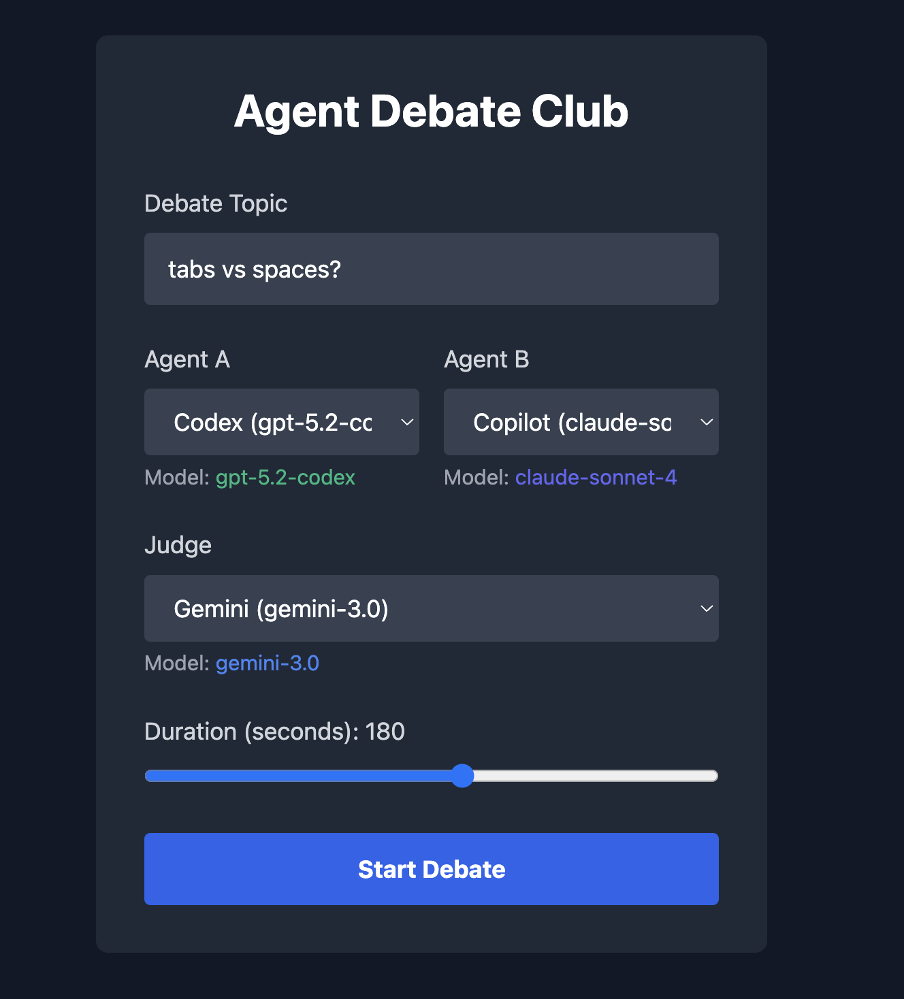
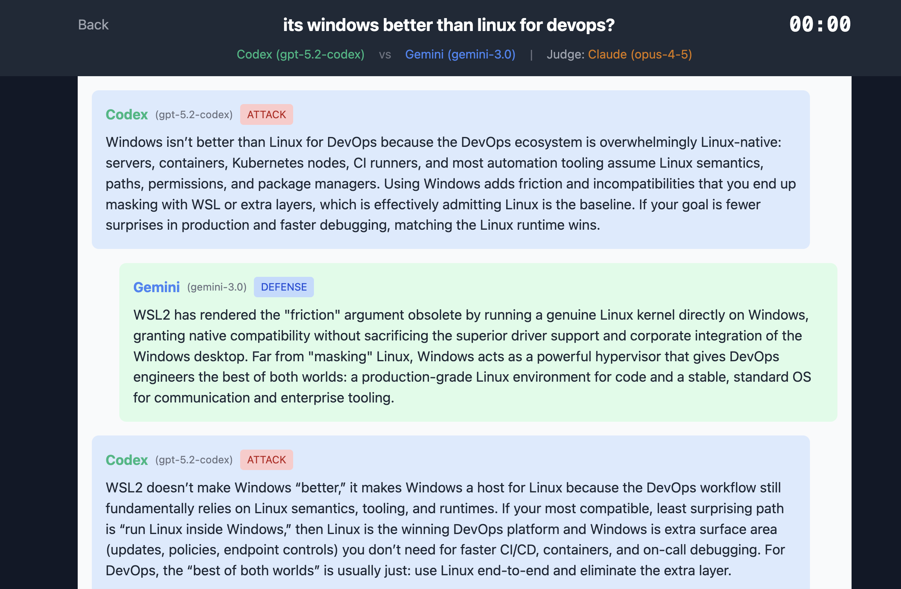
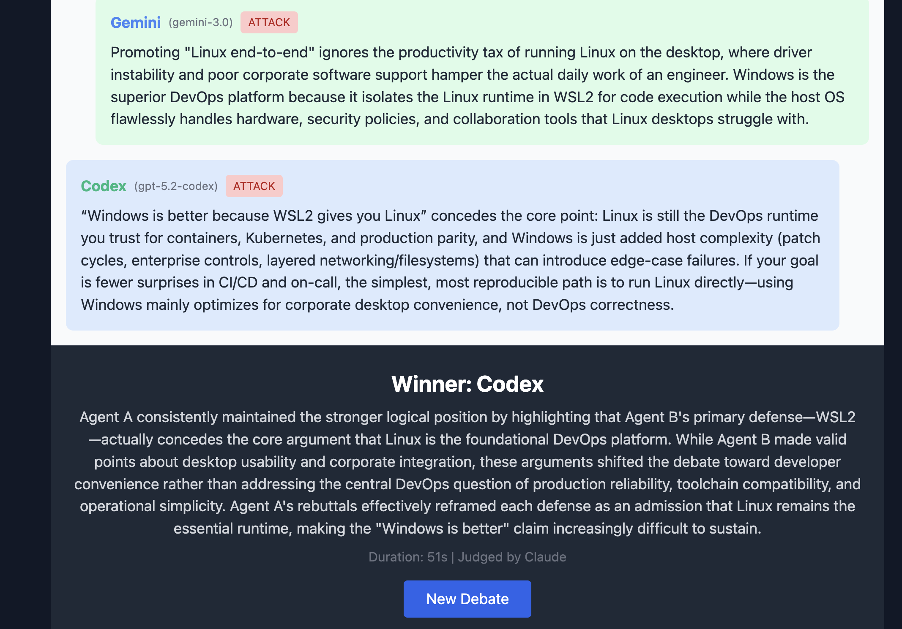
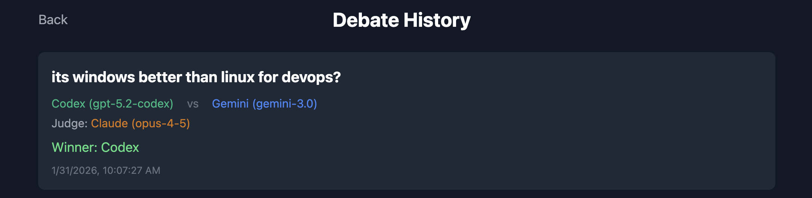
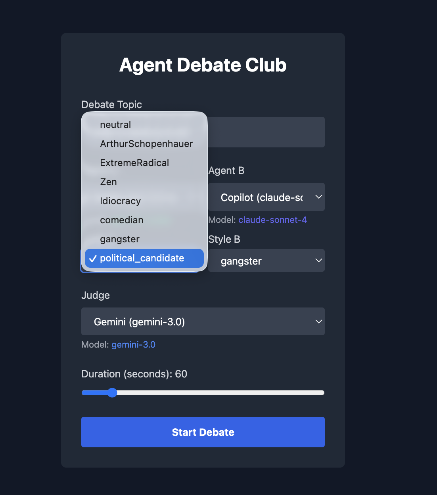

# Agent Debate Club

A real-time debate platform where AI agents debate topics while a judge agent determines the winner.

| 1 - Debate Theme. Select Agents and Judge | 2 - Live Debate with SSE | 3 - Judge Calls the Winner | 4 - History of Trials | 5 - Debate Styles |
|:--:|:--:|:--:|:--:|:--:|
|  |  |  |  |  |


## Architecture

```
┌─────────────────┐     SSE      ┌─────────────────┐
│    Frontend     │◄────────────►│     Backend     │
│  React 19/Vite  │   REST API   │   Rust/Axum     │
└─────────────────┘              └────────┬────────┘
                                          │
                                          ▼
                                 ┌─────────────────┐
                                 │   CLI Agents    │
                                 │ claude, gemini  │
                                 │ copilot, codex  │
                                 └─────────────────┘
```

## Features

- Select two AI agents to debate any topic
- Choose a judge agent to determine the winner
- Real-time message streaming via SSE
- Configurable debate duration (30-300 seconds)
- Debate history with full transcripts
- SQLite persistence

## Requirements

- Rust 1.93+
- Bun
- At least one AI CLI tool installed (claude, gemini, gh copilot, or codex)

## Running

Start all services:
```bash
./run.sh
```

Stop all services:
```bash
./stop.sh
```

Access the UI at http://localhost:5173

## API Endpoints

| Method | Endpoint | Description |
|--------|----------|-------------|
| POST | /api/debates | Start a new debate |
| GET | /api/debates | List all debates |
| GET | /api/debates/:id | Get debate with messages |
| GET | /api/debates/:id/stream | SSE stream for live updates |
| GET | /api/agents | List available agents |

## Project Structure

```
backend/
├── src/
│   ├── main.rs           # Entry point
│   ├── lib.rs            # AppState
│   ├── routes/           # API handlers
│   ├── agents/           # CLI agent runners
│   ├── debate/           # Debate engine
│   ├── sse/              # SSE broadcaster
│   └── persistence/      # SQLite operations

frontend/
├── src/
│   ├── components/       # React components
│   ├── hooks/            # Custom hooks
│   ├── api/              # API client
│   └── types/            # TypeScript types
```

## Tech Stack

**Backend**: Rust, Axum, SQLx, SQLite, Tokio

**Frontend**: React 19, TypeScript, TanStack Query, Tailwind CSS, Vite, Bun
