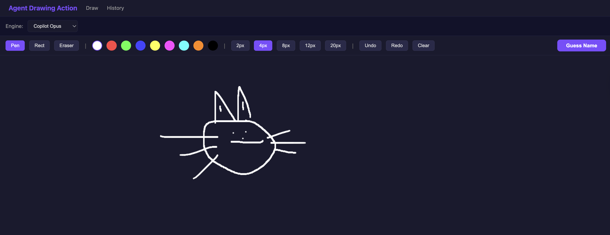
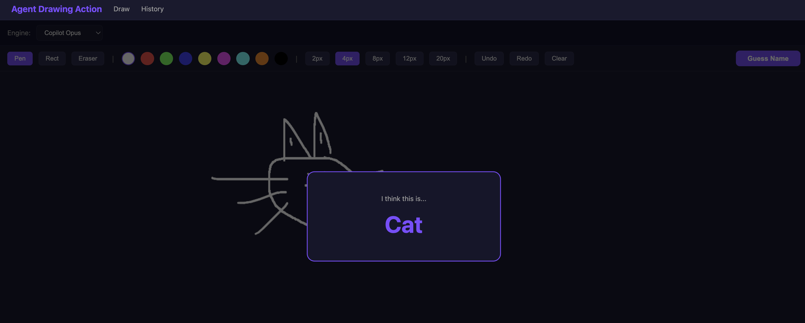
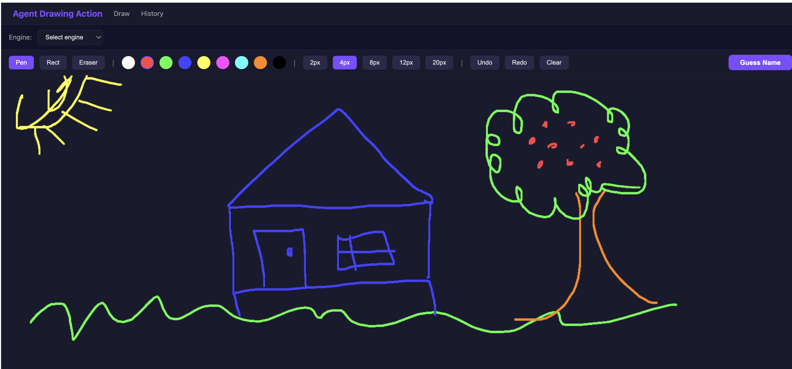
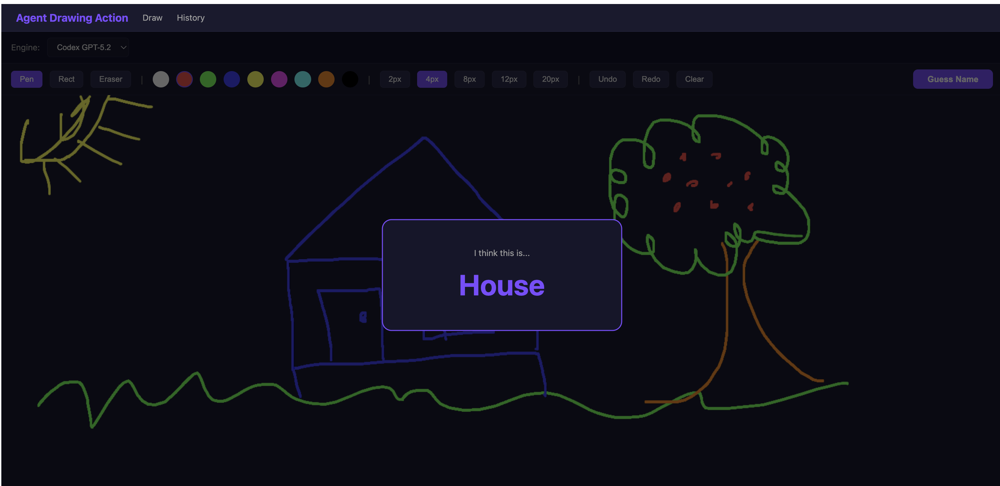
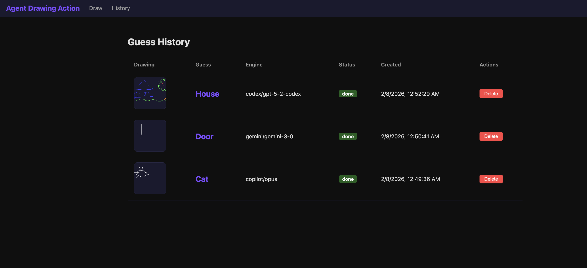
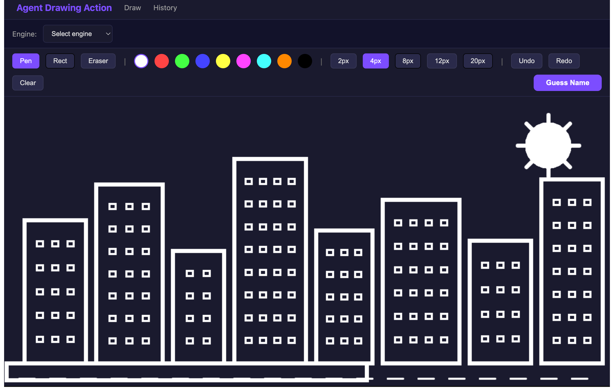

# Agent Drawing Action

A full-stack app where the user draws on an HTML5 canvas and an LLM agent guesses what the drawing is in 1-2 words. Supports multiple LLM engines (Claude, Codex, Gemini, Copilot) via CLI subprocess spawning.

### Tech Stack

- **Frontend**: React 19, TanStack Router + Query, Vite, Bun, TypeScript
- **Backend**: Rust, Tokio, Actix-Web, SQLite (sqlx)
- **Agents**: CLI subprocesses (claude, codex, gemini, copilot)

### How to Run

```bash
./run.sh
```
Open http://localhost:5173

### How to Stop

```bash
./stop.sh
```

### Screenshots

| Screenshot | Description |
|---|---|
|  | Drawing screen - user drew a cat using the pen tool with Copilot Opus engine selected |
|  | Guess result - the LLM agent correctly guessed "Cat" from the freehand drawing |
|  | Drawing screen - colorful house scene with sun, tree, and grass using multiple colors |
|  | Guess result - the Codex GPT-5.2 engine correctly guessed "House" from the drawing |
|  | History screen - shows all past guesses with drawing thumbnails, LLM predictions, engines, and timestamps |

### Experiment

I have Playwright MCP on my claude code and asked him to use this website and using the MCP to draw a city, and he was able to do it.

