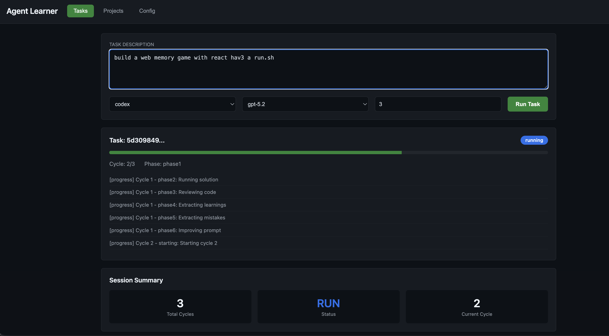
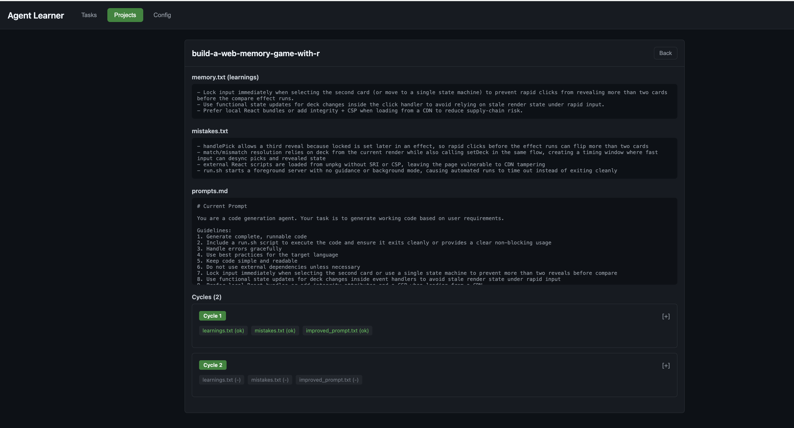
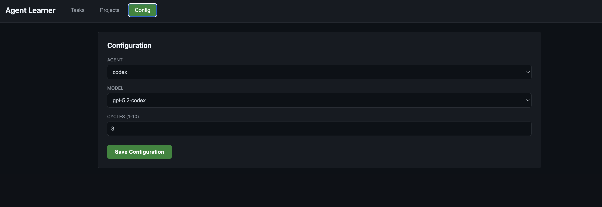

# Rationale

What I'm trying to do in this POC?

0. I want build more complex systems, to see where the AI will break and what are the limits, clerly architecture and security are not `AI Fortes`. However can we take the best out of LLMs? 
1. I want experience with advanced agents. This is not an agent that learn, perhaps it's a agent that build the software with learnings and try to extract and store such learnings into better prompts.
2. I did not like the idea of Ralph loops, IMHO is a bit Dumb, so I want a more intelectual loop so consider this a "Lisa Loop".
3. Raplh just run the sample prompt over and over, I'm tryimng to (be lisa) and think about, I give prompts to ask the LLM to think about learnings, mistakes and improve the prompt in every loop not just run the same thing therefore is a lisa not a ralph.
4. The problem here is this sucks LLM calls and tokens like crazy because: 
```
Each learning cycle makes 5 LLM API calls:

1. Generate code - calls agent
2. Review code - calls agent
3. Extract learnings - calls agent
4. Extract mistakes - calls agent
5. Improve prompt - calls agent

With 3 cycles = 15 total API calls. Each call can take 10-60+ seconds.
```
5. This is multi-agent and multi-model via CLI transformed into API calls.
6. There is a REPL and a UI mode. 
7. I'm not happy with the results but it works...
8. If you want learn more read the [design-doc.md](design-doc.md)
9. Learnigs by side effect might be:
* What are common mistakes LLM makes we can can transform in prompt instructions or even into tests?
* What are common learnings we can add to the prompt to improve results? Might give us clues to better prompt engineering.
* How different agents and models perform in this iterative learning process?
* How effective is code review by LLM in identifying issues and improving code quality?

# Agent Learner Prompt

A self-learning CLI agent that iteratively improves its prompts based on execution results. Runs 3 learning cycles per task with code review. Supports multiple agents: claude, codex, copilot, gemini.

1. Type your prompt and see progress... <br/>
 <br/>

2. See the learnings and improvet prompts ... <br/>
 <br/>

3. Config (change agent, model, cycles) ... <br/>
 <br/>

There is a REPL as well:
```
❯ ./run.sh
Agent Learner - Self Learning Code Generation Agent

Usage: agent-learner [OPTIONS] [TASK]

Arguments:
  [TASK]                  The task description for code generation
                          If not provided, enters REPL mode

Options:
  --agent <AGENT>, -a     CLI agent to use (claude, codex, copilot, gemini)
  --model <MODEL>, -m     Model to use for the agent
  --cycles <N>, -c        Number of learning cycles (default: 3)
  --repl                  Enter interactive REPL mode
  --ui                    Start web UI mode
  --port <PORT>           Web UI port (default: 3000)
  --help                  Show this help message

Supported Agents:
  claude   - Claude CLI (default)
  codex    - OpenAI Codex CLI
  copilot  - GitHub Copilot CLI
  gemini   - Google Gemini CLI

REPL Commands:
  :quit, :q               Exit the REPL
  :agent <NAME>           Switch agent (claude, codex, copilot, gemini)
  :model <NAME>           Switch model
  :cycles <N>             Set number of cycles (e.g. :cycles 5)
  :memory, :m             Show current learnings
  :mistakes               Show current mistakes
  :prompts, :p            Show prompt history
  :help, :h               Show REPL help

Agent Learner REPL - Interactive Mode
Type :help for commands, or enter a task to start learning
Agent: claude | Model: sonnet | Cycles: 3

agent>
```

## Features

- Multi-agent support (claude, codex, copilot, gemini)
- Easy agent/model switching via flags
- Per-project learning files (memory.txt, mistakes.txt, prompts.md)
- Maintains prompt version history (updated every cycle)
- Code review: architecture, design, security, tests
- Filters generic learnings, keeps specific ones
- 10s timeout for solution runs (web servers OK)
- Final code copied to code/ folder
- Interactive REPL mode

## Build

```bash
./build-all.sh
```

## Usage

Single task mode:
```bash
./run.sh "Create a hello world web server in Python"
./run.sh --agent claude --model opus "Build a REST API"
./run.sh --agent codex --model gpt-5.2 "Create CLI tool"
./run.sh --agent copilot "Use copilot agent"
./run.sh --agent gemini "Use gemini agent"
./run.sh --cycles 5 "Build a REST API"
```

Interactive REPL mode:
```bash
./run.sh --repl
./run.sh              # Also enters REPL if no task provided
```

## Supported Agents

| Agent | Default Model | CLI Command |
|-------|---------------|-------------|
| claude | sonnet | `claude -p <prompt> --model <model>` |
| codex | gpt-5.2 | `codex exec --full-auto --model <model>` |
| copilot | claude-sonnet-4 | `copilot --allow-all --model <model> -p` |
| gemini | gemini-2.5-pro | `gemini -y <prompt>` |

## REPL Commands

```
agent> :help           # Show help
agent> :agent claude   # Switch to claude agent
agent> :agent codex    # Switch to codex agent
agent> :model opus     # Switch model
agent> :cycles 5       # Set cycles to 5
agent> :memory         # Show learnings
agent> :mistakes       # Show mistakes to avoid
agent> :prompts        # Show prompt history
agent> :clear          # Clear screen
agent> :quit           # Exit REPL
agent> Create a web server   # Start learning session
```

## Learning Cycle Phases

Each cycle has 6 phases:

```
Phase 1: Execute agent to generate code
Phase 2: Run solution with 10s timeout
Phase 3: Review code for architecture, design, security, tests
Phase 4: Extract learnings from cycle (LLM)
Phase 5: Extract mistakes to avoid (LLM)
Phase 6: Improve prompt for next cycle (LLM)
```

## Project Structure

Each task creates a project folder:
```
solutions/{project}/
├── memory.txt       # Learnings accumulated
├── mistakes.txt     # Mistakes to avoid
├── prompts.md       # Prompt versions (updated every cycle)
├── cycle-1/         # First cycle output
├── cycle-2/         # Second cycle output
├── cycle-3/         # Third cycle output
└── code/            # Final production code
```

## Cycle Report

```
============================================================
CYCLE 1 REPORT
============================================================
Status: SUCCESS

Review findings:
  Architecture: OK
  Design: OK
  Code Quality: OK
  Security: Issues found
  Tests: Issues found

Learnings acquired this cycle:
  + Architecture passed review - structure is appropriate

Mistakes identified this cycle:
  - Security issue: Hardcoded API key in config.js

Prompt was improved and archived for next cycle
============================================================
```

## Stop

```bash
./stop.sh
```

## Test

```bash
./test.sh
```

## Scripts

- `build-all.sh` - Build the project
- `run.sh` - Execute agent with task or enter REPL
- `stop.sh` - Stop running agents
- `test.sh` - Run tests

## Files

- `solutions/` - Generated projects with per-project learning files
- `design-doc.md` - Architecture and design decisions
- `todo.txt` - Project task tracking
