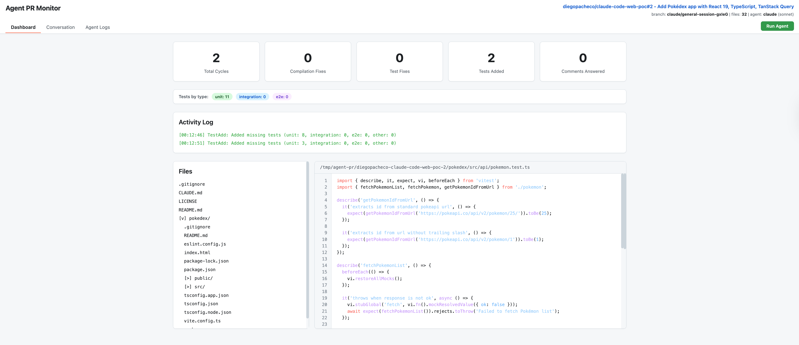
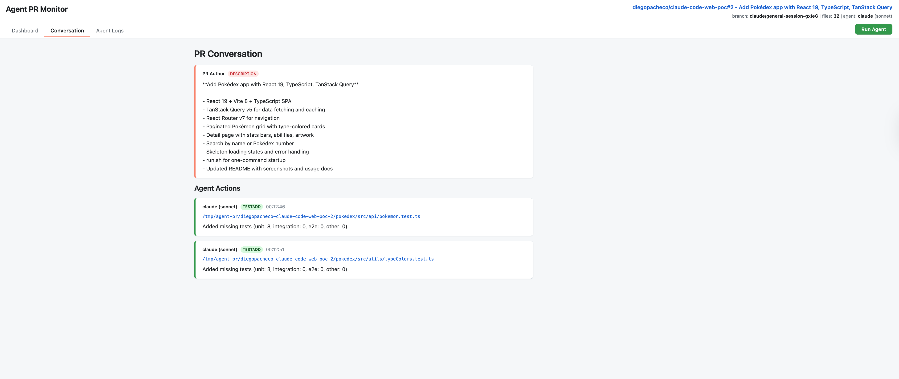
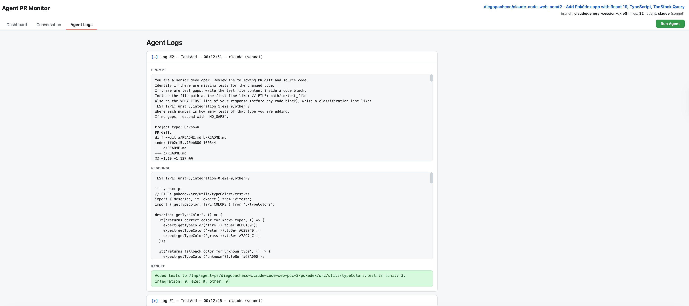

# Agent PR Monitor

A Rust CLI tool that monitors GitHub Pull Requests using LLM agents. It clones a PR, watches it on a configurable interval, and automatically fixes compilation errors, adds missing tests, resolves merge conflicts, and answers PR review comments.

Supports multiple LLM backends via CLI subprocess: `claude`, `gemini`, `copilot`, `codex`.

## Features

* Automatic compilation error detection and fixing (up to 10 retries)
* Test failure detection and fixing
* Missing test gap analysis with classification (unit, integration, e2e)
* Merge conflict resolution
* PR comment answering
* Real-time web dashboard with SSE updates
* Dry-run mode for safe local-only operation

## Usage

```bash
cargo run -- --llm claude --model sonnet --refresh 5m --ui --port 3000 <PR_URL>
```

### CLI Flags

| Flag | Description |
|------|-------------|
| `--llm` | LLM backend: claude, gemini, copilot, codex |
| `--model` | Model name (e.g. sonnet, opus, o3) |
| `--refresh` | Check interval: 1s, 30s, 1m, 5m |
| `--ui` | Enable web dashboard |
| `--port` | Dashboard port (default 3000) |
| `--dry-run` | Run locally without pushing to GitHub |

### Dry-run Mode

```bash
./run.sh --llm claude --refresh 5m --port 3034 --ui --dry-run https://github.com/owner/repo/pull/123
```

In dry-run mode the agent clones the PR, detects issues, and applies fixes locally. All actions are visible on the dashboard but nothing is committed or pushed to GitHub.

## Build

```bash
./build.sh
```

## Dashboard

The web dashboard has 3 tabs: Dashboard, Conversation, and Agent Logs.

### Dashboard Tab

Shows real-time counters (total cycles, compilation fixes, test fixes, tests added, comments answered), test classification breakdown by type, activity log with all agent actions, file explorer with syntax-highlighted source viewer.



### Conversation Tab

Shows the full PR conversation from GitHub including the PR description, issue comments, and review comments. Below that, all agent actions are listed with their test classification details and affected files.



### Agent Logs Tab

Shows detailed logs for every LLM interaction. Each log entry can be expanded to see the full prompt sent to the LLM, the raw response, and the result. Useful for debugging agent behavior and understanding what fixes were applied.



## Supported Project Types

* Rust (Cargo.toml)
* Go (go.mod)
* Node/TypeScript (package.json)
* Java Maven (pom.xml)
* Java Gradle (build.gradle)
