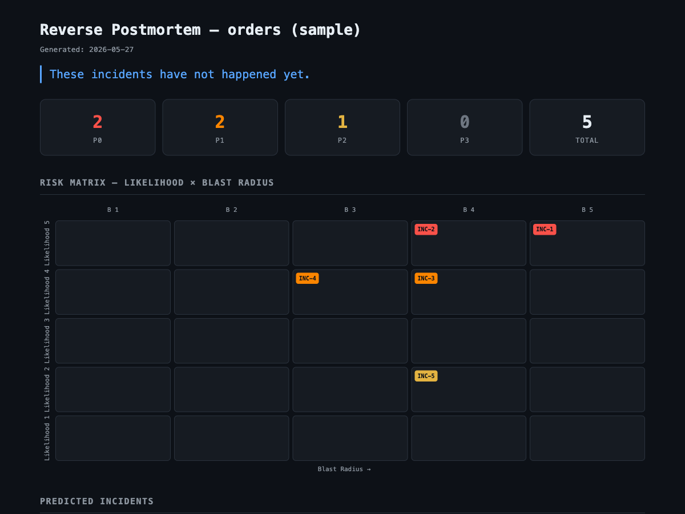
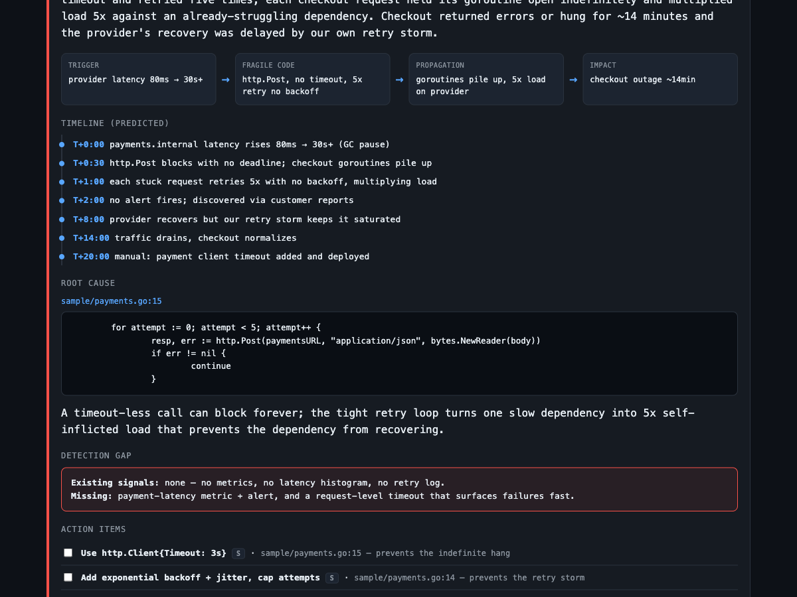
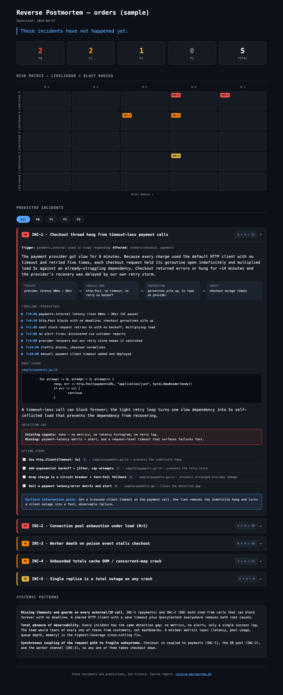

# Reverse Postmortem

Before shipping, an agent writes the failure postmortem in advance — "here is how this will break" — and you fix those causes first.

A normal postmortem analyzes an outage after it happens. The lesson is real but it cost you an incident. **Reverse Postmortem** inverts this: it scans the codebase, predicts the most likely future incidents, ranks them by likelihood and blast radius, and writes each one as a full incident report **in past tense** — as if it already happened. You read the postmortem before the outage, and fix the cause first.

## The rendered report

`/reverse-post-site` turns the report into a self-contained static site. The screenshots below are from running the skill against the `sample/` service in this repo.

### Risk dashboard and matrix



The landing view: counts per severity tier (P0–P3) and a Likelihood × Blast Radius matrix where every predicted incident is plotted in its cell. The top-right cells are the incidents that are both most likely and most damaging — INC-1 (5×5) and INC-2 (5×4) here. This is the at-a-glance triage of what to fix first.

### Incident detail



Each incident expands into a full postmortem: a causal chain (Trigger → Fragile Code → Propagation → Impact), a predicted minute-by-minute timeline, the root cause pinned to a real `file:line` with the actual snippet, a detection-gap callout (would any alert have fired?), and an action-item checklist with effort badges and the single cheapest "earliest intervention point".

### Full incident view



The complete card top-to-bottom — summary, causal chain, timeline, root-cause code, detection gap, and prevention checklist — all from the single inline-styled `index.html`, no build step or external dependencies.

## Two commands

| Command | What it does | Output |
|---|---|---|
| `/reverse-post` | Scans the codebase, predicts incidents, writes the report | `reverse-postmortem.md` |
| `/reverse-post-site` | Renders the report into a browsable static site | `reverse-postmortem-site/index.html` |

```
/reverse-post  ->  reverse-postmortem.md  ->  /reverse-post-site  ->  open in browser
```

The report is the contract. `reverse-post` does all the analysis; `reverse-post-site` only presents it.

## What a predicted incident looks like

Each incident is a complete postmortem grounded in real code:

- **Risk score** = Likelihood (1-5) x Blast Radius (1-5), tiered P0–P3
- **Predicted timeline** — trigger, propagation, detection, recovery
- **Root cause** pinned to a real `file:line` with the actual fragile snippet
- **Detection gap** — would your current logging/metrics even catch it?
- **Action items** — concrete fixes, with the single cheapest "earliest intervention point"

Predictions are fiction grounded in fact: the timeline is invented, but every causal link points to code you can inspect.

## Install

Installs both skills into `~/.claude/skills/` (global):

```bash
./install.sh
```

Uninstall:

```bash
./uninstall.sh
```

## Usage

```bash
/reverse-post                  # scan the whole repo
/reverse-post src/payments/    # scope to a path
/reverse-post --top 5          # only the 5 highest-risk incidents

/reverse-post-site             # render reverse-postmortem.md as a site
```

## Try it on the sample

The `sample/` directory is a small Go "orders" service seeded with realistic fragility signals. Point the skill at it:

```bash
/reverse-post sample/
/reverse-post-site
```

Expected findings include:

| Signal in sample | Predicted incident |
|---|---|
| `db.go` — `MaxOpenConns(5)` + N+1 query (`fetchItems` per order) | Connection pool exhaustion under load |
| `payments.go` — `http.Post` with no timeout + retry loop without backoff | Cascading timeout / retry storm hangs checkout |
| `cache.go` — `totalsCache` map with no eviction, no lock | Unbounded memory growth → OOM, plus a concurrent-map crash |
| `worker.go` — `panic` on unknown event, single goroutine, no recover | Poison message kills the worker; queue backs up and blocks checkout |
| `config.yaml` — `replicas: 1` | Single point of failure |
| Ignored `err` from `db.Query` / `rows.Scan` | Silent failures with no detection signal |

> The sample is meant for the skill to **read**, not to run. It declares `github.com/lib/pq` but is not wired to a live database.

## How it works

`reverse-post` runs a four-phase scan:

1. **Discover** — map components, hot paths, configs, dependency edges, and fragility signals (missing timeouts, unbounded growth, no backoff, swallowed errors, SPOFs). Uses `git log` churn as a likelihood signal.
2. **Hypothesize** — turn each signal into a causal chain (trigger → fail → propagate → impact), matched against an incident-pattern catalog.
3. **Rank** — score Likelihood x Blast Radius, tier P0–P3, order worst-first.
4. **Narrate** — write each as a past-tense postmortem grounded in `file:line` evidence.

See `design-doc.md` for the full design.

## Files

```
agent-reverse-postmortem/
  design-doc.md            design and rationale
  README.md                this file
  install.sh               install both skills globally
  uninstall.sh             remove both skills
  reverse-post/SKILL.md    the analyst skill
  reverse-post-site/SKILL.md   the renderer skill
  sample/                  Go service with seeded fragility signals
```

## Limitations

- Static analysis only — cannot see runtime-only triggers (real traffic shape, races at scale).
- Predictions are probabilistic; some never happen. Each is ranked and points to evidence so you can judge.
- Timelines are invented and marked as predicted, not historical.
- Pattern catalog is finite — novel failure modes may be missed.
