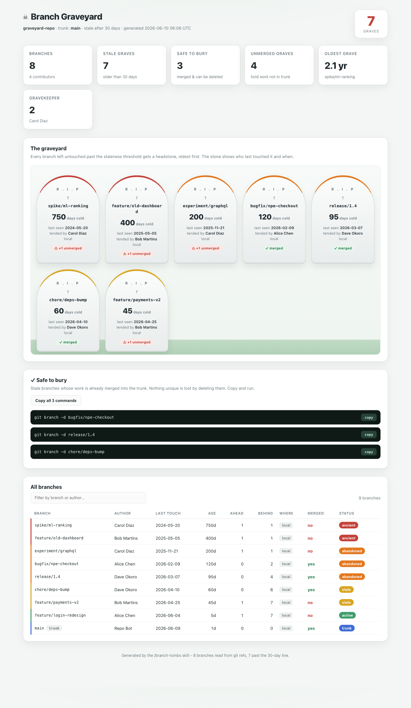
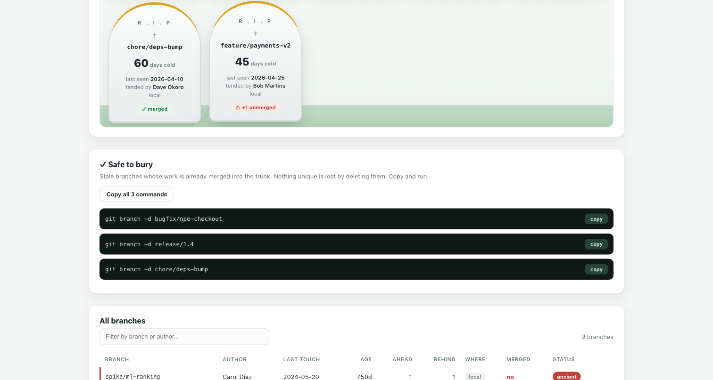
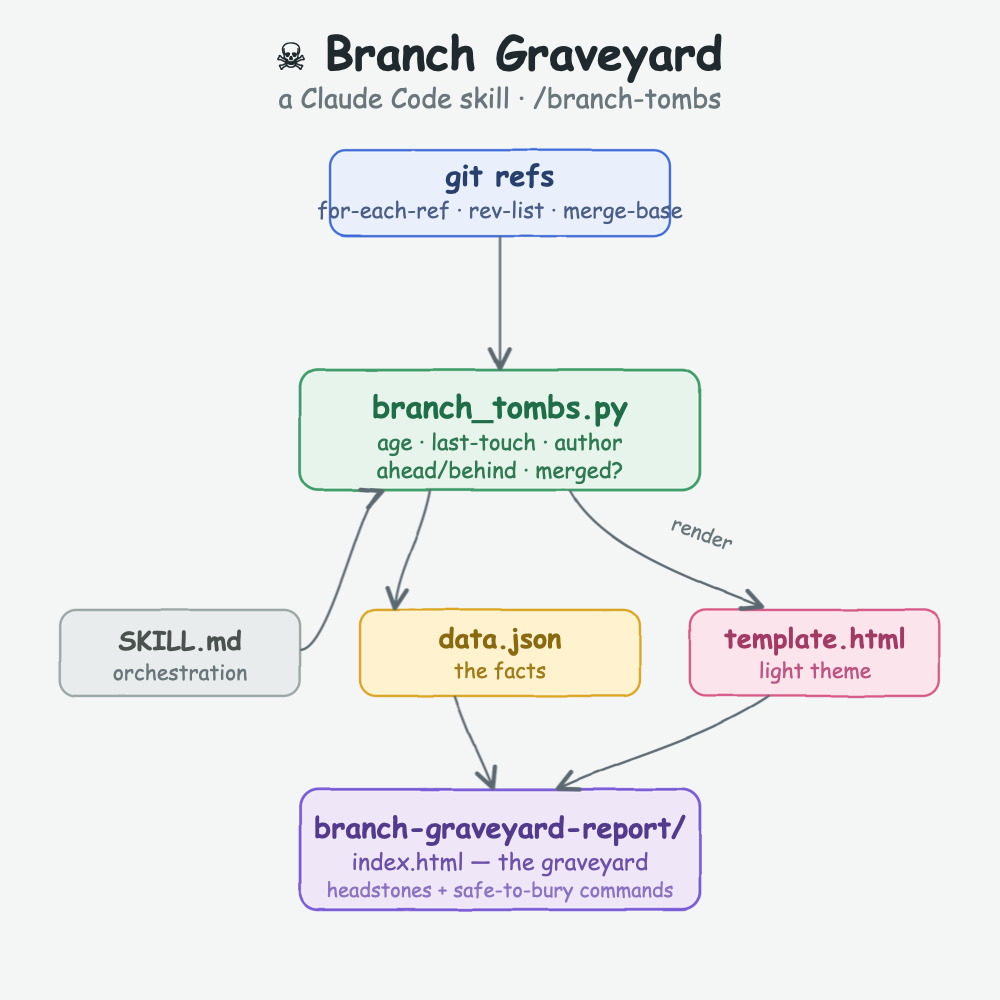
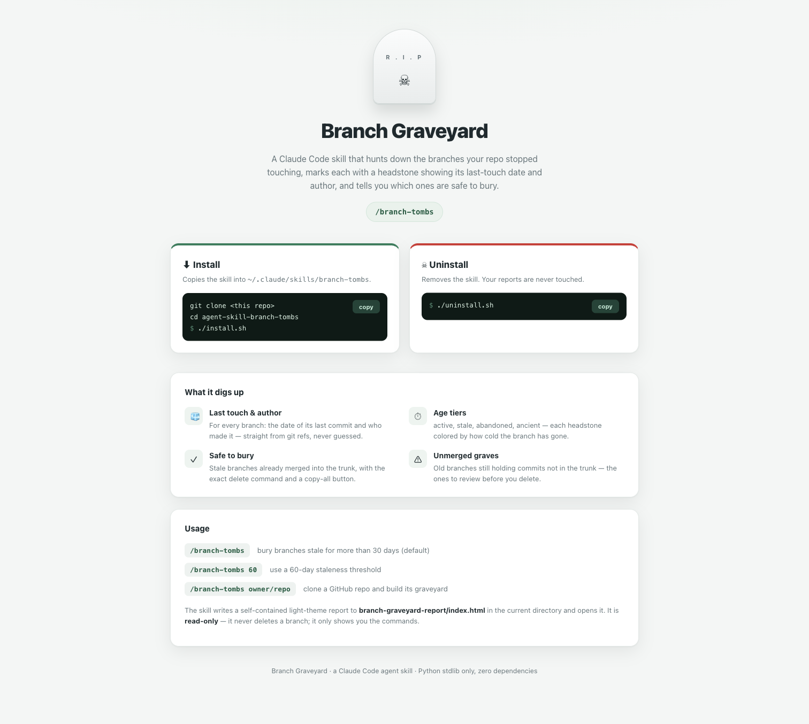

# &#9760; Branch Graveyard &mdash; a Claude Code skill

Every repo has them: branches nobody has touched in months. `feature/payments-v2`, `spike/ml-ranking`, that `release/1.4` from two quarters ago. Some are already merged and just clutter; some still hold work that never made it home. Nobody remembers which.

`/branch-tombs` reads every branch in a git repository, marks each stale one with a **headstone** showing its **last-touch date** and the **author** who last touched it, and renders a self-contained light-theme website. It also tells you exactly which branches are **safe to bury** &mdash; stale *and* already merged &mdash; with the delete command ready to copy.

It is **read-only**. It never deletes a branch; it only shows you the graves and the commands.

## The report



Each stale branch becomes a tombstone, oldest first. The stone's top edge is colored by how cold the branch has gone, and a pill says whether its work is already merged (green) or still hanging on with unmerged commits (red).



The **Safe to bury** section lists only the stale branches whose work is already in the trunk. Deleting them loses nothing unique. Copy one command, or copy them all.

## How it works



The engine (`scripts/branch_tombs.py`, Python standard library only) detects the trunk, then for every branch under `refs/heads` and `refs/remotes`:

| It reads | with |
|---|---|
| who last touched the branch and when | `git for-each-ref` (`authorname`, `committerdate`) |
| how far it diverged from the trunk | `git rev-list --left-right --count trunk...branch` |
| whether it is fully merged | `git merge-base --is-ancestor branch trunk` |

A local branch and its `origin/` twin are collapsed into one grave. Nothing in the report is invented by the model &mdash; two runs on the same repo give the same graveyard. The facts are written to `data.json` and injected into `template.html` to produce a self-contained `index.html`.

## Staleness model

Age is the number of days since the branch's last commit.

| Tier | Age | Meaning |
|---|---|---|
| **active** | &le; 30 days | still warm, not a grave |
| **stale** | 31&ndash;90 days | cooling off |
| **abandoned** | 91&ndash;365 days | likely forgotten |
| **ancient** | &gt; 365 days | a fossil |

A branch is a **grave** when its age is past the threshold (default 30 days) and it is not the trunk. A grave is **safe** when it is fully merged into the trunk, and an **unmerged grave** when it still holds commits the trunk does not.

## Install / uninstall

The skill ships with a small website that shows how to install and remove it, with copy-to-clipboard commands.



Open `site/index.html`, or just run the scripts:

```bash
./install.sh      # copies the skill into ~/.claude/skills/branch-tombs
./uninstall.sh    # removes it
```

`install.sh` warns if `python3` is missing (the engine needs it).

## Usage

```
/branch-tombs                bury branches stale for more than 30 days (default)
/branch-tombs 60             use a 60-day staleness threshold
/branch-tombs owner/repo     clone a GitHub repo and build its graveyard
```

The report is written to `branch-graveyard-report/index.html` (and `data.json`) in the current directory and opened in the browser. The summary is also printed to the terminal.

## The sample fixture (`sample/`)

`build-sample.sh` creates a throwaway git repo with eight branches backdated across two years and four authors &mdash; some merged, some not &mdash; so the skill has a real graveyard to render. It is only a fixture; the skill never reads it specially.

```bash
bash sample/build-sample.sh
( cd sample/graveyard-repo && python3 ../../scripts/branch_tombs.py )
```

Recorded output on the sample:

```
Branch Graveyard
  default branch     : main
  branches scanned   : 8
  stale (>30 days)    : 7
  safe to prune      : 3 (merged + stale)
  unmerged graves    : 4 (have unique work)
  oldest branch      : spike/ml-ranking (750 days, Carol Diaz)
  gravekeeper        : Carol Diaz (2 stale branches)

Oldest graves:
  [ 750d] spike/ml-ranking             Carol Diaz         UNMERGED +1
  [ 400d] feature/old-dashboard        Bob Martins        UNMERGED +1
  [ 200d] experiment/graphql           Carol Diaz         UNMERGED +1
  [ 120d] bugfix/npe-checkout          Alice Chen         merged
  [  95d] release/1.4                  Dave Okoro         merged
  [  60d] chore/deps-bump              Dave Okoro         merged
```

The `branch-graveyard-report/` in this repo is that run, rendered.

## Files

```
agent-skill-branch-tombs/
  README.md                  this file
  design-doc.md              the design document
  install.sh                 installs the skill into ~/.claude/skills/branch-tombs
  uninstall.sh               removes it
  SKILL.md                   orchestration the model follows
  scripts/branch_tombs.py    the git engine + renderer (stdlib only)
  assets/template.html       the light-theme graveyard template
  site/index.html            the install / uninstall website
  sample/build-sample.sh     builds a backdated multi-branch fixture repo
  branch-graveyard-report/   a generated report (from running on the sample)
  printscreens/              architecture diagram + screenshots
```

## Notes and limitations

- Branch metadata comes only from git refs. With no commit history (a shallow or empty repo) there is nothing to age, and the graveyard is reported empty rather than fabricated.
- A local branch and its remote twin are merged into one grave by name; the most recent of the two provides the date and author.
- The page is fully self-contained (no external scripts, fonts, or styles) and works offline.
