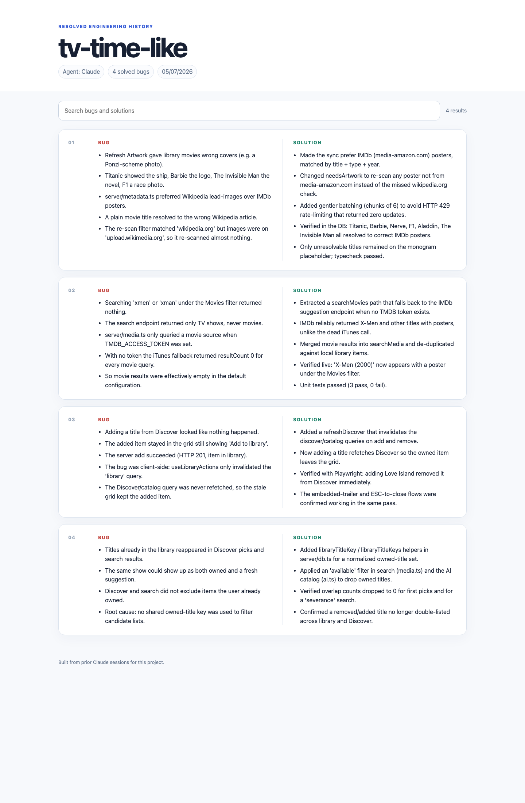

# Bug Cataloger

The report below shows the generated Bug Cataloger output for `tv-time-like`. It summarizes four resolved engineering issues as paired Bug and Solution entries, identifies the source agent and report date, and provides search across the findings.



Bug Cataloger reads prior Claude Code or Codex sessions for the current Git repository and creates a searchable record of bugs that were solved. It requires evidence of both the failure and the resolution before adding an item.

The generated file follows this format:

`<project>-bug-report-<dd_mm_yyyy>.html`

The report is a self-contained light-theme site with the project name, active agent, concise Bug and Solution entries, and client-side search. It does not require a server or external assets.

## Requirements

- Claude Code or Codex
- Python 3
- Git for repository-root detection

No Python packages or JavaScript libraries are required.

## Install

Run:

```bash
bash install.sh
```

Choose Claude Code, Codex, or both when prompted. Restart the selected agent after installation so it reloads global skills.

## Use

Open Claude Code or Codex in a project and ask:

```text
Use bug-cataloger to create the solved bug report for this project.
```

The skill detects the active agent, scans its global session history, selects sessions belonging to the current repository, evaluates bug and resolution evidence, and writes the report into the project root.

Claude Code sessions are read from `~/.claude/projects`. Codex sessions are read from `~/.codex/sessions`. Session files are never changed.

## Uninstall

Run:

```bash
bash uninstall.sh
```

Choose Claude Code, Codex, or both when prompted.

## Privacy

Session history can contain sensitive material. The report excludes credentials, personal data, raw prompts, hidden reasoning, and unrelated paths. Review the generated file before sharing it.

## Structure

- `bug-cataloger/SKILL.md` contains the agent workflow and evidence rules.
- `bug-cataloger/scripts/collect_sessions.py` selects and normalizes matching sessions.
- `bug-cataloger/scripts/render_report.py` validates findings and renders the report.
- `install.sh` and `uninstall.sh` manage global installations.
