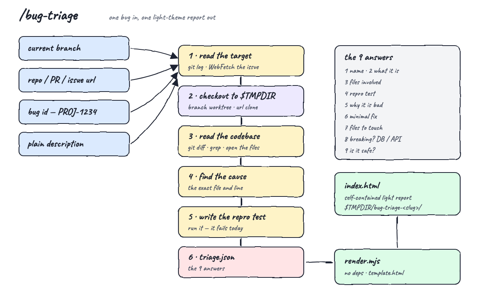
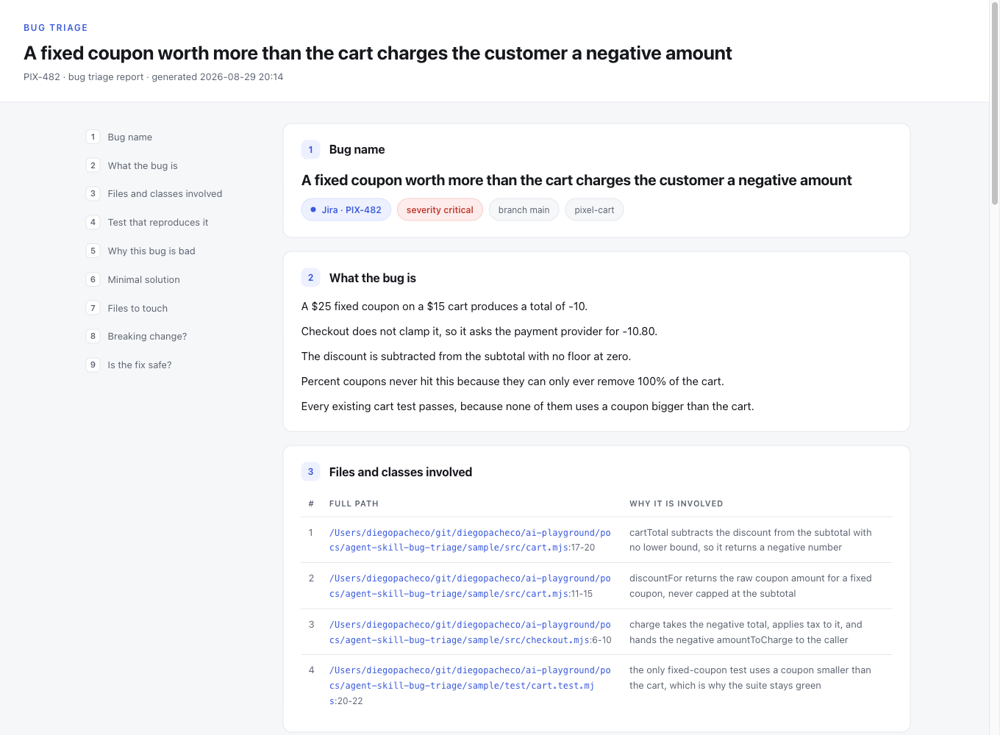
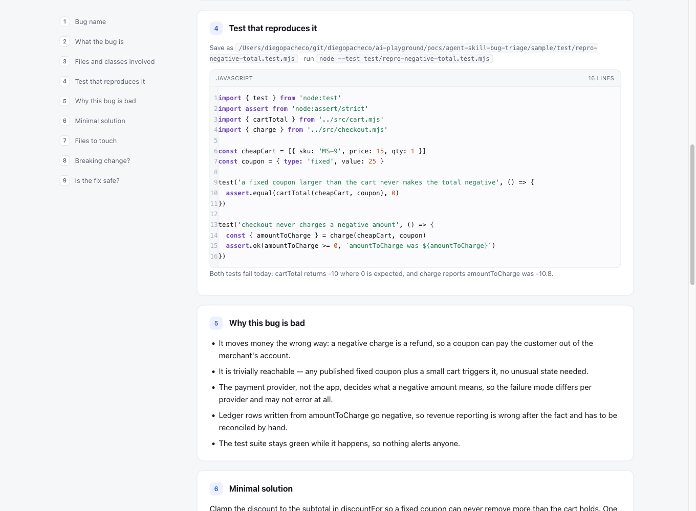
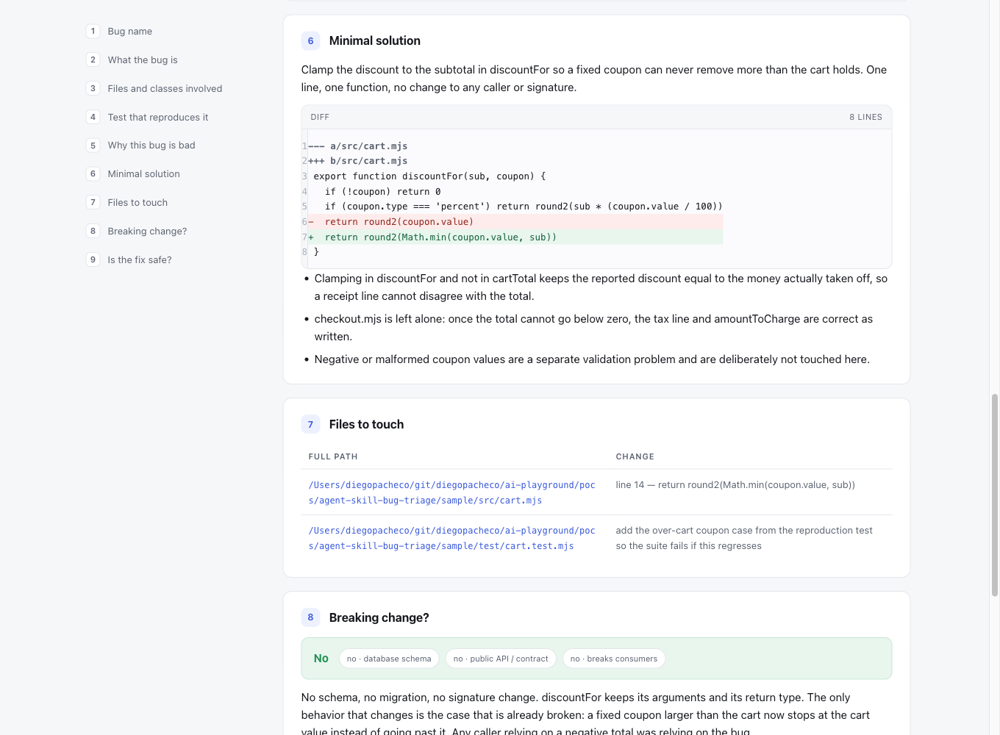
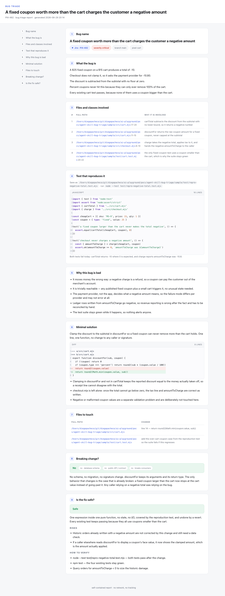

# bug-triage — one bug in, one report out

An agent skill that takes a single bug — from the branch you are on, another branch, a repo or GitHub PR url, a Jira or Linear url, a bug id, or a sentence you type — reads the real codebase to find its cause, and writes a self-contained light-theme HTML report to a temp folder.

The report answers nine questions and nothing else: what the bug is called, what it is in 3-5 plain lines, which files are involved, a test that reproduces it, why it is bad, the smallest fix, which files to touch, whether it breaks the database or a public contract, and whether the fix is safe.

## How it works

1. You run `/bug-triage` with a branch, a repo or PR url, a tracker url, a bug id, or a description.
2. The skill reads the target — `git diff`, `git log`, or WebFetch on the issue url. If the code is not the tree you are standing in — another branch, a repo url, a GitHub PR — `checkout.sh` puts it in `$TMPDIR/bug-triage-src-<slug>/` first: a detached `git worktree` for a branch, a shallow clone for a url. Your working tree and your uncommitted changes are never touched.
3. It searches and opens the real files until it can point at the exact file and line that is wrong.
4. It writes a test that fails today because of this bug, and runs it.
5. It fills a `triage.json` with the nine answers.
6. `render.mjs` validates that json and renders `index.html` into `$TMPDIR/bug-triage-<slug>-<timestamp>/`. The folder is not an argument — nothing is ever written into the repo you are triaging.

Nothing in the report is estimated. If the cause cannot be found, the report says so instead of guessing.

## Architecture



Inputs on the left all collapse to the same thing: one bug. The middle is the reading pipeline, which ends in `triage.json` — the only contract in the project. The right side is rendering: a zero-dependency Node script plus one HTML template, out to a temp folder.

## Features

| Feature | Why |
|---|---|
| Five ways in — branch, repo or PR url, issue url, bug id, description | You triage a bug from wherever it reached you, not from one tool |
| Source lands in a temp folder too | Triaging a PR or another branch never switches your branch or stashes your work |
| Reads the code, not the ticket | A ticket says what a user saw; the file says what actually happens |
| A reproduction test that fails today | A bug you cannot reproduce is a guess, and the test is also the proof the fix worked |
| Line numbers and syntax highlighting in the report | You read the test and the diff in the report instead of switching to an editor |
| Blast-radius answer (DB / public API / consumers) | Whether you can ship it now is a different question from whether the fix is right |
| Safety verdict with risks and verification | "Safe" is only useful when it says what would make it unsafe |
| Tracker link carried into the report | The report is shareable back into Jira or Linear without hunting for the ticket |
| Renders to a temp folder, always | Triage is disposable; the repo you are debugging never gains a file, so there is nothing to clean up or accidentally commit |
| Install into Claude Code, Codex, or both | One skill, whichever agent you are in that day |

## Stack

| Piece | Why |
|---|---|
| Node (ESM), no dependencies | The renderer is string work; a package.json of dependencies would be dead weight |
| One HTML template with inline CSS | The report has to open from a temp folder with no server and no network |
| Hand-rolled highlighter | 40 lines of regex beats shipping a syntax library into a report file |
| bash for install / uninstall / checkout | Copying a folder is a copy, and `git worktree` already does the hard part |
| `node --test` in the sample | The reproduction test needs a runner the sample already has |

## The contract: triage.json

`render.mjs` is the only consumer, and it rejects the file if a required field is missing.

```json
{
  "bug": { "name": "", "id": "", "url": "", "tracker": "", "severity": "critical|high|medium|low", "branch": "", "repo": "" },
  "description": ["3 to 5 short lines"],
  "files": [{ "path": "/abs/path", "lines": "17-20", "role": "why it is involved" }],
  "repro": { "path": "", "run": "", "language": "", "start_line": 1, "code": "", "expectation": "" },
  "why_bad": ["real consequences"],
  "solution": { "summary": "", "language": "diff", "code": "", "notes": [] },
  "files_to_touch": [{ "path": "", "change": "" }],
  "breaking": { "verdict": "No", "db": false, "api": false, "consumers": false, "detail": "" },
  "safety": { "verdict": "Safe", "detail": "", "risks": [], "verification": [] }
}
```

Required: `bug.name`, `description`, `files`, `repro.code`, `why_bad`, `solution.summary`, `files_to_touch`, `breaking.verdict`, `safety.verdict`. Missing one is an error with the field name and exit code 1 — the report is never rendered half-empty.

`bug.url` is optional. With it, the report shows a link to Jira, Linear, or GitHub. Without it, the report says the bug was reported as a description, and section 2 is the whole source.

## Design decisions

- **The json is the deliverable, the HTML is a view.** `triage.json` is written next to the report, so the same triage can be re-rendered or diffed later.
- **Highlighting happens at render time, not in the browser.** The report ships as static markup, so it stays readable with JavaScript off and can be saved anywhere.
- **Line numbers live in their own `<pre>`.** A gutter column beside the code keeps multi-line strings and block comments intact instead of splitting a `<span>` per line, and it keeps the numbers out of a copy-paste.
- **The renderer validates and exits loud.** A triage missing its safety verdict is not a report, so it fails rather than rendering an empty card.
- **The skill never edits the project.** It writes the report folder and the temp checkout, and nothing else — triage is a read of the code, not a change to it.
- **A branch is a worktree, a url is a clone.** A worktree reuses the objects you already have and costs a checkout; a clone is only paid when the code is not on the machine. Both are detached, so neither can move a branch under you.
- **Report paths are the paths that were read.** When the source is a temp checkout, `files` and `files_to_touch` carry those temp paths and the report says so, rather than guessing where the same file sits in your copy.

## Install

```bash
./install.sh
```

It asks where to put the skill:

```
🐛 bug-triage installer

  1) 🤖 Claude Code   (~/.claude/skills/bug-triage)
  2) 🧠 Codex         (~/.codex/skills/bug-triage)
  3) 🚀 Both

👉 install where? [1/2/3]
```

Non-interactive:

```bash
./install.sh --claude
./install.sh --codex
./install.sh --both
```

Requires `node`.

## Uninstall

```bash
./uninstall.sh            # asks: Claude Code, Codex, or both
./uninstall.sh --both
```

## Usage

```
/bug-triage                                                    triage the branch you are on
/bug-triage fix/checkout-total                                 triage what a branch changed
/bug-triage https://acme.atlassian.net/browse/PIX-482          triage a Jira issue
/bug-triage https://linear.app/acme/issue/ENG-88               triage a Linear issue
/bug-triage https://github.com/acme/store/pull/412              triage a GitHub PR
/bug-triage a $25 coupon on a $15 cart charges the user -10.80 triage a description
```

A branch, a repo url, or a PR url is checked out under `$TMPDIR` before anything is read:

```bash
./skill/scripts/checkout.sh https://github.com/acme/store/pull/412
CHECKOUT /var/folders/.../T/bug-triage-src-acme-store-pr-412
REF pull/412/head

./skill/scripts/checkout.sh --clean     # prune the worktrees, delete the temp checkouts
```

It prints the report path and offers to open it:

```
REPORT /var/folders/.../T/bug-triage-pix-482-2026-08-29-131359/index.html
```

## How to run the tests

```bash
./test.sh
```

It checks out this repo into a temp folder and proves an unknown branch is rejected, runs the sample's existing suite (green while the bug is live), runs the reproduction test (must fail), renders the report, asserts it landed in a temp folder and not in the repo, and checks all nine sections and the tracker link are in the HTML.

Measured output:

```
== checkout into a temp folder ==
OK source checked out to /var/folders/.../T/bug-triage-src-ai-playground-head
OK checkout rejects an unknown branch

== existing suite (green while the bug is live) ==
ℹ pass 4
ℹ fail 0

== reproduction test (must fail) ==
ℹ pass 0
ℹ fail 2
OK reproduction test fails as expected

== render report ==
OK report written to a temp folder
PASS report written to /var/folders/.../T/bug-triage-pix-482-2026-08-29-145712/index.html
```

## The sample bug

`sample/` is a tiny cart with one real money bug: `discountFor` in `sample/src/cart.mjs:14` returns a fixed coupon's full value with no cap, so a $25 coupon on a $15 cart makes the total `-10`, and `charge` in `sample/src/checkout.mjs:9` passes `-10.80` on as the amount to charge. Its four existing tests all pass, because none of them uses a coupon bigger than the cart — which is the point.

## The report

The top of the report: the bug name, the Jira link, the severity, and the branch, followed by the 3-5 line description and the table of every file involved with its full path and line range.



Section 4 — the reproduction test, with line numbers and syntax highlighting, where to save it, how to run it, and the failure it produces today.



Section 6 and 7 — the minimal fix as a colored diff, the notes on what was deliberately left alone, the files to touch, and the breaking-change verdict with its three flags (database schema, public API, consumers).



The whole page: nine numbered sections with a sticky index down the left, ending in the safety verdict with its risks and the steps that verify the fix.



## Layout

```
agent-skill-bug-triage/
├── skill/
│   ├── SKILL.md                 the agent playbook
│   ├── scripts/checkout.sh      branch, repo or PR into $TMPDIR (worktree or clone)
│   ├── scripts/render.mjs       validate triage.json, highlight, render
│   └── assets/template.html     the light-theme report template
├── sample/                      tiny cart with a real money bug
│   ├── src/                     cart.mjs, checkout.mjs, money.mjs
│   ├── test/                    the green suite + the failing reproduction test
│   └── triage.json              the triage of that bug
├── printscreens/                architecture diagram + report screenshots
├── install.sh / uninstall.sh    Claude Code, Codex, or both
├── test.sh                      end to end: checkout, suite, reproduction, render, checks
└── README.md
```
