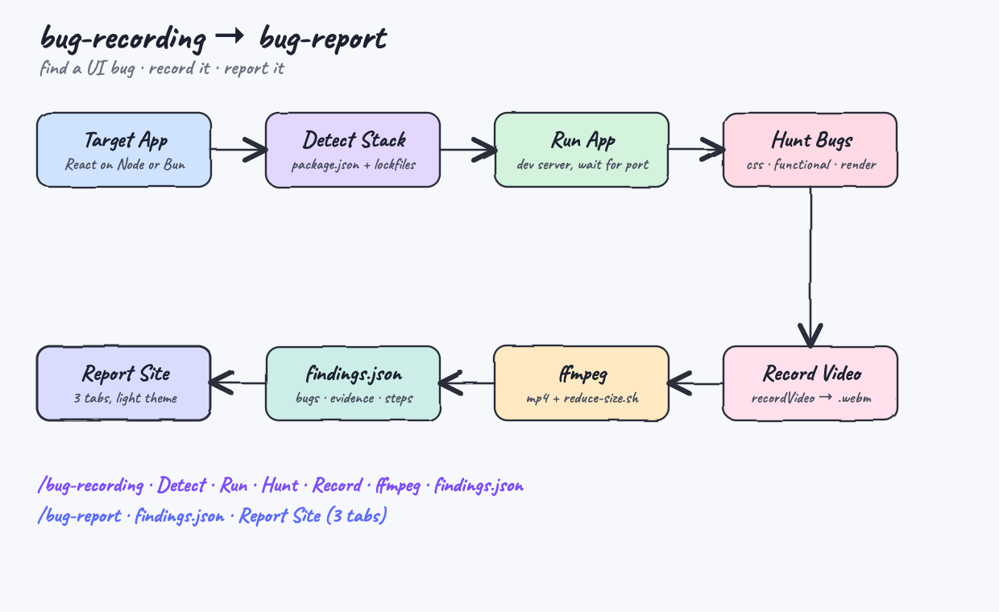
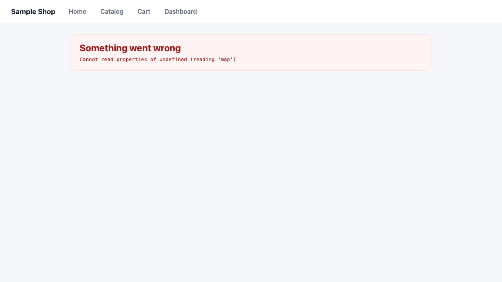
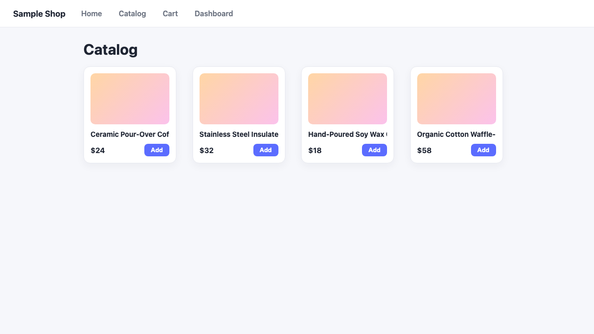
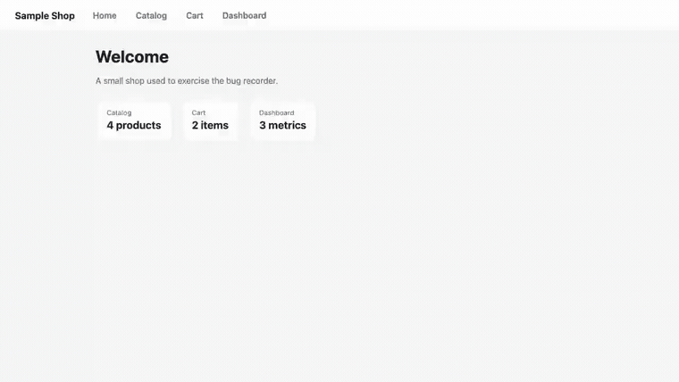
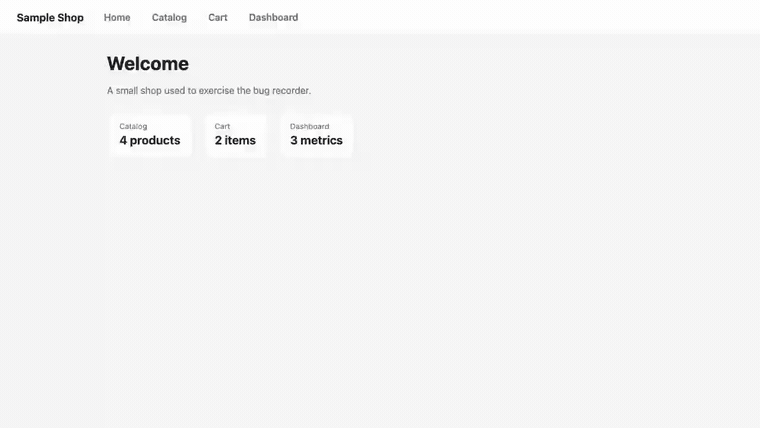
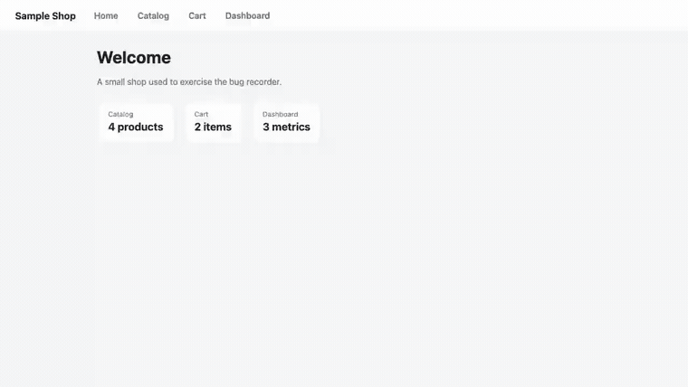
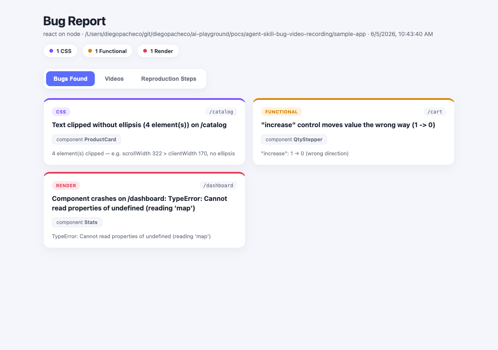
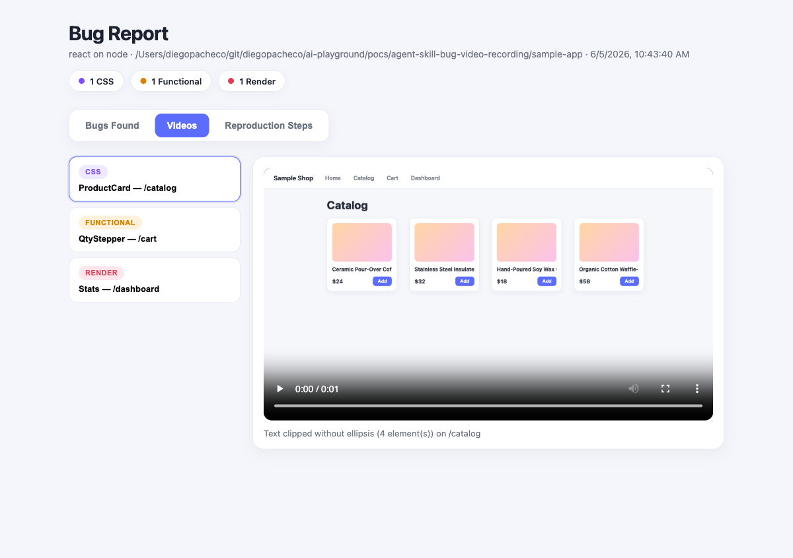
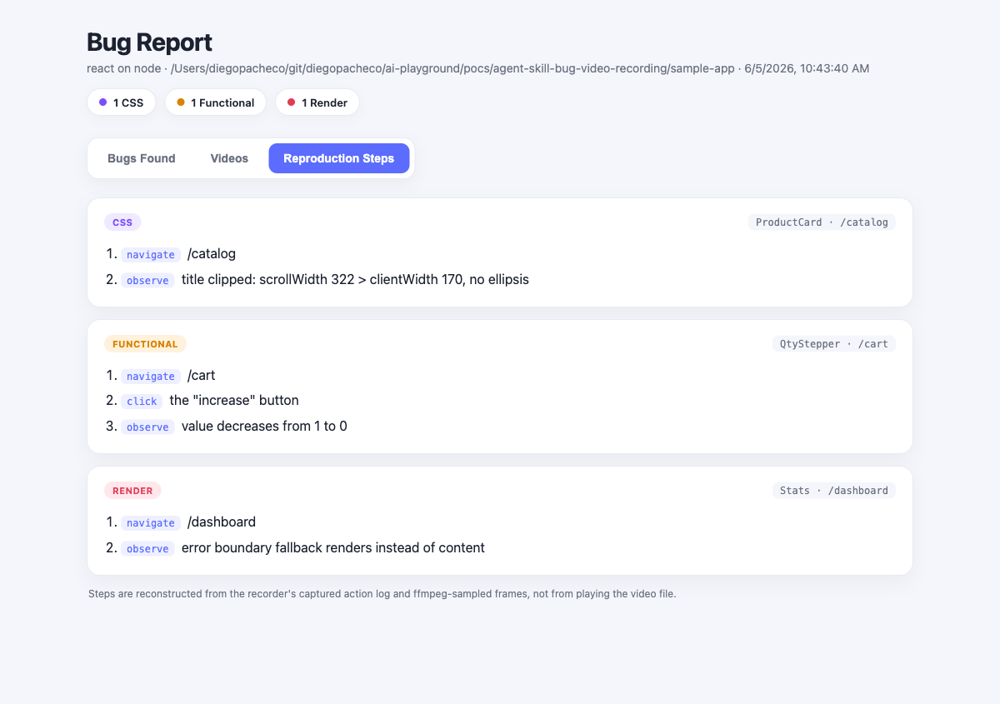

# bug-recording → bug-report

Two Claude skills that find UI bugs in a React app, record a Playwright video of
each one, and render a light-theme report site. Ships with a sample app that has
three real, planted bugs so the whole pipeline is verifiable end to end.



## What it does

- **`/bug-recording`** points at a web project, detects whether it is a React app
  on **Node** or **Bun**, starts it, drives it with Playwright, hunts for bugs,
  and records an optimized `.mp4` of each bug it reproduces.
- **`/bug-report`** reads those artifacts and renders a self-contained website
  with three tabs: the bugs found, the bug videos, and reproduction steps.

The capture path is one direction: a target app on the left becomes a report on
the right. `/bug-recording` owns everything up to `findings.json`; `/bug-report`
turns `findings.json` into the site.

## The sample app

`sample-app/` is a **Vite + React 19 + TypeScript 6 + TanStack Router + TanStack
Query** project, organized into feature folders (`src/features/<feature>`). It
runs under both Node and Bun, so stack detection has something real to classify.

It carries three bugs, each chosen to trip a different detector:

| Class      | Where                          | The bug                                                        | Detector signal |
|------------|--------------------------------|----------------------------------------------------------------|-----------------|
| Render     | `features/dashboard` · `Stats` | reads `data.metrics!` which is `undefined`, so `.map` throws   | console error + error-boundary fallback |
| Functional | `features/cart` · `QtyStepper` | the "increase" button is wired to decrement                    | clicking "increase" moves the number **down** |
| CSS        | `features/catalog` · `ProductCard` | long title in `overflow:hidden; nowrap` with no ellipsis   | `scrollWidth > clientWidth`, text clipped |

The render bug, as it appears in the app — the error boundary catches the crash:



The CSS bug — every product title is clipped mid-word with no ellipsis:



## Watch the bugs reproduce

These are the actual recorded walkthroughs — the same clips the report serves,
converted from `.mp4` to GIF. Each one starts on the home page and clicks through
to the broken screen, with a moving cursor, on-screen captions, and a highlight
box on the faulty element.

### Render bug — `/dashboard` · `Stats`



The walkthrough opens on Home and clicks through to Dashboard. `Stats` reads
`data.metrics` (which is `undefined`) and calls `.map` on it, throwing
`TypeError: Cannot read properties of undefined (reading 'map')`. The error
boundary catches the crash and the "Something went wrong" fallback renders in
place of the dashboard.

### Functional bug — `/cart` · `QtyStepper`



From Home to Cart, the cursor moves to the **+** (increase) button and clicks it.
The quantity readout drops from **1 to 0** — the increment handler is wired to
decrement, so "increase" runs the value the wrong way.

### CSS bug — `/catalog` · `ProductCard`



On the Catalog page each product title sits in an `overflow:hidden;
white-space:nowrap` box with no `text-overflow:ellipsis`. The highlight box lands
on a title — "Ceramic Pour-Over Cof…" — clipped mid-word with no `…` to mark the
cut. Measured: `scrollWidth 322 > clientWidth 170`.

## Install

```
./install.sh
```

Verifies `node`/`bun` and `ffmpeg` are present, copies both skills into
`~/.claude/skills/`, installs Playwright + Chromium for the recorder, and makes
the scripts executable.

```
./uninstall.sh
```

Removes both skills from `~/.claude/skills/`.

## Use

1. Run **`/bug-recording`** against a target (defaults to `./sample-app`). It
   writes `bug-recording-output/` with `findings.json`, `videos/`, `frames/`, and
   `screenshots/`.
2. Run **`/bug-report`** on that output. It writes `bug-report-site/index.html`
   with the videos copied into `assets/`. It is a standalone static site — open
   it directly (`open bug-report-site/index.html`) or serve it on its own port
   with `node skills/bug-report/report.mjs <output-dir> --serve`. Do not load it
   from the target app's dev-server port; that server does not host the report
   and returns 404.

Under the hood the recorder runs:

```
node skills/bug-recording/record.mjs <target-app-dir> [output-dir]
node skills/bug-report/report.mjs   <output-dir>      [site-dir]
```

## The report, tab by tab

### Tab 1 — Bugs Found

One card per bug: a class badge, the description, the route, the component, and a
one-line evidence summary. The colored top border encodes the bug class.



### Tab 2 — Videos

The recorded `.mp4` for each bug, selectable from the list on the left. Each
player uses the captured screenshot as its poster, so even paused you can see the
bug — here the clipped catalog titles are visible in the still.



### Tab 3 — Reproduction Steps

The ordered steps to reproduce each bug, with `navigate` / `click` / `observe`
actions. These are reconstructed from the recorder's captured action log and
ffmpeg-sampled frames — not from playing the video file, which the agent cannot
watch as motion.



## How bugs are detected

The recorder starts the dev server, waits for its URL, crawls routes from in-app
links, and per route runs three checks:

- **render** — a console/page error on load, or an error-boundary fallback.
- **css** — text clipped under `overflow:hidden` with no `text-overflow:ellipsis`.
- **functional** — an "increase"/"+"/"add" control that moves a numeric readout
  the wrong way, or a failing request behind an action.

## How the videos are recorded

The recorder never screen-captures the OS. Each video is produced entirely inside
Playwright, then re-encoded with `ffmpeg`:

1. **Capture.** Every bug gets its own browser context opened with `recordVideo`:

   ```js
   browser.newContext({
     viewport: { width: 1280, height: 720 },
     recordVideo: { dir: 'raw', size: { width: 1280, height: 720 } }
   })
   ```

   Playwright records the whole page to a `.webm` for the life of that context. A
   fresh context per bug means one isolated clip with no leftover state from the
   previous bug.

2. **Finalize.** The walkthrough runs, then `context.close()` flushes the `.webm`
   to disk and `page.video().path()` hands back its path.

3. **Transcode to MP4.** `ffmpeg` converts the `.webm` to web-friendly H.264 so it
   plays inline in the report and on GitHub:

   ```
   ffmpeg -i raw.webm -c:v libx264 -crf 28 -pix_fmt yuv420p \
     -vf scale=trunc(iw/2)*2:trunc(ih/2)*2 -r 30 bug-N.mp4
   ```

   `yuv420p` and even dimensions keep it playable everywhere; `-crf 28` trades a
   little quality for size.

4. **Shrink.** `reduce-size.sh` runs a second, slower pass — drops audio (`-an`),
   `-crf 32 -preset veryslow`, `+faststart` so playback can begin before the file
   finishes downloading — and keeps the result only if it actually came out
   smaller. The three clips here landed at ~57–69 KB each.

5. **Sample frames.** `ffmpeg -vf fps=1` writes one PNG per second into `frames/`.
   The agent can't watch an `.mp4` as motion, so these stills (plus the action
   log) are how it reconstructs what happened.

The animated GIFs above were made from those finished `.mp4`s with a separate
two-pass palette conversion — `palettegen` builds an optimal 256-colour table,
`paletteuse` applies it, which is what keeps a GIF clean and free of banding:

```
ffmpeg -i bug-1.mp4 -vf "fps=12,scale=760:-1:flags=lanczos,palettegen=stats_mode=diff" palette.png
ffmpeg -i bug-1.mp4 -i palette.png -filter_complex \
  "fps=12,scale=760:-1:flags=lanczos[x];[x][1:v]paletteuse=dither=bayer:bayer_scale=3" bug-1.gif
```

## How the walkthrough clicks through and reproduces the steps

The cursor, captions, and highlight box are not a video editor. They are a small
script injected into the page itself, driven in lockstep with real Playwright
input.

- **Injected overlay.** Before any app code runs, `context.addInitScript` installs
  a `window.__rec` helper on every page. It appends three elements at the top
  z-index with `pointer-events: none`, so they are visible but never intercept a
  click:
  - a red **cursor** dot that animates between positions via a CSS transition,
  - a **caption** bar pinned to the bottom of the screen,
  - a **highlight box** drawn around any selector using `getBoundingClientRect()`.

- **Real input, mirrored.** The visual cursor and the actual mouse move together:
  `__rec.move(x, y)` slides the dot while `page.mouse.move(x, y, { steps: 12 })`
  glides the real pointer to the same spot, then `__rec.ping()` pulses the dot at
  the moment of the click. The click is a genuine Playwright `locator.click()` —
  the app receives a real event.

- **Driven by the same steps the report shows.** `playStep` walks the bug's
  `steps[]` array — the exact array the report's **Reproduction Steps** tab
  renders — and acts each one out:
  - `navigate` → captions "Step N: open /route", finds the in-app `<a href>` and
    points-and-clicks it (falling back to a direct `goto` if there is no link),
  - `click` → captions "Step N: click …", locates the increase/`+` control and
    points-and-clicks it,
  - `observe` → captions the observation, draws the highlight box around the
    broken element, and dwells on it (~2.6 s) so the result is unmistakable.

Because the on-screen narration and the written reproduction steps come from one
source, the video and the steps can never drift apart.

## Honest limits

These detectors target broad bug classes, not every possible bug. The report
shows the captured evidence, not a verdict beyond it. Frame sampling can miss
timing-class faults (flicker, animation that never settles). For arbitrary apps
this is best-effort; the sample app's bugs are chosen to be caught.

## Requirements

- Node (or Bun) to run the target app.
- `ffmpeg` on PATH for encoding and the size-reduction pass.
- Playwright + Chromium (installed by `install.sh`).

## Layout

```
.
├── design-doc.md
├── install.sh / uninstall.sh
├── skills/
│   ├── bug-recording/   record.mjs · reduce-size.sh · SKILL.md
│   └── bug-report/      report.mjs · SKILL.md
├── sample-app/          Vite + React 19 + TS6 + TanStack
└── printscreens/
```
