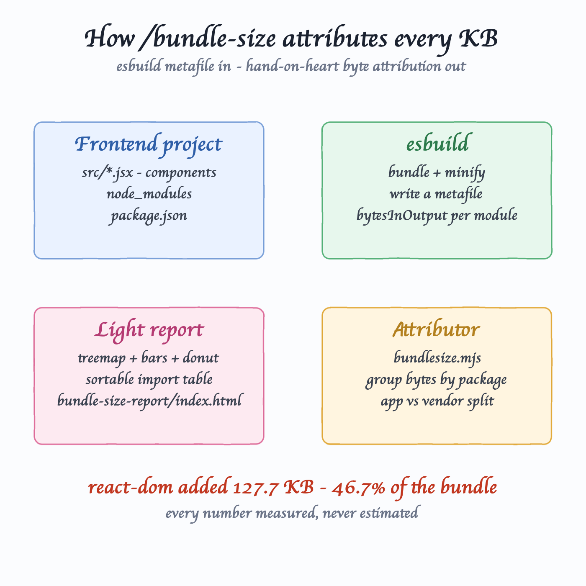
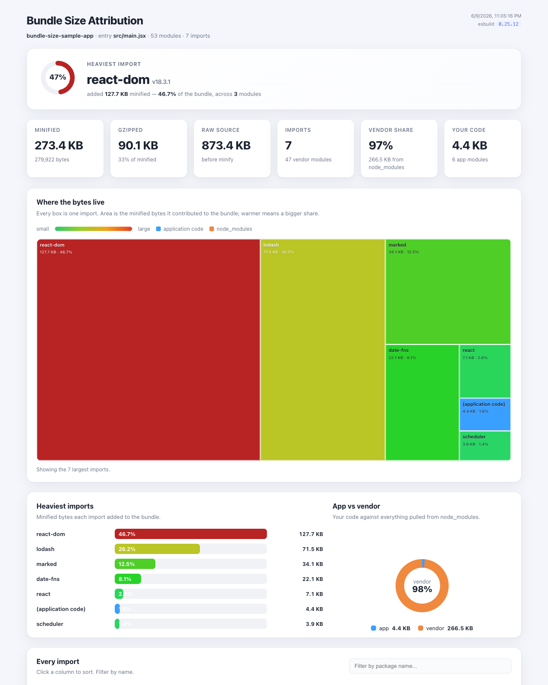
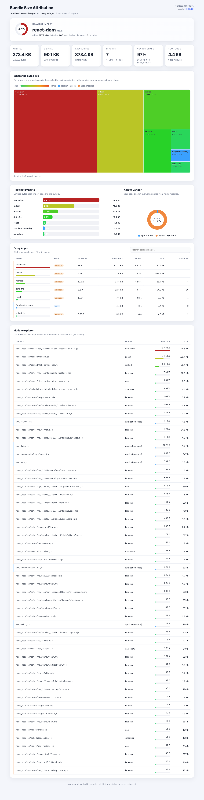

# bundle-size — import-cost attribution skill

An agent skill that answers one question about any frontend project: **which import added the most KB to your bundle?** It bundles your app with esbuild, reads esbuild's metafile, attributes every minified byte back to the npm package (or source file) that brought it in, and renders a self-contained light-theme analytics website.

> The task: *"Bundle-size attribution: which import added the most KB — read the current frontend project and generate a site full of analytics about bundle size, light themed, with a sample node/react app, install/uninstall scripts and a nice readme."*

## How it works



1. **Find the project** — locate `package.json` and the entry (`src/main.jsx`, `index.html`'s module script, …).
2. **esbuild** — bundle + minify the real source graph and emit a metafile. The metafile records `bytesInOutput` for every module: its exact contribution to the minified bundle.
3. **Attributor** (`bundlesize.mjs`) — group those bytes by npm package (scoped packages keep their `@scope/`), split app code from `node_modules`, gzip the whole bundle, rank everything.
4. **Light report** — inject the data into an HTML template: a treemap, a ranked bar list, an app/vendor donut, a sortable table of every import, and a module explorer.

Every number is **measured, never estimated**. If esbuild cannot bundle the project, the skill says so instead of faking a report.

## The report

Generated against the bundled sample app — `react-dom` is the heaviest import at **127.7 KB (46.7%)**, with `lodash` the classic runner-up at 26%:



Full page — treemap, heaviest-imports bars, app-vs-vendor donut, the sortable "Every import" table, and the per-module explorer:



## Install

```bash
./install.sh
```

Copies the skill to `~/.claude/skills/bundle-size` (and `~/.codex/skills/bundle-size` if Codex is present) and runs `npm install` there to fetch esbuild — the skill's only dependency.

Requires `node` and `npm`.

## Uninstall

```bash
./uninstall.sh
```

## Usage

In Claude Code, from inside any frontend project:

```
/bundle-size
```

Or point it at a path or a specific entry file:

```
/bundle-size ./apps/web
/bundle-size . src/main.tsx
```

The skill needs the project's `node_modules` present (it bundles the real imports). It writes `bundle-size-report/index.html` and `bundle-size-report/data.json` into the current directory and prints a summary:

```
project        bundle-size-sample-app
entry          src/main.jsx
bundle (min)   273.4 KB  gzip 90.1 KB
modules        53 across 7 packages
app vs vendor  4.4 KB app / 266.5 KB vendor
heaviest       react-dom  127.7 KB (46.7% of bundle)

top imports by minified size:
    130745 B   46.7%  react-dom@18.3.1
     73217 B   26.2%  lodash@4.18.1
     34909 B   12.5%  marked@12.0.2
     22673 B    8.1%  date-fns@3.6.0
      7321 B    2.6%  react@18.3.1
```

## Try it on the sample app

A real Vite + React dashboard lives in `sample-app/`, pulling in `react`, `react-dom`, `lodash`, `date-fns`, and `marked` so the attribution has something to chew on.

```bash
cd sample-app
npm install
node "$HOME/.claude/skills/bundle-size/scripts/bundlesize.mjs" .
open bundle-size-report/index.html
```

## What the numbers mean

- **Minified bytes** — each module's `bytesInOutput`, i.e. its real contribution to the minified bundle. This is the honest unit for "which import added the most KB", and what the treemap, bars, and table rank on.
- **Gzipped** — the whole bundle run through zlib. Per-import gzip is *not* reported, because gzip is not additive across modules.
- **App vs vendor** — everything outside `node_modules` is grouped as `(application code)`; everything inside is grouped by package name.

The engine measures a production-style build (`bundle`, `minify`, `format=esm`, `NODE_ENV=production`). It is not your exact Vite/webpack config, but it is a faithful, repeatable attribution of the same source graph. Projects that need SCSS/LESS or path-alias resolution are reported as an esbuild error rather than a partial result.

## Layout

```
agent-skill-bundle-size/
├── skills/bundle-size/
│   ├── SKILL.md                 the agent playbook
│   ├── package.json             esbuild dependency
│   ├── scripts/bundlesize.mjs   the attribution engine
│   └── assets/template.html     the light-theme report template
├── sample-app/                  Vite + React app to try it on
├── printscreens/                rendered diagram + report screenshots
├── install.sh / uninstall.sh
├── design-doc.md
└── README.md
```
