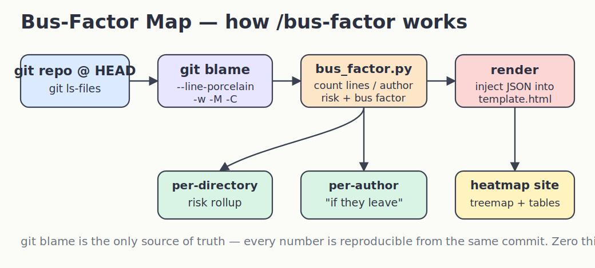
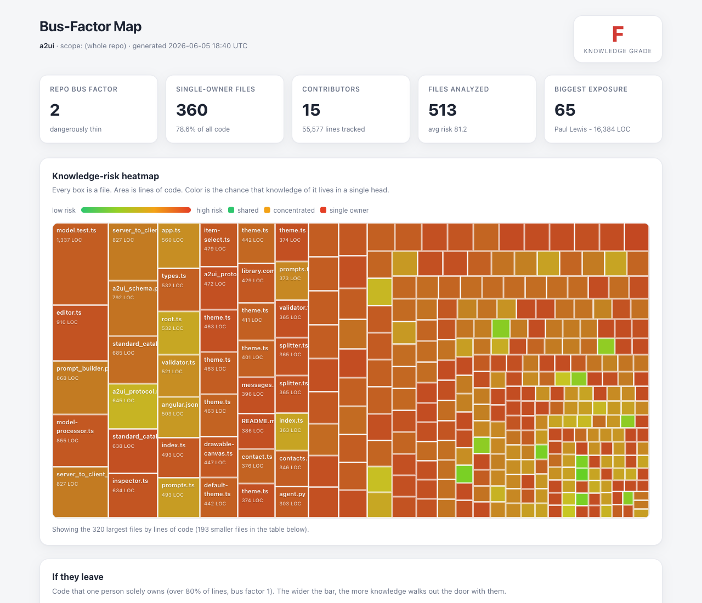
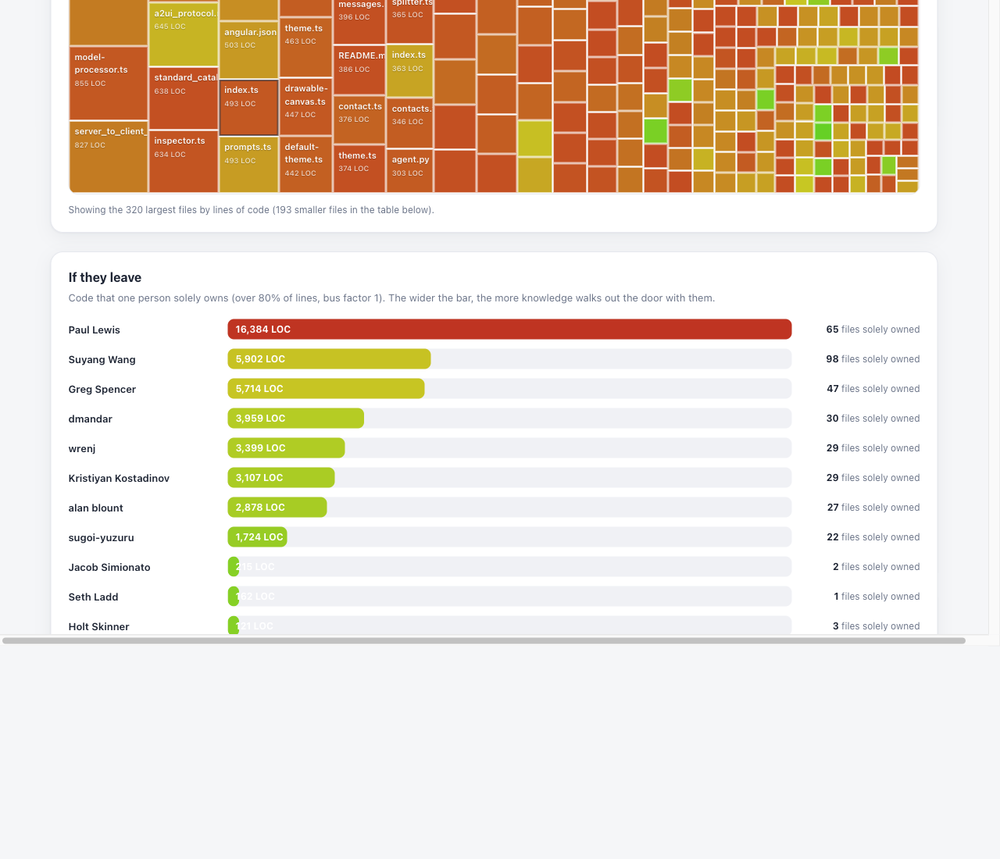
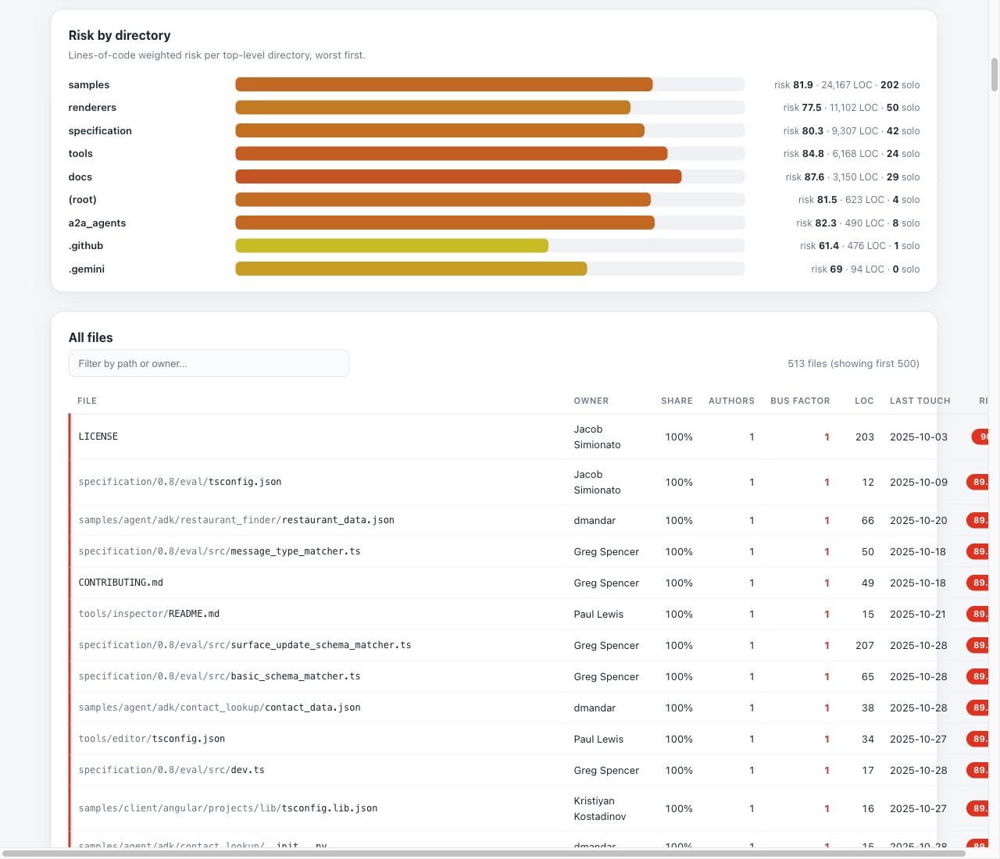

# Bus-Factor Map

A Claude Code skill that turns a repository's git history into a **knowledge-risk heatmap**. Run `/bus-factor` and it blames every tracked file, works out who really owns the surviving lines, computes a *bus factor* per file, directory, and author, and opens a light-theme website that shows exactly where the project's knowledge is trapped in a single head.

> The bus factor of a file is the smallest number of people who would have to be hit by a bus before the only working knowledge of that code is gone. A bus factor of **1** means one resignation away from trouble.

## How it works



A deterministic Python engine (`scripts/bus_factor.py`, zero third-party dependencies) does all the counting; the model only orchestrates and points you at the worst findings. Every number in the report is reproducible from `git blame` on the same commit — nothing is estimated.

```
git ls-files  ->  git blame --line-porcelain -w -M -C  ->  per-file risk + bus factor
              ->  directory rollup + per-author "if they leave" + repo grade
              ->  inject JSON into template.html  ->  bus-factor-report/index.html
```

## Install

```bash
./install.sh
```

Copies the skill to `~/.claude/skills/bus-factor`. Requires `python3` (standard library only) and `git`.

```bash
./uninstall.sh
```

Removes it.

## Usage

```
/bus-factor                                scan the whole current repository
/bus-factor src/                           scan a subdirectory (faster on large repos)
/bus-factor services/api                   scan a specific module
/bus-factor https://github.com/owner/repo  clone a GitHub repo and scan it
/bus-factor owner/repo                     same, using the owner/repo shorthand
```

Run `/bus-factor` with no argument and the skill asks whether to scan the **current repository** or a **GitHub repository**. For a GitHub target it clones the repo — with **full history**, which `git blame` needs to attribute lines correctly (a shallow clone would collapse everything into one commit) — into a temporary folder, runs the analysis there, copies the report into your current directory, and removes the clone.

The report is written to `bus-factor-report/index.html` (and `data.json`) in your current directory, and opened in your browser.

## What the report looks like

### Overview + knowledge-risk heatmap



The header shows the repo's **A–F knowledge grade**, and summary cards give the repo bus factor, how many files are single-owned, contributor count, and the single biggest "if they leave" exposure. The centerpiece is a **treemap heatmap**: every box is a file, its **area is lines of code**, and its **color is risk** — green where ownership is shared, red where one person holds it all. Hovering any box reveals the owner, their share, the author count, the bus factor, the line count, and when it was last touched.

### If they leave



Authors ranked by how much code they **solely own** (≥80% of lines, bus factor 1). The widest bar is the person whose departure would hurt most — in the run above, one author solely owns 16,384 lines across 65 files. This is your pairing / documentation / code-review priority list, by name.

### Risk by directory and the full file table



Lines-of-code weighted risk per top-level directory (worst first), followed by a sortable, filterable table of every analyzed file — owner, share, authors, bus factor, lines, last touch, and a color-coded risk badge. Bus-factor-1 files are flagged in red.

## The risk model

Each file scores 0–100:

| Component | Range | What it captures |
|---|---|---|
| Owner concentration | 0–60 | top author's share of surviving lines |
| Spread | 0 / 12 / 25 | bus factor of 3+, 2, or 1 |
| Staleness | 0–15 | time since the surviving lines last changed (caps at 2 years) |

Tiers: **0–24 low** (green), **25–49 medium**, **50–74 high**, **75–100 critical** (red). The repo grade is the LOC-weighted average risk mapped to A–F.

Full details, trade-offs, and limitations are in [design-doc.md](design-doc.md).

## Files

```
SKILL.md              orchestration the model follows
scripts/bus_factor.py the analysis engine (Python stdlib only)
assets/template.html  the self-contained light-theme website
install.sh            install into ~/.claude/skills/bus-factor
uninstall.sh          remove it
design-doc.md         the full design
printscreens/         rendered report screenshots + architecture diagram
```

## Notes and limits

- `git blame` measures *surviving lines*, a proxy for knowledge — not understanding or fault.
- One person with several git emails currently counts as several authors (`.mailmap` support is a planned enhancement).
- Blame cost scales with file count; on a large monorepo, scope to a subdirectory. Vendored, generated, and binary paths are skipped by default.
- GitHub mode needs network access and clones the **full** history (not shallow) so blame stays accurate; the temporary clone is deleted once the report is rendered.
