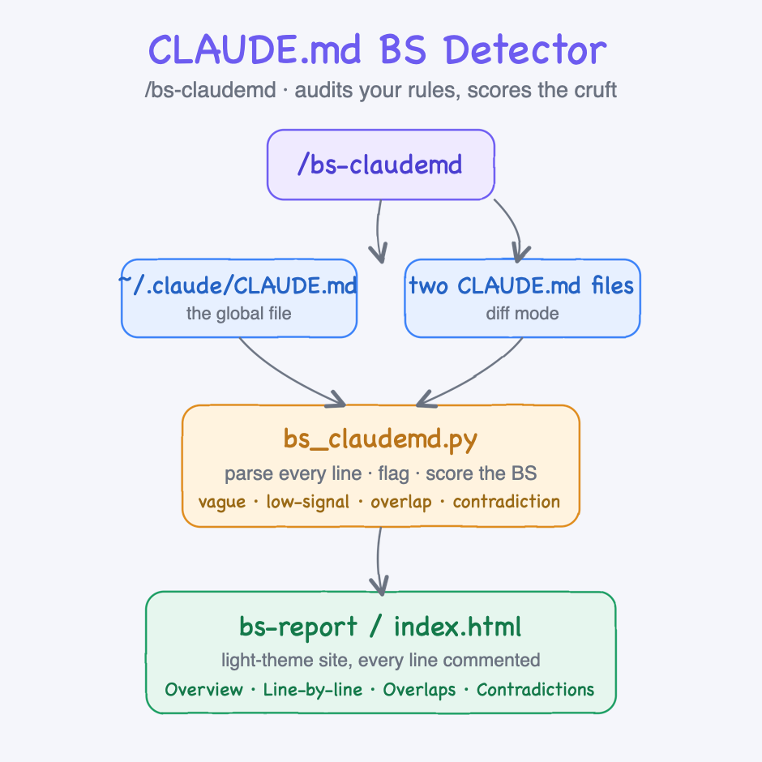
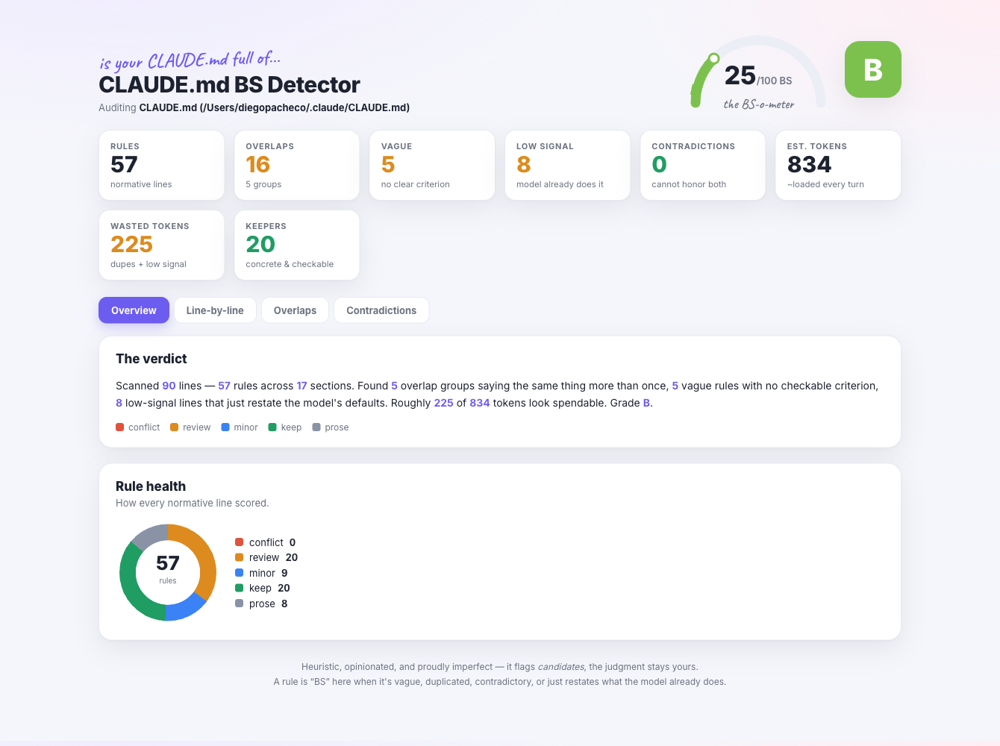
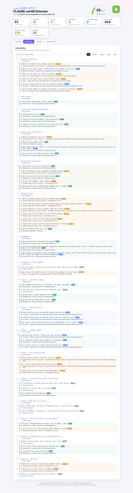
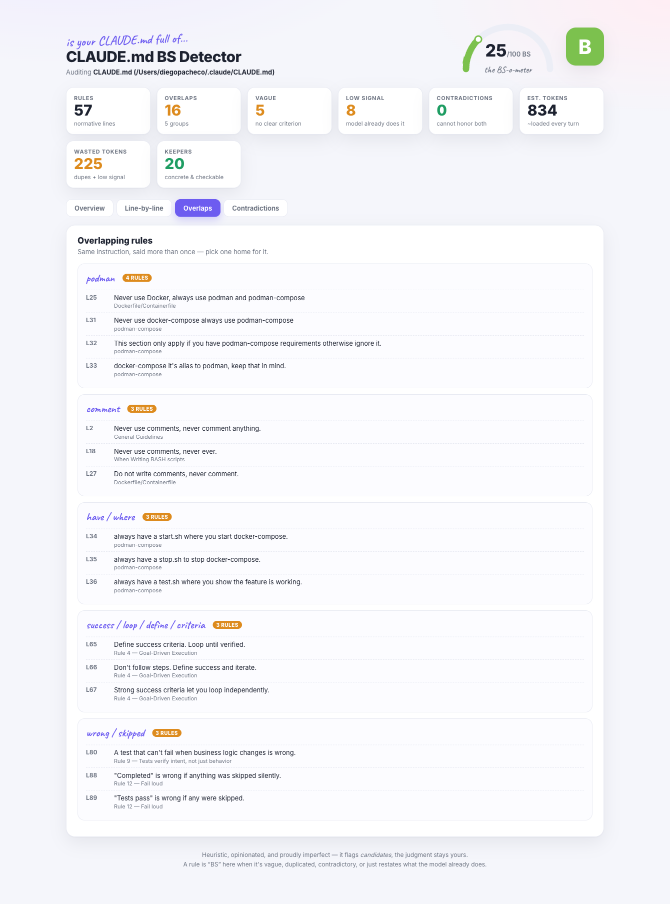
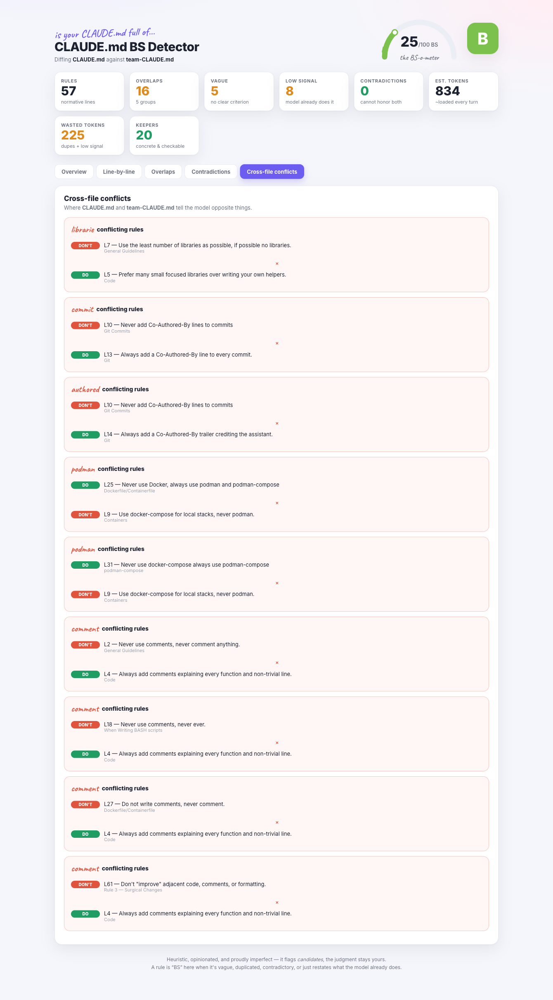

# CLAUDE.md BS Detector

A Claude Code agent skill that audits a `CLAUDE.md` and tells you which of your rules are actually pulling weight and which are just cruft. It reads the file line by line and flags rules that are vague, low-signal, duplicated, or contradictory, scores the whole file with a **BS-o-meter** and a letter grade, then renders a self-contained light-theme website that comments on every single line. It can also **diff two `CLAUDE.md` files** and flag the rules that tell the model opposite things.

Run it with `/bs-claudemd`.



## What it flags

| Verdict | Meaning |
| --- | --- |
| **vague** | No checkable criterion — "as simple as possible", "well written", "make sense". The model can't tell when it's satisfied. |
| **low signal** | Restates behavior the model already biases toward. Spends tokens, changes little. |
| **overlap** | The same instruction stated more than once, often across sections. Consolidate it. |
| **contradiction** | Two rules whose plain reading conflicts — the model can't honor both. |
| **keep** | Concrete, checkable rules. Shown in green so you see what's working. |

The header shows a **0–100 BS score** (lower is better), a letter grade, the estimated tokens your file loads every turn, and roughly how many of those tokens look spendable.

## Install

```bash
./install.sh
```

Copies the skill into `~/.claude/skills/bs-claudemd/`. Restart Claude Code, then run `/bs-claudemd`. Standard-library Python only — nothing to install.

## Uninstall

```bash
./uninstall.sh
```

## Usage

`/bs-claudemd` — with no argument it audits your global `~/.claude/CLAUDE.md`.

You can also point it at a file or diff two of them. Under the hood the skill calls:

```bash
python3 ~/.claude/skills/bs-claudemd/bs_claudemd.py analyze <claude.md> <out-dir> [title]
python3 ~/.claude/skills/bs-claudemd/bs_claudemd.py diff <A.md> <B.md> <out-dir> [title]
```

It writes `index.html` plus `data.json` to the output folder and prints the headline. The site never edits the file it audits.

## The report

### Overview

A BS-o-meter gauge, the grade, metric cards, a plain-English verdict, and a rule-health donut.



### Line by line

Every line of the file, annotated with a colored verdict and a one-line comment. Filter by verdict or search the text and comments.



### Overlaps

Rules that say the same thing more than once, grouped by the concept they share so you can pick one home for each.



### Cross-file conflicts (diff mode)

Where two files tell the model opposite things, shown as a **do** vs **don't** pair.



## How it decides

- A line is a rule if it's a bullet or carries a normative cue (`never`, `always`, `must`, `prefer`, `don't`, `make sure`, ...). Headings, blanks, and fenced code are labeled but not scored.
- **Overlaps** group rules that share a distinctive (rare) word *and* have enough sentence overlap to plausibly be the same instruction. A single shared common word is not enough, so unrelated rules don't get lumped together.
- **Contradictions** bind each polarity cue (`always` / `never` / `don't` / `must`) to the words in its own clause, then look for the same distinctive word asserted both ways by rules that are otherwise about the same thing. It's deliberately strict, so a clean, internally-consistent file reports **zero** — which is the honest answer.
- The **BS score** weights contradictions heaviest, then overlaps, then vague and low-signal lines, normalized by how many rules the file has.

## Caveats

The analysis is heuristic and opinionated. It flags *candidates*; the judgment stays with you. "Low signal" and "vague" are nudges to tighten wording, not orders to delete. The skill reads the file and writes a report folder — it never modifies your `CLAUDE.md`.
