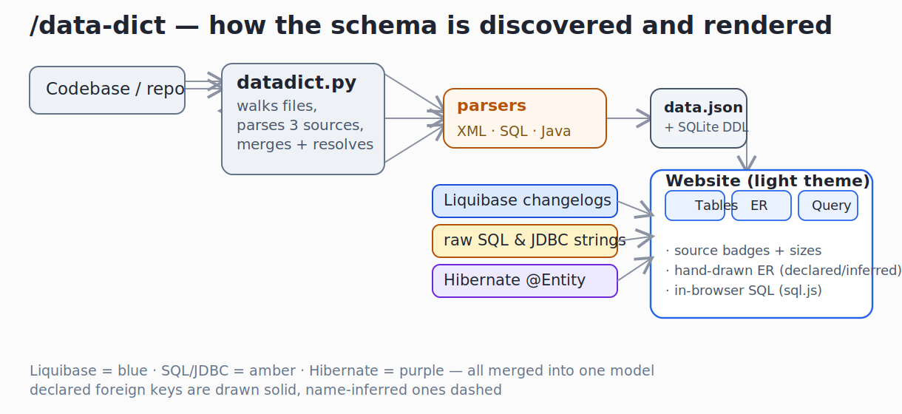
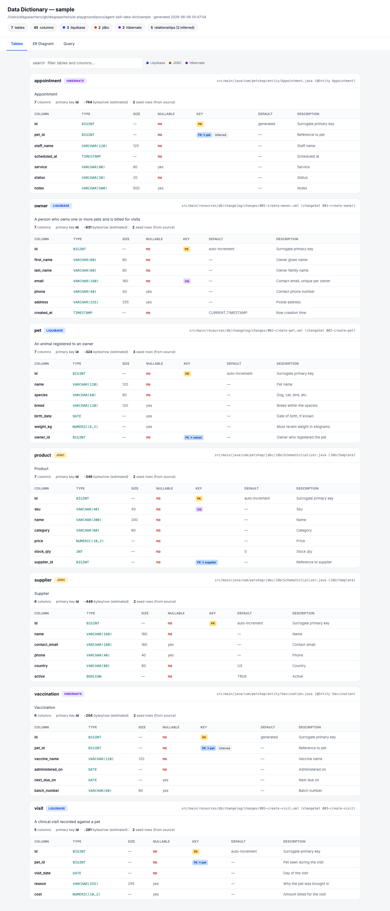
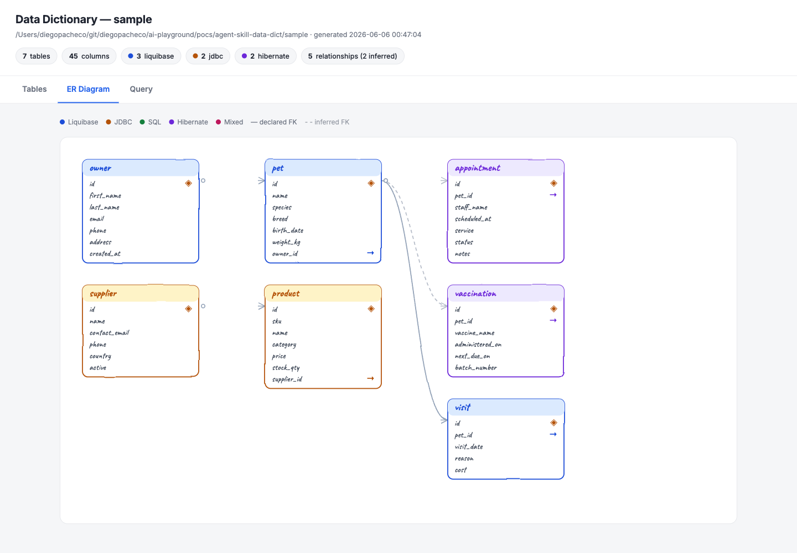
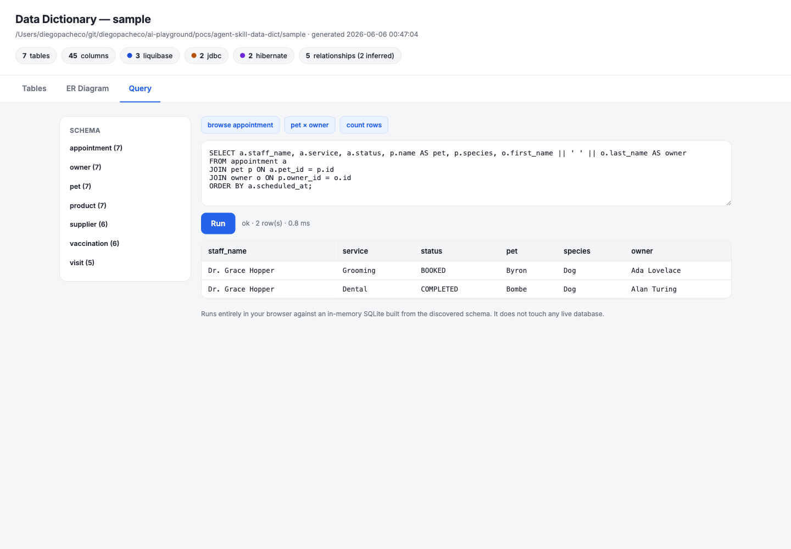

# data-dict — a Claude Code skill

`/data-dict` reads a codebase, finds the database schema **wherever it is defined**, and renders a self-contained light-theme website that documents it.

Real projects rarely keep their schema in one place. Some tables live in **Liquibase** changelogs, some are created by **raw SQL run through JDBC**, and some are generated by **Hibernate** from JPA entities — so the DDL never appears in source at all. This skill reads all three, merges them into one model of the database, and produces a data dictionary anyone on the team can read, with three tabs:

1. **Tables** — every table with its columns, types, sizes, keys, a plain-language description, and a badge saying where it came from.
2. **ER Diagram** — a hand-drawn entity-relationship diagram of the tables and their relationships.
3. **Query** — an in-browser SQL console that runs against the discovered schema, so anyone can try queries without a live database.

The skill is **generic** — it makes no assumptions about any particular project and discovers whatever schema the code defines.

## How it works



The engine (`scripts/datadict.py`, Python stdlib only) walks the target path and parses three independent sources, merges tables found under the same name, resolves foreign keys (declared and name-inferred), computes deterministic per-table facts, writes `data.json`, and injects it into `assets/template.html` to produce `index.html`. Nothing in the report is invented by the model — two runs on the same code give the same dictionary.

## The three tabs

### 1. Tables
Every table as a card: name, a source badge (**Liquibase / SQL / JDBC / Hibernate / Mixed**), the origin file, a description, column count and estimated row width, and a full column table — type, size, nullable, PK/FK/unique, default, and description. Foreign-key columns link to the referenced table. A search box filters by table or column.



### 2. ER Diagram
A hand-drawn (Excalidraw-style) ER diagram: boxes are color-coded by source, primary keys are marked, and relationships are lines — **solid for declared foreign keys, dashed for name-inferred ones**. This is what connects a Hibernate entity to a Liquibase-managed table even when no JPA mapping exists. Below, `appointment` and `vaccination` (Hibernate) link to `pet` (Liquibase) by inference, while `pet → owner`, `visit → pet`, and `product → supplier` are declared.



### 3. Query
An in-browser SQL console (SQLite compiled to WebAssembly via `sql.js`) built from the discovered schema and seeded with any `INSERT`s found in the source. Type any SQL and see the results, row count, and timing. It runs **entirely in the browser and never touches a live database**. The screenshot shows a query joining across all three sources — `appointment` (Hibernate) → `pet` (Liquibase) → `owner` (Liquibase):



## What it discovers

| Source | What the engine reads |
|---|---|
| **Liquibase** | XML changelogs (`createTable`, `addColumn`, `addForeignKeyConstraint`, `addPrimaryKey`, `dropColumn`, `<sql>`), formatted-SQL changelogs, and JSON changelogs. Reads table/column `remarks`, types with sizes, constraints, and references. |
| **Raw SQL / JDBC** | `CREATE TABLE` / `ALTER TABLE ADD COLUMN` in `.sql` files and in SQL strings embedded in Java (text blocks and `+`-concatenated literals, e.g. `jdbcTemplate.execute("CREATE TABLE ...")`). Parses columns, types/sizes, `NOT NULL`, `DEFAULT`, `PRIMARY KEY`, `UNIQUE`, and `FOREIGN KEY`. |
| **Hibernate / JPA** | `@Entity` classes — `@Table`, `@Column(name/length/nullable/precision/scale)`, `@Id`, `@GeneratedValue`, `@ManyToOne`/`@JoinColumn`, `@Enumerated`. Reconstructs the table Hibernate would generate, including the default `CamelCase → snake_case` naming. |

Tables seen from more than one source are merged and labeled **Mixed**. Relationships are resolved from declared foreign keys first, then any `<name>_id` column whose `<name>` matches a known table is linked as an **inferred** relationship.

## Install / uninstall

```bash
./install.sh      # copies the skill into ~/.claude/skills/data-dict
./uninstall.sh    # removes it
```

`install.sh` warns if `python3` is missing (the engine needs it).

## Usage

```
/data-dict                 scan the current repository
/data-dict sample/         scan a subdirectory (the bundled sample app)
/data-dict <path>          scan any path
```

The report is written to `data-dict-report/index.html` (and `data.json`) in the current directory and opened in the browser.

## The sample app (`sample/`)

A runnable petshop service whose schema is deliberately split across all three mechanisms, so the skill has something real and mixed to discover. It is only a fixture — the skill never reads it specially.

- **Stack**: Java 25, Spring Boot 4.0.6, H2 (in-memory), Maven.
- **3 tables via Liquibase**: `owner`, `pet`, `visit`.
- **2 tables via raw SQL/JDBC** (`JdbcTemplate.execute` at startup): `supplier`, `product`.
- **2 tables via Hibernate** (`@Entity`, `ddl-auto=update`): `appointment`, `vaccination`.

Relationships span the sources: `pet → owner`, `visit → pet`, `product → supplier` are declared; `appointment → pet` and `vaccination → pet` are inferred (because `pet` is not a JPA entity).

Run and verify it (boots the app and asserts all 7 tables exist in one running database):

```bash
cd sample
./test.sh
```

Recorded output:

```
tables in running database: ["APPOINTMENT","DATABASECHANGELOG","DATABASECHANGELOGLOCK","OWNER","PET","PRODUCT","SUPPLIER","VACCINATION","VISIT"]
PASS: all 7 tables created across Liquibase, JDBC and Hibernate
```

`start.sh` / `stop.sh` run and stop the app on `http://localhost:8080` (`/api/tables` lists the live tables).

> Note for Spring Boot 4: autoconfiguration was split into per-technology modules, so Liquibase needs `spring-boot-starter-liquibase` on the classpath — `liquibase-core` alone no longer activates it.

## What the skill produces on the sample

```
Tables discovered: 7 (45 columns)
  hibernate: 2
  jdbc: 2
  liquibase: 3
Relationships: 5 (2 inferred)
```

## Files

```
agent-skill-data-dict/
  design-doc.md          the design document
  README.md              this file
  install.sh             installs the skill into ~/.claude/skills/data-dict
  uninstall.sh           removes it
  SKILL.md               orchestration the model follows
  scripts/datadict.py    the discovery + render engine (stdlib only)
  assets/template.html   the light-theme website template
  sample/                the mixed-schema petshop fixture
  data-dict-report/      a generated report (from running the skill on sample/)
  printscreens/          architecture diagram + tab screenshots
```

## Notes and limitations

- The query tab uses SQLite, so vendor-specific SQL won't run identically; types are normalized and exotic ones degrade to `TEXT`.
- With no live database there are no real row counts — "size" means schema size (columns, declared lengths, estimated row width), never fabricated statistics.
- Hibernate DDL is reconstructed from annotations, not generated by Hibernate; it covers the common annotation set.
- Inferred foreign keys are shown visually distinct (dashed) from declared ones.
- The page is self-contained except for two on-demand resources: `sql.js` (query tab) and the Caveat handwriting font (diagram); both degrade gracefully offline.
