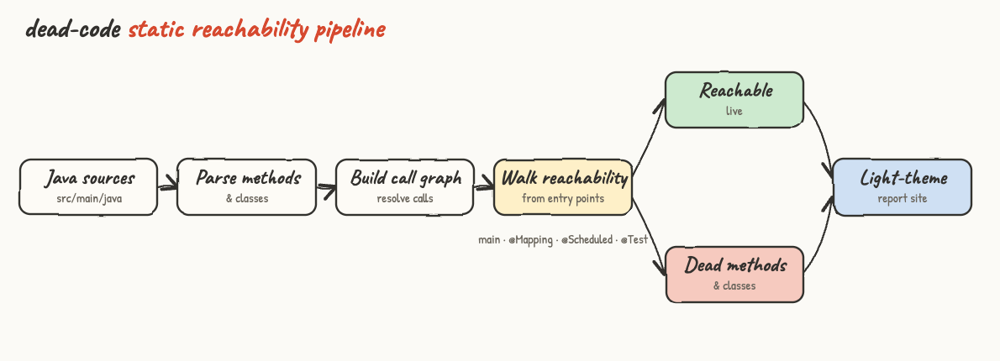
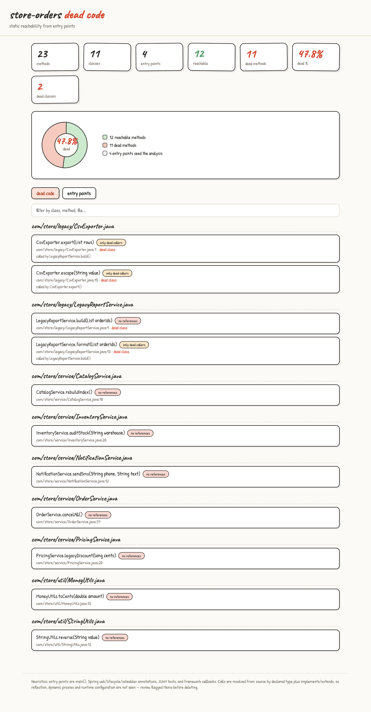
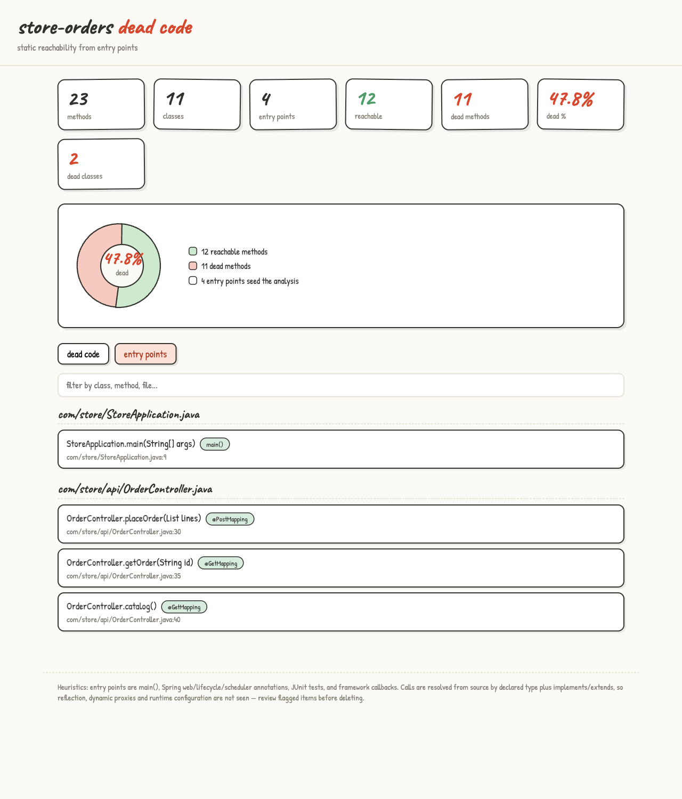

# dead-code

A Claude Code skill that finds dead Java code by **static reachability from entry points** and renders a light-theme website with summaries and the full list of dead code.

A method is *dead* when it cannot be reached, directly or transitively, from any real entry point of the program. The skill parses the sources, builds the method call graph, seeds a walk from the true entry points (`main`, Spring web/lifecycle/scheduler handlers, JUnit tests, framework callbacks), and reports everything the walk never touches.

## Pipeline



1. **Java sources** — point the skill at `src/main/java` (or any directory of `.java` files).
2. **Parse methods & classes** — every method declaration, its annotations, and each class's `implements`/`extends`.
3. **Build call graph** — calls are resolved from the declared type of fields, parameters and locals, widened through interface and superclass relationships so a call through an interface reaches its implementations.
4. **Walk reachability** — breadth-first from the entry points over the call graph.
5. **Split** — everything reached is *live*; everything else is *dead* (split again into `no references` and `only dead callers`, and classes where every method is dead).
6. **Light-theme report site** — a single self-contained `index.html`.

## Install

```
./install.sh
```

Copies the skill to `~/.claude/skills/dead-code/`. Restart Claude Code, then run `/dead-code` inside any Java project.

```
./uninstall.sh
```

## Usage

Run the command in a Java project:

```
/dead-code
```

The skill runs the analyzer and writes `dead-code-site/index.html`:

```
python3 ~/.claude/skills/dead-code/find_dead_code.py <java-src-dir> <out-dir> [title]
```

It needs only Python 3 (standard library). Open the file directly or serve it with `python3 -m http.server`.

## What counts as an entry point

Reachability roots are detected from the source, not assumed:

- `main(String[])`
- Spring web mappings: `@GetMapping`, `@PostMapping`, `@PutMapping`, `@DeleteMapping`, `@PatchMapping`, `@RequestMapping`, `@ExceptionHandler`
- Spring lifecycle and messaging: `@Bean`, `@PostConstruct`, `@PreDestroy`, `@EventListener`, `@Scheduled`, `@KafkaListener`, `@RabbitListener`, `@JmsListener`, `@MessageMapping`
- JUnit: `@Test`, `@ParameterizedTest`, `@RepeatedTest`, and `@BeforeEach`/`@AfterEach`/`@BeforeAll`/`@AfterAll`
- Framework callbacks: public `run`, `call`, `doFilter`, `onApplicationEvent`, `convert`, ... on classes implementing `CommandLineRunner`, `ApplicationRunner`, `Runnable`, `Callable`, `Filter`, `HandlerInterceptor` and similar

## The report

### Dead code



Summary cards show total methods, classes, entry points, reachable methods, dead methods, dead percentage and dead classes. The donut shows the reachable-vs-dead split. The **dead code** tab lists every unreachable method grouped by file with its `file:line`, a reason tag, who calls it, and a marker when the whole class is dead:

- `no references` — nothing in the codebase calls it.
- `only dead callers` — called only from other dead code (a dead chain).

### Entry points



The **entry points** tab shows the seeds the analysis started from, so the result is auditable. The search box filters every list by class, method, or file.

## Sample app

`sample/` is a Java 25 / Spring Boot 4.0.6 order service, built to contain known dead code.

```
cd sample
mvn -DskipTests package
python3 ~/.claude/skills/dead-code/find_dead_code.py src/main/java dead-code-site store-orders
```

The build passes and the analyzer reports:

```
23 methods, 4 entry points, 12 reachable, 11 dead (47.8%), 2 dead classes
```

The live path is `OrderController` (web handlers) → `OrderService` → `PricingService`/`InventoryService`/`NotificationService` and `CatalogService` → `StringUtils`/`MoneyUtils`. The dead code is real:

- `legacy/LegacyReportService` and `legacy/CsvExporter` are whole **dead classes** — `CsvExporter.export` and `escape` are flagged `only dead callers` because they are reached only from the dead `LegacyReportService`.
- Unused methods scattered across live classes: `OrderService.cancelAll`, `PricingService.legacyDiscount`, `InventoryService.auditStock`, `NotificationService.sendSms`, `CatalogService.rebuildIndex`, `StringUtils.reverse`, `MoneyUtils.toCents` — all `no references`.

## Limits

Static analysis cannot see reflection, dynamic proxies, dependency injection wired only at runtime, serialization, or methods invoked purely from configuration or an external framework. The report is a strong candidate list — review each item before deleting.
