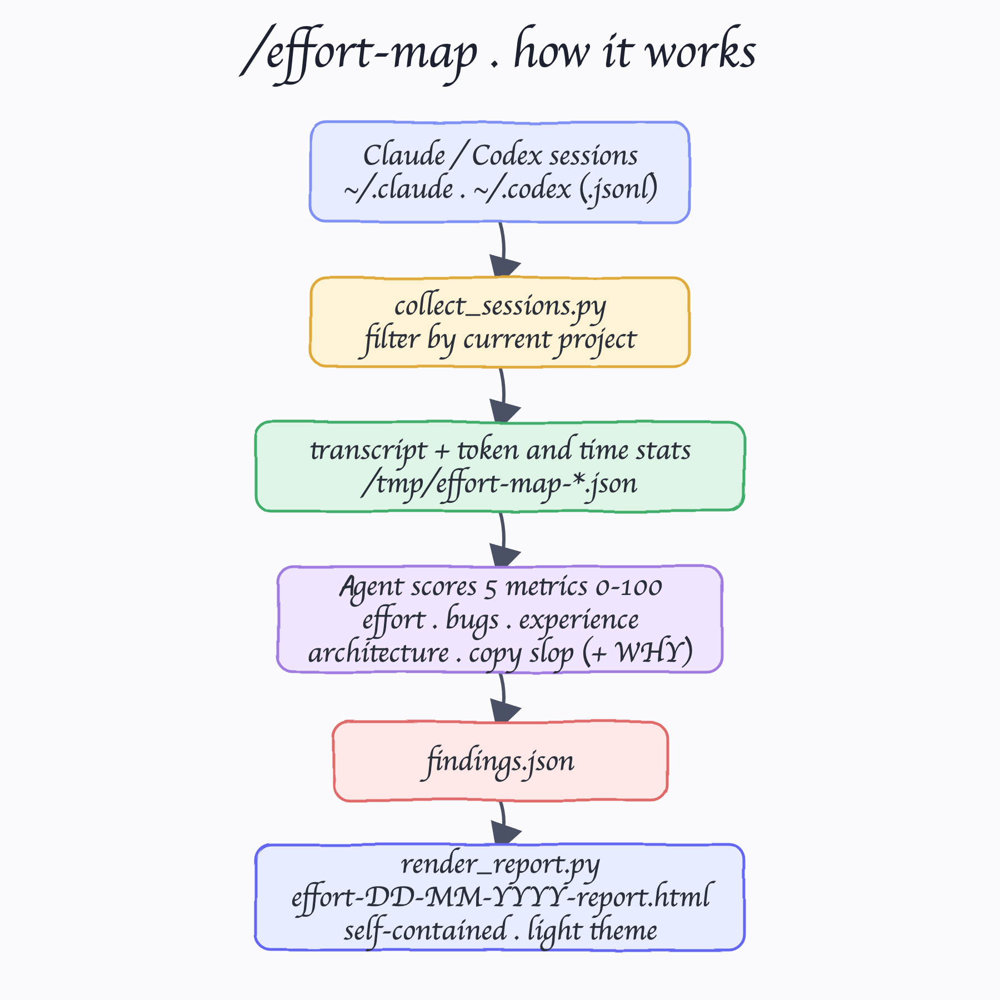
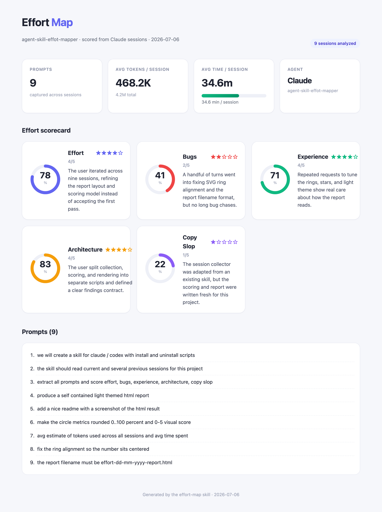

# effort-map

A skill for **Claude Code** and **Codex** that reads the current project's agent sessions and scores how much real effort went into it. Run it with `/effort-map` inside any project and it produces a self-contained, light-theme HTML report.

## What it does

It reads the current and several previous sessions for the folder you are in, then extracts:

- **All prompts** you typed in this project.
- **Five effort metrics**, each as a rounded 0–100% ring plus a 0–5 visual score and one sentence of WHY:
  - **Effort** — how much you reasoned and iterated versus one-shotting.
  - **Bugs** — how much time went into chasing and fixing bugs.
  - **Experience** — how much you tuned the UX versus generate-and-done.
  - **Architecture** — how much you cared about stack and structure.
  - **Copy slop** — how much was copied with no changes or taste.
- **Average tokens** used per session (and total across all sessions).
- **Average time** spent per session, shown as a visual bar.

The result is written to `effort-DD-MM-YYYY-report.html` in the current folder.

## How it works



1. `collect_sessions.py` scans `~/.claude/projects` (Claude) or `~/.codex/sessions` (Codex), keeps only the sessions whose working directory is the current project, and writes a normalized transcript plus token and time stats.
2. The agent reads the transcript, extracts every prompt, and scores the five metrics from the evidence — never from a guess.
3. The token and time numbers are computed by the collector, not invented, and merged into `findings.json`.
4. `render_report.py` turns `findings.json` into the final self-contained HTML report.

## The report



The report is a single HTML file with no external dependencies, styled light and clean: a stats row (prompts, avg tokens, avg time, agent), a scorecard of five ring cards, and the full list of prompts.

## Install

```bash
./install.sh
```

You will be asked to choose the target:

```
Install the effort-map skill for:
  1) Claude
  2) Codex
  3) Both
```

- **Claude** installs to `~/.claude/skills/effort-map`.
- **Codex** installs to `~/.codex/skills/effort-map` and registers the `~/.codex/prompts/effort-map.md` command.

## Uninstall

```bash
./uninstall.sh
```

Same 1/2/3 prompt, removes the skill from the chosen target(s).

## Usage

Open any project in Claude Code or Codex and run:

```
/effort-map
```

## Layout

```
effort-map/
  SKILL.md                    skill instructions
  scripts/
    collect_sessions.py       gather sessions + token/time stats
    render_report.py          render the HTML report
install.sh                    interactive install (Claude / Codex / Both)
uninstall.sh                  interactive uninstall
printscreens/                 README images
```
