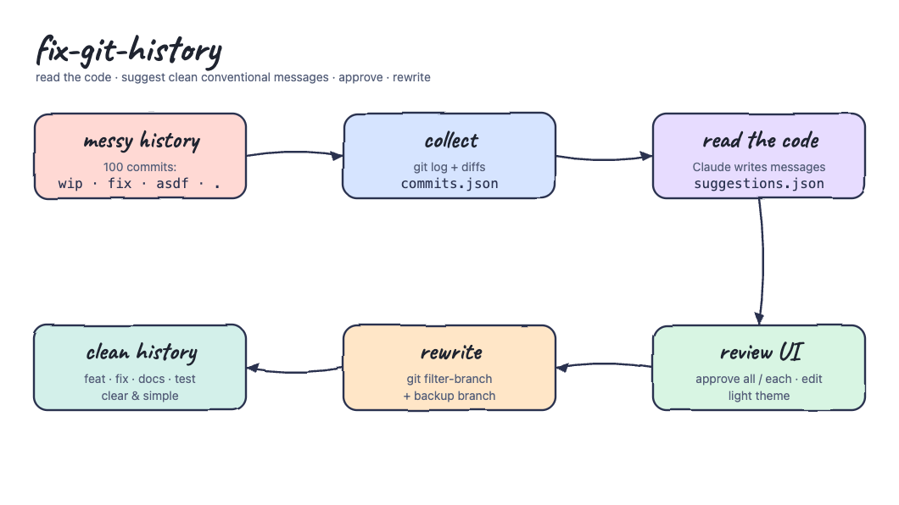
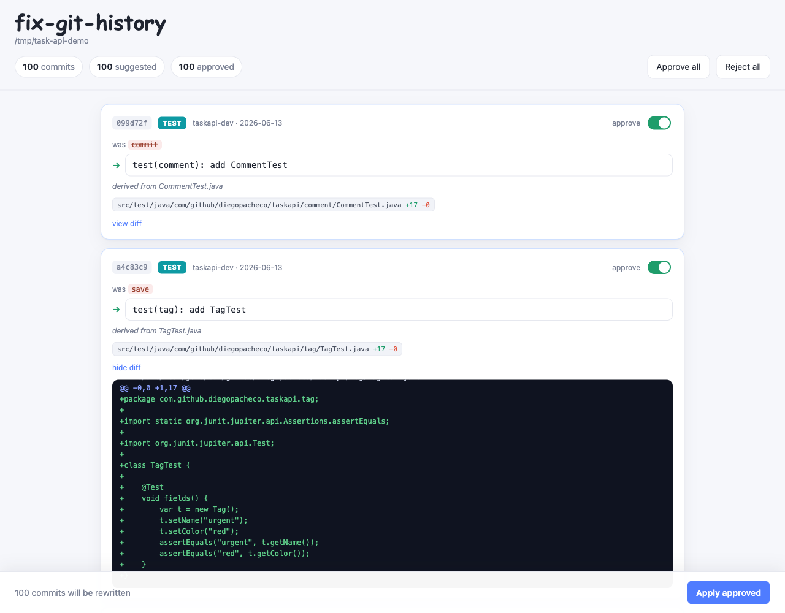
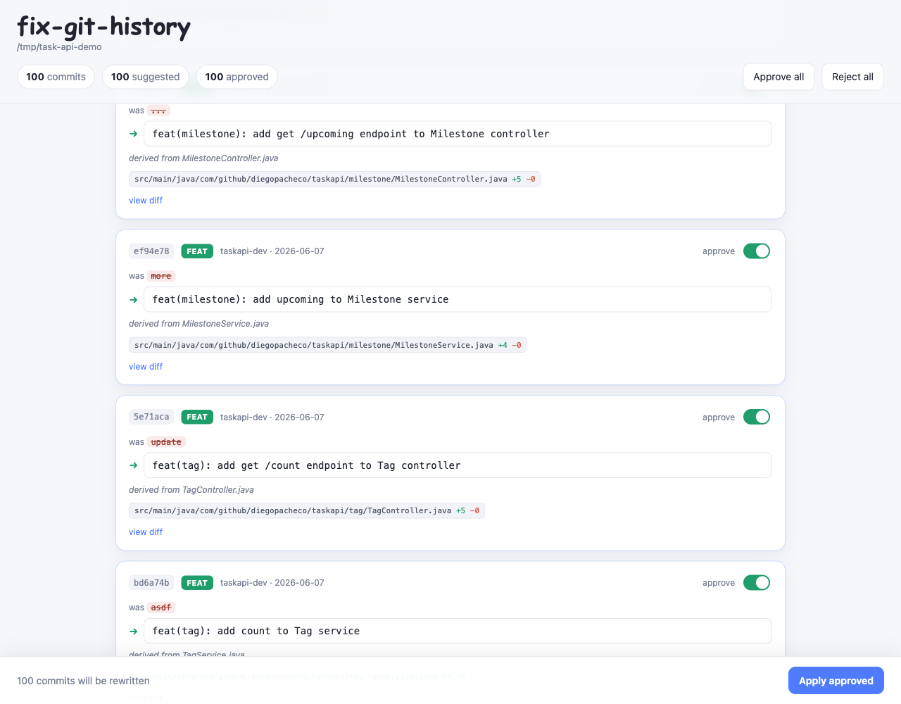
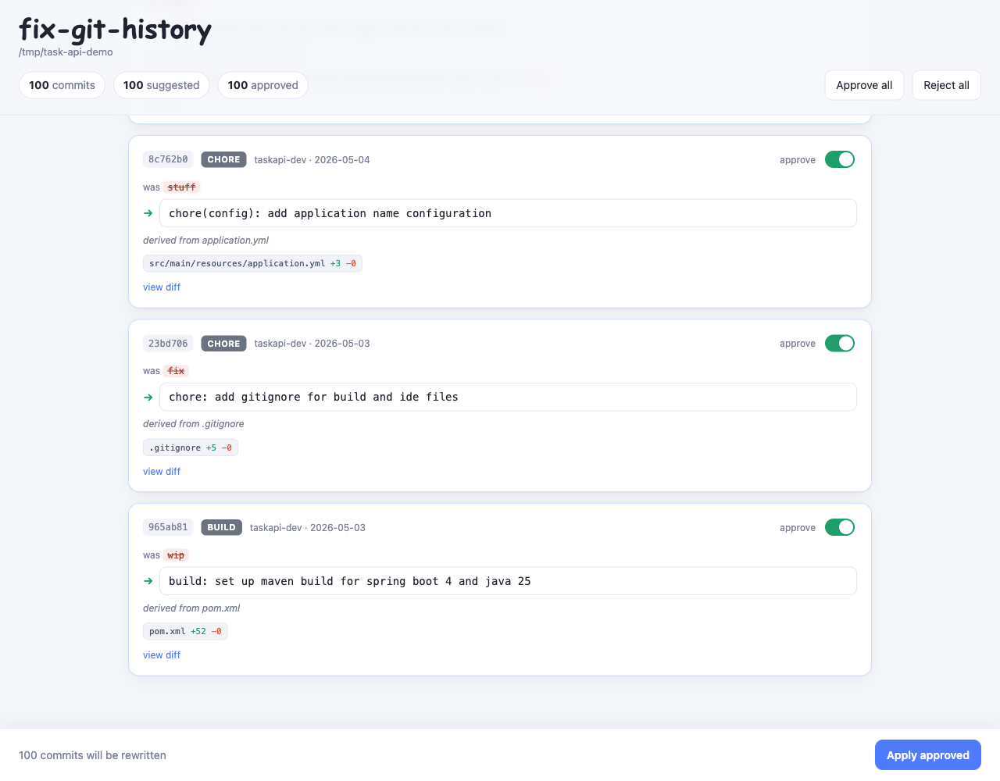
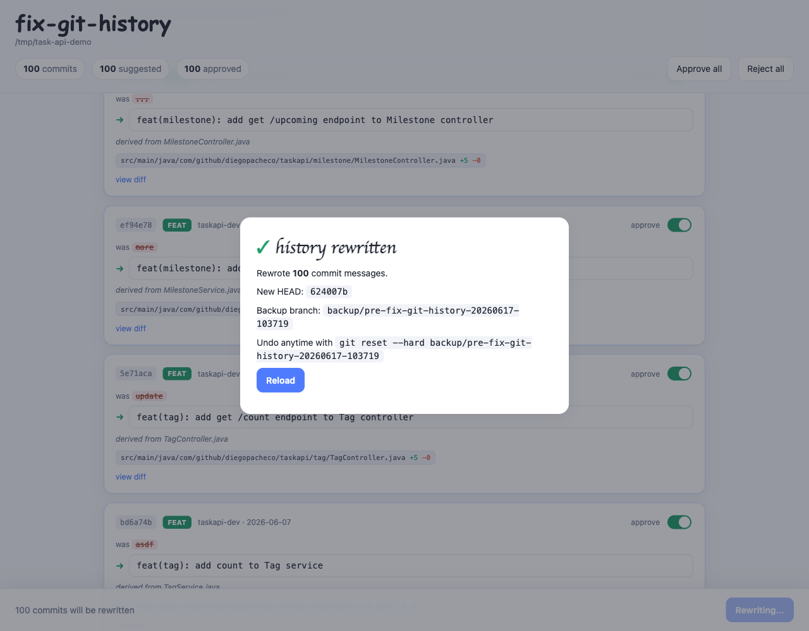

# fix-git-history

A Claude Code agent skill that rewrites a messy commit history into clean
conventional-commit messages. It reads the last N commits **with their diffs**,
proposes a clear message for each one by looking at what the code actually
changed, and opens a light-theme review UI where you approve every change —
all at once or one by one — before anything is rewritten.



## What it does

Run `/fix-git-history` in any git repository and the skill:

1. **collects** the last 100 commits (hash, author, date, old message, changed
   files, and a truncated diff) into a JSON file.
2. **reads the code** of every commit and writes a new message in
   `type(scope): summary` form. The type and summary come from the diff, not
   from the old message — so `wip`, `fix`, `asdf` and `.` become things like
   `feat(task): add status filtering to task search`.
3. opens a **light-theme review UI** on `localhost`. Each commit shows the old
   message struck through, the suggested new one (editable), the changed files
   and a one-line reason. You toggle each commit on or off, use **Approve all**
   or **Reject all**, then click **Apply approved**.
4. **rewrites** only the approved messages with `git filter-branch --msg-filter`,
   after first creating a `backup/pre-fix-git-history-<timestamp>` branch. Trees
   and parents are untouched; only the messages change.

## Install

```bash
./install.sh
```

This copies the skill to `~/.claude/skills/fix-git-history`. Restart Claude Code,
then run `/fix-git-history` inside any git repository.

```bash
./uninstall.sh
```

The skill uses only the Python standard library and the `git` already on your
machine. Nothing is installed.

## The review UI

The newest commits first; every suggested change is approved by default.



Messages are derived from the diff. Adding an endpoint becomes
`feat(tag): add get /count endpoint to Tag controller`; adding a service method
becomes `feat(milestone): add upcoming to Milestone service`.



Build, config and docs commits are classified too — `wip` on the first commit
becomes `build: set up maven build for spring boot 4 and java 25`.



Clicking **Apply approved** creates the backup branch, rewrites the history and
tells you exactly how to undo it.



## Try it on the sample

The `sample/` folder generates a throwaway git repository containing a real
**Spring Boot 4.0.6 / Java 25** Task API, built across **exactly 100 commits**,
each with a deliberately bad message (`wip`, `fix`, `stuff`, `asdf`, `...`).
Every commit is a genuine incremental change, so the skill has real code to read.

```bash
./sample/make-bad-history.sh /tmp/task-api-bad-history
cd /tmp/task-api-bad-history
git log --oneline | head
```

Then from that directory run `/fix-git-history` in Claude Code.

The generated project is a complete Task API — `User`, `Project`, `Task`, `Tag`,
`Comment` and `Milestone` entities, each with a JPA repository, a service, a REST
controller and tests — and it builds and passes its tests:

```
mvn test
...
[INFO] Tests run: 11, Failures: 0, Errors: 0, Skipped: 0
[INFO] BUILD SUCCESS
```

The `@SpringBootTest` context load runs on Spring Boot 4.0.6 with Java 25 and an
embedded H2 database.

## How the rewrite stays safe

- The working tree must be clean; the skill refuses to run with uncommitted
  changes to tracked files.
- A `backup/pre-fix-git-history-<timestamp>` branch is created before the
  rewrite. Undo any time with `git reset --hard <backup-branch>`.
- Only the commits you approve change. Rewriting a message changes the hash of
  that commit and every commit after it, which is what the backup is for.
- Do not run it on a branch others have already pulled unless you intend the
  rewritten hashes to diverge from the remote.

## Layout

```
install.sh / uninstall.sh   install the skill into ~/.claude/skills
skill/SKILL.md              instructions Claude follows
skill/fix_git_history.py    collect + serve (light-theme UI) + apply (rewrite)
sample/make-bad-history.sh  generate the 100-bad-commit sample repo
sample/generate_history.py  builds the Spring Boot 4 / Java 25 Task API
printscreens/               diagram and UI screenshots
```

## Verified end to end

Against the generated sample repo: collect read all 100 commits, the suggestions
covered all 100, the UI rendered 100 cards, and **Apply approved** rewrote 100
messages, left the commit count at 100, and created the backup branch
`backup/pre-fix-git-history-<timestamp>`.
