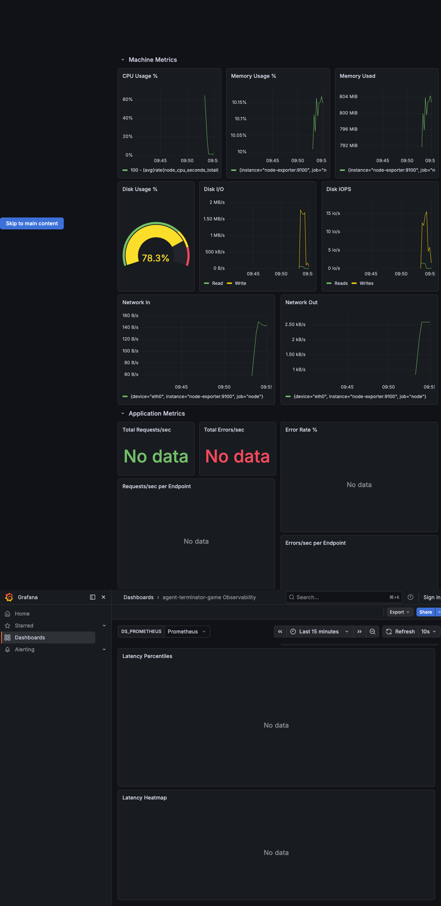

# Sample: agent-terminator-game

This skill was run against the [agent-terminator-game](https://github.com/diegopacheco/ai-playground/tree/main/pocs/agent-terminator-game) project, a Spring Boot 4.0.2 (Java 25) game with SQLite.

## Grafana Dashboard



The dashboard has two sections:

**Machine Metrics** - CPU usage, memory usage %, memory used bytes, disk usage % gauge, disk I/O read/write, disk IOPS, network in/out. All powered by node_exporter.

**Application Metrics** - Total requests/sec, total errors/sec, error rate %, requests/sec per endpoint, errors/sec per endpoint, latency percentiles (p50, p70, p90, p95, p99, p99.9) overlaid, and latency heatmap.

## Generated Files

The skill generated these files in the project root:

| File | Purpose |
|------|---------|
| `grafana/dashboards/dashboard.json` | Grafana dashboard with all panels and PromQL queries |
| `grafana/provisioning/datasources/datasources.yaml` | Prometheus datasource auto-provisioned |
| `grafana/provisioning/dashboards/dashboards.yaml` | Dashboard auto-provisioned from file |
| `prometheus/prometheus.yml` | Scrape config for the app on port 8080 and node-exporter |
| `podman-compose.yaml` | Three containers: grafana, prometheus, node-exporter |
| `run-grafana.sh` | Starts the stack and waits for Grafana to be ready |
| `stop-grafana.sh` | Stops the stack |
| `test-grafana.sh` | Verifies grafana, prometheus, dashboard, and datasource are healthy |

## Stack Detection

The skill detected:
- **Stack**: Spring Boot (from `backend/pom.xml`)
- **App Port**: 8080 (from `application.properties`)
- **Metrics Path**: `/actuator/prometheus`
- **Endpoints**: discovered from `@GetMapping`, `@PostMapping`, `@DeleteMapping` annotations

## Spring Boot Metrics Requirements

For latency panels (percentiles + heatmap) to work, the app needs these in `pom.xml`:
```xml
<dependency>
    <groupId>org.springframework.boot</groupId>
    <artifactId>spring-boot-starter-actuator</artifactId>
</dependency>
<dependency>
    <groupId>io.micrometer</groupId>
    <artifactId>micrometer-registry-prometheus</artifactId>
</dependency>
```

And these in `application.properties`:
```properties
management.endpoints.web.exposure.include=prometheus,health
management.metrics.distribution.percentiles-histogram.http.server.requests=true
management.metrics.distribution.minimum-expected-value.http.server.requests=1ms
management.metrics.distribution.maximum-expected-value.http.server.requests=10s
```

Without `percentiles-histogram=true`, Spring Boot does not expose `http_server_requests_seconds_bucket` metrics and the latency panels will show "No data".

## How to Run

1. Start the app on port 8080
2. Run `./run-grafana.sh`
3. Open http://localhost:3000
4. Run `./test-grafana.sh` to verify
5. Run `./stop-grafana.sh` to stop
