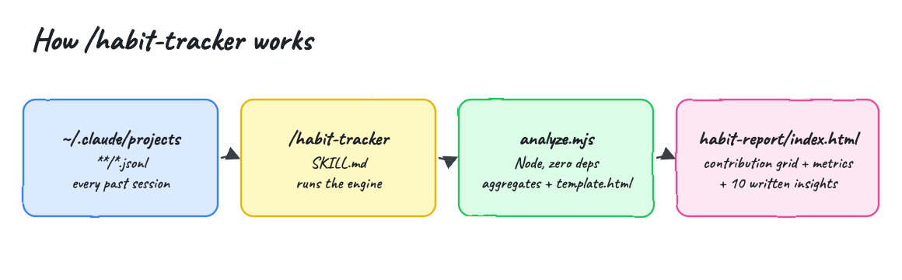
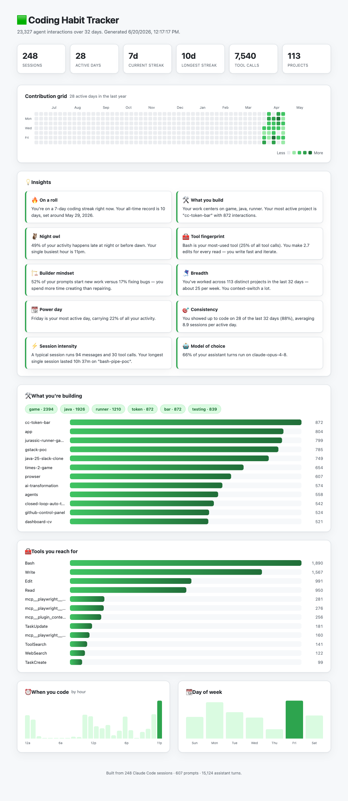
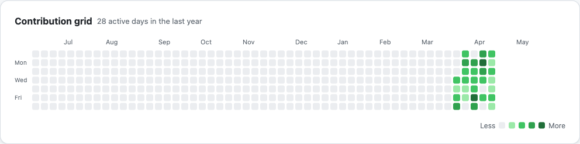
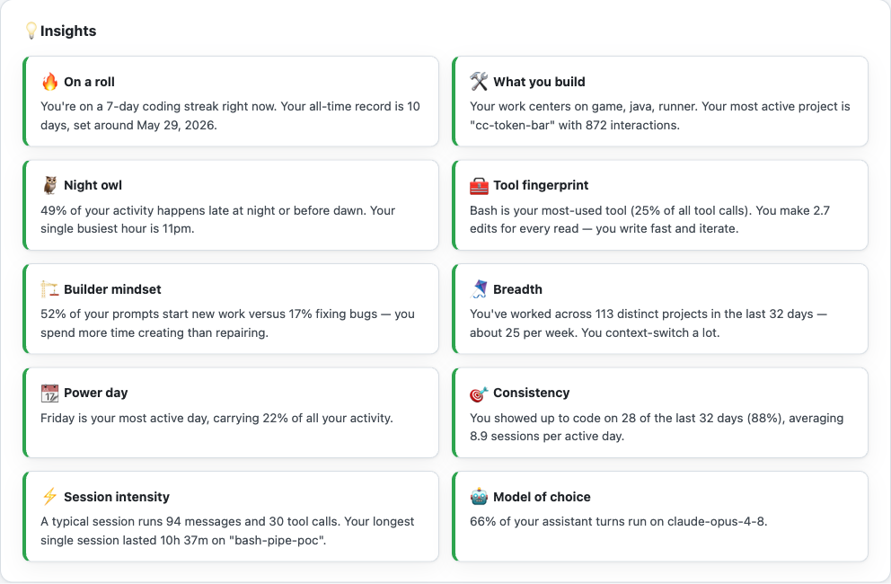

# habit-tracker

A Claude Code (and Codex) agent skill. Run `/habit-tracker` and it reads every past Claude Code session on your machine, then renders a self-contained, light-theme website with a GitHub-style contribution grid, visual metrics, and a set of written insights about your agent coding habits and what you have been building.

Nothing is estimated — every number comes from your real session logs under `~/.claude/projects`.

## How it works



The skill runs one Node script with no dependencies. It walks `~/.claude/projects/**/*.jsonl`, reads each session line (timestamp, working directory, git branch, model, message content), aggregates the activity, picks the most salient insights, and writes `habit-report/index.html` plus `habit-report/data.json` into the current directory.

## Install

```bash
./install.sh
```

This copies the skill to `~/.claude/skills/habit-tracker` (and to `~/.codex/skills/habit-tracker` if Codex is present). It needs `node` and has no other dependencies.

## Uninstall

```bash
./uninstall.sh
```

## Usage

In Claude Code:

```
/habit-tracker
```

The skill writes the report and points you at `habit-report/index.html`. Open it in any browser — it is one file with the grid, charts, and insights inlined, no server or network needed.

You can also run the engine directly:

```bash
node ~/.claude/skills/habit-tracker/scripts/analyze.mjs habit-report
```

## What it reads

| Source | What it becomes |
| --- | --- |
| timestamp of every message | contribution grid, streaks, hour-of-day, day-of-week |
| working directory | top projects and what you are building |
| git branch | project context |
| `tool_use` blocks | tool-usage fingerprint |
| user prompt wording | builder vs fixer vs refactor vs explore split |
| model field | model-of-choice share |
| session id | session count, duration, intensity |

## The report

A light-theme website. The header carries six stat cards (sessions, active days, current streak, longest streak, tool calls, projects), followed by the contribution grid, the insights, what you are building, the tools you reach for, and when you code.



### Contribution grid

One square per day for the last year, shaded in five steps by how many interactions happened that day, with month and weekday labels and a hover tooltip — the GitHub graph, for your agent coding.



### Insights

The engine builds a pool of candidate insights, scores each by how salient it is for your data, and renders the top ten that apply. The set changes as your habits change. Candidates include:

- **On a roll** — your current streak and your all-time longest.
- **What you build** — the dominant themes across your project names and your most active project.
- **Night owl / early bird / peak hour** — when your activity concentrates.
- **Tool fingerprint** — your most-used tool and your read-to-edit ratio.
- **Builder vs fixer** — how much of your work starts new things versus fixing them.
- **Breadth** — how many distinct projects you juggle and how fast you switch.
- **Power day** — your most active weekday.
- **Weekend warrior** — how much you build off the clock.
- **Session intensity** — typical messages and tool calls per session, and your marathon session.
- **Momentum** — last 30 days versus the previous 30 (shown once you have enough history).
- **Consistency** — days you showed up out of the span, and sessions per active day.
- **Model of choice** — which model runs most of your turns.



## Test

```bash
./test.sh
```

It runs the engine against your real `~/.claude` data and asserts the report was written with a non-empty grid, counted interactions, and at least five insights.

```
running analyzer against /Users/diegopacheco/.claude
Scanned 248 session files.
23,327 interactions, 248 sessions, 28 active days across 32 days.
Current streak 7d, longest 10d. Busiest hour 11pm, busiest day Friday.
Top project: cc-token-bar. Generated 10 insights.
checks passed: 23327 interactions, 10 insights, 28 active days
PASS report written to habit-report/
```

## Layout

```
install.sh          copy the skill into the Claude/Codex global dir
uninstall.sh        remove it
test.sh             run the engine against ~/.claude and assert output
skill/SKILL.md      the skill definition Claude loads
skill/scripts/analyze.mjs   the Node engine, zero dependencies
skill/assets/template.html  the light-theme report shell
```
