# Codebase Inventory Skill

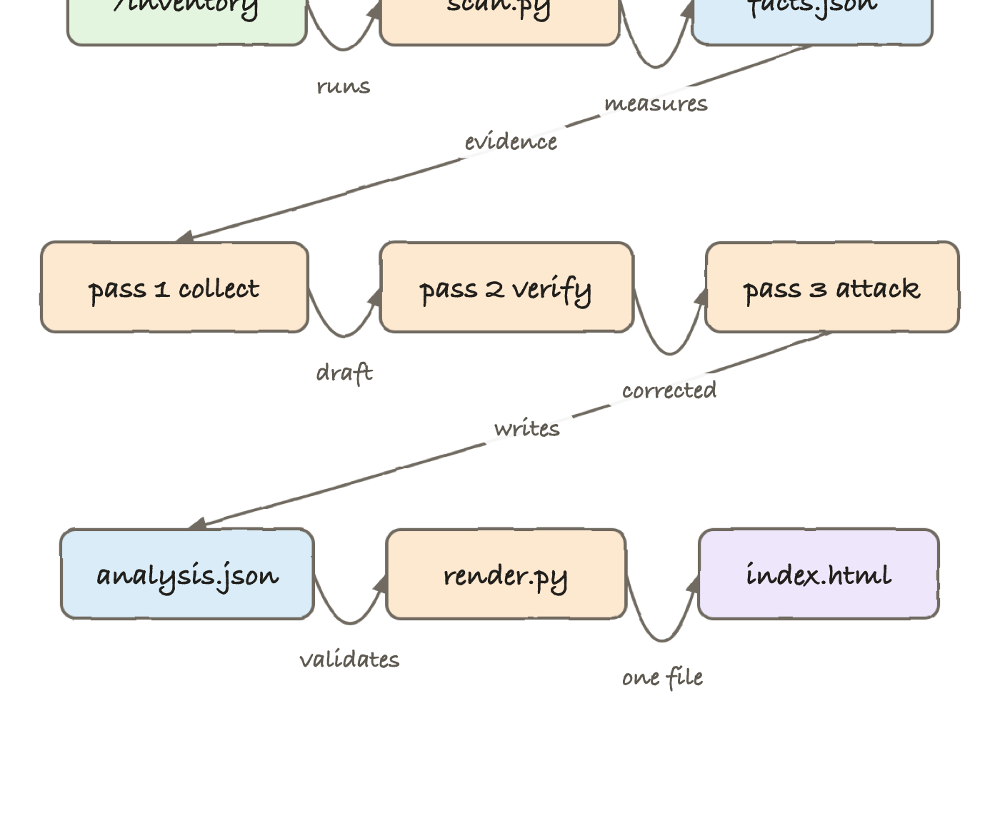

A Claude Code and Codex skill. `/inventory` scans a codebase **three times**,
cross-checks every claim against the files on disk, and writes one
self-contained light-themed searchable HTML report with seven tabs:
architecture, modules, schema, committers, tech debt, observability and tests.

The report is a single `index.html`. No server, no assets, no build. Open it,
mail it, read it offline.

👉 **[See a real report](sample/index.html)** — a full run against a Rust +
React codebase, committed in [`sample/`](sample/).

## How it works

`scan.py` reads the repository and measures it: modules, languages, git
authors, test files and cases by kind, log statements by level, SQL tables,
risky queries, TODO markers, long functions, credential-shaped literals. It
writes `facts.json`. It never draws a conclusion.

The agent then makes three passes over that evidence and the real files.
**Pass 1** collects a draft. **Pass 2** re-opens every file and checks each
path, line number and count against disk and against `facts.json`, recording
every correction. **Pass 3** attacks what is left: it deletes anything no file
proves, resolves contradictions between tabs, and rewrites prose that runs long
or reaches for a metaphor.

`render.py` is the gate. It refuses to build a report when a path does not
exist, a module lacks exactly 5 pros and 5 cons, a count disagrees with the
scan, an edge points at a node that is not there, or the analysis claims fewer
than three passes. A rejected report prints the exact problems and the agent
fixes the analysis, not the validator.

## Architecture

The diagram above is generated by the skill's own renderer. Read it as three
rows: measure, then check three times, then validate and render.

| Stage | What runs | Output |
| --- | --- | --- |
| Measure | `skills/inventory/scripts/scan.py` | `facts.json` — evidence with paths and line numbers |
| Pass 1 | [`prompts/pass-1-collect.md`](prompts/pass-1-collect.md) | a first draft of `analysis.json` |
| Pass 2 | [`prompts/pass-2-verify.md`](prompts/pass-2-verify.md) | every claim checked against disk |
| Pass 3 | [`prompts/pass-3-adversarial.md`](prompts/pass-3-adversarial.md) | unproven claims cut, prose rewritten |
| Render | `skills/inventory/scripts/render.py` | `index.html`, or a rejection listing what is wrong |

The report lands in a fresh temp directory, and that directory path is printed
at the top of the report itself and in its footer.

## Features

* **Three passes, not one.** Each has a single job, and the third one throws
  work away. A one-shot summary drifts; an adversarial pass does not.
* **The renderer validates and fails loud.** A path that does not resolve stops
  the build. Nothing invented reaches the report.
* **Hand-drawn architecture diagram.** Generated from a node and edge graph with
  a layered layout, side-routed long edges and label collision avoidance, so
  nothing overlaps at any size.
* **Search across every tab at once.** Type once and each tab shows how many
  matches it holds.
* **Modules as cards with a modal.** Icon, plain-language description, main
  files with full paths, 5 pros and 5 cons where each con carries why it hurts
  and how to fix it.
* **Tech debt with evidence.** Up to 10 per module, ranked by evidence count,
  each with the anti-patterns behind it and real file paths and line numbers.
* **Committer pictures.** GitHub avatar when a login is known, Gravatar
  otherwise, and an inline initials SVG when both fail.
* **Schema tab appears only when a schema exists.** Empty sections say they are
  empty instead of filling with generic advice.
* **Installs where you work.** Claude Code, Codex, or both — the installer asks.

## Stack

| Choice | Why |
| --- | --- |
| Python 3 standard library | Runs wherever `python3` runs; a skill that needs `pip install` does not get used |
| No frontend framework | The report must be one file that opens offline |
| Inline SVG for the diagram | Scales, stays crisp, and needs no diagram library |
| Google Fonts "Caveat" with a system fallback | The hand-drawn look degrades to Chalkboard or Comic Sans offline |
| Bash for install and test | Nothing to bootstrap before you can install or verify |
| git plumbing for authorship | `git log` and `git show` are the only reliable source for who wrote what |

## Contracts

There is no service. Two JSON contracts hold the pipeline together.

**`facts.json`** — written by `scan.py`, read by every pass. Carries
`repoRoot`, `githubUrl`, `totals`, `languages`, `modules`, `committers`,
`tests`, `observability`, `techDebtSignals` and `schema`. Evidence only.

**`analysis.json`** — written by the agent, validated by `render.py`. The full
contract is [`prompts/schema.md`](prompts/schema.md). The rules the validator
enforces:

* exactly 5 pros and 5 cons per module, and per schema when one exists
* every `path` resolves against the repository root
* every architecture edge names both an existing node and its evidence
* at most 10 tech-debt items per module, at most 10 test issues
* every counted number matches `facts.json`
* `verification.passes` equals 3

## Key design decisions

* **Facts are collected by code, judgement is written by the agent.** `scan.py`
  never guesses and the agent never counts. That split is what makes pass 2
  possible: there is something objective to check against.
* **The validator is not advisory.** Making a report pass means fixing the
  analysis. Editing `render.py` to get past it defeats the point.
* **Modules come from build files first, directories second.** A `pom.xml`,
  `package.json`, `go.mod` or `Cargo.toml` is a stronger signal than a folder
  name.
* **Table sizes are `n/a`, never estimated.** A static scan cannot reach a live
  database, so it says so.
* **Prompts live in `prompts/`, never in code.** Changing how a pass thinks does
  not require touching Python.
* **Output goes to a temp directory.** The scanned repository is never written
  to. The report prints where it lives so it can be copied somewhere permanent.

## How to run

```bash
./install.sh              # asks: 🤖 Claude Code, 🧠 Codex, or 🚀 both
./install.sh both         # or skip the question

/inventory                # scan the current repository
/inventory path/to/sub    # scan a subdirectory

./uninstall.sh            # asks which target to remove
```

Run the pieces directly without the agent:

```bash
python3 skills/inventory/scripts/scan.py /path/to/repo facts.json
python3 skills/inventory/scripts/render.py facts.json analysis.json ./out
```

## How to test

```bash
./test.sh
```

44 checks. It builds a fixture repository with git history, runs the scanner
against it and asserts what it measured, renders a report and inspects the
embedded payload, then feeds the renderer ten deliberately broken analyses and
asserts each one is rejected with the right message.

```
passed: 44   failed: 0
✅ ALL TESTS PASSED
```

## Print screens

All screenshots are from the committed [sample report](sample/index.html).

### Tab 1 — Architecture overview

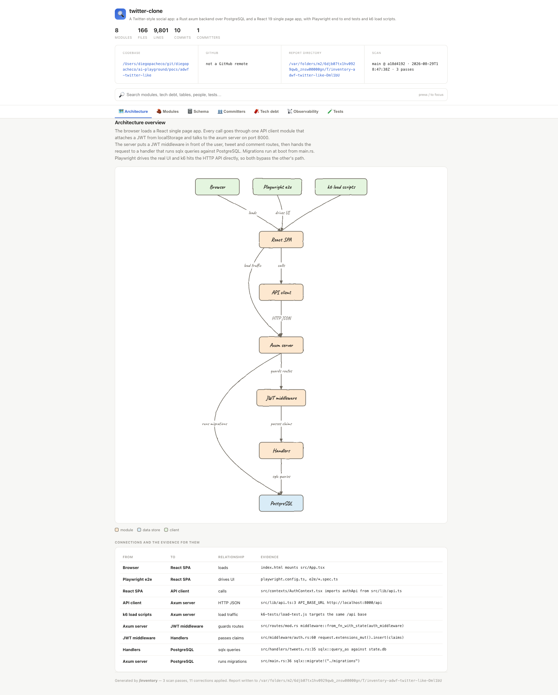

The header carries the codebase path, the GitHub URL when there is one, the
temp directory the report was written to, and the branch and commit that were
scanned. The diagram below is drawn from the node and edge graph the passes
produced: clients on top, the request path down the middle, PostgreSQL at the
bottom. The two long edges — k6 into the server and the server into the
database for migrations — are routed around the side so they cross nothing. The
table under it gives the evidence for every arrow, because an arrow no file
proves does not get drawn.

### Tab 2 — Modules

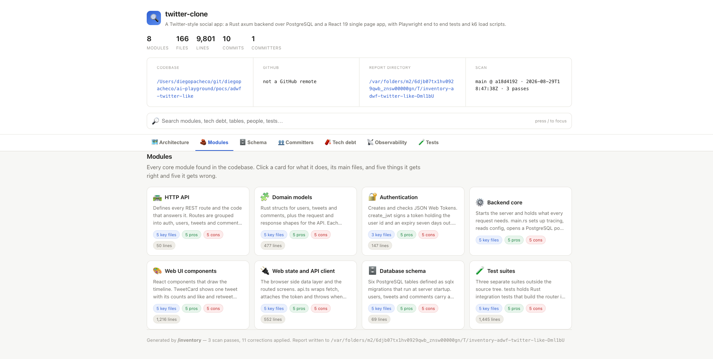

Every core module as a card with an icon, the first lines of its description,
how many key files it has, and its line count from the scan.

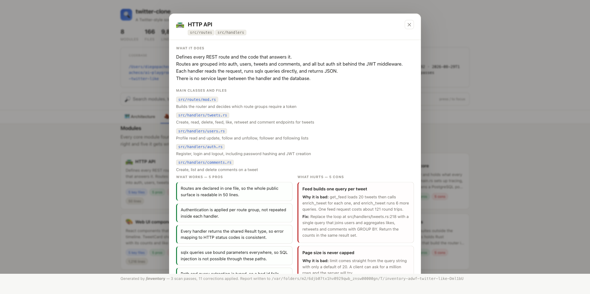

Clicking a card opens what the module does in three to five plain lines, its
main files with full clickable paths, then five pros and five cons side by side.
Each con says what goes wrong for a real person in at most two lines, then the
fix on named code in at most three.

### Tab 3 — Schema

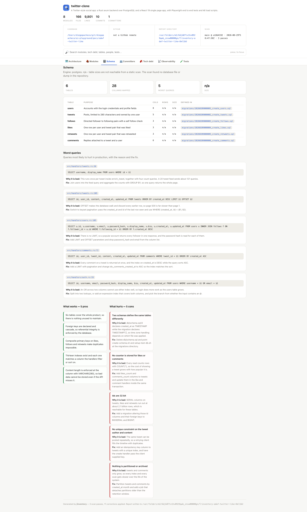

Table count, columns mapped, and where each table is defined. Below that the
worst queries with the SQL as written, the file and line, why it hurts and how
to fix it — here an N+1 lookup, OFFSET pagination, an unbounded follower list
that also reads the password hash, and a sort that fights its own index. The
tab is not rendered at all when no schema is found.

### Tab 4 — Committers

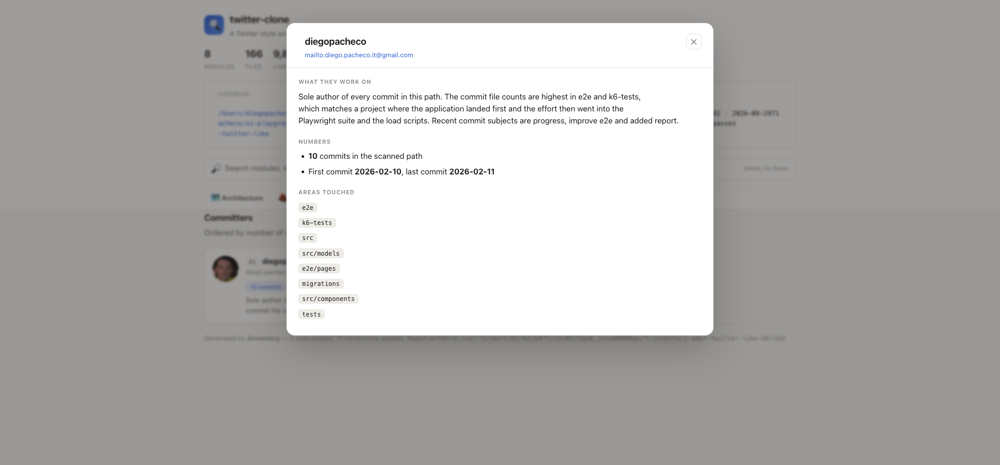

Ordered by commits in the scanned path, with a real picture pulled from GitHub
or Gravatar. The modal shows what the person actually works on, their commit
count and date range, and the directories they touched — all taken from
`git log` and `git show`, never inferred.

### Tab 5 — Tech debt

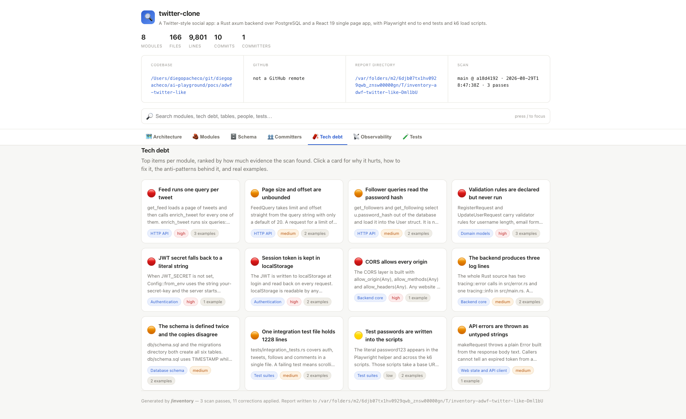

Up to ten items per module, ranked by evidence, colour-coded by severity and
tagged with the module they belong to.

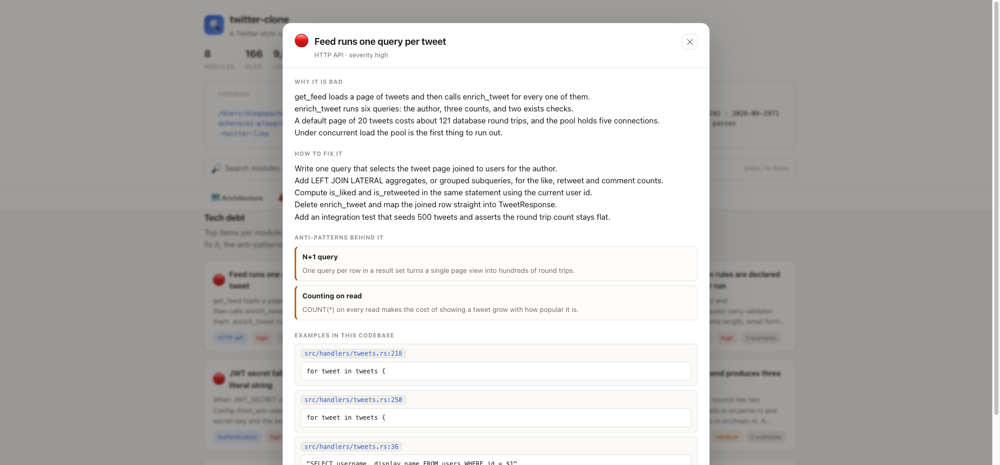

The modal gives why it is bad, ordered steps to fix it, the anti-patterns behind
it with a plain reason for each, and the real examples with file, line and the
offending line of code.

### Tab 6 — Observability

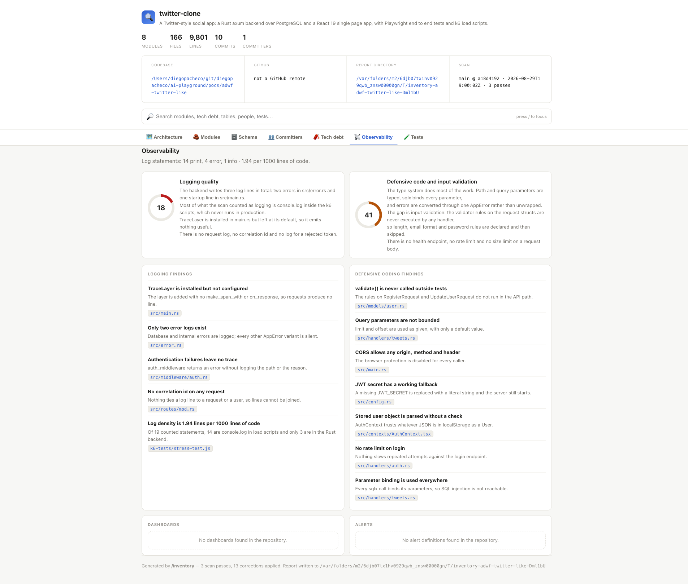

Two scores out of 100 — one for logging, one for defensive code and input
validation — each with the reasoning and the findings that produced it. Below
them the dashboards and alerts found in the repository, which here is nothing,
stated plainly rather than padded.

### Tab 7 — Tests

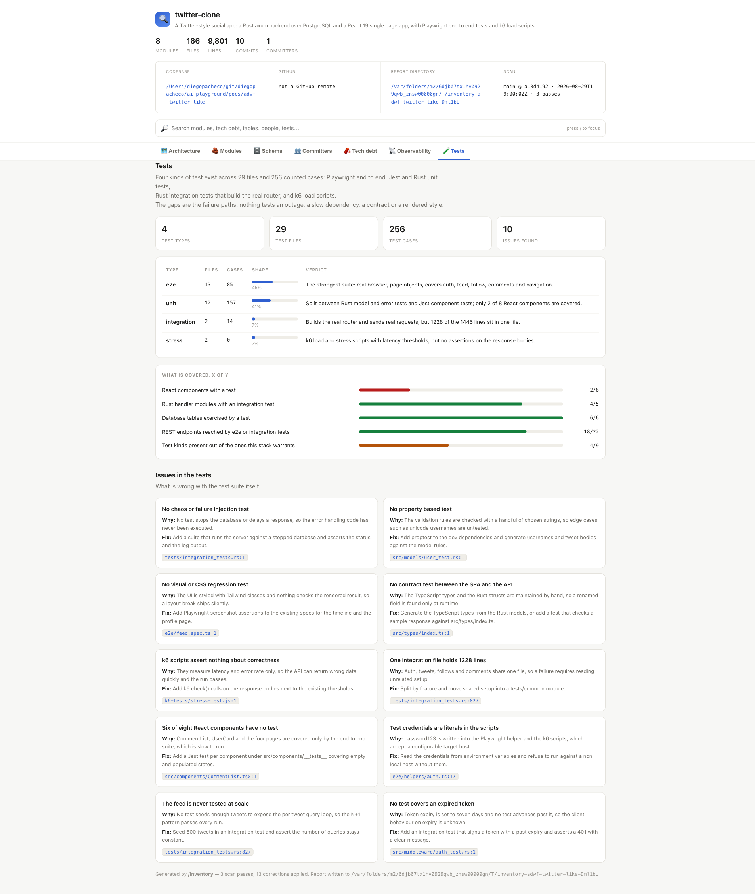

Files and cases per test kind with each kind's share, what is covered as x of y,
and the ten problems with the test suite itself — no chaos test, no property
test, no visual regression, no contract test, k6 scripts that assert nothing
about correctness.

### Search

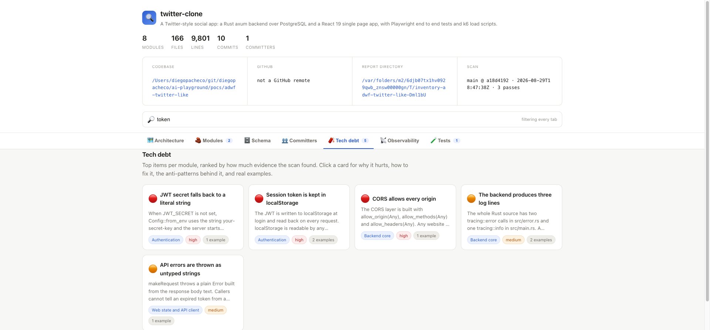

Typing filters every tab at once. The badge on each tab shows how many matches
it holds, so "token" surfaces 2 modules, 5 tech-debt items and 1 test issue
without leaving the page. Press `/` to focus the box from anywhere.
