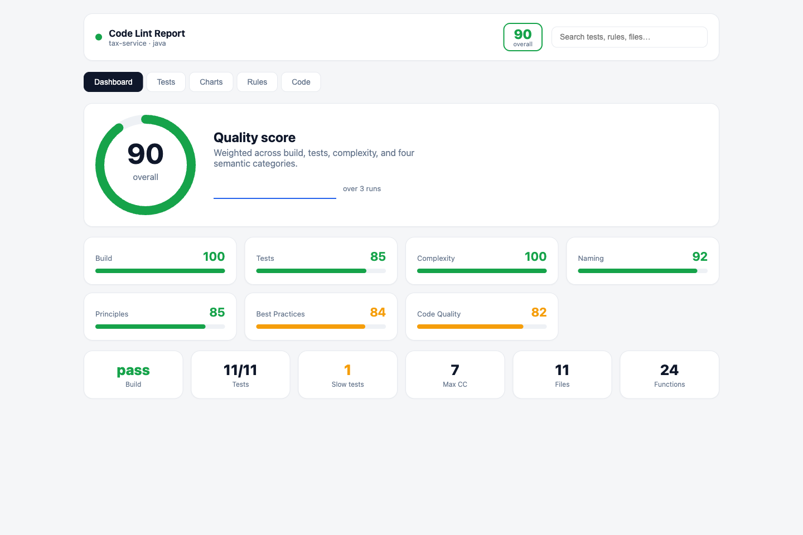
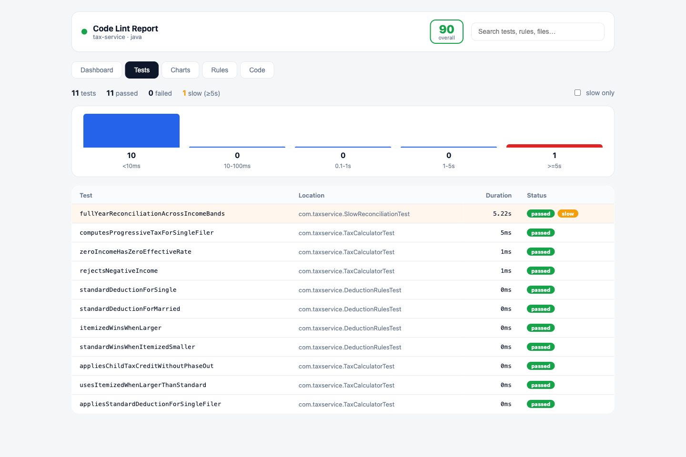
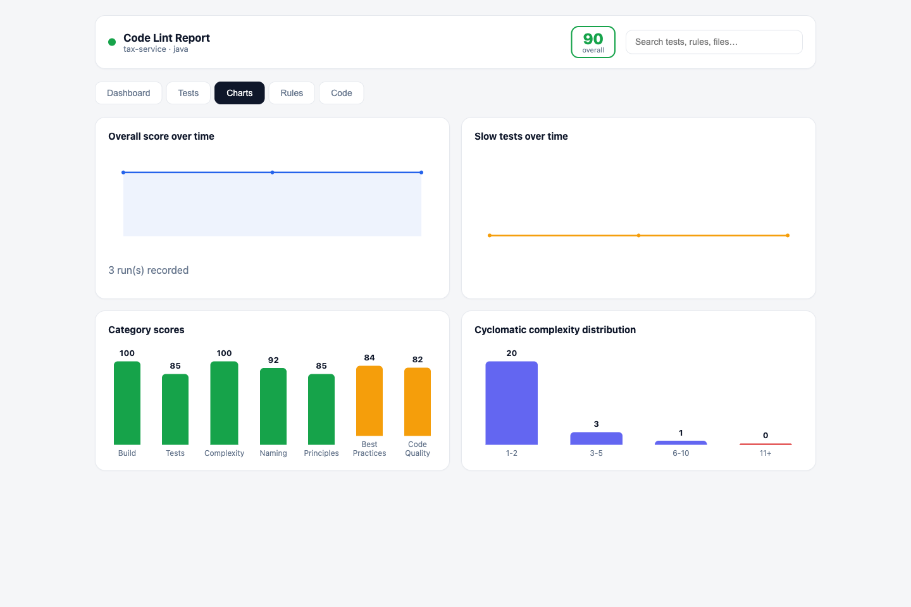
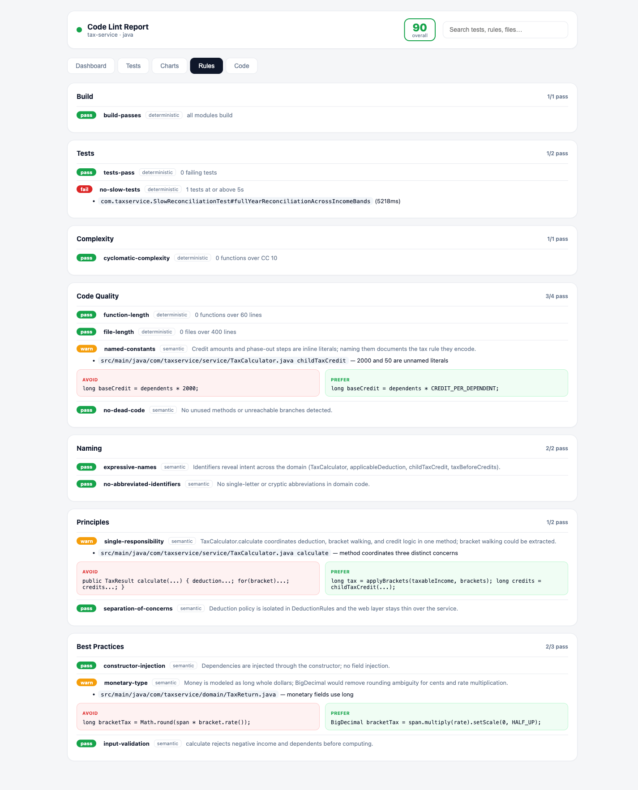
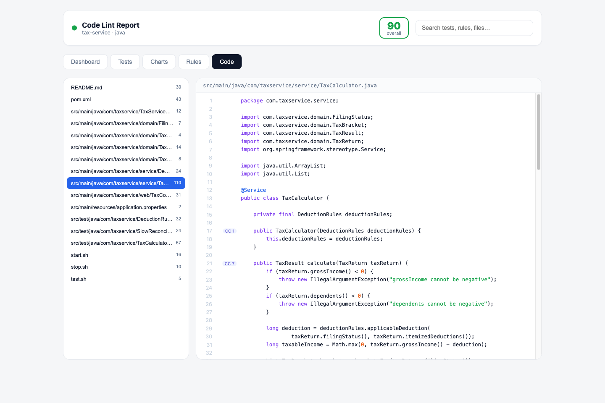
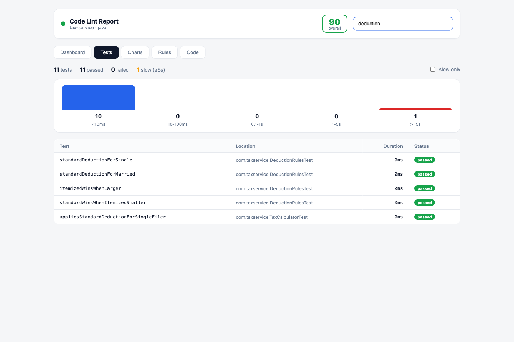
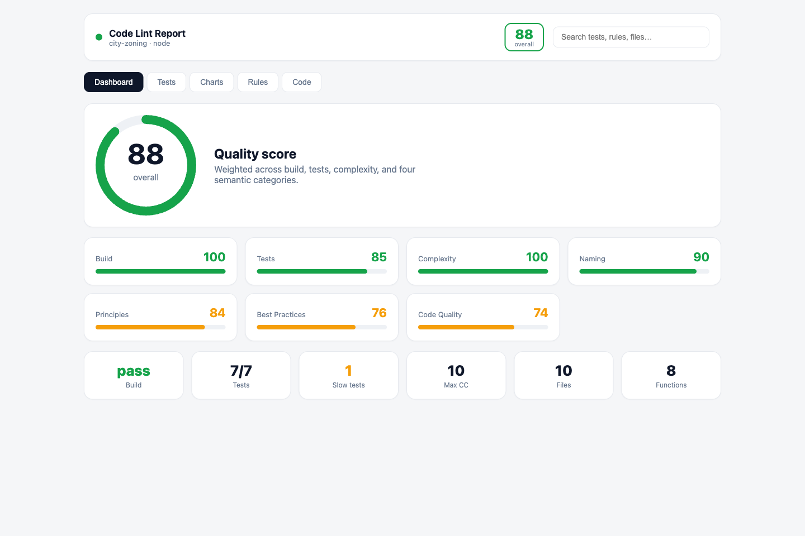

# agent-skill-linter

A Claude Code skill that lints a codebase on real engineering signals — not just a
Sonar wrapper — and renders the result as a modern, searchable web report.

It is a **hybrid linter**: deterministic signals (build status, test status,
per-test speed, cyclomatic complexity) come from host tooling, and semantic
signals (expressive naming, design principles, best practices, code quality) come
from Claude's judgment. The two halves merge into one `report.json`, then
`/lint-site` renders it as a five-tab web app running entirely in Podman.

Two commands:

- **`/lint [path]`** — analyze a repo, write `.lint/report.json` plus a history entry.
- **`/lint-site [path]`** — render the latest report as a web report (Podman).

## The web report

### Dashboard — overall score and every category at a glance


### Tests — per-method timing, slow-test histogram, slow flag at 5s


### Charts — score and slow-test trends across runs, category and complexity distributions


### Rules — every rule pass/fail with findings and avoid/prefer code pairs


### Code — file tree, line numbers, syntax coloring, cyclomatic-complexity markers in the gutter


### Global search — one box filters the active tab (tests, rules, files)


## What it lints

| Category | Signals | Source |
|---|---|---|
| Build | build succeeds, warning count | deterministic |
| Tests | pass/fail, **per-test timing, slow at ≥ 5s** | deterministic |
| Complexity | cyclomatic complexity per function (decision-point counting, no Sonar) | deterministic |
| Code quality | function length, file length, duplication, dead code, magic numbers | mixed |
| Naming | expressive, intent-revealing identifiers | semantic |
| Principles | SOLID, DRY, KISS, separation of concerns | semantic |
| Best practices | language idioms, validation, resource handling, immutability | semantic |

Each category is scored 0–100. The overall score is a weighted average:
build 20, tests 20, complexity 15, principles 15, best practices 12,
code quality 10, naming 8.

## Install

```
./install.sh
```

Copies the skill to `~/.claude/skills/agent-skill-linter/` and installs the
`/lint` and `/lint-site` commands into `~/.claude/commands/`.

```
./uninstall.sh
```

Removes both.

## How it works

```
/lint  ──▶  engine/lint.mjs        (host: build, test, time, complexity)  ──▶ .lint/deterministic.json
       ──▶  Claude semantic pass   (naming, principles, best practices)    ──▶ .lint/semantic.json
       ──▶  engine/assemble.mjs     (merge + weighted score + history)      ──▶ .lint/report.json + .lint/history/

/lint-site ──▶ site/start.sh ──▶ podman-compose up
                 backend  (Java 25 + Spring Boot 4)  serves report, history, source
                 frontend (React + Vite + Bun)       renders the five tabs
```

`/lint` runs on the host and needs no containers. Only `/lint-site` uses Podman,
and the user only ever sees the URL (http://localhost:8088).

## Requirements

- Node (for the `/lint` engine), the target's own build tools (Maven/Gradle, npm/Bun).
- Podman + podman-compose, and Java 25 + Bun on the host to build the site images
  (the apps themselves run in containers).

## Sample projects

Two runnable target projects live under `samples/`, each with `start.sh`,
`stop.sh`, and `test.sh`:

- **`samples/tax-service`** — Java 25 + Spring Boot 4, progressive income-tax rules.
- **`samples/city-zoning`** — React + Vite (Bun) over a zero-dependency Node
  backend, municipal zoning rules.

Both were linted with this skill:

| Sample | Overall | Build | Tests | Complexity | Naming | Principles | Best Pr. | Code Q. |
|---|---|---|---|---|---|---|---|---|
| tax-service | 90 | 100 | 85 | 100 | 92 | 85 | 84 | 82 |
| city-zoning | 88 | 100 | 85 | 100 | 90 | 84 | 76 | 74 |

The same report, rendered for the Node + React sample:



Tests score 85 on both because each carries one deliberately slow test (≥ 5s) that
the linter flags. To reproduce:

```
node skill/engine/lint.mjs samples/tax-service
# (Claude writes samples/tax-service/.lint/semantic.json)
node skill/engine/assemble.mjs samples/tax-service
./skill/site/start.sh samples/tax-service
```

Only lint trusted repositories: `/lint` builds and runs the target's tests.
