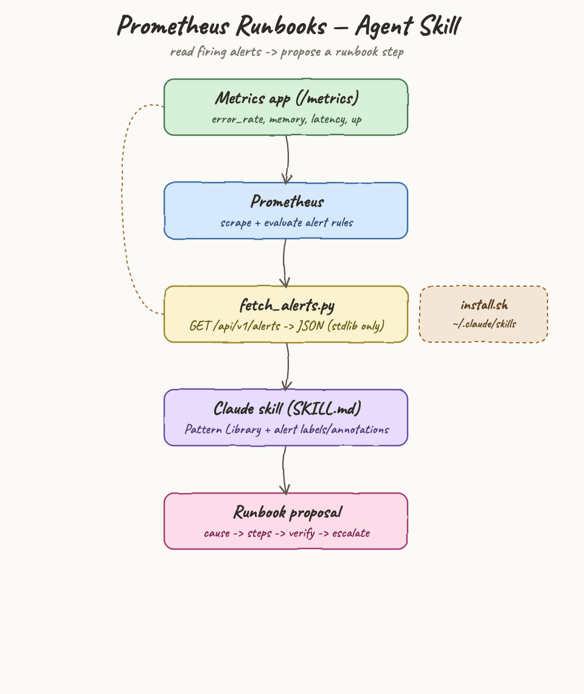
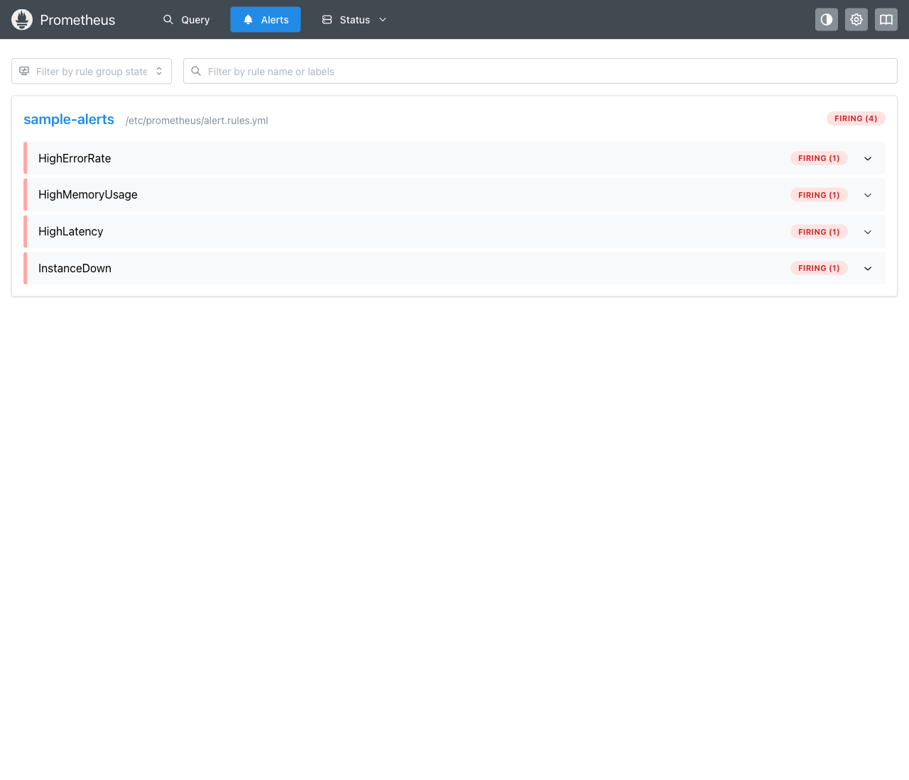
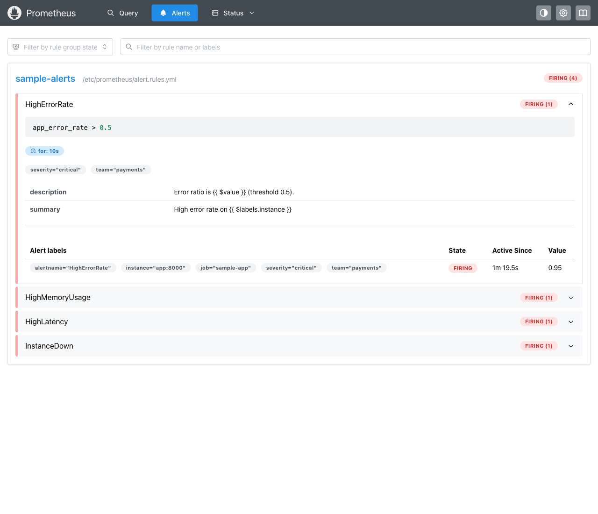

# Prometheus Runbooks — Agent Skill

A Claude Code agent skill that reads the **active alerts** from any Prometheus
server and, for every firing alert, proposes a **runbook step**: the most likely
cause, ordered investigation/remediation steps, a verification check, and an
escalation hint. It is generic — it works against any Prometheus instance and any
alert names, using the alert's own labels and annotations plus a built-in pattern
library.

## Architecture



The skill never changes anything: it reads `/api/v1/alerts`, reasons over the
data, and proposes steps for a human to run.

## Layout

```
agent-skill-prometheus-runbooks/
├── design-doc.md
├── install.sh                         install into ~/.claude/skills
├── uninstall.sh
├── skill/prometheus-runbooks/
│   ├── SKILL.md                       agent instructions + pattern library
│   └── scripts/fetch_alerts.py        stdlib-only alert fetcher
└── sample/                            podman stack that fires real alerts
    ├── app/                           metrics generator (stdlib http server)
    ├── prometheus/                    Prometheus image + rules baked in
    ├── podman-compose.yml
    ├── start.sh  stop.sh  test.sh
```

## Install / Uninstall

```
./install.sh      copies skill/prometheus-runbooks into ~/.claude/skills/prometheus-runbooks
./uninstall.sh    removes it
```

After installing, Claude Code picks up the skill as `/prometheus-runbooks`.

## Running the sample

The sample brings up a metrics app plus Prometheus with four alert rules wired to
fire within seconds.

```
cd sample
./start.sh        podman-compose up (builds app + prometheus)
./test.sh         waits for firing alerts and prints them, exits PASS
./stop.sh         tears the stack down
```

Endpoints once up:
- Prometheus UI — http://localhost:9090
- Alerts — http://localhost:9090/alerts
- Sample app metrics — http://localhost:8000/metrics

### Alerts firing in the sample



Expanding an alert shows the labels and annotations the skill consumes (note the
real `$value`, `instance`, `severity`, and `team`):



## Using the skill

Start the sample, then ask Claude Code:

> /prometheus-runbooks http://localhost:9090

The skill runs the fetcher:

```
python3 skill/prometheus-runbooks/scripts/fetch_alerts.py http://localhost:9090
```

which returns the normalized alerts as JSON, then produces a runbook proposal per
firing alert. Against the sample, the output looks like this:

```
4 alerts firing — highest severity: critical.

## HighErrorRate  [critical]
- Instance: app:8000 (job sample-app, team payments)
- Firing since: 2026-06-14T07:09:56Z
- Signal: error ratio 0.95 (threshold 0.5)
- Likely cause: a recent deploy or a failing downstream dependency
- Runbook:
  1. Check for a deploy/config change in the alert window; if found, prepare a rollback.
  2. Tail the service error logs for app:8000.
  3. Check downstream dependency health (DB, cache, upstream APIs).
  4. If isolated to one instance, drain traffic from it.
- Verify: error ratio drops below 0.5 for the rule's `for` window.
- Escalate if: not recovering in 15m -> team payments.

## InstanceDown  [critical]
- Instance: app:9999 (job missing-service)
- Signal: up == 0
- Likely cause: target process not listening or wrong scrape target
- Runbook:
  1. Open /targets and read the scrape error for app:9999.
  2. Probe the endpoint directly (curl/telnet host:port).
  3. Check process/pod state; restart if crashed (capture logs first).
  4. Rule out resource exhaustion (OOM, disk full).
- Verify: target returns to up == 1 and the alert clears.
- Escalate if: host unreachable -> infra on-call.

## HighMemoryUsage  [warning]
- Instance: app:8000
- Signal: memory usage ratio 0.92 (threshold 0.8)
- Likely cause: memory leak or undersized limit
- Runbook:
  1. Check trend: steady climb (leak) vs spike (load).
  2. For a leak, capture a heap dump then schedule a restart.
  3. For load, raise the memory limit or scale out.
- Verify: usage stabilizes below 0.8; no OOM kills.

## HighLatency  [warning]
- Instance: app:8000
- Signal: latency 1.8s (threshold 1s)
- Likely cause: slow downstream hop or saturation
- Runbook:
  1. Locate the slow hop (app, DB, cache, dependency).
  2. Check DB slow queries / cache hit ratio / GC pauses.
  3. Mitigate: scale out or roll back a slow change.
- Verify: p95/p99 returns under the SLO.

Confirm before acting — these are proposed steps; verify the cause before
running anything against production.
```

## How it stays generic

- Reasoning lives in the agent (`SKILL.md` pattern library + the alert's own
  labels/annotations). Fetching lives in a dumb, deterministic script.
- A `runbook_url` annotation, if present on an alert, is surfaced first — the
  team's own runbook beats the generic one.
- Unknown alert names still get a sensible proposal via the Unknown Alert
  fallback (restate the signal, scope blast radius from labels, generic triage).

## Notes
- The Prometheus config and rules are baked into the image via `Containerfile`
  (no bind mounts) to avoid SELinux relabel issues on the podman machine.
- `fetch_alerts.py` uses only the Python standard library.
