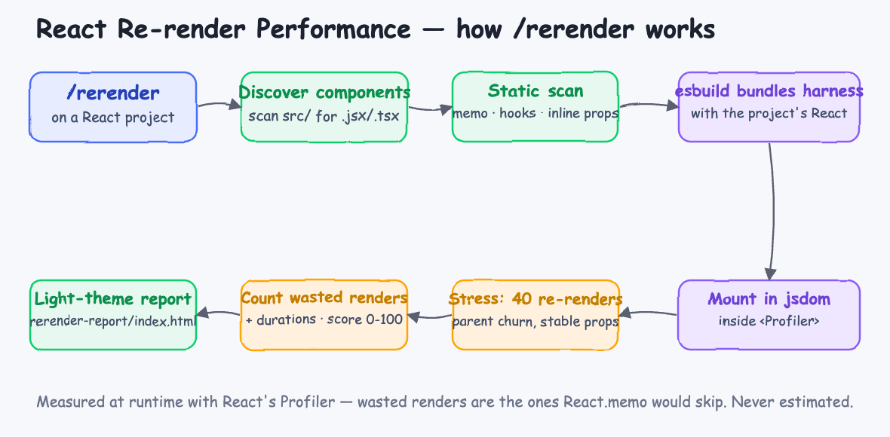
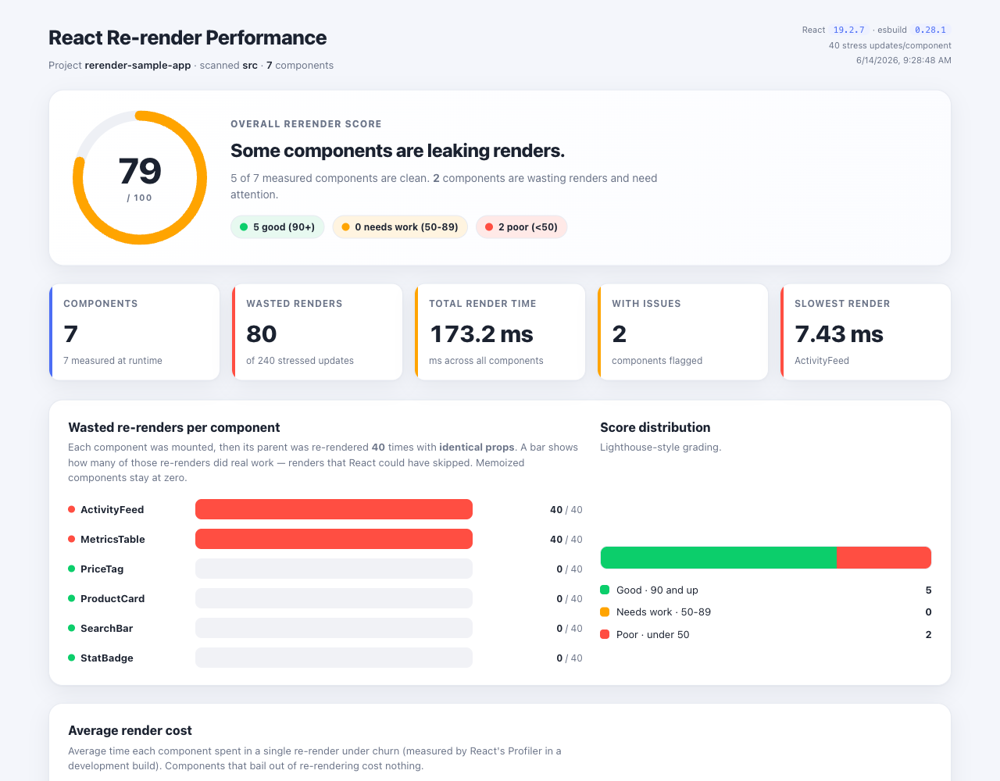
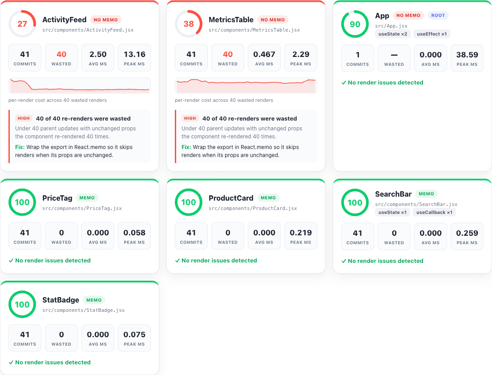
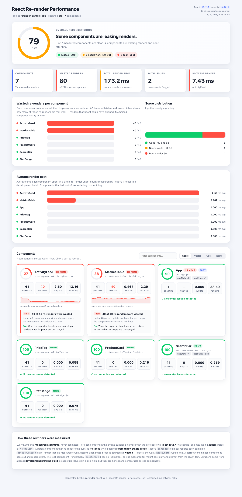
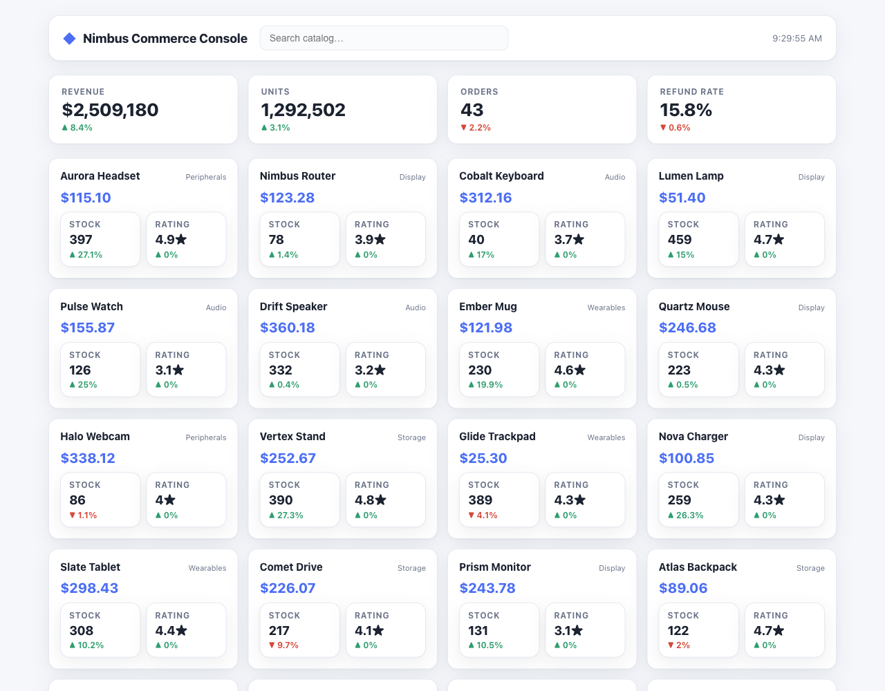
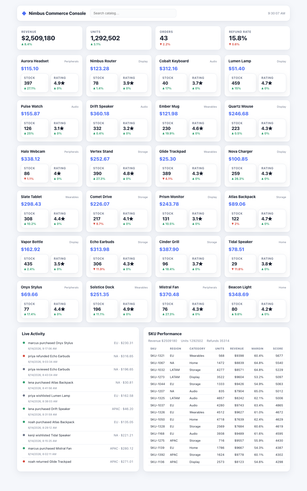

# rerender — React re-render performance skill

An agent skill that answers one question about any React project: **which components are wasting renders, and how badly?** It mounts every component in your project with its **own React**, re-renders each one's parent dozens of times with unchanged props, and uses React's Profiler to count the renders React could have skipped. Then it renders a self-contained, light-theme, **Lighthouse-style** performance report that scores each component 0–100.

> The task: *"A Lighthouse-style perf report for React re-render. The `/rerender` skill runs a re-render test on every React component in a project and shows a highly visual light-theme website with render benchmarks and counters. Ship a `sample/` React 19 app with half a dozen components (1–2 with re-render issues), a README, start/stop scripts for the sample, and install/uninstall scripts for the skill."*

## How it works



1. **Discover components** — scan `src/` for `.jsx/.tsx` (and React-flavored `.js/.ts`), skipping `node_modules`, build output, tests, and the entry that calls `createRoot`.
2. **Static scan** — read each file for `React.memo`, hook usage, inline object/array/function props, and array work in the render body.
3. **esbuild** — bundle a measurement harness that imports each component, resolving **the project's own React** so the benchmark is faithful.
4. **Mount in jsdom + `<Profiler>`** — render each component for real inside React's Profiler.
5. **Stress** — re-render the component's parent **40 times** with **referentially-stable props**. A correctly memoized component bails out; an un-memoized one re-renders every time.
6. **Count + score** — React's `onRender` reports each commit's `actualDuration`; renders that did work despite unchanged props are **wasted renders**. Each component is scored 0–100 (green ≥90 / orange / red <50).
7. **Light report** — inject the data into an HTML template.

Every number is **measured at runtime, never estimated**. If a component cannot be auto-mounted, it is reported as not-measured rather than faked.

## The report

Overall score gauge, animated metric counters, a wasted-renders bar chart, a Lighthouse-style score distribution, and an average-render-cost chart:



A sortable, filterable card per component — score ring, `memo`/`no memo` tags, hooks, commit/wasted/avg/peak counters, a per-render sparkline, and a concrete fix for every issue:



The full page:



## Try it on the sample app

A real Vite + **React 19** dashboard lives in `sample/` — the *Nimbus Commerce Console*: KPI badges, a 24-product grid, a live activity feed, and a 500-row SKU table.



It has six components on purpose:

| Component | State | Why |
|---|---|---|
| `StatBadge` | ✅ memoized | pure, stable props |
| `PriceTag` | ✅ memoized | pure currency formatter |
| `ProductCard` | ✅ memoized | composes memoized children |
| `SearchBar` | ✅ memoized | `useCallback` for handlers |
| `ActivityFeed` | ❌ **re-render issue** | not memoized **and** maps/sorts 240 items on every render |
| `MetricsTable` | ❌ **re-render issue** | not memoized **and** sorts 500 rows on every render |

Run the benchmark on it:

```bash
cd sample
npm install
node "$HOME/.claude/skills/rerender/scripts/rerender.mjs" .
open rerender-report/index.html
```

Measured result (grades and wasted-render counts are stable; sub-millisecond timings vary a point or two):

```
project        rerender-sample-app  (React 19.2.7)
components     7 found, 7 measured, stress 40 parent updates
overall score  79/100   good 5  warn 0  poor 2
wasted renders 80 of 240 stressed updates
slowest render ActivityFeed  7.92 ms

per component (worst first):
  27  ActivityFeed        40/40 wasted      avg 2.50ms
  38  MetricsTable        40/40 wasted      avg 0.45ms
  90  App [root]          root mount only   avg 0.00ms
  100 PriceTag            0/40 wasted       avg 0.00ms
  100 ProductCard         0/40 wasted       avg 0.00ms
  100 SearchBar           0/40 wasted       avg 0.00ms
  100 StatBadge           0/40 wasted       avg 0.00ms
```

The two un-memoized components re-render all 40 times; the four memoized ones bail out at zero. Exactly as designed.

### Run the live sample

```bash
./sample/start.sh      # vite dev on http://localhost:5188
./sample/stop.sh
```

The header clock ticks every second, re-rendering `App` — so in the running app `ActivityFeed` and `MetricsTable` re-run their heavy work once a second while the memoized components stay put.



## Install

```bash
./install.sh
```

Copies the skill to `~/.claude/skills/rerender` (and `~/.codex/skills/rerender` if Codex is present) and runs `npm install` there to fetch its only two dependencies — `esbuild` and `jsdom`. Requires `node` and `npm`.

## Uninstall

```bash
./uninstall.sh
```

## Usage

In Claude Code, from inside any React project:

```
/rerender
```

Or point it at a path:

```
/rerender ./apps/web
```

The skill needs the project's `node_modules` present (it mounts the project's real React). It writes `rerender-report/index.html` and `rerender-report/data.json` into the current directory and prints a per-component summary.

## What the numbers mean

- **Wasted renders** — under 40 parent re-renders with unchanged props, how many re-renders still did measurable work. This is the work `React.memo` would skip. A memoized leaf scores 0; an un-memoized one scores 40.
- **Avg / peak ms** — `actualDuration` from React's Profiler. Measured in a React **development profiling build** (required for the Profiler to report timings), so absolute values run a little high but are honest and comparable across components.
- **Score** — 0–100, Lighthouse-style, driven mainly by the wasted-render ratio, plus render cost and static anti-patterns.
- **Root component** — the one rendered by `createRoot` has no real parent, so it is measured for mount cost only and exempt from the churn test.

## Layout

```
agent-skill-react-rerender/
├── skills/rerender/
│   ├── SKILL.md                 the agent playbook
│   ├── package.json             esbuild + jsdom
│   ├── scripts/rerender.mjs     discovery + harness + profiler + scoring
│   └── assets/template.html     the light-theme report template
├── sample/                      Vite + React 19 app to benchmark
│   ├── start.sh / stop.sh
│   └── src/components/          6 components, 2 with re-render issues
├── printscreens/                architecture diagram + screenshots
├── install.sh / uninstall.sh
├── design-doc.md
└── README.md
```
