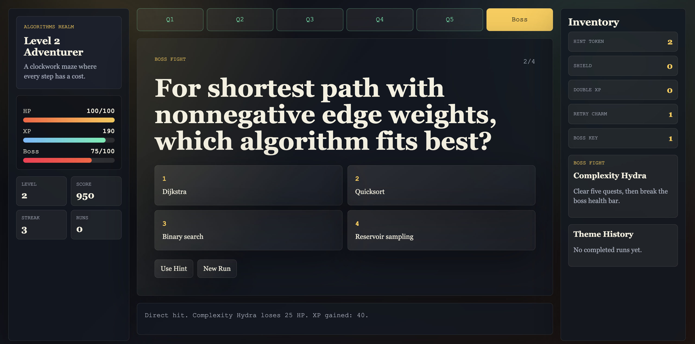

# terminal-rpg-agent



[Open the RPG learner picture](rpg-learner.png)

The picture shows the browser RPG learning flow with theme selection, quest cards, player stats, inventory, boss progress, and run history visible in one place.

`terminal-rpg-agent` is a local learning skill that turns study sessions into a visual RPG. Pick a theme, answer quests, gain XP, collect items, survive failures, and fight a boss.

Read the full design in [design-doc.md](design-doc.md).

## Themes

1. Algorithms
2. Data Structures
3. Generative AI
4. Machine Learning
5. SRE/DevOps
6. Management

Each run starts a new game. Run history is saved by theme, but XP, score, health, and inventory reset every time.

## Run The Browser Game

Open this file in your browser:

```text
web/index.html
```

Open a specific theme directly:

```text
web/index.html?theme=algorithms
```

The browser game has animated cards, visible state, XP bars, inventory, per-theme history, boss health, and final score.

## Run The Terminal Fallback

```bash
./scripts/rpg_learn.sh algorithms
```

Run without a theme to pick from a menu:

```bash
./scripts/rpg_learn.sh
```

Valid theme names:

```text
algorithms
datastructures
generative-ai
machine-learning
sre-devops
management
```

## Install

```bash
./install.sh
```

The installer asks where to install:

```text
1. Codex
2. Claude
3. Both
```

Codex install path:

```text
~/.codex/skills/terminal-rpg-agent
```

Claude install path:

```text
~/.claude/skills/terminal-rpg-agent
```

## Run With Codex

After installing for Codex, start a new Codex session or reload skills, then type:

```text
/rpg-learn algorithms
```

Codex should point you to the installed browser game:

```text
~/.codex/skills/terminal-rpg-agent/web/index.html?theme=algorithms
```

To choose from the menu:

```text
/rpg-learn
```

## Run With Claude

After installing for Claude, start a new Claude session or reload skills, then type:

```text
/rpg-learn sre-devops
```

Claude should point you to the installed browser game:

```text
~/.claude/skills/terminal-rpg-agent/web/index.html?theme=sre-devops
```

To choose from the menu:

```text
/rpg-learn
```

## Uninstall

```bash
./uninstall.sh
```

The uninstaller asks where to remove the skill from and whether to delete local run history.

## State

Browser run history is stored in browser local storage by theme.

Terminal fallback run history is stored in:

```text
~/.terminal-rpg-agent/state
```

The history is append-only by theme. A new game never loads previous score, XP, health, or inventory.
