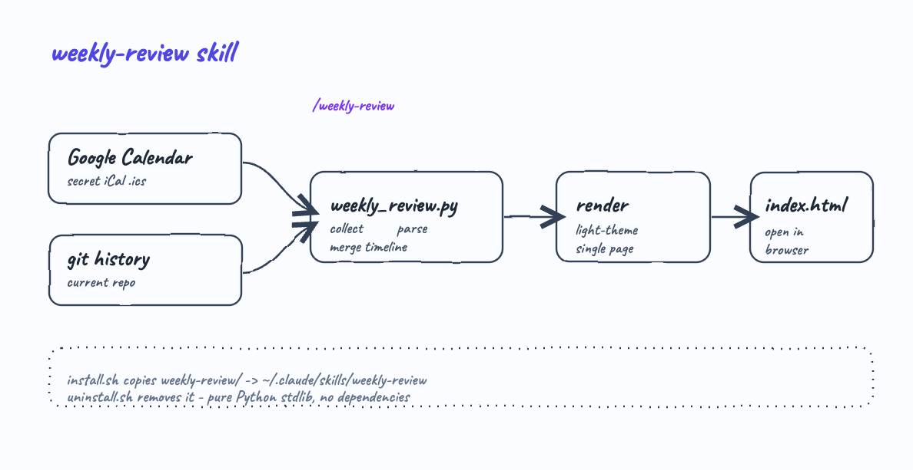
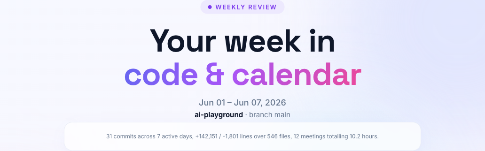
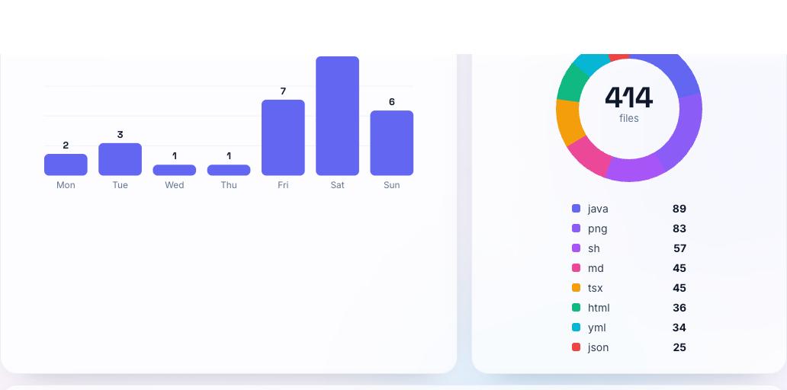
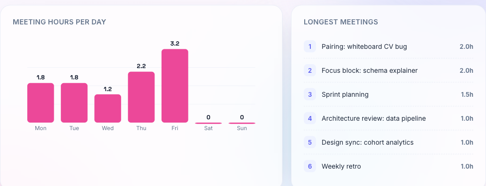
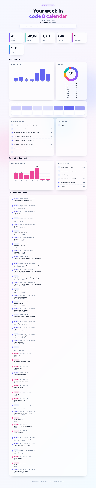

# weekly-review

A Claude Code agent skill. Run `/weekly-review` inside any git repository and it produces a flashy, light-theme single-page website that recaps your week by combining two sources:

- **Google Calendar** — your meetings, read from the calendar's *secret address in iCal format*.
- **Git history** — the commits, lines, files and contributors of the current repository.

The result is a self-contained `index.html` with animated stat counters, a commit-rhythm bar chart, a file-type donut, an activity heatmap, your busiest meeting days, your longest meetings, and a single timeline that merges commits and meetings end to end.

## How it works



`install.sh` copies the `weekly-review/` skill into `~/.claude/skills/weekly-review`. When you run `/weekly-review`, Claude calls `weekly_review.py`, which pulls the git log of the current repo, fetches the iCal feed, merges the two streams, and writes a static site you can open in the browser. The generator is **pure Python standard library** — no pip install, no Node, no runtime dependencies.

## Install

```bash
./install.sh
```

Then, inside any git repository:

```
/weekly-review
```

To remove it:

```bash
./uninstall.sh
```

## Connecting Google Calendar

The skill reads your calendar over the read-only **secret iCal address** that Google gives every calendar — no OAuth app, no API key.

1. Open Google Calendar → **Settings**.
2. Under *Settings for my calendars*, pick the calendar.
3. Open *Integrate calendar* → copy **Secret address in iCal format**.
4. Make it available to the skill in one of these ways:
   - Export it: `export WEEKLY_REVIEW_ICAL_URL="https://calendar.google.com/calendar/ical/.../basic.ics"`
   - Or save it to `~/.claude/skills/weekly-review/calendar.url`
   - Or let the skill ask you for it the first time and offer to save it.

The secret URL is sensitive; the skill never prints it back and never commits it. If no calendar is configured, the review still runs git-only.

## Running the generator directly

```bash
python3 ~/.claude/skills/weekly-review/scripts/weekly_review.py \
  --repo . \
  --ical-url "$WEEKLY_REVIEW_ICAL_URL" \
  --out ./weekly-review-site
```

| Flag | Meaning |
| --- | --- |
| `--repo` | Repository to review (default: current directory) |
| `--since` / `--until` | Date range `YYYY-MM-DD` (default: last 7 days) |
| `--ical-url` | Google Calendar secret iCal URL |
| `--ical-file` | A local `.ics` file instead of a URL |
| `--author` | Focus the git stats on one contributor |
| `--highlights` | Custom hero summary text |
| `--out` | Output directory (default: `./weekly-review-site`) |

The command prints a JSON summary on stdout (commit counts, busiest day, meeting hours, top subjects) so the skill can write a short, human highlight line and re-run with `--highlights "..."`.

## What the site looks like

The screenshots below were generated by running the skill against this repository, using `sample-calendar.ics` for the meetings.

### Hero

The header states the week, the repository and branch, and a one-line summary of everything that happened.



### Commit rhythm and file types

A bar chart of commits per day sits next to a donut of the file types you touched, so you can see both *when* you worked and *what* you worked on.



### Where the time went

When a calendar is connected, the site charts meeting hours per day and ranks your longest meetings.



### The full page

Stat cards, charts, an activity heatmap, most-changed files, contributors, the meeting breakdown, and a merged commit-and-meeting timeline — all in one scroll.



## Layout

```
agent-skill-weekly-review/
  install.sh                 copies the skill into ~/.claude/skills
  uninstall.sh               removes it
  sample-calendar.ics        sample meetings used for the screenshots
  weekly-review/             the skill (this is what gets installed)
    SKILL.md                 instructions Claude follows for /weekly-review
    scripts/
      weekly_review.py       collector + renderer, Python standard library only
  printscreens/              README images
```
