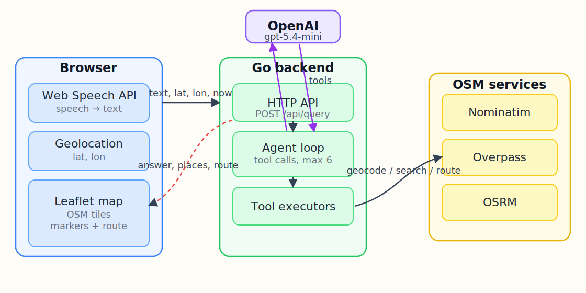
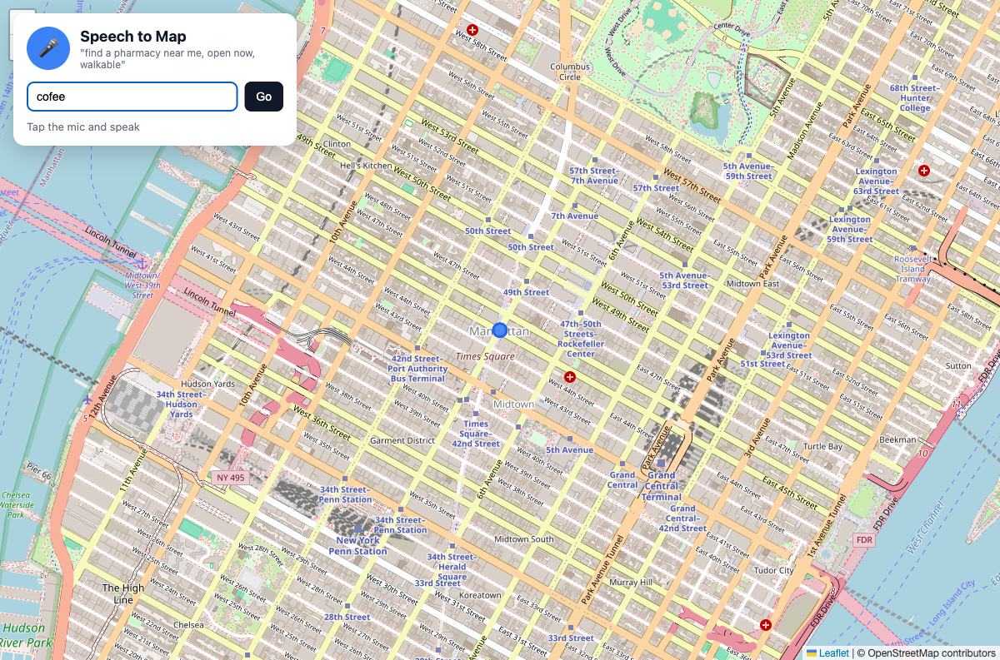
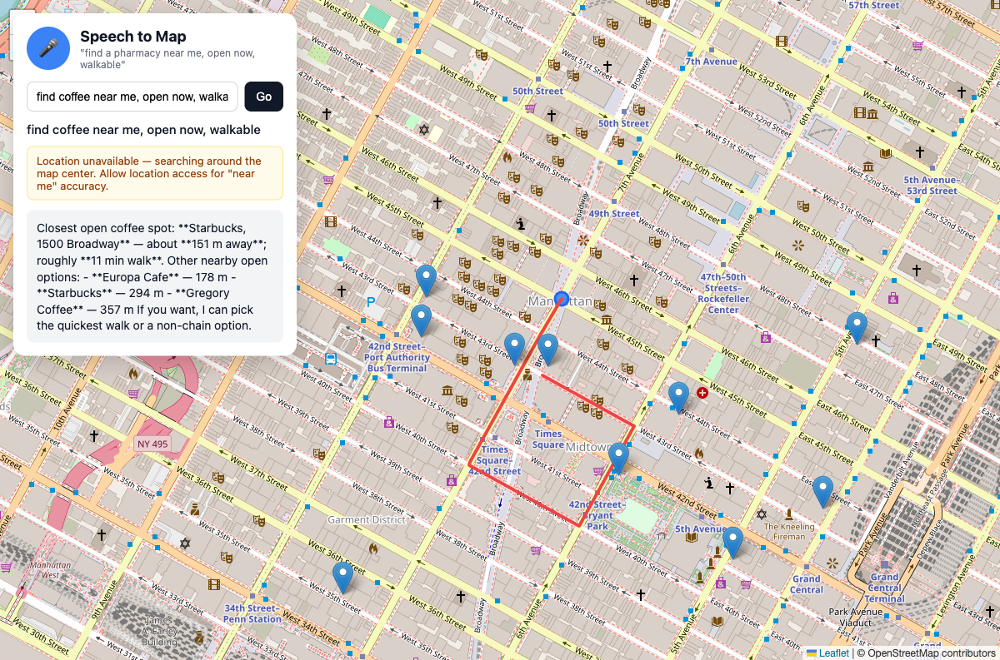

# Geospatial Reasoning Agent — Speech to Map

Speak a request like *"find a pharmacy near me, open now, walkable"*. The browser
turns your speech into text and reads your location, a Go backend runs an OpenAI
`gpt-5.4-mini` agent that reasons over OpenStreetMap tools (geocode, POI search,
routing), and the answer is plotted on a Leaflet map — markers for the places and
a walking route line to the closest one.

The full design is in [design-doc.md](./design-doc.md).

## Architecture



The OpenAI key lives only in the backend; the browser never sees it. The agent is
a bounded tool-calling loop (max 6 iterations): it calls `gpt-5.4-mini`, executes
any requested OSM tool, feeds the result back, and repeats until the model returns
a final answer. The backend tracks the tool outputs so the frontend receives typed
places and a route, not just prose.

## What it looks like

### On load
A full-screen OpenStreetMap with a floating control: mic button, a typed-input
fallback, and the live transcript / answer area. The blue dot is your location.



### After a request
Markers drop for each place found, the map fits to them, and a red walking route
is drawn to the closest one. The answer text summarizes the result. The screenshot
below is a live run of *"find coffee near me, open now, walkable"* against the real
backend — the agent found open coffee shops around the map center and listed the
closest ones. The yellow notice appears because location access was denied, so the
search fell back to the map center.



## How a request flows

1. Mic → Web Speech API produces the transcript; Geolocation API provides `lat, lon`.
2. `POST /api/query { text, lat, lon, now }` to the backend.
3. The agent calls `gpt-5.4-mini` with the three tool schemas.
4. The model calls tools — typically `find_pois`, then `get_route` — which the
   backend executes against Nominatim / Overpass / OSRM.
5. The model returns a concise answer; the backend returns `{ answer, center, places, route }`.
6. The frontend renders markers, the route polyline, and the answer.

## Tools the agent can call

| Tool | Service | Purpose |
|---|---|---|
| `geocode_place` | Nominatim | Resolve a named place to coordinates |
| `find_pois` | Overpass | Find places by brand or amenity within a radius |
| `get_route` | OSRM | Distance, duration and geometry between two points (foot/driving/cycling) |

## Tech stack

| Layer | Tech | Version |
|---|---|---|
| Frontend | React | 19 |
| Build | Vite | 8 |
| Language | TypeScript | 6 |
| Map | Leaflet + react-leaflet | 1.9 / 5 |
| Backend | Go | 1.26 |
| OpenAI client | `github.com/openai/openai-go/v2` | 2.7 |
| Model | OpenAI | `gpt-5.4-mini` |
| Geocode / POI / route | Nominatim / Overpass / OSRM | public endpoints |

## Prerequisites

- Go 1.26+
- Node 20+
- An OpenAI API key

## Run

```bash
export OPENAI_API_KEY=sk-...
./start.sh
```

`start.sh` builds and starts the Go backend, starts the Vite dev server, picks a
free port for each (so it never collides with other apps you already run), waits
until both answer, and prints the real URL to open. Stop everything with:

```bash
./stop.sh
```

## Configuration

| Variable | Where | Purpose |
|---|---|---|
| `OPENAI_API_KEY` | backend | OpenAI auth. Required. Never sent to the browser. |
| `PORT` | backend | Backend port (default 8080, auto-advanced if busy). |
| `FRONTEND_PORT` | frontend | Vite port (default 5173, auto-advanced if busy). |
| `VITE_API_BASE` | frontend | Backend base URL (set by `start.sh`). |

## API

`POST /api/query`

```json
{ "text": "find a burger king near me", "lat": 40.7580, "lon": -73.9855, "now": "2026-06-08T15:04:00-04:00" }
```

```json
{
  "answer": "I found 3 Burger Kings near you. The closest is 350 m away, about a 5 minute walk.",
  "center": { "lat": 40.7580, "lon": -73.9855 },
  "places": [{ "name": "Burger King", "lat": 40.7561, "lon": -73.9869, "address": "Manhattan, NY", "opening_hours": "Mo-Su 06:00-23:00", "distance_m": 350 }],
  "route": { "to": { "lat": 40.7561, "lon": -73.9869 }, "mode": "foot", "distance_m": 380, "duration_s": 300, "geometry": [[40.7580, -73.9855], [40.7561, -73.9869]] }
}
```

`route` is omitted when the request did not call for routing.

`GET /api/health` returns `{ "status": "ok" }`.

## Tests

```bash
./test.sh
```

Runs the Go unit tests, the frontend typecheck and build, and checks `/api/health`.

```
=== RUN   TestBuildOverpassQueryBrandIsCaseInsensitive
--- PASS: TestBuildOverpassQueryBrandIsCaseInsensitive (0.00s)
=== RUN   TestBuildOverpassQueryAmenityCoversShopAndAmenity
--- PASS: TestBuildOverpassQueryAmenityCoversShopAndAmenity (0.00s)
=== RUN   TestBuildOverpassQueryDefaultsToAnyAmenity
--- PASS: TestBuildOverpassQueryDefaultsToAnyAmenity (0.00s)
=== RUN   TestEscapeOverpassNeutralizesQuotes
--- PASS: TestEscapeOverpassNeutralizesQuotes (0.00s)
=== RUN   TestFormatAddressJoinsNumberStreetCity
--- PASS: TestFormatAddressJoinsNumberStreetCity (0.00s)
=== RUN   TestNormalizeProfileMapsWalkableToFoot
--- PASS: TestNormalizeProfileMapsWalkableToFoot (0.00s)
=== RUN   TestHaversineApproximatesKnownDistance
--- PASS: TestHaversineApproximatesKnownDistance (0.00s)
=== RUN   TestDispatchUnknownToolReportsError
--- PASS: TestDispatchUnknownToolReportsError (0.00s)
=== RUN   TestToolErrorIsValidJSON
--- PASS: TestToolErrorIsValidJSON (0.00s)
PASS
ok  	speechtomap        0.561s
ok  	speechtomap/osm    0.324s
```

## Notes and limits

- **Public OSM endpoints** are rate-limited. The backend sends a descriptive
  User-Agent and bounds the search radius. For heavy use, self-host Nominatim /
  Overpass / OSRM behind the same tool interfaces.
- **`opening_hours`** parsing is left to the model for common cases; the raw tag is
  always passed through so you can verify "open now".
- **Walking routes** use the public OSRM server; when its foot profile is
  unavailable it falls back to the driving network for geometry, and walking time
  is derived from distance.
- **Speech recognition** needs a browser with the Web Speech API (Chrome/Edge). The
  typed-input box is the fallback everywhere else. If location is denied, the search
  falls back to the map center and shows a notice.
