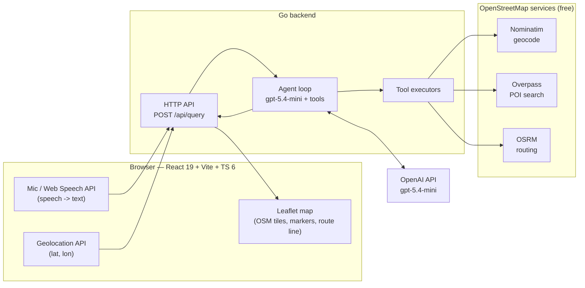
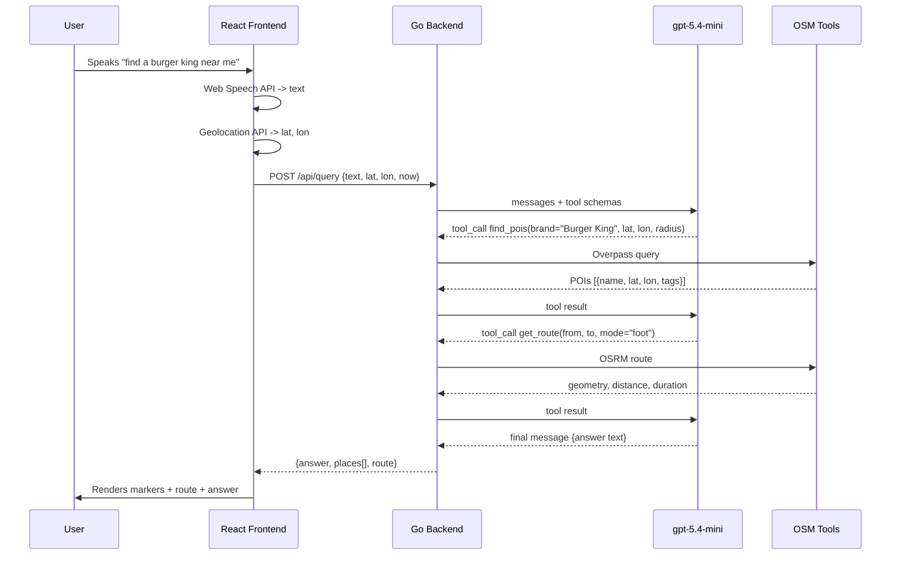

# Geospatial Reasoning Agent (Speech to Map) — Design Doc

## 1. Summary

A voice-driven geospatial agent. The user speaks a natural request such as
*"find a Burger King near me"* or *"find a pharmacy near me, open now, walkable"*.
The system transcribes the speech, sends the text plus the user's current
location to a Go backend, and the backend runs an OpenAI `gpt-5.4-mini` agent
that reasons over OpenStreetMap tools (geocoding, point-of-interest search,
routing) to produce an answer. The result is plotted on a map in the browser:
markers for the places found and, when relevant, a walking route line.

The core gap this fills: there is no geospatial tool use elsewhere in the
playground. This ties **voice input** to **map reasoning** through a tool-calling
agent.

## 2. Goals and Non-Goals

### Goals
- Speak a request and see results plotted on an OpenStreetMap map.
- The agent decides which tools to call and in what order (geocode → search → route).
- Use only free OpenStreetMap services (Nominatim, Overpass, OSRM) — no map API keys.
- Use the official OpenAI Go SDK with model `gpt-5.4-mini`.
- One-command start and stop.

### Non-Goals
- No user accounts, persistence, or history.
- No turn-by-turn navigation UI; routing is a single drawn line plus distance/duration.
- No self-hosting of OSM services for the POC; public endpoints are used (with a
  documented path to self-host later).
- No mobile-native app; browser only.

## 3. Key Decisions

| Decision | Choice | Rationale |
|---|---|---|
| Speech-to-text | Browser native **Web Speech API** (`SpeechRecognition`) | Zero libraries, zero extra latency, no audio upload. Fits the "least libraries" constraint. OpenAI audio transcription is the documented fallback for browsers without support. |
| Reasoning model | OpenAI `gpt-5.4-mini` via official Go SDK (`github.com/openai/openai-go`) | Required by spec; mini is cheap and fast enough for tool-calling. |
| "near me" | Browser **Geolocation API** | The only reliable source of the user's real coordinates; passed to the backend with every query. |
| Map rendering | **Leaflet** + `react-leaflet` with OSM tiles | The standard, lightest OSM map renderer for React. |
| Geocoding | **Nominatim** | OSM canonical geocoder; resolves named places ("near Times Square"). |
| POI search | **Overpass API** | Brand/amenity search by tag and radius; supports `opening_hours` for "open now". |
| Routing | **OSRM** public server | Free routing with a `foot` (walking) profile for "walkable". |
| Agent location | **Backend (Go)** | Keeps the OpenAI key server-side; the browser never sees it. |

## 4. Architecture



## 5. Request Flow



## 6. The Agent

The agent is a bounded tool-calling loop in Go:

1. Build the message list: a system prompt + the user request, with the user's
   coordinates and current local time injected as context.
2. Call `gpt-5.4-mini` with the tool schemas.
3. If the model returns tool calls, execute each against the matching OSM
   service and append the results as tool messages.
4. Repeat until the model returns a final text answer, or a max-iteration cap is
   hit (default 6) to prevent runaway loops.
5. Return the final answer together with the structured places and route the
   tools produced (the backend tracks tool outputs so the frontend gets typed
   data, not just prose).

### System prompt (intent)
- You are a geospatial assistant. The user's current location and local time are
  given. Use the tools to find places and routes. Prefer results close to the
  user. When the user says "open now", check `opening_hours` against the given
  local time and exclude places that are clearly closed. When the user says
  "walkable", use the foot routing profile and prefer places within a short
  walking distance. Always answer concisely.

### Tools (function schemas)

**`geocode_place`** — resolve a named place to coordinates (Nominatim).
```json
{
  "name": "geocode_place",
  "parameters": {
    "query": "string — e.g. 'Times Square, New York'"
  }
}
```

**`find_pois`** — find points of interest near a coordinate (Overpass).
```json
{
  "name": "find_pois",
  "parameters": {
    "lat": "number",
    "lon": "number",
    "radius_m": "number — search radius in meters, default 2000",
    "brand": "string — optional brand name, e.g. 'Burger King'",
    "amenity": "string — optional OSM amenity/shop, e.g. 'pharmacy'",
    "open_now": "boolean — optional, hint to prefer currently-open places"
  }
}
```
Returns up to N places: `name`, `lat`, `lon`, `address`, `opening_hours`,
`distance_m` (straight-line from the search point).

**`get_route`** — route between two coordinates (OSRM).
```json
{
  "name": "get_route",
  "parameters": {
    "from_lat": "number",
    "from_lon": "number",
    "to_lat": "number",
    "to_lon": "number",
    "mode": "string — 'foot' | 'driving' | 'cycling', default 'foot'"
  }
}
```
Returns `distance_m`, `duration_s`, and `geometry` (GeoJSON line coordinates).

### "Open now" reasoning
The backend sends the user's local time in the request. The model receives each
POI's `opening_hours` tag and reasons about whether it is open. Parsing of the
OSM `opening_hours` syntax is left to the model for the common cases; the tool
also passes the raw tag through so the frontend can show it.

## 7. API Contract

### `POST /api/query`
Request:
```json
{
  "text": "find a burger king near me",
  "lat": 40.7580,
  "lon": -73.9855,
  "now": "2026-06-08T15:04:00-04:00"
}
```

Response:
```json
{
  "answer": "I found 3 Burger Kings near you. The closest is 350 m away on 7th Ave, about a 5 minute walk.",
  "center": { "lat": 40.7580, "lon": -73.9855 },
  "places": [
    {
      "name": "Burger King",
      "lat": 40.7561,
      "lon": -73.9869,
      "address": "Manhattan, NY",
      "opening_hours": "Mo-Su 06:00-23:00",
      "distance_m": 350
    }
  ],
  "route": {
    "to": { "lat": 40.7561, "lon": -73.9869 },
    "mode": "foot",
    "distance_m": 380,
    "duration_s": 300,
    "geometry": [[40.7580, -73.9855], [40.7561, -73.9869]]
  }
}
```
`route` is omitted when the request did not call for routing.

### `GET /api/health`
Returns `{ "status": "ok" }`.

## 8. Frontend

- **Stack:** React 19, Vite, TypeScript 6.x, Leaflet + `react-leaflet`.
- **Layout:** full-screen Leaflet map with OSM tiles; a floating control with a
  mic button and a text box showing the live transcript and the agent's answer.
- **Mic button:** starts `SpeechRecognition`; on final transcript, requests
  geolocation, then POSTs `/api/query`.
- **On response:** clears old markers, drops a marker per place, fits the map
  bounds to the results, and draws the route polyline when present. The marker
  for the chosen place opens a popup with name, address, opening hours, and
  walking time.
- **States surfaced to the user:** listening, thinking (request in flight),
  done, and error (mic denied, location denied, no results, backend error).

## 9. Tech Stack and Versions

| Layer | Tech | Version |
|---|---|---|
| Frontend framework | React | 19 |
| Build tool | Vite | latest |
| Language (frontend) | TypeScript | 6.x |
| Map | Leaflet + react-leaflet | latest |
| Backend language | Go | 1.26 |
| OpenAI client | `github.com/openai/openai-go` | latest |
| Model | OpenAI | `gpt-5.4-mini` |
| Geocoding | Nominatim | public endpoint |
| POI search | Overpass API | public endpoint |
| Routing | OSRM | public endpoint |

## 10. Project Structure

```
agent-speech-to-map/
  design-doc.md
  start.sh
  stop.sh
  backend/
    go.mod
    main.go                 HTTP server, /api/query, /api/health
    agent.go                tool-calling loop with gpt-5.4-mini
    tools.go                tool schemas + dispatch
    osm/
      nominatim.go          geocode_place
      overpass.go           find_pois
      osrm.go               get_route
  frontend/
    index.html
    vite.config.ts
    tsconfig.json
    package.json
    src/
      main.tsx
      App.tsx               layout: map + voice control
      MapView.tsx           Leaflet map, markers, route
      VoiceControl.tsx      Web Speech API, geolocation, fetch
      api.ts                typed client for /api/query
      types.ts             shared response types
```

## 11. Configuration

| Variable | Where | Purpose |
|---|---|---|
| `OPENAI_API_KEY` | backend | OpenAI auth; exposed by the user as an env var. Never sent to the browser. |
| `PORT` | backend | Backend listen port (default 8080). |
| `VITE_API_BASE` | frontend | Backend base URL (default `http://localhost:8080`). |

## 12. Start / Stop

- `start.sh` — starts the Go backend (reads `OPENAI_API_KEY` from the
  environment) and the Vite dev server, then waits in a loop (max 1s sleeps)
  until each port answers before reporting ready. Writes PIDs to a run dir.
- `stop.sh` — reads the PIDs and stops both processes.

The frontend talks to the backend over HTTP; both run locally. No containers are
required for the POC, though the OSM services could be self-hosted later behind
the same tool interfaces.

## 13. Error Handling and Edge Cases

| Case | Handling |
|---|---|
| Browser lacks Web Speech API | Show a typed-input fallback box; document OpenAI transcription as the upgrade path. |
| Geolocation denied | Prompt the user; allow them to type a place, which the agent resolves with `geocode_place`. |
| No POIs found | Agent returns a plain answer ("nothing found within 2 km"); frontend shows the message, no markers. |
| OSM service slow/down | Per-tool timeout; agent reports degraded results rather than hanging. Overpass/Nominatim public endpoints are rate-limited — set a descriptive User-Agent and keep radius bounded. |
| Model loops | Hard cap on tool-call iterations (default 6). |
| Ambiguous request | The system prompt instructs the model to make a reasonable default (e.g. 2 km radius, walking) rather than ask back, since the channel is one-shot voice. |

## 14. Risks

- **Public OSM endpoint rate limits.** Mitigation: bounded radius, result caps,
  a clear User-Agent, and a documented switch to self-hosted instances.
- **`opening_hours` parsing.** OSM's syntax is rich; "open now" is best-effort
  and surfaces the raw hours so the user can verify.
- **Speech recognition accuracy** varies by browser and accent; the live
  transcript is shown so the user can retry.

## 15. Future Work

- Self-host Nominatim/Overpass/OSRM in containers for reliability and rate.
- Spoken answers via text-to-speech.
- Multi-step itineraries ("coffee, then a bookshop, then home").
- OpenAI audio transcription as a first-class STT path.
