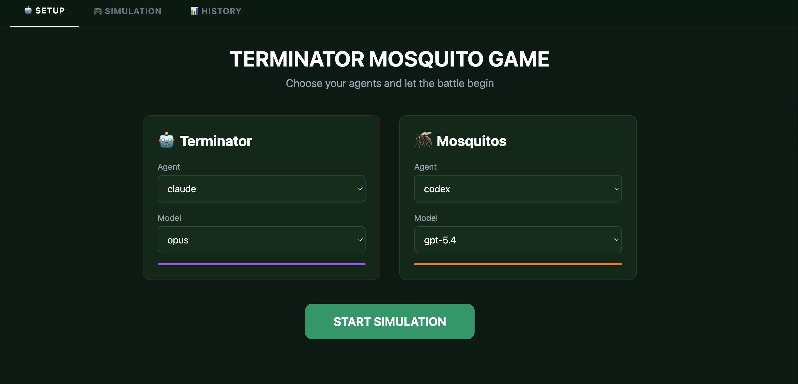
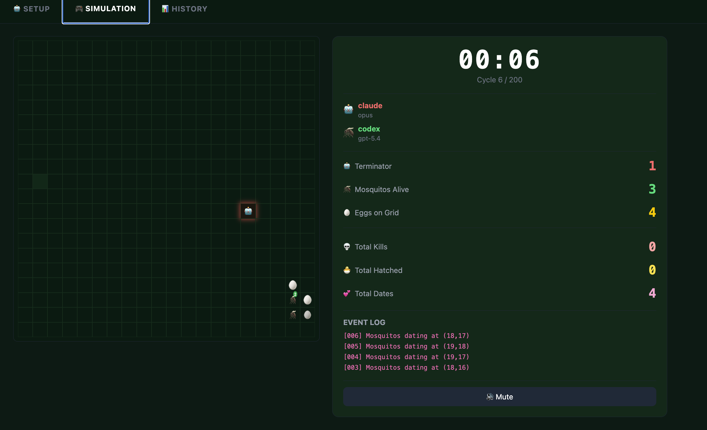

# Terminator Mosquito Game

AI-powered grid simulation where a Terminator hunts mosquitos on a 20x20 battlefield. Pick which AI agent controls each side and watch them battle in real time.

## Tech Stack

* **Backend**: Java 25, Spring Boot 4.0.2, Spring Data JDBC, SQLite
* **Frontend**: Remix, React 19, Tailwind CSS 4, Web Audio API
* **Communication**: Server-Sent Events (SSE)

## Setup

Pick the AI agent and model for the Terminator and for the Mosquitos, then start the simulation.



## Simulation

The Terminator chases mosquitos and eggs on the grid. Mosquitos evade, breed, and lay eggs. Stats, event log, and a live clock are shown on the right panel.



## How to Run

```
./run.sh
```
* Backend: http://localhost:8080
* Frontend: http://localhost:5173

## How to Stop

```
./stop.sh
```
