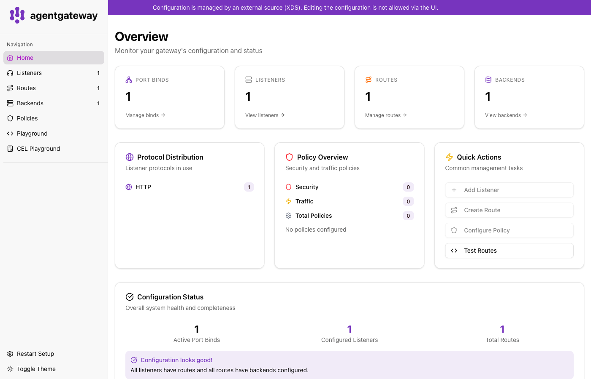
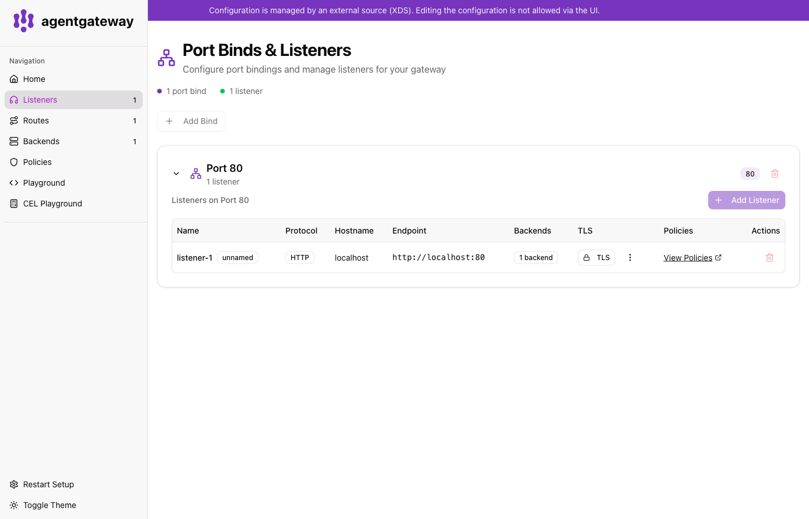
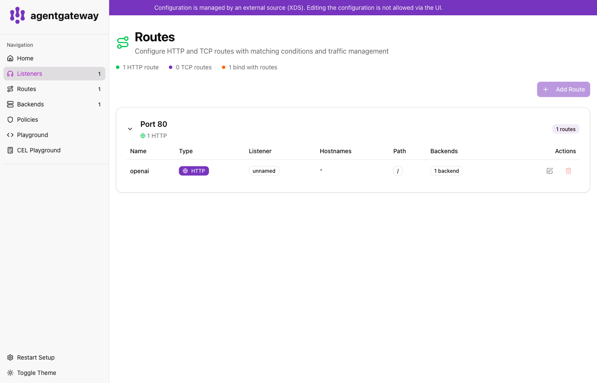
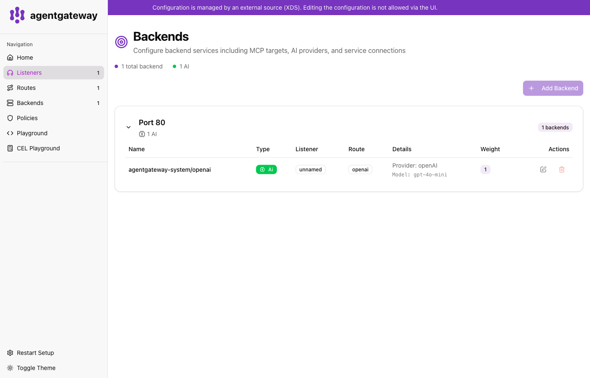
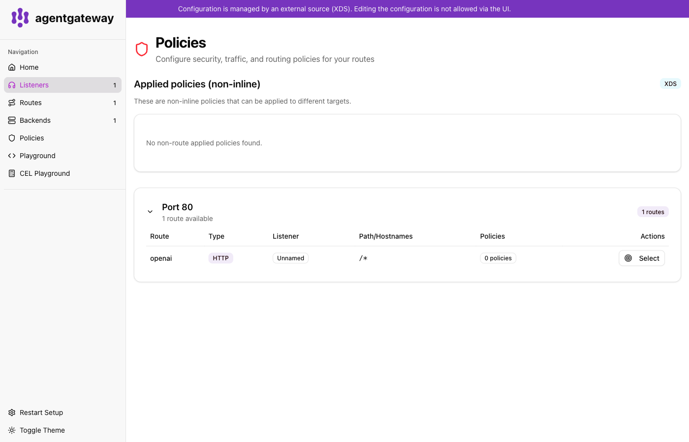
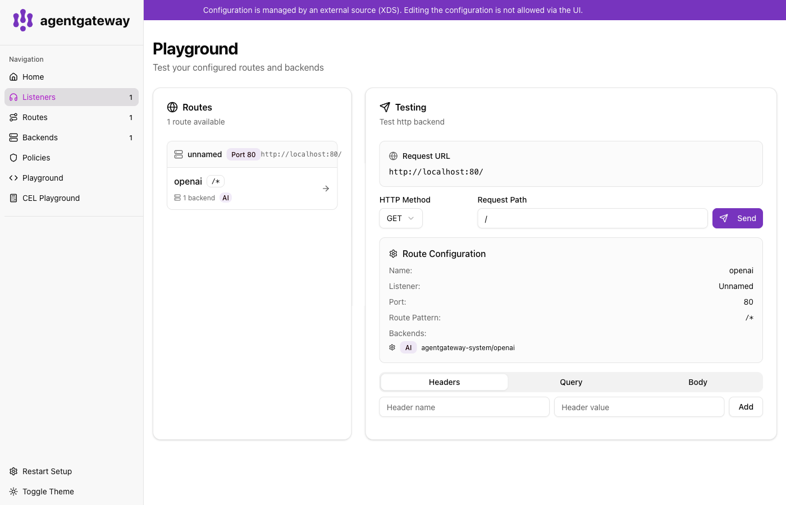
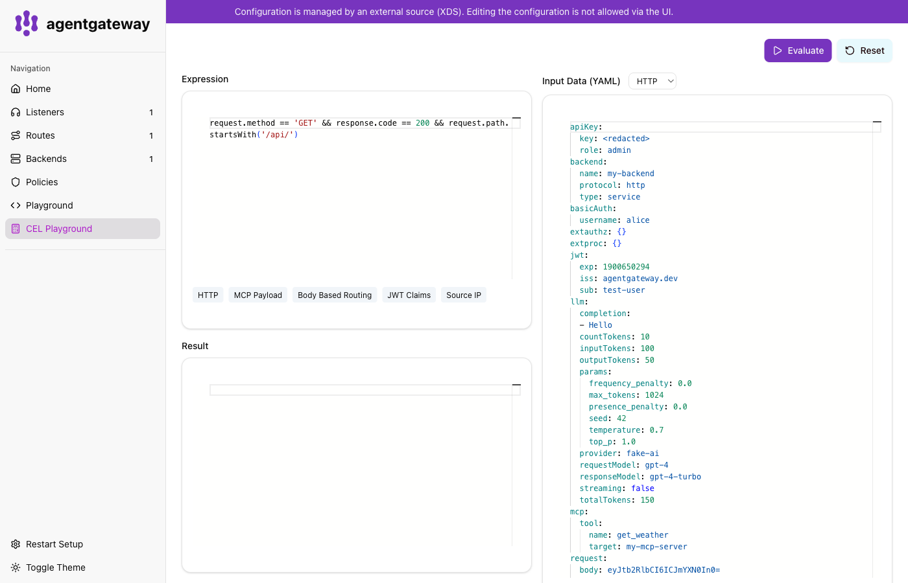

# agentgateway-poc

A small POC that runs [agentgateway](https://agentgateway.dev/) on a local [Kind](https://kind.sigs.k8s.io/) cluster and routes all LLM traffic through it to **OpenAI**.

Two clients are wired in:

- A tiny Node CLI using the **OpenAI SDK** (`app-cli.sh`).
- The **Claude Code** CLI, going through [claude-code-router](https://github.com/musistudio/claude-code-router) which translates Anthropic API calls into OpenAI calls, then forwards to agentgateway (`claude-agentgateway.sh`).

```
              app-cli.sh ──┐
                           │     ┌─────────────────────┐    ┌──────────────┐
                           ├───▶ │ agentgateway (kind) │ ─▶ │  OpenAI API  │
                           │     └─────────────────────┘    └──────────────┘
claude ─▶ ccr (Anthropic→OpenAI) ─┘
```

## Prerequisites

- `kind`, `kubectl`, `helm`, `curl`
- `podman` (this POC uses `podman` as the Kind provider)
- `node`, `npm`
- `OPENAI_API_KEY` exported in your shell

For the Claude Code flow, install both CLIs globally:

```bash
npm install -g @anthropic-ai/claude-code
npm install -g @musistudio/claude-code-router
```

`@musistudio/claude-code-router` (`ccr`) is the shim that lets the Anthropic-protocol Claude Code talk to OpenAI-protocol backends. `claude-agentgateway.sh` writes the `ccr` config for you (pointing at agentgateway) and then runs `ccr code`.

## Files

```
start.sh                  bring up kind + agentgateway + routes
stop.sh                   tear it all down
ui.sh                     port-forward the admin UI on :15000
app-cli.sh                OpenAI SDK CLI -> agentgateway -> OpenAI
claude-agentgateway.sh    Claude Code -> ccr -> agentgateway -> OpenAI
test.sh                   curl + cli sanity check
k8s/                      kind config, Gateway, OpenAI backend, route
app/                      Node OpenAI SDK CLI
```

## Quick start

```bash
export OPENAI_API_KEY=sk-...
./start.sh
./app-cli.sh hello
```

Example output:

```
❯ ./app-cli.sh hello
Hello! How can I assist you today?
```

Then:

```bash
./ui.sh                                          # open the admin UI on :15000
./claude-agentgateway.sh -p "explain java"       # one-shot prompt
./claude-agentgateway.sh                         # interactive claude session
./stop.sh
```

`claude-agentgateway.sh` forwards its arguments to `ccr code`, which in turn forwards them to `claude`. Two ways to use it:

- `./claude-agentgateway.sh -p "<prompt>"` — non-interactive, prints the answer and exits (the `-p` flag is Claude Code's "print" mode).
- `./claude-agentgateway.sh` — drops you into an interactive Claude Code session whose every request flows through agentgateway.

Example non-interactive run:

```
❯ ./claude-agentgateway.sh -p "explain java"
claude -> ccr -> strip-proxy -> agentgateway -> OpenAI
Service not running, starting service...
Java is a high-level, object-oriented programming language developed by Sun Microsystems in the
mid-1990s. It is designed to be platform-independent at both the source and binary levels, which
is achieved through the use of the Java Virtual Machine (JVM)...

Key features of Java include:

1. Platform Independence — Java code is compiled into bytecode, which can be executed on any
   platform with a compatible JVM ("Write Once, Run Anywhere").
2. Object-Oriented — organizes code into reusable classes and objects.
3. Strongly Typed — statically typed; errors caught at compile time.
4. Automatic Memory Management — garbage collection reclaims unused memory.
5. Rich Standard Library — networking, data structures, file I/O, etc.
6. Multithreading Support — built-in concurrency primitives.
```

## How it routes

- `POST http://localhost:8080/v1/chat/completions` → `AgentgatewayBackend/openai` → `api.openai.com`
- The OpenAI SDK is pointed at the gateway with `baseURL=http://localhost:8080/v1`; the client-side API key is unused because agentgateway injects the upstream `Authorization` header from the Kubernetes secret `openai-secret`.
- Claude Code does not speak OpenAI natively, so `claude-agentgateway.sh` runs `claude-code-router` on `localhost:3456`, which converts Anthropic requests into OpenAI requests. ccr then forwards through a small Node sidecar (`app/strip-proxy.js`, `:8090`) that drops fields like `reasoning` / `reasoning_effort` / `thinking` that OpenAI's `gpt-4o-mini` rejects, and finally hits agentgateway.

## Admin UI walk-through

`./ui.sh` port-forwards the `agentgateway-proxy` admin UI to <http://localhost:15000/ui/>. In Kubernetes mode the UI is **read-only** — it reflects what the controller pushed via xDS. Use it to inspect configuration and debug routing.

The left-side navigation has seven screens:

### Home



The overview dashboard. Shows the counts of port binds, listeners, routes and backends the proxy is currently serving, plus high-level system health. Good first stop to confirm the gateway picked up your manifests.

### Listeners



Lists the listener bound by the `Gateway` resource (`agentgateway-proxy`, port 80, HTTP). Each listener is a bind point; the proxy fans incoming requests from here into matching routes.

### Routes



Shows the `HTTPRoute` resources attached to the gateway. The one defined here matches `/v1/chat/completions` and forwards to the `openai` backend. This is where you verify path matches and route ordering.

### Backends



Lists the `AgentgatewayBackend` resources. The `openai` backend declares the LLM provider (`ai.provider.openai`, model `gpt-4o-mini`) and references the `openai-secret` for upstream auth. The UI shows you what the proxy actually sees, useful to spot a misnamed secret or wrong provider type.

### Policies



Lists `AgentgatewayPolicy` resources — auth, rate limits, transformations, etc. This POC ships none, so the page is empty; in a real deployment this is where you'd inspect resolved policy.

### Playground



An in-browser request runner for hitting MCP tools / routes that the proxy is serving. Useful for poking at the gateway without writing a client.

### CEL Playground



An interactive editor for [CEL](https://github.com/google/cel-spec) expressions. Agentgateway uses CEL for conditional policies and request matching; this tab lets you author and test expressions against sample request data before committing them to a policy.

## Useful links

- agentgateway: <https://agentgateway.dev/>
- agentgateway source: <https://github.com/agentgateway/agentgateway>
- claude-code-router: <https://github.com/musistudio/claude-code-router>
- Claude Code CLI: <https://github.com/anthropics/claude-code>
- Kind: <https://kind.sigs.k8s.io/>
