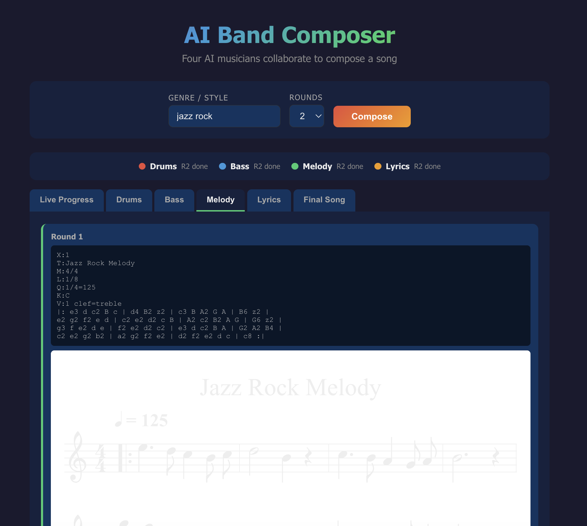

### Result


### AI Band Composer

Four AI musician agents (Drums, Bass, Melody, Lyrics) collaborate in rounds to compose a song.
Each agent calls Claude CLI to generate ABC notation, passing context between them.
Drums and Bass run in parallel, then Melody builds on top, then Lyrics fit the melody.
The frontend renders sheet music and plays it back in the browser with singing via Web Speech API.

### Stack
* Backend: Rust + Actix-web + SSE streaming
* Frontend: React + TypeScript + abcjs
* LLM: Claude CLI (sonnet)

### How to run
```bash
./run.sh
```
* Backend: http://localhost:8080
* Frontend: http://localhost:3001
