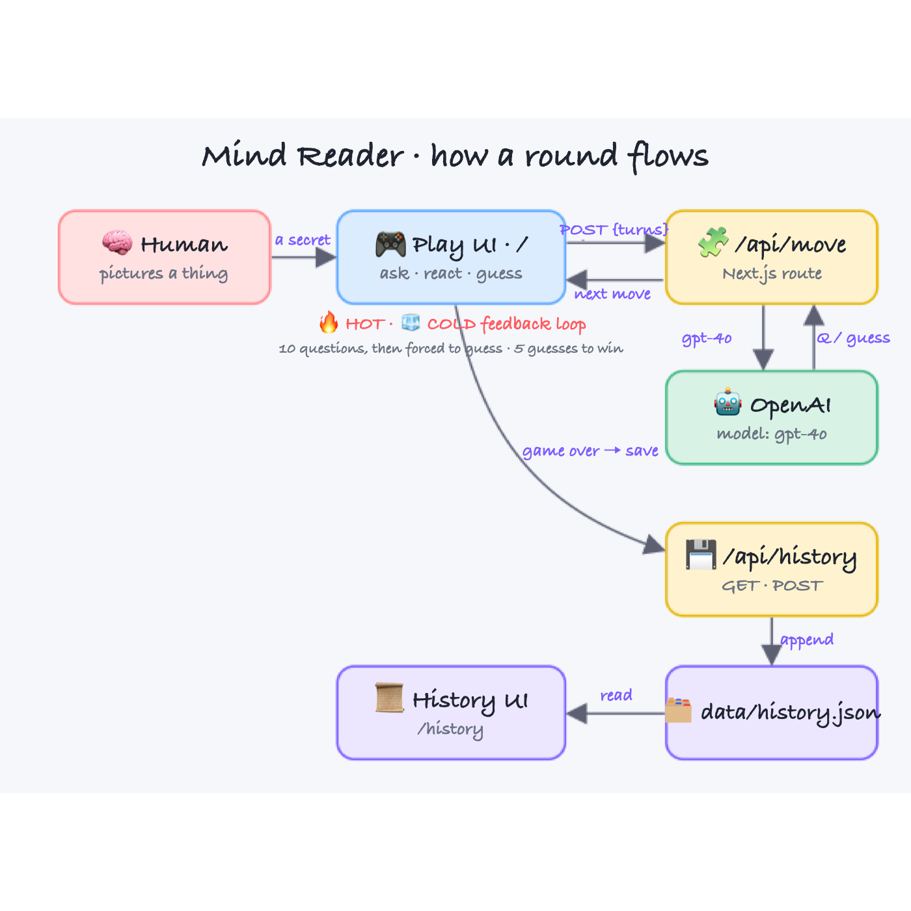
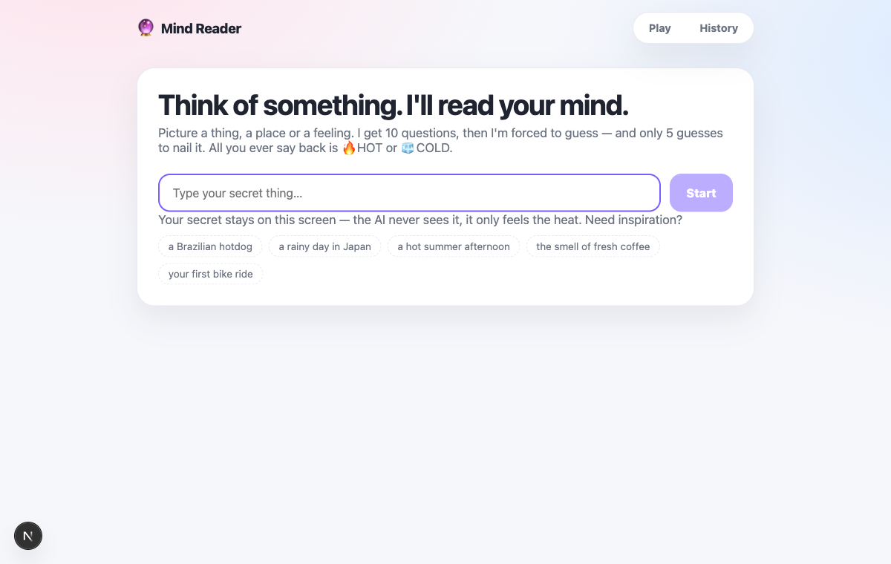
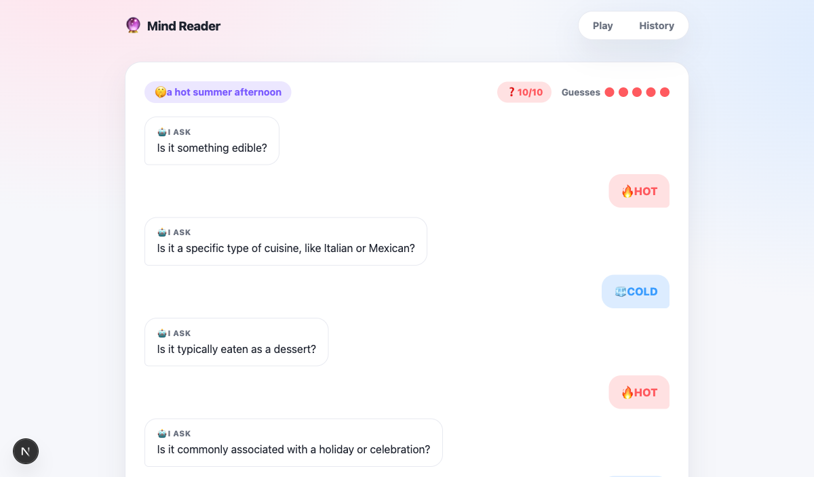
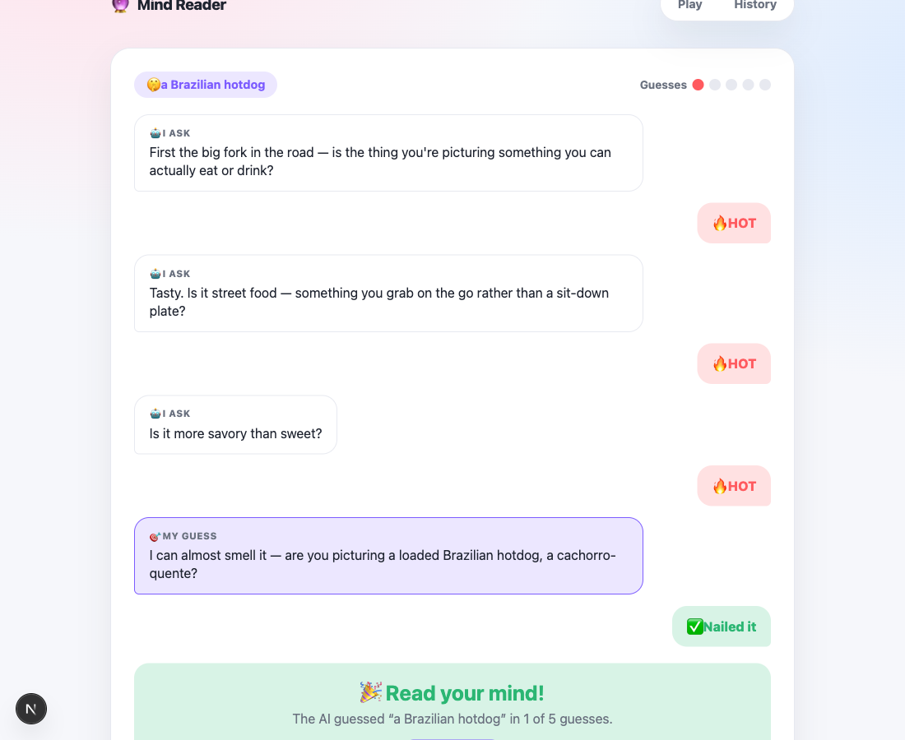

# 🔮 Mind Reader — AI Guessing Game

You think of something — _a Brazilian hotdog_, _a rainy day in Japan_, _a hot summer afternoon_. The AI tries to read your mind. The twist: the only words you are allowed to say back are **🔥 HOT** and **🧊 COLD**.

Powered by **OpenAI `gpt-4o`**, built with **Next.js 16 + React 19 + TypeScript 6** on **Turbopack**, light-themed and playful.

## How a round works

1. You picture a thing and type it in. It stays on your screen — **the AI never sees your secret**, it only feels the heat.
2. The AI asks a question. You answer with one tap: **🔥 HOT** (warm / yes / close) or **🧊 COLD** (cold / no / far).
3. The AI may ask **up to 10 questions**. After that it is **forced to guess** — no more questions.
4. The AI has **5 guesses**. When it guesses, you tap **✅ Nailed it** or **❌ Nope**.
5. A correct guess → **the AI wins**. Five wrong guesses → **you stumped it and you win**.

## Two screens

| Screen | Route | What it does |
| --- | --- | --- |
| **Play** | `/` | The live duel: AI questions, your 🔥/🧊 taps, a question counter, five guess dots, and the win / loss banner. |
| **History** | `/history` | Every past round. Win / loss stats, AI win-rate, and each game expands to replay the full question-and-guess transcript. |

## Architecture



- The **Play UI** posts the running list of turns to **`/api/move`**.
- That route asks **OpenAI `gpt-4o`** for the next move and returns a strict JSON `{ type: "question" | "guess", text, reasoning }`. The server enforces the rules: once 10 questions are spent, the move is forced to a guess.
- Your secret never leaves the browser — the server only ever sees questions, guesses and your 🔥/🧊 reactions.
- When a round ends, the Play UI posts the record to **`/api/history`**, which appends it to **`data/history.json`**. The **History UI** reads it straight back.

## Screenshots

**Setup — pick your secret thing**



**Live round — the AI asks, you answer 🔥 / 🧊** (here a real game ran the question counter all the way to `10/10`)



**Guess → win — the AI commits, you tap ✅ Nailed it, and it reads your mind**



## Run it

The app reads your key from the environment — nothing is written to disk.

```bash
export OPENAI_API_KEY=sk-...
./start.sh
```

Then open:

- Play — http://localhost:3434
- History — http://localhost:3434/history

Stop it with:

```bash
./stop.sh
```

`start.sh` installs dependencies on first run, boots the Turbopack dev server on port **3434**, and waits until it answers before returning.

## Tech stack

- **Next.js 16** (App Router, Turbopack dev + build)
- **React 19**
- **TypeScript 6**
- **OpenAI Node SDK** → model `gpt-4o`, JSON response mode
- **No database** — history is a plain `data/history.json` file behind two API routes

## Project layout

```
ai-guessing-game/
├── app/
│   ├── page.tsx            Play UI (client)
│   ├── history/page.tsx    History UI (server-rendered)
│   ├── api/move/route.ts   asks gpt-4o for the next move
│   ├── api/history/route.ts read / append game records
│   ├── layout.tsx          shell + nav
│   ├── globals.css         light theme
│   └── icon.svg            favicon
├── lib/
│   ├── ai.ts               prompt + gpt-4o call + rule enforcement
│   ├── store.ts            history.json read / write
│   └── types.ts            shared types, MAX_QUESTIONS=10, MAX_GUESSES=5
├── data/history.json       saved rounds
├── start.sh / stop.sh
└── printscreens/
```

## Verification

- `npm run build` — compiles and type-checks clean (Next.js 16, TypeScript 6).
- Played live against `gpt-4o`: the model asks real questions, and the 10-question cap is enforced server-side — after the tenth question every move comes back as a guess, exactly as designed.
